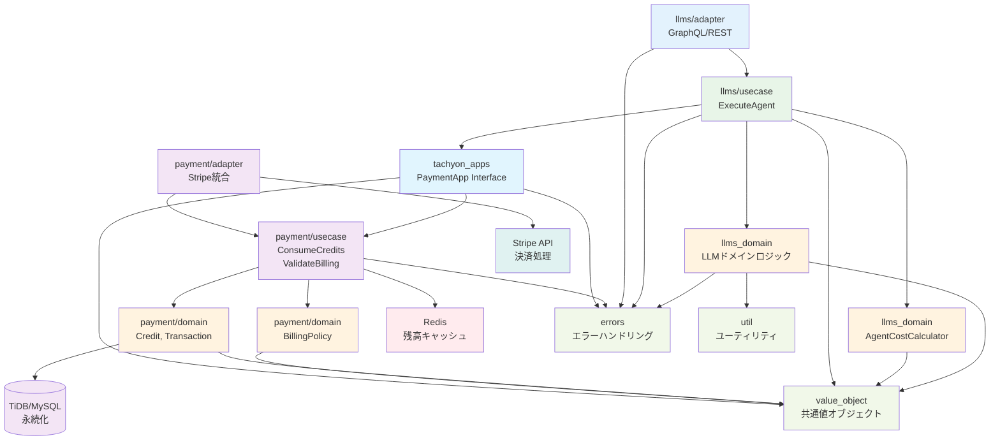
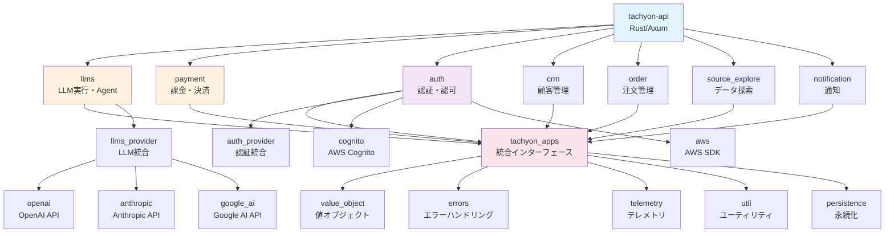
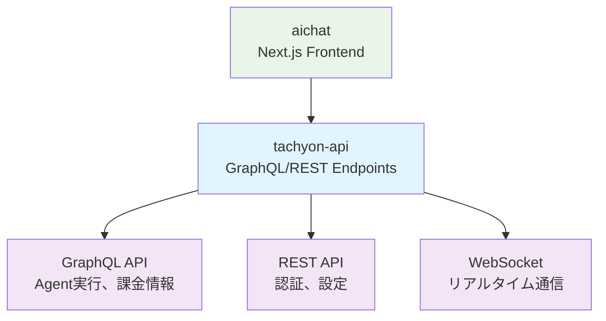

# Crate間依存関係アーキテクチャ

Tachyon Appsプロジェクトにおけるcrate間（packages間）の依存関係を可視化し、アーキテクチャの理解を深めるためのドキュメントです。

## 全体アーキテクチャ概要

Tachyon Appsは、以下の層で構成されています：

1. **アプリケーション層** (apps/*) - 具体的なサービス実装
2. **ドメインパッケージ層** (packages/*) - ビジネスロジックとインフラストラクチャ
3. **共通ライブラリ層** - 全体で共有される基盤機能
4. **プロバイダー層** (packages/providers/*) - 外部サービス統合

## メインアーキテクチャ図

```mermaid
graph TD
    %% Applications Layer (Top)
    TachyonAPI[tachyon-api<br/>Rust/Axum]
    AiChat[aichat<br/>Next.js]
    LibraryAPI[library-api<br/>Rust/Axum]
    BakuureAPI[bakuure-api<br/>Rust/Axum]
    
    %% More Applications
    BakuureUI[bakuure-ui<br/>Next.js]
    BakuureAdminUI[bakuure-admin-ui<br/>Next.js]
    LibraryUI[library<br/>Next.js]
    TachyonUI[tachyon<br/>Next.js]
    StockMind[stockmind<br/>Rust]
    
    %% Core Business Domains (Main Crates)
    LLMs[llms<br/>LLM実行・Agent]
    Payment[payment<br/>課金・決済]
    Auth[auth<br/>認証・認可]
    CRM[crm<br/>顧客管理]
    
    %% More Core Domains
    Order[order<br/>注文管理]
    Delivery[delivery<br/>配送管理]
    Catalog[catalog<br/>商品カタログ]
    SourceExplore[source_explore<br/>データ探索]
    
    %% Additional Domains
    Projects[projects<br/>プロジェクト管理]
    IAC[iac<br/>インフラ管理]
    ProcessManager[process_manager<br/>プロセス管理]
    Notification[notification<br/>通知]
    
    %% Domain Sub-crates
    LLMsDomain[llms_domain<br/>LLMドメインロジック]
    AuthDomain[auth_domain<br/>認証ドメインロジック]
    DatabaseDomain[database_domain<br/>DBドメインロジック]
    
    %% Supporting Services
    FeatureFlag[feature_flag<br/>機能フラグ]
    Onboarding[onboarding<br/>オンボーディング]
    Taskflow[taskflow<br/>タスクフロー]
    CorporateDB[corporate_db<br/>企業DB]
    
    %% More Supporting Services
    DeveloperFront[developer_front<br/>開発者向け]
    DocumentUpdater[document_updater<br/>ドキュメント更新]
    CSVImporter[csv_importer<br/>CSV取込]
    
    %% Integration Layer
    TachyonApps[tachyon_apps<br/>統合インターフェース]
    
    %% Infrastructure Layer
    Database[database<br/>DB管理]
    Persistence[persistence<br/>永続化]
    Telemetry[telemetry<br/>テレメトリ]
    
    %% Provider Integration
    LLMsProvider[llms_provider<br/>LLM統合]
    PaymentProvider[payment_provider<br/>決済統合]
    CRMProvider[crm_provider<br/>CRM統合]
    NotificationProvider[notification_provider<br/>通知統合]
    AuthProvider[auth_provider<br/>認証統合]
    
    %% AI/LLM Providers
    OpenAI[openai<br/>OpenAI API]
    Anthropic[anthropic<br/>Anthropic API]
    GoogleAI[google_ai<br/>Google AI API]
    Groq[groq<br/>Groq API]
    PerplexityAI[perplexity_ai<br/>Perplexity API]
    
    %% Infrastructure Providers  
    AWS[aws<br/>AWS SDK]
    Cognito[cognito<br/>AWS Cognito]
    Firebase[firebase_admin<br/>Firebase]
    Stripe[stripe<br/>Stripe決済]
    Square[square<br/>Square決済]
    
    %% Communication Providers
    Slack[slack<br/>Slack API]
    HubSpot[hubspot<br/>HubSpot CRM]
    
    %% Other Providers
    B4BAPI[b4b_api<br/>B4B API]
    Misoca[misoca<br/>Misoca API]
    OpenLogi[openlogi<br/>OpenLogi API]
    
    %% Foundation Layer
    Errors[errors<br/>エラーハンドリング]
    ValueObject[value_object<br/>値オブジェクト]
    Util[util<br/>ユーティリティ]
    TestHelper[test_helper<br/>テストヘルパー]
    Muon[muon<br/>テストランナー]

    %% Application Layer Dependencies
    TachyonAPI --> LLMs
    TachyonAPI --> Payment
    TachyonAPI --> Auth
    TachyonAPI --> CRM
    TachyonAPI --> Order
    TachyonAPI --> SourceExplore
    TachyonAPI --> Notification
    
    AiChat -.-> TachyonAPI
    LibraryUI -.-> LibraryAPI
    BakuureUI -.-> BakuureAPI
    BakuureAdminUI -.-> BakuureAPI
    TachyonUI -.-> TachyonAPI

    %% Core Domain Dependencies
    LLMs --> Auth
    LLMs --> Notification
    LLMs --> Taskflow
    LLMs --> Telemetry
    
    %% Domain to Domain Sub-crate Dependencies
    LLMs --> LLMsDomain
    Auth --> AuthDomain
    Database --> DatabaseDomain
    
    Payment --> Auth
    Payment --> Catalog
    Payment --> IAC
    
    Order --> Auth
    Order --> Payment
    Order --> Delivery
    Order --> CRM
    Order --> Catalog
    Order --> SourceExplore
    
    CRM --> Auth
    CRM --> Payment
    CRM --> Delivery
    CRM --> Catalog
    CRM --> IAC

    %% Supporting Domain Dependencies  
    DocumentUpdater --> LLMs
    DocumentUpdater --> Auth
    
    CSVImporter --> Auth
    CSVImporter --> Database
    
    SourceExplore --> Auth
    SourceExplore --> CSVImporter
    SourceExplore --> Database
    
    Projects --> Auth
    Projects --> Database
    Projects --> Persistence

    %% Domain to Integration Layer
    LLMs --> TachyonApps
    Payment --> TachyonApps
    Auth --> TachyonApps
    CRM --> TachyonApps
    Order --> TachyonApps
    SourceExplore --> TachyonApps
    Projects --> TachyonApps
    IAC --> TachyonApps
    Notification --> TachyonApps

    %% Integration to Infrastructure
    TachyonApps --> Database
    TachyonApps --> Persistence
    TachyonApps --> Telemetry

    %% Provider Integration Dependencies
    LLMs --> LLMsProvider
    Payment --> PaymentProvider
    Auth --> AuthProvider
    CRM --> CRMProvider
    Notification --> NotificationProvider

    %% Provider to External Services
    LLMsProvider --> OpenAI
    LLMsProvider --> Anthropic
    LLMsProvider --> GoogleAI
    LLMsProvider --> Groq
    LLMsProvider --> PerplexityAI
    
    PaymentProvider --> Stripe
    PaymentProvider --> Square
    
    AuthProvider --> Cognito
    AuthProvider --> AWS
    AuthProvider --> Firebase
    
    CRMProvider --> HubSpot
    
    NotificationProvider --> Slack

    %% Infrastructure to Foundation
    Database --> ValueObject
    Database --> Util
    Database --> Errors
    
    Persistence --> ValueObject
    Persistence --> Errors
    
    TachyonApps --> ValueObject
    TachyonApps --> Errors
    
    Telemetry --> Util
    Telemetry --> Errors

    %% Domain Sub-crates to Foundation Dependencies
    LLMsDomain --> ValueObject
    LLMsDomain --> Util
    LLMsDomain --> Errors
    
    AuthDomain --> ValueObject
    AuthDomain --> Errors
    
    DatabaseDomain --> ValueObject
    DatabaseDomain --> Errors
    
    %% Main Crates to Foundation Dependencies
    LLMs --> ValueObject
    LLMs --> Util
    LLMs --> Errors
    LLMs --> Persistence
    
    Payment --> ValueObject
    Payment --> Util
    Payment --> Errors
    Payment --> Persistence
    
    Auth --> ValueObject
    Auth --> Util
    Auth --> Errors
    Auth --> Persistence
    
    CRM --> ValueObject
    CRM --> Util
    CRM --> Errors
    CRM --> Persistence
    
    Order --> ValueObject
    Order --> Util
    Order --> Errors
    Order --> Persistence

    %% Styling
    style TachyonAPI fill:#e1f5fe
    style AiChat fill:#e8f5e8
    style LLMs fill:#fff3e0
    style Payment fill:#fff3e0
    style Auth fill:#f3e5f5
    style TachyonApps fill:#fce4ec
    style Database fill:#fce4ec
    style OpenAI fill:#e0f2f1
    style Stripe fill:#e0f2f1
    style ValueObject fill:#f1f8e9
    style Errors fill:#f1f8e9
    style Util fill:#f1f8e9
```

## LLM課金システムの依存関係詳細

LLM課金システムに特化した依存関係を詳しく見てみましょう：

## アプリケーション別依存関係

### tachyon-api (Rust/Axum)

主要なRust APIサーバーとしての依存関係：

### aichat (Next.js)

フロントエンドとしての統合：

## 依存関係の層別分析

### 第1層: 共通基盤 (Foundation Layer)

最下位層で、他のすべてのpackageから依存される基盤機能：

- `errors` - エラーハンドリング
- `value_object` - 値オブジェクト（ID、金額など）
- `util` - ユーティリティ関数

### 第2層: インフラストラクチャ (Infrastructure Layer)

基盤の上に構築されるインフラ機能：

- `persistence` - データ永続化
- `database` - データベース管理
- `telemetry` - 監視・ログ
- `tachyon_apps` - 統合インターフェース

### 第3層: プロバイダー (Provider Layer)

外部サービスとの統合：

- `providers/*` - 各種外部API統合
- 認証プロバイダー、決済プロバイダー、LLMプロバイダーなど

### 第4層: ドメインサービス (Domain Service Layer)

ビジネスロジックを実装するメインパッケージ：

- `auth` - 認証・認可（`auth_domain`サブcrateを含む）
- `llms` - LLM実行・Agent（`llms_domain`サブcrateを含む）
- `payment` - 課金・決済
- `crm` - 顧客管理
- `order` - 注文管理
- `database` - データベース管理（`database_domain`サブcrateを含む）

**重要な依存関係の注意点:**
- `llms` crate → `llms_domain` crate（llmsがドメインロジックに依存）
- `llms` crate → `tachyon_apps` crate（統合インターフェースに依存）  
- `llms_domain` crate → 基盤crate群のみ（`tachyon_apps`には依存しない）

### 第5層: アプリケーション (Application Layer)

最上位層で、具体的なサービスを提供：

- `tachyon-api` - メインAPIサーバー
- `aichat` - AIチャットフロントエンド
- その他のアプリケーション

## 設計原則とベストプラクティス

### 1. 循環依存の回避

依存関係が一方向になるよう設計されており、循環依存は発生しません。

### 2. レイヤード・アーキテクチャ

各層は下位層にのみ依存し、上位層への依存は避けられています。

### 3. コンテキスト境界の明確化

- LLMsコンテキスト: Agent実行、使用量測定
- Paymentコンテキスト: クレジット管理、決済処理
- Authコンテキスト: 認証・認可

### 4. インターフェース分離

`tachyon_apps`パッケージが統一インターフェースを提供し、コンテキスト間の結合を緩めています。

### 5. プロバイダーパターン

外部サービスとの統合は専用のプロバイダーパッケージで抽象化されています。

## メンテナンス指針

### 新しいドメインパッケージを追加する場合

1. 共通基盤（`errors`, `value_object`, `util`）に依存
2. 必要に応じてインフラ層（`persistence`, `database`）に依存
3. `tachyon_apps`にインターフェースを追加
4. 外部サービス統合が必要な場合はプロバイダーパッケージを作成

### 依存関係を変更する場合

1. 循環依存が発生しないことを確認
2. レイヤー違反（上位層への依存）がないことを確認
3. 必要最小限の依存関係に留める
4. インターフェースを通じた間接的な依存を検討

## 関連ドキュメント

- [LLM Agent Billing設計書](../tasks/feature/implement-llm-billing-system.md)
- [コンテキスト境界設計](./context-boundaries.md)
- [API設計ガイドライン](./api-design-guidelines.md)

---

このドキュメントは、システムの理解と適切な依存関係管理のための参考資料として活用してください。 