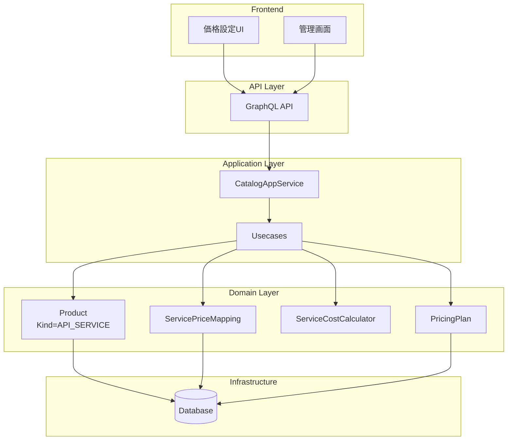

# サービスカタログ・価格設定システム

## 概要

サービスカタログ・価格設定システムは、Tachyonプラットフォームで提供するAPIサービス（Agent API、Chat API、画像生成API等）の価格を一元管理するシステムです。調達原価をベースに適切な利益率を確保しながら、顧客に提供するサービスの価格を柔軟に設定・管理できます。

## アーキテクチャ

### システム構成



### ドメインモデル

#### Product（既存の拡張）
- **Kind::ApiService**: APIサービスを識別
- **ProductServiceSpec**: サービス仕様（SLA、API制限）
- **ProductUsagePricing**: 従量課金設定

#### ServicePriceMapping
調達原価とサービス価格をマッピングする集約ルート：
- 固定価格または調達価格ベースの価格設定
- マークアップ率の適用
- 有効期間の管理

#### PricingPlan
料金プランを表現する値オブジェクト：
- プラン別割引率
- 含まれる機能
- 月額料金とクレジット

#### ServiceCostCalculator
価格計算を行うドメインサービス：
- 使用量に基づくコスト計算
- プラン割引の適用
- 複数の価格要素の集計

## データモデル

### service_price_mappings
```sql
CREATE TABLE `service_price_mappings` (
    `id` VARCHAR(32) NOT NULL,
    `tenant_id` VARCHAR(29) NOT NULL,
    `product_id` VARCHAR(32) NOT NULL,
    `price_type` VARCHAR(50) NOT NULL,
    `price_mode` ENUM('fixed', 'procurement_linked') NOT NULL DEFAULT 'fixed',
    `fixed_price` DECIMAL(15, 6),
    `fixed_price_nanodollars` BIGINT,
    `procurement_price_id` VARCHAR(32),
    `markup_rate` DECIMAL(5, 2) DEFAULT 1.5,
    `effective_from` TIMESTAMP NOT NULL,
    `effective_until` TIMESTAMP,
    PRIMARY KEY (`id`)
);
```

調達連動マッピングでは定期的に fixed 価格を再計算して `fixed_price_nanodollars` を埋め、課金ロジックが固定価格のみを参照することで調達漏れを早期検知します。値が未設定のまま課金処理が呼ばれた場合はビジネスロジックエラーが発生します。

### pricing_plans
```sql
CREATE TABLE `pricing_plans` (
    `id` VARCHAR(32) NOT NULL,
    `tenant_id` VARCHAR(29) NOT NULL,
    `plan_code` VARCHAR(50) NOT NULL,
    `display_name` VARCHAR(255) NOT NULL,
    `monthly_fee` DECIMAL(15, 2),
    `included_credits` DECIMAL(15, 2),
    `discount_rates` JSON,
    `status` ENUM('ACTIVE', 'INACTIVE') NOT NULL DEFAULT 'ACTIVE',
    PRIMARY KEY (`id`)
);
```

### product_usage_pricing
```sql
CREATE TABLE `product_usage_pricing` (
    `id` VARCHAR(32) NOT NULL,
    `product_id` VARCHAR(32) NOT NULL,
    `tenant_id` VARCHAR(29) NOT NULL,
    `usage_rates` JSON NOT NULL,
    `minimum_units` JSON,
    PRIMARY KEY (`id`)
);
```

## API仕様

### GraphQL Query

#### apiServices
APIサービス一覧を取得：
```graphql
query GetApiServices {
  apiServices {
    id
    name
    description
    status
    kind
    listPrice
    billingCycle
    requiresUsagePricing
    serviceSpec {
      apiLimits
      sla
    }
    usagePricing {
      usageRates
    }
  }
}
```

#### calculateServiceCost
サービスコストを計算：
```graphql
query CalculateServiceCost($input: CalculateServiceCostInput!) {
  calculateServiceCost(input: $input) {
    product {
      name
    }
    items {
      itemType
      description
      quantity
      unitPrice
      amount
    }
    subtotal
    discounts {
      description
      amount
    }
    total
  }
}
```

### GraphQL Mutation

#### setServicePriceMapping
価格マッピングを設定：
```graphql
mutation SetServicePriceMapping($input: SetServicePriceMappingInput!) {
  setServicePriceMapping(input: $input) {
    id
    priceType
    fixedPrice
    markupRate
    effectivePrice
  }
}
```

## 価格計算ロジック

### 基本的な価格計算フロー

1. **使用量の収集**
   - 実行回数
   - プロンプトトークン数
   - 完了トークン数
   - ツール使用回数

2. **価格要素の計算**
   - 基本料金（固定）
   - トークン料金（従量）
   - ツール使用料（従量）

3. **マークアップの適用**
   - 調達原価 × マークアップ率

4. **プラン割引の適用**
   - サブトータル × (1 - 割引率)

### 計算例

```yaml
# Agent API実行コスト
base_fee: ¥10
prompt_tokens: 1000 × ¥0.03 = ¥30
completion_tokens: 500 × ¥0.06 = ¥30
mcp_calls: 5 × ¥5 = ¥25
subtotal: ¥95
plan_discount: -¥9.5 (Pro plan 10%)
total: ¥85.5
```

## 統合ポイント

### LLMsコンテキストとの統合
ExecuteAgentユースケースでCatalogAppServiceを使用：
```rust
let cost = self.catalog_app
    .calculate_service_cost(&product_id, &usage, plan_id)
    .await?;
```

### Paymentコンテキストとの統合
計算されたコストをPaymentAppに渡して課金処理を実行。

## 運用

### 価格更新フロー
1. 管理画面から価格マッピングを更新
2. 有効期間を設定して段階的移行
3. 価格変更履歴の自動記録

### モニタリング
- サービス別収益性
- 利益率の推移
- 価格弾力性分析

## セキュリティ考慮事項

- 価格設定は管理者権限が必要
- 価格変更は監査ログに記録
- テナント間の価格情報分離

## 今後の拡張予定

1. **価格最適化機能**
   - 使用量分析に基づく価格提案
   - A/Bテストによる価格実験

2. **高度な料金体系**
   - ボリュームディスカウント
   - コミットメント割引
   - 時間帯別料金

3. **外部連携**
   - 競合価格トラッキング
   - 為替レート連動
