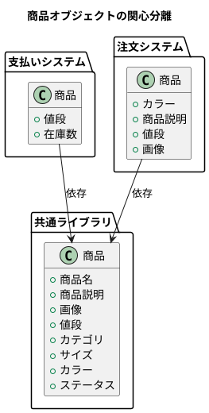

# Proposal: appsのデータベースをLibraryに接続する

2024/07/01

商品オブジェクト

- 商品名
- 商品説明
- 画像
- 値段
- カテゴリ
- サイズ
- カラー
- ステータス

など現実の商品には無数の属性がある。
しかし、アプリケーションがそれら全てを意識することはない。

支払いシステムには、商品説明やカテゴリなどの属性は必要ないが、値段や在庫数などは必要かもしれない。
ユーザーのための注文システムには、カラー、商品説明、値段や画像などが必要かもしれない。

そして、これらの属性は、それぞれのシステムで一部の必要属性のみを持った商品オブジェクトとして保存されている。
これを**関心の分離**（SoC, Separation of Concerns）という。

昨今のSaaSアプリケーションでは、関心の分離によって各ドメインを深め、使いやすさを追求している。

しかし、これにはデータが複雑になり管理しきれないという課題が発生する。
あらゆるシステムやユースケースごとに、商品オブジェクトが保存されるため、ユーザーから見ると商品オブジェクトがあらゆる場所に複数存在するように見える。

これはデータの不整合や高い認知不可が生まれる。

---

そこで、アプリケーションのデータベースをLibraryに接続することで、この課題を解決する。
