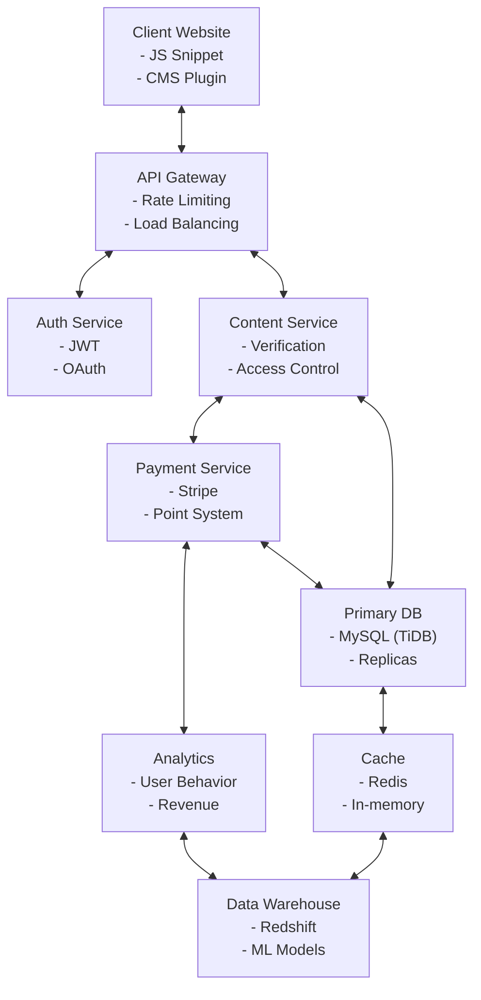

# Proposal: コンテンツ作成者向けマイクロペイメントシステム（micropay）

2024/11/27

## 1. アイデア

### 背景と目的

広告などを使わず随筆者に金銭的利益を分配する。

**背景**

お金を払いたくないわけじゃないが、単価が高すぎる。アフィリ広告ベタベタは論外。でも、ある出版社などにサブスクで払うというのも高いし読むかわからない。キュレーションアプリに払うのも倫理的に控えたい。よって、ビューやお気に入り登録などに応じてマイクロに課金して欲しい。ピッコマとかで漫画を買って読むくらいの感覚がいい。

これにはいろんな可能性が広がると思っている。二次創作の利益が原作者に分配するという行為が気軽に行われたら、より読みやすい文章を書く人がとあるPoC論文などを読みやすくし、より広い人に届けることができる。それは原作にも利益が分配できるという役割分担も可能になる。

**業界の課題**

現在のコンテンツ配信モデルには、以下のような課題が存在する：

1. **広告モデルの限界**: 広告収入に依存するモデルは、コンテンツの質よりも注目を集めることを優先し、クリックベイトや過剰な広告表示を促進している
2. **サブスクリプション疲れ**: 複数のサービスに月額料金を支払うことへのユーザーの抵抗感が高まっている
3. **クリエイターの収益化困難**: 多くの優れたコンテンツ作成者が適切な報酬を得られていない
4. **デジタルコンテンツの価値評価**: デジタルコンテンツの適正価格設定が難しい
5. **プラットフォーム依存**: 収益化のためにクリエイターが特定のプラットフォームに縛られてしまう
6. **プラットフォーム手数料の高さ**: アプリストア(30%)、電子書籍(30-65%)、サブスクメディア(50%前後)など、中間業者への手数料が高額
7. **AI生成コンテンツとの差別化**: 人間による創作物の価値の再評価と適正な対価の必要性

### サブスクリプションモデルからの移行動機

#### コンテンツプロバイダー側の動機

1. **プラットフォーム手数料からの解放**
   - 既存プラットフォームでは収益の30-65%が手数料として徴収される
   - マイクロペイメントでは手数料が10-15%程度に削減可能
   - 独自のブランディングと読者関係を維持しながら収益化できる

2. **コンテンツ価値の適正評価**
   - 実際に読まれたコンテンツのみが収益化される公平なモデル
   - 高品質・専門性の高いコンテンツに適した価格設定が可能
   - コンテンツの価値に応じた差別的価格設定の柔軟性

3. **読者データの直接獲得**
   - プラットフォームに依存せず読者との直接関係構築
   - 詳細な読者行動データの取得とマーケティングへの活用
   - 継続的な関係構築とロイヤルユーザー育成

4. **収益モデルの多様化**
   - 広告・サブスク・マイクロペイメントの併用による安定経営
   - コンテンツ種類に応じた最適な収益化手段の選択
   - 市場環境の変化に強い柔軟なビジネスモデル

#### 読者側の動機

1. **選択的コンテンツ消費**
   - 関心のある記事のみに支払い可能
   - 複数サブスクリプションの総コスト削減
   - 多様なソースからの情報取得の自由度

2. **広告なし体験のオプション**
   - 必要に応じて広告を見ない選択ができる
   - 良質な読書体験の獲得
   - プライバシー意識の高まりへの対応

3. **コンテンツクリエイターへの直接支援**
   - 支持するクリエイターへの直接的な経済支援
   - 中間マージンの削減による効率的な支援
   - クリエイターとの関係性強化

### ターゲットユーザー

**読者**
- お金を払いたくないわけじゃないが、単価が高すぎると感じている人
- 良質なコンテンツに対して適切な対価を支払いたい人
- 広告なしの読書体験を求める人
- 20代〜40代のデジタルネイティブ世代
- 専門知識や趣味のコンテンツに関心が高い層
- 複数のサブスクリプションサービスへの支出を見直したいと考えている人
- 選択的なコンテンツ消費を好む人

**コンテンツ作成者**
- 自分の作品から適切な収益を得たい随筆者、ブロガー
- 二次創作者
- 専門知識を持ち、それを分かりやすく伝えたい人
- 個人出版や自費出版を考えている著者
- 研究者や専門家（論文や専門記事の執筆者）
- 既存のブログやCMSで活動している作家（WordPress, note, Medium等）

### 提供価値

- 随筆者がページビュー数に応じて利益を得られる
- 読者は広告なしで良質なコンテンツを適正価格で楽しめる
- 原作者と二次創作者の間で公平な利益分配が可能になる
- 専門知識の普及と対価の獲得を両立できる
- コンテンツ消費の透明性と公平性の向上
- クリエイターと読者の直接的な関係構築
- 長期的なコンテンツエコシステムの健全な発展
- **プラットフォーム非依存**: 好きなCMSやブログサービスを使いながら収益化できる

## 2. 製品のコンセプト

### 製品の概要

既存のCMSやブログと連携し、アフィリエイト広告の代替となるマイクロペイメントシステム。読者は事前購入したポイントを使ってコンテンツを消費し、作者はそのポイントに応じた収益を得られる。コンテンツ管理自体は既存のCMSやブログサービスをそのまま利用できる。

**コアバリュー**
- **透明性**: 課金と収益の流れが明確
- **公平性**: 消費されたコンテンツに対してのみ課金
- **柔軟性**: 多様なプラットフォームやCMSとの連携
- **持続可能性**: クリエイターの長期的な収益を支援
- **非侵襲性**: 既存のワークフローを尊重しながら収益化を実現

### 主要な機能

- 既存のCMSやブログプラットフォームと連携するAPIとプラグイン
- 広告あり無料閲覧と広告なし有料閲覧のハイブリッドモデル
- 既存広告システムとの互換性維持
- 課金は事前購入ポイント制
- ページ単位での課金
- １日待てば無料などの特典
- コンテンツ自体の差別化要因は、無料チケット使えるなどの特典の有無や単価で
- 二次創作の場合、原作者への自動的な利益分配
- 読者のエンゲージメント（読了率、滞在時間など）に基づく報酬システム
- 簡単に導入できるJavaScriptスニペット（広告タグのような実装）
- リアルタイム収益追跡ダッシュボード
- 主要CMSプラットフォーム向けプラグイン（WordPress, Medium, note等）
- マイクロペイメントウォレットの一元管理（複数サイト間で共通）

### 差別化要因

- 広告なしでのコンテンツ体験の提供
- ハイブリッドモデル対応（広告あり/広告なしの選択肢）
- マイクロペイメントによる柔軟な価格設定
- 原作者と二次創作者間の公平な利益分配システム
- 読者の行動に基づく透明性の高い報酬システム
- **プラットフォーム非依存**: 既存のブログやCMSをそのまま使える
- **統一ウォレット**: 複数のサイトやサービス間で共通利用可能
- **導入の容易さ**: 数行のコードで実装可能
- **アフィリエイト広告の代替または併用**: より読者フレンドリーな収益化手段

### ユーザーエクスペリエンス

**読者のジャーニー**

1. **発見**: お気に入りのブログやサイトでマイクロペイメントタグを発見
2. **選択**: 「広告ありで無料で読む」または「広告なしでポイント支払い」の選択
3. **登録**: 初回のみ簡単な登録（メールアドレスやソーシャルアカウント）
4. **ポイント購入**: 初回登録特典として無料ポイントを獲得
5. **コンテンツ消費**: ポイントを使って記事を読む（プレビュー部分は無料）
6. **シームレスな体験**: 一度登録すると、連携サイトを横断して利用可能
7. **エンゲージメント**: 気に入ったコンテンツにチップなどの追加支援も可能
8. **リピート**: お気に入りのクリエイターを様々なプラットフォームで追いかけられる

**クリエイターのジャーニー**

1. **アカウント作成**: サービスに登録
2. **連携設定**: 自分のブログやCMSにプラグインやスニペットを設置
3. **価格設定**: コンテンツごとの課金設定（記事ごと、セクションごとなど）
4. **コンテンツ制作**: 普段使っているツールでそのまま作成
5. **公開**: 既存のワークフローで公開
6. **収益追跡**: 統合ダッシュボードでリアルタイムに収益を確認
7. **最適化**: データに基づいてコンテンツ戦略を改善

## 3. 市場の概要

### 市場規模と成長性

- デジタルコンテンツ市場は年々拡大しており、特に個人クリエイターの参入が増加
- サブスクリプションモデルの飽和により、より柔軟な支払いモデルへの需要が高まっている
- Z世代を中心に、広告よりも直接支払いを好む傾向が強まっている
- 世界のデジタルコンテンツ市場は2025年までに3,000億ドルを超える見込み
- 日本国内のデジタルコンテンツ市場は年率8%以上で成長中
- クリエイターエコノミーは2022年以降急速に拡大し、グローバルで1,000億ドル規模に成長
- オンライン広告市場の信頼性低下によりアフィリエイト広告の代替手段への需要が増加

**成長要因**

- スマートフォンの普及とモバイルデータ通信の高速化
- デジタルネイティブ世代の購買力増加
- コロナパンデミック以降のデジタルコンテンツ消費の習慣化
- クリエイターエコノミーへの注目度向上
- 著作権とデジタル資産に関する意識の高まり
- **広告ブロッカーの普及**: 従来の広告収入モデルの持続可能性への疑問
- **プライバシー意識の高まり**: トラッキング広告への嫌悪感

### AIとマイクロペイメントの相乗効果

**市場変化要因としてのAI**

1. **コンテンツ価値の再定義**
   - AI生成コンテンツの普及による人間作成コンテンツの希少性と価値の上昇
   - 信頼性の高い情報源としての専門メディアの価値再評価
   - 創造性・専門性・独自視点を持つコンテンツの差別化

2. **AIを活用した価格最適化**
   - 読者行動と支払い意思額の分析による動的価格設定
   - コンテンツ種類・質・長さに応じた最適価格の自動算出
   - パーソナライズされた価格提案と購読推奨

3. **新たな価値創造機会**
   - AI支援による高品質コンテンツ制作の効率化
   - 人間とAIのコラボレーションによる新たなコンテンツ形式
   - データの価値化と適正な対価分配メカニズム

4. **コンテンツ消費行動の変化への対応**
   - 断片的情報消費に対応した柔軟な課金システム
   - 知識グラフ連動型の関連コンテンツ推奨と統合課金
   - AI要約と詳細読解の選択肢提供

### 競合分析

**ダイレクト決済サービス**
- Stripe Payment Links: 決済に特化、コンテンツ管理機能なし
- Buy Me a Coffee: ティッピングモデル、マイクロペイメント非対応
- PayPal: 汎用決済、コンテンツ特化機能なし

**コンテンツプラットフォーム内課金**
- note: 有料記事機能あり、ただし記事単位での固定価格、外部サイトとの連携不可
- zenn: 技術記事に特化、有料記事と投げ銭機能あり、プラットフォーム依存
- Medium: 会員制と閲覧時間に基づく報酬システム、プラットフォーム依存

**広告代替ソリューション**
- Brave Publisher: 暗号資産ベースの報酬、特定ブラウザ依存
- Coil: Web Monetizationプロトコル、普及率低い
- YouTube Premium: 広告非表示のサブスクリプション、動画コンテンツ限定

**プラグイン型決済**
- WordPress有料コンテンツプラグイン: WordPress限定、マイクロペイメント非対応
- Memberful: メンバーシップモデル、マイクロトランザクション非対応
- Patreon: 定期支援モデル、コンテンツ単位の支払いなし

**競合優位性分析**

| サービス | 強み | 弱み | 我々の差別化ポイント |
|---------|------|------|-----------------|
| note | UI/UXの洗練、ブランド力 | プラットフォーム依存、固定価格のみ | プラットフォーム非依存、柔軟な価格設定 |
| Buy Me a Coffee | シンプルさ、低い導入障壁 | 定額のみ、コンテンツ連動性低い | コンテンツ消費に基づく自動課金、多様な価格モデル |
| WordPress課金プラグイン | WordPressとの高い統合性 | 単一プラットフォーム、複雑な設定 | マルチプラットフォーム対応、簡単導入 |
| Brave Publisher | プライバシー重視、広告代替 | 特定ブラウザ依存、暗号資産利用 | ブラウザ非依存、法定通貨でのポイント制 |

## 4. 技術的実装案

### システム構成

- フロントエンド（ウィジェット）: JavaScript, React
- バックエンド: Rust (axum)
- データベース: MySQL (TiDB)
- 決済システム: Stripe Connect
- コンテンツ認証: JWT, OAuth
- APIゲートウェイ: AWS API Gateway
- キャッシュ: Redis
- 分析基盤: AWS Kinesis + Redshift

### 統合方式

1. **JavaScriptスニペット**: 1〜2行のコードで任意のサイトに埋め込み可能
   ```html
   <script src="https://micropay.example.com/widget.js" data-content-id="article-123"></script>
   ```

2. **CMSプラグイン**:
   - WordPress Plugin
   - Ghost Integration
   - Drupal Module
   - 他の主要CMSプラグイン

3. **REST API**: カスタム連携用の包括的なAPI
   ```
   POST /api/v1/content/authorize
   GET /api/v1/wallet/balance
   POST /api/v1/payment/process
   ```

4. **WebComponent**: フレームワーク非依存のカスタム要素
   ```html
   <micro-paywall content-id="article-123" price="100" currency="points"></micro-paywall>
   ```

### システムアーキテクチャ



### 主要技術コンポーネント

1. **マイクロペイメントウィジェット**
   - 軽量JavaScriptライブラリ（<5KB gzipped）
   - レスポンシブデザイン
   - カスタマイズ可能なUI
   - オフラインサポート（PWA対応）

2. **ウォレットシステム**
   - ポイント購入・管理
   - 使用履歴追跡
   - 自動分配アルゴリズム
   - サイト間共通ウォレット

3. **コンテンツアクセス制御**
   - JWTベースの認証
   - タイムベースアクセス（待機時間後の無料閲覧）
   - 部分的アクセス（プレビュー/ティーザー）
   - 戻り読み許可（一度支払い済みコンテンツへの再アクセス）

4. **クリエイターダッシュボード**
   - CMSプラグインとして統合
   - スタンドアロンWebアプリ
   - リアルタイム収益表示
   - コンテンツパフォーマンス指標

### 技術的課題と解決策

| 課題 | 解決策 |
|------|-------|
| 多様なCMSとの互換性 | 標準化されたJSスニペットとWebComponentによる統合 |
| コンテンツアクセス制御 | クライアントサイド暗号化とサーバーサイド検証の組み合わせ |
| クロスサイト認証 | シングルサインオン、共通認証トークン |
| パフォーマンス最適化 | エッジキャッシュ、非同期処理、最小限のペイロード |
| オフラインサポート | PWA技術の活用、ローカルデータ同期 |
| コンテンツ不正アクセス防止 | 暗号化スクランブル、ウォーターマーキング、アクセスタイムスタンプ |
| プライバシー保護 | 最小限のデータ収集、匿名化、透明性のあるポリシー |
| API乱用防止 | レート制限、トークン検証、異常検知 |

### 開発ロードマップ

1. MVP開発: 基本的なJSスニペットとAPI、ポイント購入システム
2. WordPressプラグイン: 最も普及しているCMSへのネイティブ統合
3. 利益分配システム: 閲覧数に応じた作者への分配機能
4. 二次創作サポート: 原作者への自動分配機能
5. 広告あり/広告なし選択機能: 既存広告システムとの連携
6. 追加CMSプラグイン: Drupal, Ghost, Webflow等への拡大
7. 高度なカスタマイズオプション: デザイン、価格モデル、アクセス制御
8. SDKリリース: サードパーティ開発者向けの統合キット
9. グローバル展開のための多言語・多通貨対応

### 開発タイムライン

| フェーズ | 期間 | 主要マイルストーン |
|---------|------|-----------------|
| 概念検証 | 2ヶ月 | 要件定義、プロトタイプ作成、ユーザーフィードバック |
| MVP開発 | 3ヶ月 | 基本ウィジェット実装、APIバックエンド、初期テスト |
| WordPressプラグイン | 1ヶ月 | WordPressプラグイン開発、テスト、公開 |
| パブリックベータ | 2ヶ月 | 限定サイト向けリリース、フィードバック収集、改善 |
| 追加CMS対応 | 3ヶ月 | 主要CMSプラットフォームへの拡大 |
| 製品版リリース | 1ヶ月 | 一般公開、マーケティングキャンペーン、初期サポート |

## 5. ビジネスモデル

### 収益源

- **トランザクション手数料**: 取引額の10-15%
- **プレミアム機能**: 高度な分析、カスタムデザイン、特別な分配ルール
- **法人向けエンタープライズプラン**: 大規模メディア企業向けホワイトラベル版
- **決済処理手数料**: ポイント購入時の手数料（3-5%）
- **プロフェッショナルサービス**: カスタム導入、コンサルティング

### 既存ウェブメディアへの価値提案

大手ウェブメディア（アスキー、Gizmodoなど）がマイクロペイメントを導入する主なメリット：

1. **収益の多様化と安定化**
   - 広告ブロッカー対策として有効（現在30-40%のユーザーが使用）
   - 広告市場の変動リスク分散
   - 収益源の多角化による経営安定化

2. **コンテンツ資産の最大活用**
   - 過去記事アーカイブの収益化
   - 専門性の高い深掘り記事の適正価格での提供
   - 長期的に価値のある技術記事・レビュー記事の継続的収益化

3. **編集戦略の最適化**
   - 記事単位でのROI測定の精緻化
   - 読者データに基づいたコンテンツ戦略の改善
   - 収益性と社会的価値のバランスの取れた編集方針の実現

4. **読者関係の強化**
   - 有料読者の詳細なプロファイル獲得
   - ロイヤルユーザーの特定と関係深化
   - コミュニティ形成と読者エンゲージメント向上

5. **AI時代における競争優位性**
   - 独自取材・一次情報の価値向上
   - 専門的編集視点による情報キュレーションの差別化
   - 知的財産の適正評価と保護

**業界別特化戦略**

- **テック系メディア**: 専門度に応じた段階的価格設定、開発者向け深掘りコンテンツ
- **ガジェットレビュー**: 基本情報は無料、詳細分析・比較考察は有料モデル
- **ゲームメディア**: ニュースは無料、攻略・裏技・詳細分析は有料化
- **ライフスタイル**: トレンド情報は無料、実践方法・詳細ガイドは有料コンテンツ

### 収益予測

**初年度（保守的シナリオ）**
- 導入サイト数: 1,000サイト
- アクティブユーザー（月間）: 5万人
- 平均月間ポイント購入額: 1,000円
- 年間総取引額: 6億円
- プラットフォーム収益（15%）: 9,000万円

**3年目（成長シナリオ）**
- 導入サイト数: 10,000サイト
- アクティブユーザー（月間）: 30万人
- 平均月間ポイント購入額: 1,500円
- 年間総取引額: 54億円
- プラットフォーム収益（15%）: 8.1億円

### コスト構造

**初期開発コスト**
- エンジニアリング: 1,500万円
- デザイン: 300万円
- インフラ構築: 200万円
- プラグイン開発: 500万円
- 法務・セキュリティ: 200万円

**運用コスト（月間）**
- 人件費: 600万円
- サーバー・インフラ: 150万円
- マーケティング: 200万円
- カスタマーサポート: 100万円
- 決済手数料: 取引額の3%

### マネタイズ戦略

- **段階的価格設定**: サイト規模やトラフィックに応じた料率
- **フリーミアムモデル**: 小規模サイトは低手数料、高度な機能は追加料金
- **バンドル割引**: 複数サイト運営者向けの割引パッケージ
- **早期導入者特典**: 初期導入サイトには長期的な料率割引
- **アフィリエイトプログラム**: 導入サイト紹介に対する手数料還元

## 6. マーケティング戦略

### ターゲットセグメント

1. **初期採用者**:
   - 個人ブロガー（特に技術系、趣味系）
   - 小規模メディア運営者
   - コンテンツマーケティング担当者
   - アフィリエイト収入に依存しているサイト運営者

2. **成長期**:
   - 中規模メディア企業
   - 専門メディア（ニッチ分野）
   - オンライン出版社
   - 教育コンテンツ提供者

3. **成熟期**:
   - 大規模メディア企業
   - 企業ブログネットワーク
   - 国際的な出版社
   - 教育機関

### プロモーション戦略

- **コンテンツマーケティング**: 「収益化の未来」に関するブログ記事シリーズ
- **チュートリアルビデオ**: 導入方法の詳細解説
- **WordPress.orgディレクトリ掲載**: 公式プラグインとして登録
- **WordCampスポンサーシップ**: WordPress関連イベントでの露出
- **インフルエンサーマーケティング**: 著名ブロガーによる導入事例
- **ウェビナー**: 「アフィリエイト広告の先にあるもの」「読者体験を損なわない収益化」
- **成功事例の公開**: 導入サイトの収益増加データの共有
- **オンラインセミナー**: プラットフォーム非依存の収益化戦略
- **パートナーシッププログラム**: ウェブ制作会社やマーケティング会社との提携

### 成長戦略

- **垂直展開**: 特定業界向けの特化ソリューション（学術出版、料理レシピ等）
- **水平展開**: 新しいコンテンツタイプへの対応（動画、音声、会員限定コンテンツ）
- **地域展開**: 多言語対応、国際決済対応
- **エコシステム構築**: サードパーティ開発者によるプラグイン拡張
- **統合パートナーシップ**: 主要CMSやホスティングサービスとの提携

## 7. リスク分析と対策

### 主要リスク

| リスク | 影響度 | 対策 |
|-------|-------|-----|
| 既存CMS更新による互換性問題 | 高 | バージョン監視、自動テスト、迅速なアップデート体制 |
| 読者の課金抵抗感 | 高 | 段階的導入、無料トライアル、透明性のある価格設定 |
| サイト運営者の導入障壁 | 中 | 簡単な導入プロセス、手厚いドキュメント、サポート体制 |
| 競合サービスの模倣 | 中 | 継続的イノベーション、特許出願、独自機能の強化 |
| コンテンツ保護の課題 | 高 | 高度な暗号化、アクセス制御、不正利用検知システム |
| 決済トラブル | 中 | 複数決済手段、明確な返金ポリシー、サポート体制強化 |
| プライバシー規制対応 | 高 | GDPR/CCPA準拠設計、データ最小化、透明性のある同意取得 |

### 緩和策

- **早期フィードバックループ**: ベータプログラムによる問題の早期発見
- **段階的ロールアウト**: 特定CMSから開始し、徐々に拡大
- **エスクローシステム**: 収益の一部を一定期間保留して返金対応に備える
- **コードの安定性確保**: 継続的インテグレーション、自動テスト
- **法的対策**: 利用規約、プライバシーポリシーの徹底レビュー
- **教育コンテンツ**: 導入サイト向けのベストプラクティスガイド

## 8. 次のステップ

- ユーザーインタビュー（コンテンツ作成者とサイト運営者）
- WordPress向けMVPプラグイン開発
- JavaScriptウィジェットプロトタイプ作成
- 主要CMSプラットフォームとの技術的互換性調査
- 決済システム連携テスト
- 初期テストパートナーの募集（10サイト程度）
- プライバシーおよび法的要件の精査

### パートナーサイト検証フレームワーク

**検証目的**
- マイクロペイメントモデルの実用性と収益性の検証
- 広告あり/広告なしハイブリッドモデルの効果測定
- ユーザー体験と導入障壁の評価
- コンバージョン率と収益影響の測定

**検証方法**
1. **A/Bテスト**: 同一サイト内での広告モデルとマイクロペイメントモデルの比較
2. **段階的導入**: 記事の一部のみをマイクロペイメント対象にして効果検証
3. **ユーザーフィードバック**: 読者とコンテンツ作成者双方からの意見収集
4. **収益比較分析**: 広告収入とマイクロペイメント収入の詳細比較

**測定指標（KPI）**
- 広告あり/広告なし選択率
- コンバージョン率（無料→有料）
- 記事完読率の変化
- 平均セッション時間の変化
- コンテンツ作成者の収益変化
- ユーザー満足度スコア
- リピート率と継続購入率
- サイト全体の収益への影響

**テストパートナー選定基準**
- 多様なコンテンツジャンルの代表性
- トラフィック規模（小・中・大）
- 既存の収益モデル（広告依存度）
- 読者層の特性とデジタル親和性
- 導入意欲と長期的なビジョンの共有

**検証期間**: 初期3ヶ月間のクローズドベータ、その後3ヶ月のオープンベータ

### 直近のアクションアイテム（3ヶ月以内）

1. ✅ コンセプト文書完成（当文書）
2. □ 20名のコンテンツ作成者インタビュー実施
3. □ JavaScriptウィジェットプロトタイプ作成
4. □ WordPress基本プラグイン開発
5. □ 広告あり/広告なしハイブリッドモデルの設計完了
6. □ Stripe連携テスト環境構築
7. □ パートナーサイト検証計画の詳細化
8. □ 技術仕様書完成
9. □ テストパートナー5サイト確保
10. □ 初期マーケティングウェブサイト構築

### パートナーサイト検証フレームワーク

**検証目的**
- マイクロペイメントモデルの実用性と収益性の検証
- 広告あり/広告なしハイブリッドモデルの効果測定
- ユーザー体験と導入障壁の評価
- コンバージョン率と収益影響の測定

**検証方法**
1. **A/Bテスト**: 同一サイト内での広告モデルとマイクロペイメントモデルの比較
2. **段階的導入**: 記事の一部のみをマイクロペイメント対象にして効果検証
3. **ユーザーフィードバック**: 読者とコンテンツ作成者双方からの意見収集
4. **収益比較分析**: 広告収入とマイクロペイメント収入の詳細比較

**測定指標（KPI）**
- 広告あり/広告なし選択率
- コンバージョン率（無料→有料）
- 記事完読率の変化
- 平均セッション時間の変化
- コンテンツ作成者の収益変化
- ユーザー満足度スコア
- リピート率と継続購入率
- サイト全体の収益への影響

**テストパートナー選定基準**
- 多様なコンテンツジャンルの代表性
- トラフィック規模（小・中・大）
- 既存の収益モデル（広告依存度）
- 読者層の特性とデジタル親和性
- 導入意欲と長期的なビジョンの共有

**検証期間**: 初期3ヶ月間のクローズドベータ、その後3ヶ月のオープンベータ

**補足調査項目**

- **サブスクリプションとの共存モデル検証**
  - サブスク購読者へのマイクロペイメント特典効果
  - ハイブリッドモデルの最適な料金設計
  - 移行段階におけるユーザー心理分析

- **AI関連指標の測定**
  - AI生成コンテンツとの差別化要素の特定
  - AI支援コンテンツ制作の効率性と収益性
  - AIツールとの統合による体験向上効果

- **プラットフォーム非依存の効果**
  - 自社メディアブランド強化への影響
  - 読者の直接関係構築による効果
  - 手数料削減による収益改善の実測

### 直近のアクションアイテム（3ヶ月以内）

1. ✅ コンセプト文書完成（当文書）
2. □ 20名のコンテンツ作成者インタビュー実施
3. □ JavaScriptウィジェットプロトタイプ作成
4. □ WordPress基本プラグイン開発
5. □ 広告あり/広告なしハイブリッドモデルの設計完了
6. □ Stripe連携テスト環境構築
7. □ パートナーサイト検証計画の詳細化
8. □ 技術仕様書完成
9. □ テストパートナー5サイト確保
10. □ 初期マーケティングウェブサイト構築 