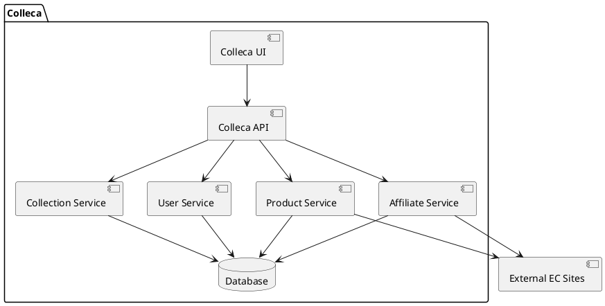

# Colleca サービス実装計画

このドキュメントでは、Collecaサービスの実装計画をPR単位で詳細に説明します。各PRは特定の機能セットに焦点を当て、段階的な開発アプローチを可能にします。

## 全体アーキテクチャ

Collecaは以下のコンポーネントで構成されます：

## PR実装計画

### PR #1: プロジェクト基盤セットアップ

**目的**: Collecaサービスの基本構造と開発環境を整備する

**実装内容**:
- 📝 APIプロジェクト構造の作成 (`apps/colleca-api/`)
- 📝 UIプロジェクト構造の作成 (`apps/colleca-ui/`)
- 📝 共通パッケージの作成 (`packages/colleca-common/`)
- 📝 データベースマイグレーション基盤の設定
- 📝 CI/CD設定
- 📝 開発環境のDockerfile作成

**技術スタック**:
- バックエンド: Rust (axum)
- フロントエンド: Next.js + TypeScript + Tailwind CSS
- データベース: MySQL (TiDB)

### PR #2: ユーザー認証システム

**目的**: ユーザー登録、ログイン、プロフィール管理機能の実装

**実装内容**:
- 📝 ユーザーモデルの定義
- 📝 認証APIエンドポイント
- 📝 SNS認証連携 (Google, Twitter)
- 📝 ユーザープロフィール管理画面
- 📝 認証ミドルウェア

**技術的詳細**:
- `packages/auth/`との連携
- JWTを使用したセッション管理
- マルチテナンシー対応

### PR #3: 商品情報取得システム

**目的**: 外部ECサイトから商品情報を取得する機能の実装

**実装内容**:
- 📝 商品モデルの定義
- 📝 URL解析システム
- 📝 Amazon商品情報取得
- 📝 楽天商品情報取得
- 📝 その他ECサイト対応
- 📝 商品情報キャッシュシステム

**技術的詳細**:
- スクレイピングとAPI併用アプローチ
- レート制限対応
- 非同期処理による情報取得

### PR #4: コレクション管理システム

**目的**: ユーザーがコレクションを作成・管理できる機能の実装

**実装内容**:
- 📝 コレクションモデルの定義
- 📝 コレクション作成・編集API
- 📝 商品追加・削除・並べ替え機能
- 📝 コレクション管理UI
- 📝 コレクション検索・フィルタリング

**技術的詳細**:
- ドラッグ&ドロップによる並べ替え
- リアルタイム保存
- 画像最適化

### PR #5: コレクション共有システム

**目的**: コレクションの共有と表示機能の実装

**実装内容**:
- 📝 公開/非公開設定
- 📝 共有URL生成
- 📝 SNSシェア機能
- 📝 コレクション表示ページ
- 📝 埋め込みウィジェット

**技術的詳細**:
- OGP対応
- レスポンシブデザイン
- パフォーマンス最適化

### PR #6: アフィリエイト連携システム

**目的**: ECサイトのアフィリエイトプログラムとの連携

**実装内容**:
- 📝 アフィリエイトアカウント連携
- 📝 アフィリエイトリンク生成
- 📝 クリック追跡
- 📝 収益計算システム
- 📝 レポート生成

**技術的詳細**:
- 各ECサイトのアフィリエイトAPI連携
- クリック追跡のためのリダイレクト処理
- データ集計バッチ処理

### PR #7: API開発

**目的**: 外部サービスとの連携のためのAPI開発

**実装内容**:
- 📝 RESTful API設計
- 📝 GraphQL API実装
- 📝 API認証・認可
- 📝 レート制限
- 📝 APIドキュメント

**技術的詳細**:
- GraphQLスキーマ設計
- APIキー管理
- Swagger/OpenAPIドキュメント

### PR #8: 分析ダッシュボード

**目的**: ユーザーとコレクションのパフォーマンス分析機能

**実装内容**:
- 📝 データ集計システム
- 📝 ダッシュボードUI
- 📝 レポート生成
- 📝 エクスポート機能

**技術的詳細**:
- データウェアハウス連携
- グラフ・チャート表示
- 定期レポート自動生成

## 開発スケジュール

| PR | 予定期間 | 依存関係 |
|----|----------|----------|
| #1 | 1週間    | なし     |
| #2 | 2週間    | #1       |
| #3 | 2週間    | #1       |
| #4 | 2週間    | #2, #3   |
| #5 | 1週間    | #4       |
| #6 | 2週間    | #4, #5   |
| #7 | 1週間    | #4, #5, #6 |
| #8 | 2週間    | #6, #7   |

## 技術的考慮事項

### スケーラビリティ
- 商品情報取得はキューベースの非同期処理
- 読み取り負荷の高いコレクション表示はCDNキャッシュ活用
- データベースシャーディングの準備

### セキュリティ
- HTTPS強制
- CSRFトークン
- 入力バリデーション
- レート制限

### パフォーマンス
- 画像最適化
- コンポーネントの遅延ロード
- データベースインデックス最適化
- クエリキャッシュ

## 今後の拡張計画

フェーズ1のMVP完成後、以下の機能を検討：

- 📝 AIによる商品レコメンデーション
- 📝 ユーザーフォロー機能
- 📝 コメント・いいね機能
- 📝 モバイルアプリ開発
- 📝 より多くのECサイト対応
