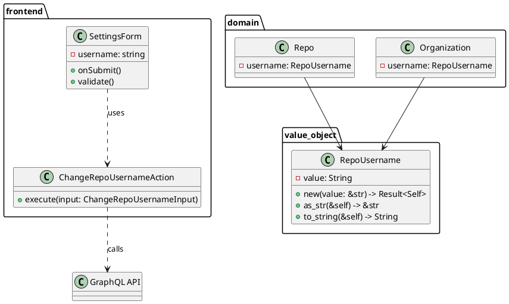
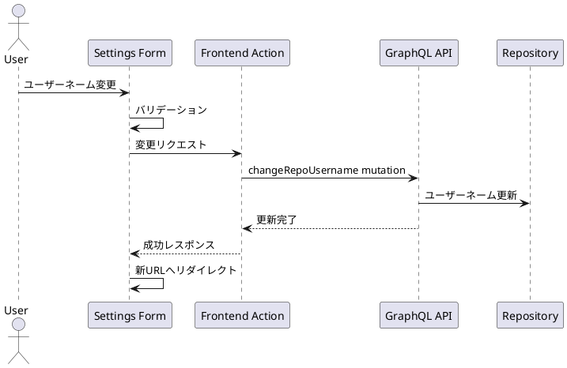

# リポジトリのユーザーネーム機能

## 概要
リポジトリのユーザーネーム変更機能の実装と、`OperatorAlias`から新しい`RepoUsername` Value Objectへの移行について説明します。

## タスク進捗

### バックエンド
- ✅ `RepoUsername` Value Objectの作成
- ✅ Value Objectのバリデーションルール実装（大文字小文字対応、ハイフン許可）
- ✅ `packages/value_object`への新しいValue Object追加
- ✅ `lib.rs`でのValue Object再エクスポート
- ✅ `domain/repo/mod.rs`での`OperatorAlias`から`RepoUsername`への置き換え
- ✅ `domain/organization.rs`での`OperatorAlias`から`RepoUsername`への置き換え
- ✅ Gateway層での`OperatorAlias`から`RepoUsername`への置き換え
- ✅ Usecase層での型定義更新
- ✅ GraphQL Mutationの追加（`changeRepoUsername`）

### フロントエンド
- ✅ 設定画面にユーザーネーム変更フィールドの追加
- ✅ フォームバリデーションの実装
- ✅ GraphQL Mutationの追加
- ✅ 成功・エラーメッセージの実装
- ✅ ユーザーネーム変更後のリダイレクト処理

## 実装詳細

### GraphQL Mutation
```graphql
mutation ChangeRepoUsername($input: ChangeRepoUsernameInput!) {
  changeRepoUsername(input: $input) {
    id
    username
    name
    description
    isPublic
  }
}

input ChangeRepoUsernameInput {
  orgUsername: String!
  oldRepoUsername: String!
  newRepoUsername: String!
}
```

### フロントエンド実装
- 設定画面（`/v1beta/[org]/[repo]/settings`）にユーザーネーム変更フィールドを追加
- React Hook FormとZodを使用したバリデーション
- 成功時は新しいURLへリダイレクト
- エラー時はトースト通知で表示

### Value Object仕様
- 文字数制限: 3-40文字
- 許可される文字:
  - 大文字（A-Z）
  - 小文字（a-z）
  - 数字（0-9）
  - ハイフン（-）
  - アンダースコア（_）

### システム構成図


### シーケンス図


## 変更点
1. `OperatorAlias`の代わりに`RepoUsername`を使用
2. ユーザーネームのバリデーションルールを強化
3. 大文字小文字とハイフンの対応を追加
4. Clean Architectureに基づいたレイヤー間の依存関係の維持
5. フロントエンド設定画面にユーザーネーム変更機能を追加
6. GraphQL APIでユーザーネーム変更をサポート

## 使用例

### バックエンド
```rust
// Value Objectの作成
let username = RepoUsername::new("my-repo-123")?;

// リポジトリでの使用
let repo = Repo::new(
    RepoId::default(),
    username,
    "My Repository",
    "Description",
    true,
)?;
```

### フロントエンド
```typescript
// フォームでの使用
const form = useForm({
  resolver: zodResolver(generalSettingsSchema),
  defaultValues: {
    username: repo.username,
    // ...
  },
});

// ユーザーネーム変更
const onSubmit = async (data: GeneralSettingsFormData) => {
  if (data.username !== repo.username) {
    await changeRepoUsernameAction({
      orgUsername: params.org,
      oldRepoUsername: params.repo,
      newRepoUsername: data.username,
    });
    router.push(`/v1beta/${params.org}/${data.username}/settings`);
  }
};

## 関連Issue
- [#566 library repo usernameを変更できるようにする](https://github.com/quantum-box/tachyon-apps/issues/566)
