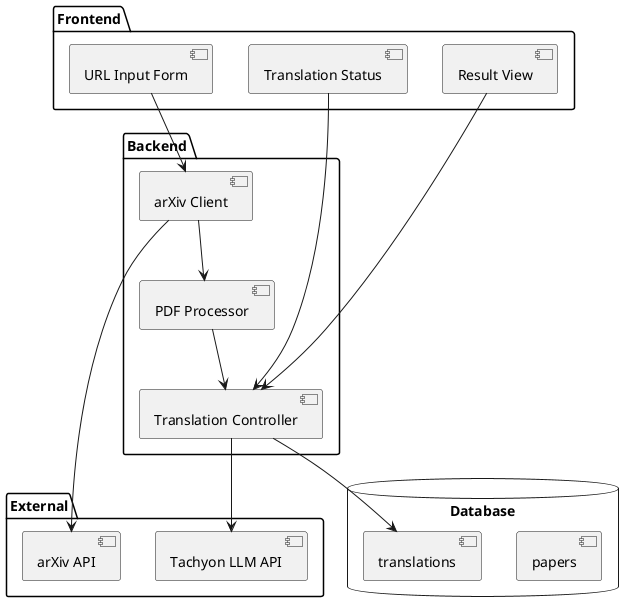

# 論文読解支援 MVP実装

Phase 1のMVP（Minimum Viable Product）実装に関する詳細設計です。

## 🎯 MVPの目標
- arXivの論文URLから論文を取得し、日本語に翻訳できる
- 最小限のUIで動作確認ができる


### コンポーネント構成



### データベース設計
```sql
-- 論文テーブル
CREATE TABLE papers (
    id VARCHAR(32) PRIMARY KEY,  -- ULID
    arxiv_id VARCHAR(32) NOT NULL UNIQUE,
    title TEXT NOT NULL,
    authors TEXT NOT NULL,
    abstract TEXT NOT NULL,
    pdf_url TEXT NOT NULL,
    created_at TIMESTAMP NOT NULL DEFAULT CURRENT_TIMESTAMP,
    updated_at TIMESTAMP NOT NULL DEFAULT CURRENT_TIMESTAMP
);

-- 翻訳テーブル
CREATE TABLE translations (
    id VARCHAR(32) PRIMARY KEY,  -- ULID
    paper_id VARCHAR(32) NOT NULL REFERENCES papers(id),
    status VARCHAR(32) NOT NULL,  -- pending, processing, completed, failed
    original_text TEXT NOT NULL,
    translated_text TEXT,
    error_message TEXT,
    created_at TIMESTAMP NOT NULL DEFAULT CURRENT_TIMESTAMP,
    updated_at TIMESTAMP NOT NULL DEFAULT CURRENT_TIMESTAMP
);
```

### API設計

#### 1. 論文取得 API
```typescript
POST /api/papers
Request:
{
    arxiv_url: string  // arXivの論文URL
}

Response:
{
    paper_id: string,
    translation_id: string,
    status: "pending" | "processing" | "completed" | "failed"
}
```

#### 2. 翻訳状態取得 API
```typescript
GET /api/translations/{translation_id}/status

Response:
{
    status: "pending" | "processing" | "completed" | "failed",
    progress: number,  // 0-100
    error_message?: string
}
```

#### 3. 翻訳結果取得 API
```typescript
GET /api/translations/{translation_id}

Response:
{
    paper: {
        title: string,
        authors: string[],
        abstract: string,
        pdf_url: string
    },
    translation: {
        status: "completed",
        original_text: string,
        translated_text: string
    }
}
```

### フロントエンド実装

#### 1. ページ構成
- `app/page.tsx`: メインページ
  - URL入力フォーム
  - 翻訳状態表示
  - 翻訳結果表示

#### 2. コンポーネント
```typescript
// URLInput.tsx
const URLInput: React.FC = () => {
    // arXiv URLの入力と送信
}

// TranslationStatus.tsx
const TranslationStatus: React.FC<{ translationId: string }> = () => {
    // 翻訳状態の表示と更新
}

// TranslationResult.tsx
const TranslationResult: React.FC<{ translationId: string }> = () => {
    // 翻訳結果の表示
}
```

### バックエンド実装

#### 1. arXiv クライアント
```rust
// arxiv.rs
pub struct ArxivClient {
    client: reqwest::Client,
}

impl ArxivClient {
    pub async fn fetch_paper(&self, arxiv_id: &str) -> Result<Paper> {
        // arXivからメタデータとPDFを取得
    }
}
```

#### 2. PDF プロセッサ
```rust
// pdf.rs
pub struct PdfProcessor {
    poppler: PopplerWrapper,
}

impl PdfProcessor {
    pub fn extract_text(&self, pdf_data: Vec<u8>) -> Result<String> {
        // PDFからテキストを抽出
    }
}
```

#### 3. 翻訳コントローラ
```rust
// translation.rs
pub struct TranslationController {
    llm_client: LLMClient,
    db: DbPool,
}

impl TranslationController {
    pub async fn translate(&self, text: String) -> Result<String> {
        // LLM APIを使用して翻訳
    }
}
```

## 📝 実装手順

### Week 1（5日間）
1. Day 1: 基盤実装
   - [ ] プロジェクト設定
   - [ ] データベースマイグレーション
   - [ ] arXivクライアント実装

2. Day 2: バックエンド実装
   - [ ] PDFプロセッサ実装
   - [ ] 翻訳コントローラ実装
   - [ ] APIエンドポイント実装

3. Day 3: フロントエンド実装
   - [ ] コンポーネント実装
   - [ ] API連携
   - [ ] 基本的なUI実装

4. Day 4: 統合とテスト
   - [ ] E2Eテスト
   - [ ] エラーハンドリング
   - [ ] パフォーマンス確認

5. Day 5: 改善とデバッグ
   - [ ] バグ修正
   - [ ] UI/UX改善
   - [ ] ドキュメント更新

## 🎯 評価基準
1. **機能要件**
   - [ ] arXiv URLから論文を取得できる
   - [ ] PDFからテキストを抽出できる
   - [ ] 日本語に翻訳できる
   - [ ] 翻訳結果を表示できる

2. **非機能要件**
   - [ ] 翻訳開始まで3秒以内
   - [ ] エラー時に適切なメッセージを表示
   - [ ] モバイルでも表示可能

3. **品質要件**
   - [ ] 主要なブラウザで動作
   - [ ] エラーログが適切に記録される
   - [ ] セキュリティ上の問題がない
