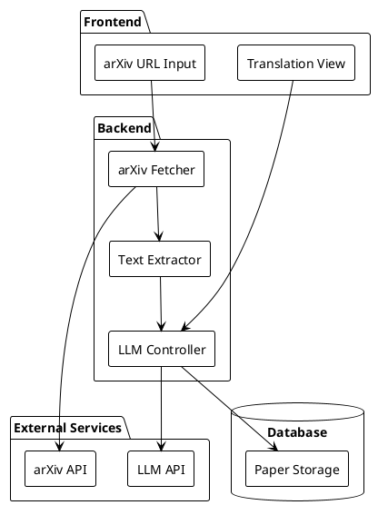

# 論文を読みやすくする

論文読解支援のLLMサービスのプロトタイプ開発についての設計ドキュメントです。

## 🎯 プロトタイプの目的と制約
- arXivの論文を簡単に日本語で読めるようにする
- シンプルな機能に絞り、迅速な開発を優先
- 個人での論文読解に特化

### プロトタイプの制約
- arXiv URLからの取得のみ（PDFアップロードは後で追加）
- OCRなし（テキスト抽出可能な論文のみ対応）
- キャッシュ機能なし（将来追加）
- ファイルサイズ制限なし（将来追加）
- 翻訳は日本語のみ
- 数式はプレーンテキストとして処理
- 図表は原文のまま表示

## 🏗 システム構成

### 入力ソース
- arXiv URLからの論文取得（Phase 1）
- PDFファイルのアップロード（Phase 2）

### 技術スタック
1. **フロントエンド**
   - Next.js + TypeScript
   - Tailwind CSS
   - シンプルな1ページアプリケーション

2. **バックエンド**
   - Rust + axum
   - poppler-utils（PDF処理）

3. **外部サービス**
   - 既存のTachyon LLM API
   - arXiv API

### コンポーネント構成

### プロトタイプの機能
1. **入力処理**
   - arXiv URLからの論文取得（arXiv API）
   - テキストの前処理（改行の正規化など）

2. **翻訳機能**
   - 論文全体の翻訳を一括で実行
   - 翻訳結果のみを表示
   - 翻訳中の進捗表示

3. **データ保存**
   - 最低限の論文データ保存
   - 翻訳結果の一時保存

## 📝 実装予定の機能（優先順位順）
1. 📝 arXiv API連携の実装
   - URLからの論文取得
   - メタデータ抽出
   - PDFからのテキスト抽出

2. 📝 翻訳機能の実装
   - LLM APIとの連携
   - 翻訳パイプライン

3. 📝 フロントエンドUI
   - URL入力フォーム
   - 翻訳結果表示
   - 進捗表示

## 🔧 開発フェーズ
1. **Phase 1: MVP（1週間）**
   - arXiv API連携
     - URLからのPDF取得
     - メタデータ（タイトル、著者など）の抽出
   - 基本的な翻訳機能
     - タイトルと本文の翻訳
     - 数式はそのまま表示
   - 最小限のUI
     - URL入力フォーム
     - 翻訳結果の表示

2. **Phase 2: 基本機能の改善（1週間）**
   - UIの改善
     - レスポンシブデザイン
     - ダークモード対応
     - 読みやすいタイポグラフィ
   - エラーハンドリング
     - API エラーの適切な処理
     - ユーザーフレンドリーなエラーメッセージ
   - 翻訳品質の改善
     - 文脈を考慮した翻訳
     - 専門用語の一貫性確保

3. **Phase 3: 拡張機能 Part 1（1週間）**
   - PDFアップロード機能
     - ドラッグ&ドロップ対応
     - 複数ファイル対応
   - OCR機能
     - 画像からのテキスト抽出
     - 数式の認識改善

4. **Phase 4: 拡張機能 Part 2（1週間）**
   - キャッシュ機能
     - 翻訳結果のキャッシュ
     - 頻繁にアクセスする論文の高速表示
   - 並列表示モード
     - 原文と訳文の対応表示
     - 段落ごとの対応付け

5. **Phase 5: 高度な機能（2週間）**
   - 論文管理機能
     - お気に入り論文の保存
     - 閲覧履歴
     - タグ付け
   - 検索機能
     - 全文検索
     - メタデータによる検索
   - 専門用語辞書
     - 分野別の用語対応
     - ユーザー定義の用語追加

6. **Phase 6: ソーシャル機能（2週間）**
   - 共有機能
     - 翻訳結果の共有
     - 注釈の共有
   - コメント機能
     - 段落ごとのコメント
     - 議論スレッド
   - コラボレーション
     - 共同翻訳
     - 用語集の共同編集

## 📊 マイルストーン
1. **Week 1-2: 基本機能**
   - Phase 1完了
   - Phase 2完了
   - 基本的な論文読解が可能に

2. **Week 3-4: 機能拡張**
   - Phase 3完了
   - Phase 4完了
   - より多くの論文形式に対応

3. **Week 5-8: 高度な機能**
   - Phase 5完了
   - Phase 6完了
   - 完全な論文管理システムとして機能

## 🎯 各フェーズの評価基準
1. **Phase 1（MVP）**
   - [ ] arXivの論文が読める
   - [ ] 基本的な翻訳が機能する
   - [ ] UIが最低限動作する

2. **Phase 2**
   - [ ] UIが使いやすい
   - [ ] エラー時の挙動が適切
   - [ ] 翻訳品質が向上

3. **Phase 3-4**
   - [ ] PDF直接アップロードが機能
   - [ ] OCRが正常に動作
   - [ ] キャッシュが効果的に機能

4. **Phase 5-6**
   - [ ] 論文管理が便利
   - [ ] 検索が正確
   - [ ] コラボレーションが円滑