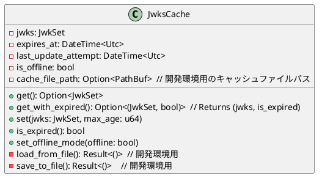

# Authorization

## JWKS Caching Specification

### Overview
JWKSのキャッシュ機能を実装し、認証処理のパフォーマンスを向上させます。オフライン時でもキャッシュからJWKSを利用可能にします。
開発環境ではホットリロード時もキャッシュを保持し、ネットワークリクエストを最小限に抑えます。

### Requirements
- JWKSをメモリにキャッシュする
- Cache-Controlヘッダーのmax-ageに基づいてキャッシュを管理する
- オフライン時は有効期限切れのキャッシュも許容する
  - オンライン復帰時に自動更新を試みる
  - 有効期限切れの場合はその旨をログに記録する
- エラー時はキャッシュを継続して使用し、バックグラウンドで更新を試みる
- 開発環境での最適化
  - ホットリロード時もキャッシュを保持
  - 有効期限内のキャッシュは再利用
  - 環境変数`JWKS_CACHE_PERSIST=true`で制御可能

### Cache Structure


### Implementation Tasks

#### キャッシュ機能の実装
📝 キャッシュ構造体の作成
- 📝 `JwksCache` 構造体の実装
- 📝 キャッシュの取得・設定メソッドの実装
- 📝 有効期限チェックロジックの実装
- 📝 オフラインモード切り替え機能の実装
- 📝 開発環境用のファイルベースキャッシュの実装

📝 キャッシュ更新ロジック
- 📝 バックグラウンド更新機能の実装
- 📝 エラーハンドリングの実装
- 📝 リトライロジックの実装
- 📝 オフライン検知と復帰時の更新処理の実装
- 📝 ホットリロード時のキャッシュ復元処理の実装

📝 キャッシュ統合
- 📝 既存のJWKS取得ロジックとの統合
- 📝 テストケースの追加（オフラインケースを含む）
- 📝 開発環境用のテストケース追加
- 📝 ドキュメントの更新

### Development Mode Cache
1. キャッシュファイルの場所
   - 開発環境: `./.dev-cache/jwks-cache.json`
   - gitignoreに追加

2. キャッシュファイルの構造
```json
{
  "jwks": {
    "keys": [...]
  },
  "expires_at": "2024-02-20T12:00:00Z",
  "last_update_attempt": "2024-02-19T12:00:00Z"
}
```

3. キャッシュの永続化ロジック
   - アプリケーション起動時にファイルから読み込み
   - キャッシュ更新時にファイルに保存
   - 有効期限内のキャッシュのみ保存
   - ファイル操作のエラーは警告としてログ出力

### Error Handling
1. キャッシュ更新失敗時
   - 既存のキャッシュを継続使用
   - バックグラウンドでリトライ
   - エラーログの出力
   - ネットワークエラーの場合はオフラインモードに切り替え

2. 初回取得失敗時
   - エラーを上位に伝播
   - 認証処理を失敗として扱う

3. オフライン時の動作
   - 有効期限切れのキャッシュも使用許可
   - 期限切れの場合は警告ログを出力
   - オンライン復帰検知時に更新を試みる

4. 開発環境でのキャッシュファイル操作エラー
   - ファイル読み込みエラー: メモリキャッシュから新規作成
   - ファイル書き込みエラー: 警告ログを出力し処理継続
   - 破損したキャッシュファイル: 無視して新規作成

### Performance Considerations
- メモリ使用量の監視
- キャッシュヒット率の計測
- 更新処理のパフォーマンス計測
- オフライン時のパフォーマンス計測
- 開発環境でのファイルI/Oの最小化

### Security Considerations
- キャッシュされたJWKSの整合性確認
- 有効期限切れのキーの使用に関する警告
- メモリ内データの安全な管理
- オフライン時の期限切れキャッシュ使用に関するセキュリティリスクの明確化
- 開発環境のキャッシュファイルのセキュリティ
  - センシティブでない情報のみ保存
  - ファイルパーミッションの適切な設定
  - プロダクション環境では無効化

### Logging
- キャッシュヒット/ミス
- 有効期限切れの使用
- オフライン/オンライン状態の変更
- 更新試行の成功/失敗
- 開発環境でのキャッシュファイル操作
