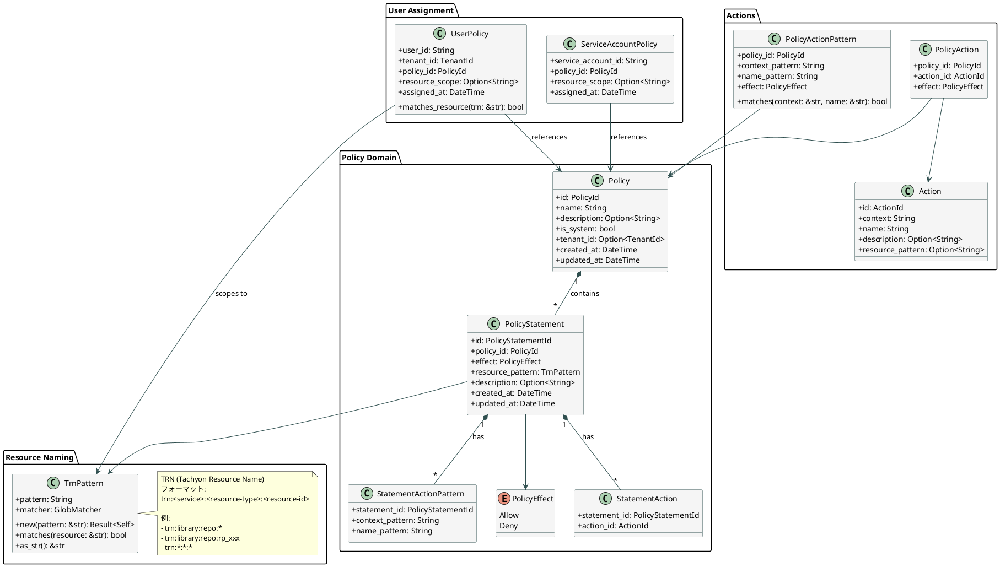
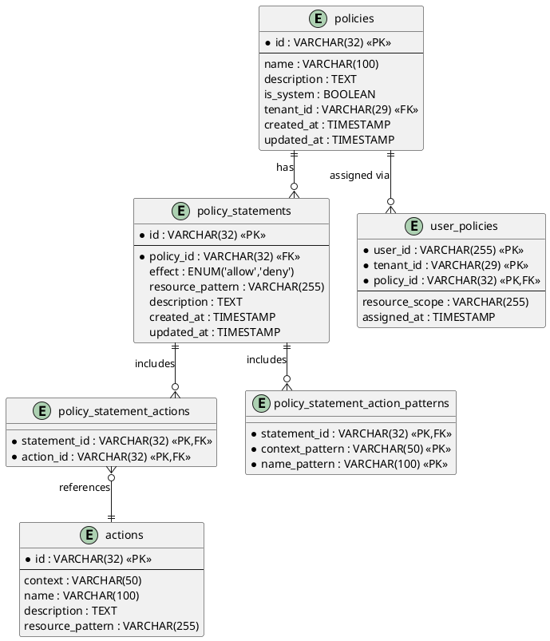
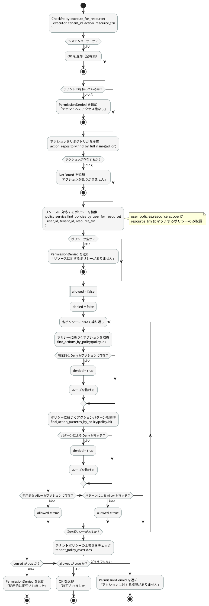
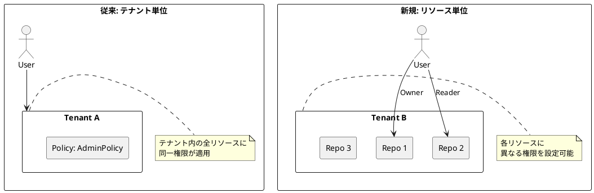

# リソースベースアクセス制御

## 概要

AWS IAMスタイルのリソース単位のアクセス制御を実現するシステムです。従来のテナント単位の権限制御に加え、特定のリソース（リポジトリ、データベース等）に対するきめ細かなアクセス制御が可能になります。

## 3行で分かる仕様

1. **何ができる？** → 「この人は、このリポジトリ(rp_xxx)だけ編集OK」という**リソース単位**の権限設定ができる
2. **どうやって？** → ポリシー割り当て時に `resource_scope` で対象リソースを指定（例: `trn:library:repo:rp_xxx`）
3. **従来との違い？** → 従来は「テナント内の全リソースに同じ権限」だったが、今は「リソースごとに違う権限」を設定可能

## 具体例で理解する

### シナリオ: Libraryのリポジトリ権限管理

```
Tenant: quantum-box (tn_01xxx)
├── User: Alice
│   ├── リポジトリA (rp_aaa): Owner（編集・削除OK）
│   ├── リポジトリB (rp_bbb): Reader（閲覧のみ）
│   └── リポジトリC (rp_ccc): アクセス権なし
│
└── User: Bob
    └── リポジトリA (rp_aaa): Writer（編集OK、削除NG）
```

#### 従来のシステムでは...

```yaml
# user_policies テーブル
- user_id: alice
  tenant_id: tn_01xxx
  policy_id: pol_owner  # ← テナント全体にOwner権限

# 問題: AliceはリポジトリA, B, C全てにOwner権限を持ってしまう
```

#### 新しいシステムでは...

```yaml
# user_policies テーブル（resource_scope 追加）
- user_id: alice
  tenant_id: tn_01xxx
  policy_id: pol_owner
  resource_scope: "trn:library:repo:rp_aaa"  # ← リポジトリAだけ

- user_id: alice
  tenant_id: tn_01xxx
  policy_id: pol_reader
  resource_scope: "trn:library:repo:rp_bbb"  # ← リポジトリBは閲覧のみ
```

### TRN (Tachyon Resource Name) とは？

AWSのARNのような、リソースを一意に識別する名前です。

```
フォーマット: trn:<サービス>:<リソース種別>:<リソースID>

具体例:
- trn:library:repo:rp_01abc...     → Libraryの特定リポジトリ
- trn:library:repo:*               → Libraryの全リポジトリ
- trn:library:database:db_01xyz... → Libraryの特定データベース
- trn:auth:user:us_01def...        → 特定ユーザー
- *                                → 全リソース（管理者用）
```

### 権限チェックの流れ

```
1. ユーザーがリポジトリAを編集しようとする
   ↓
2. 「library:UpdateRepo」アクションを
   「trn:library:repo:rp_aaa」に対して実行したい
   ↓
3. ユーザーのポリシーを取得
   → resource_scope が "trn:library:repo:rp_aaa" にマッチするものだけ
   ↓
4. マッチしたポリシーに「library:UpdateRepo」がAllowで含まれているか確認
   ↓
5. Allow → 許可 / Deny → 拒否 / 該当なし → 拒否
```

### resource_scope のマッチングルール

| ポリシーの resource_scope | リクエストの resource_trn | マッチ？ |
|--------------------------|--------------------------|---------|
| `NULL`（未設定） | 何でも | ✅ マッチ（全リソースに適用） |
| `trn:library:repo:rp_aaa` | `trn:library:repo:rp_aaa` | ✅ マッチ（完全一致） |
| `trn:library:repo:rp_aaa` | `trn:library:repo:rp_bbb` | ❌ 不一致 |
| `trn:library:repo:*` | `trn:library:repo:rp_aaa` | ✅ マッチ（ワイルドカード） |
| `trn:library:repo:*` | `trn:library:database:db_xxx` | ❌ 不一致（種別が違う） |

## API使用例

### 権限チェック

```rust
// 従来（テナント単位）
auth_app.check_policy(executor, tenant_id, "library:UpdateRepo").await?;

// 新規（リソース単位）
auth_app.check_policy_for_resource(
    executor, 
    tenant_id, 
    "library:UpdateRepo",
    "trn:library:repo:rp_xxx"  // ← 対象リソースを指定
).await?;
```

### ポリシー割り当て

```rust
// リポジトリ作成時にOwner権限を付与
auth_app.attach_user_policy_with_scope(
    user_id,
    tenant_id,
    "pol_01libraryrepoowner",   // Ownerポリシー
    "trn:library:repo:rp_xxx",  // このリポジトリだけに適用
).await?;
```

### ポリシー削除

```rust
// 権限を剥奪
auth_app.detach_user_policy_with_scope(
    user_id,
    tenant_id,
    "pol_01libraryrepoowner",
    "trn:library:repo:rp_xxx",
).await?;
```

## Action.resource_pattern によるバリデーション

アクション定義に `resource_pattern` を設定することで、**どのアクションがどのリソースタイプに適用されるか**を明示的に定義できます。

### シードデータでの定義例

```yaml
# scripts/seeds/n1-seed/008-auth-policies.yaml
- context: library
  name: UpdateRepo
  resource_pattern: trn:library:repo:*  # このアクションはrepoリソース用
  
- context: library
  name: UpdateDatabase  
  resource_pattern: trn:library:database:*  # このアクションはdatabaseリソース用
```

### バリデーションの動作

`execute_for_resource` 実行時に、渡された `resource_trn` がアクションの `resource_pattern` にマッチするか自動チェックされます。

```rust
// OK: UpdateRepo アクションに repo TRN を渡す
auth_app.check_policy_for_resource(
    executor, tenant_id,
    "library:UpdateRepo",
    "trn:library:repo:rp_xxx",  // ✅ パターン trn:library:repo:* にマッチ
).await?;

// NG: UpdateRepo アクションに database TRN を渡す → BadRequest
auth_app.check_policy_for_resource(
    executor, tenant_id,
    "library:UpdateRepo",
    "trn:library:database:db_xxx",  // ❌ パターン不一致
).await?;
// → Error: "Resource 'trn:library:database:db_xxx' is not valid for action 'library:UpdateRepo'"
```

### メリット

| 問題 | 解決 |
|------|------|
| 間違ったTRNを渡しても検出できない | `resource_pattern` で自動バリデーション |
| どのアクションがどのリソースに対応するか不明 | シードデータで明示的に定義 |
| 実行時にしか分からないバグ | 早期にBadRequestで検出 |

## ドメインモデル

### クラス図



### エンティティ関連図（ER図）



## 権限チェックフロー



## TRNパターンマッチング

### TRN (Tachyon Resource Name) フォーマット

```
trn:<service>:<resource-type>:<resource-id>
```

### パターン例

| パターン | マッチ対象 |
|---------|----------|
| `*` | 全リソース |
| `trn:library:repo:*` | Library の全リポジトリ |
| `trn:library:repo:rp_xxx` | 特定のリポジトリ |
| `trn:library:*:*` | Library サービスの全リソース |
| `trn:auth:user:us_*` | 全ユーザーリソース |

### マッチングロジック

```rust
impl TrnPattern {
    /// globset によるパターンマッチング
    pub fn matches(&self, resource: &str) -> bool {
        self.matcher.is_match(resource)
    }
}

impl UserPolicy {
    /// リソーススコープのマッチング判定
    pub fn matches_resource(&self, resource_trn: &str) -> bool {
        match &self.resource_scope {
            // resource_scope が未設定なら全リソースに適用
            None => true,
            Some(scope) => {
                // globパターンでマッチング
                let pattern = TrnPattern::new(scope).ok();
                pattern.map(|p| p.matches(resource_trn)).unwrap_or(false)
            }
        }
    }
}
```

## Library連携例

### リポジトリアクセス制御

```rust
// Library-API でのリポジトリアクセスチェック
async fn check_repo_access(
    auth_app: &AuthApp,
    executor: &Executor,
    tenant_id: &TenantId,
    repo_id: &str,
    action: ActionString,
) -> Result<()> {
    let resource_trn = format!("trn:library:repo:{}", repo_id);
    auth_app.check_policy_for_resource(
        executor,
        tenant_id,
        action,
        &resource_trn,
    ).await
}
```

### ポリシー割り当て

```rust
// リポジトリ作成時にOwner権限を付与
async fn create_repo_with_owner(
    auth_app: &AuthApp,
    user_id: &str,
    tenant_id: &TenantId,
    repo_id: &str,
) -> Result<()> {
    // リポジトリ作成処理...
    
    // Ownerポリシーをリソーススコープ付きで付与
    auth_app.attach_user_policy_with_scope(
        user_id.to_string(),
        tenant_id.clone(),
        PolicyId::new("pol_01libraryrepoowner")?,
        format!("trn:library:repo:{}", repo_id),
    ).await
}
```

## 既存システムとの違い

### テナント単位 vs リソース単位



### データモデルの拡張

| 項目 | 従来 | 新規 |
|-----|-----|-----|
| 権限粒度 | テナント単位 | リソース単位 |
| user_policies | user_id + tenant_id + policy_id | + resource_scope |
| 権限チェック | `execute(action)` | `execute_for_resource(action, trn)` |
| Policy定義 | Actions のみ | + PolicyStatements (Resource条件付き) |

## 関連ドキュメント

- [Policy管理システム](./policy-management.md)
- [Multi-Tenancy構造](./multi-tenancy.md)
- [タスク: Library リソースベースアクセス制御](../../tasks/in-progress/library-resource-based-access-control/task.md)

