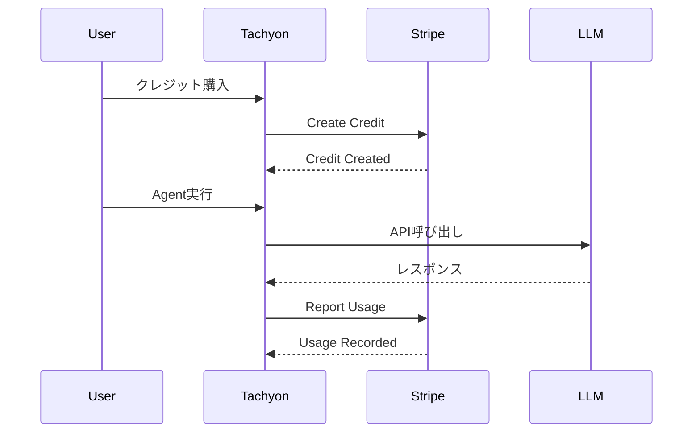

# Stripe Billing Credits実装

## 概要

Stripeの[Billing Credits](https://docs.stripe.com/billing/subscriptions/usage-based/billing-credits)機能を使用して、LLMビリングシステムをより効率的に実装する。

## 背景・目的

### 現在の問題点
- 独自のクレジット残高管理システムが複雑
- Stripeとの同期が必要
- トランザクション管理が煩雑

### Stripe Billing Creditsの利点
1. **Stripeがクレジット残高を管理**: 残高追跡の責任をStripeに委譲
2. **自動的な使用量追跡**: クレジット消費を自動的に記録
3. **柔軟な価格モデル**: 前払い・後払いの両方をサポート
4. **統合された請求**: 通常の請求と一体化

## 実装方針

### 基本的な流れ



## 詳細仕様

### 1. Stripeでのセットアップ

```yaml
# 商品設定
product:
  name: "Tachyon AI Credits"
  type: "service"

# 価格設定
price:
  currency: "jpy"
  billing_scheme: "per_unit"
  unit_amount: 1  # 1クレジット = 1円
  usage_type: "licensed"  # 前払い型
  aggregate_usage: "sum"

# クレジットパッケージ（フロントエンド定義）
credit_packages:
  - amount: 1000    # ¥1,000
  - amount: 5000    # ¥5,000  
  - amount: 10000   # ¥10,000
  - amount: 30000   # ¥30,000
  - amount: 50000   # ¥50,000
  
# カスタム金額
custom_amount:
  min_jpy: 500      # 最小¥500
  min_usd: 5        # 最小$5
  step_jpy: 100     # ¥100単位
  step_usd: 1       # $1単位
```

### 2. クレジット付与（購入時）

```rust
// Stripe Credit Grant API
async fn grant_credits(
    stripe_client: &stripe::Client,
    customer_id: &str,
    amount: i64,
    metadata: HashMap<String, String>,
) -> Result<stripe::Credit> {
    let params = CreateCreditParams {
        amount,
        customer: customer_id.to_string(),
        type_: CreditType::CustomerBalance,
        metadata: Some(metadata),
        ..Default::default()
    };
    
    stripe::Credit::create(stripe_client, params).await
}
```

### 3. 使用量報告（消費時）

```rust
// 使用量をStripeに報告
async fn report_usage(
    stripe_client: &stripe::Client,
    subscription_item_id: &str,
    quantity: i64,
    action: UsageRecordAction,
) -> Result<stripe::UsageRecord> {
    let params = CreateUsageRecordParams {
        quantity,
        timestamp: Some(Utc::now().timestamp()),
        action: Some(action),
    };
    
    stripe::UsageRecord::create(
        stripe_client,
        subscription_item_id,
        params
    ).await
}
```

### 4. 残高確認

```rust
// Customer Balanceから残高を取得
async fn get_credit_balance(
    stripe_client: &stripe::Client,
    customer_id: &str,
) -> Result<i64> {
    let customer = stripe::Customer::retrieve(
        stripe_client,
        &CustomerId::from_str(customer_id)?,
        &[],
    ).await?;
    
    Ok(customer.balance.unwrap_or(0))
}
```

## タスク分解

### フェーズ1: Stripe設定 ✅
- [x] Stripe商品の作成（手動で実施）
- [x] 価格設定の作成
  - price_test_billing_credits_jpy: 1クレジット = 1円
- [x] Webhookエンドポイントの設定
  - /api/stripe/webhook実装済み

### フェーズ2: 基本実装 ✅
- [x] Customer作成時にサブスクリプション作成
  - create_stripe_customer内で実装
- [x] クレジット付与API実装
  - grant_stripe_credits usecase実装
  - バッチ処理でのクレジット付与実装
- [x] 使用量報告API実装（部分的）
  - report_usage_to_stripeメソッド定義
  - TODO: 実際のAgent実行時の統合
- [x] 残高確認API実装
  - Customer残高をStripeから取得

### フェーズ3: 既存システムとの統合 🔄
- [x] PaymentApp trait拡張
- [ ] LLMsコンテキストからの使用量報告
- [x] 既存のクレジット購入フローとの統合
- [x] PurchaseCredits GraphQL mutationの実装

### フェーズ4: Webhook処理 📝
- [ ] `customer.credit.created` webhook
- [ ] `customer.credit.updated` webhook
- [ ] `invoice.created` webhook（使用量ベース）

### フェーズ5: 移行 📝
- [ ] 既存のクレジット残高をStripeに移行
- [ ] 並行稼働期間の実装
- [ ] 完全移行

## 実装詳細

### PaymentApp trait拡張

```rust
#[async_trait::async_trait]
pub trait PaymentApp: Debug + Send + Sync + 'static {
    // 既存のメソッド
    async fn check_billing<'a>(&self, input: &CheckBillingInput<'a>) -> Result<()>;
    async fn consume_credits<'a>(&self, input: &ConsumeCreditsInput<'a>) -> Result<ConsumeCreditsOutput>;
    
    // 新規: Stripe Credits統合
    async fn grant_stripe_credits<'a>(
        &self,
        input: &GrantStripeCreditsInput<'a>,
    ) -> Result<()>;
    
    async fn report_usage_to_stripe<'a>(
        &self,
        input: &ReportUsageToStripeInput<'a>,
    ) -> Result<()>;
    
    async fn get_stripe_balance<'a>(
        &self,
        input: &GetStripeBalanceInput<'a>,
    ) -> Result<i64>;
}
```

### 実装済みのコンポーネント（2025年6月11日）

1. **Stripeカスタマー管理**
   - `stripe_customers`テーブル作成
   - SqlxStripeCustomerRepository実装
   - カスタマー作成時の自動サブスクリプション設定

2. **クレジット付与機能**
   - `grant_stripe_credits` usecase実装
   - GraphQL mutation `grantCredits`実装
   - 10,000円のクレジット付与テスト成功

3. **Webhook処理**
   - HandleStripeWebhook usecase実装
   - サブスクリプション作成/更新イベント処理
   - 注意: CustomerBalanceFundsAddedイベントは未サポート（stripe-rust更新待ち）

4. **データベースマイグレーション**
   - 20250609020042: stripe_customersテーブル作成
   - 20250611100000: サブスクリプション関連カラム追加

### LLMsコンテキストでの使用

```rust
// Agent実行後の使用量報告
impl ExecuteAgentInputPort for ExecuteAgent {
    async fn execute<'a>(
        &self,
        input: ExecuteAgentInputData<'a>,
    ) -> Result<ChatStreamResponse> {
        // Agent実行
        let response = self.execute_agent_internal(input).await?;
        
        // 使用量をStripeに報告（非同期）
        if let Some(usage) = &response.usage {
            tokio::spawn(async move {
                let _ = self.payment_app.report_usage_to_stripe(
                    &ReportUsageToStripeInput {
                        tenant_id: input.multi_tenancy.get_tenant_id()?,
                        quantity: usage.total_credits,
                        metadata: HashMap::from([
                            ("agent_id", response.agent_id.clone()),
                            ("execution_id", response.execution_id.clone()),
                        ]),
                    }
                ).await;
            });
        }
        
        Ok(response)
    }
}
```

## 移行計画

### 段階1: 並行稼働（2週間）
- 新規購入はStripe Credits使用
- 既存残高は従来システムで管理
- 使用量は両方のシステムに記録

### 段階2: 移行期間（1週間）
- 既存残高をStripeに移行
- バッチ処理で一括移行

### 段階3: 切り替え（1日）
- 従来システムを読み取り専用に
- Stripe Creditsに完全移行

## テスト計画

### 単体テスト
- Stripe API呼び出しのモック
- エラーハンドリング
- 並行処理のテスト

### 統合テスト
- Stripe Test環境での実際のAPI呼び出し
- エンドツーエンドのフロー
- 高負荷テスト

## リスクと対策

### リスク1: Stripe APIの遅延
- **対策**: 非同期処理、キューイング

### リスク2: 二重課金
- **対策**: 冪等性キー、重複チェック

### リスク3: 残高の不整合
- **対策**: 定期的な照合、監査ログ

## 現在の実装状況（2025年6月12日更新）

### 完了した項目
1. **基本的なStripe Billing Credits実装** ✅
   - Stripeカスタマー管理機能
   - クレジット付与API（grantCredits mutation）
   - Webhookエンドポイント実装

2. **フロントエンド機能（大幅改善）** ✅
   - シンプルな購入UI（新規購入ボタンを削除）
   - カスタム金額購入機能（500円〜の任意金額）
   - タブ切り替えによる定額/自由金額選択
   - SelectコンポーネントによるモダンなUI
   - 購入後の視覚的フィードバック改善
   - 開発環境でのシミュレーション表示

3. **バックエンド改善** ✅
   - purchase_credits_with_payment.rsの修正
   - Customer balance更新ロジックの分離
   - grant_stripe_creditsによる適切な残高管理

4. **UI/UX改善** ✅
   - 購入成功時のtoast表示（アイコン付き）
   - 残高表示の即時更新
   - エラーハンドリングの改善
   - 支払い方法未登録時の誘導

### 仕様変更
1. **クレジット購入フロー**
   - 新規購入と即時購入の区別を廃止
   - 統一された「クレジット購入」ボタン
   - 支払い方法がない場合は購入ダイアログ内で追加を促す

2. **購入金額オプション**
   ```yaml
   定額パッケージ:
     - 1,000円（1,000クレジット）
     - 5,000円（5,000クレジット）
     - 10,000円（10,000クレジット）
     - 30,000円（30,000クレジット）
     - 50,000円（50,000クレジット）
   
   自由金額:
     最小金額:
       JPY: 500円
       USD: $5
     ステップ:
       JPY: 100円単位
       USD: $1単位
   ```

### 未実装の項目
1. **Agent実行時の統合**
   - execute_agent.rsでの使用量報告
   - Stripeへの使用量API呼び出し

2. **多通貨対応**
   - 現在はJPY固定
   - ユーザーの通貨設定からの自動取得

3. **本番環境でのテスト**
   - 実際のStripe決済フロー
   - Webhook処理の本番動作確認

## 完了条件

- [x] Stripe Billing Creditsが実装されている
- [x] 既存のクレジット購入フローが動作する
- [ ] Agent実行時に使用量が報告される
- [x] 残高がStripeで正確に管理される
- [x] ユーザーフレンドリーな購入UIが実装されている
- [ ] テストカバレッジ80%以上

## 参考資料

- [Stripe Billing Credits Guide](https://docs.stripe.com/billing/subscriptions/usage-based/billing-credits)
- [Stripe API Reference - Credits](https://docs.stripe.com/api/credits)
- [Usage-based Billing](https://docs.stripe.com/billing/subscriptions/usage-based)