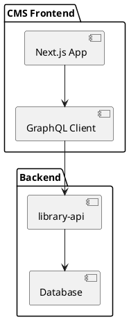

# シンプルCMSフロントエンド仕様書

## 概要

このドキュメントでは、library-apiをバックエンドとして使用するシンプルなCMSフロントエンドの仕様を定義します。このCMSは、コンテンツの作成、編集、公開を容易にするためのユーザーインターフェースを提供します。

CMSは既存のlibraryアプリとは別の新しいアプリケーションとして実装され、library-apiをバックエンドとして利用します。

## 機能要件

### コンテンツ管理
- 📝 リポジトリ一覧の表示と検索
- 📝 リポジトリ内のコンテンツ一覧表示
- 📝 コンテンツの作成・編集・削除
- 📝 コンテンツのプレビュー
- 📝 コンテンツの公開・非公開設定

### ユーザーインターフェース
- 📝 レスポンシブデザイン
- 📝 ダークモード/ライトモード切り替え
- 📝 直感的なナビゲーション
- 📝 ドラッグ&ドロップによるコンテンツ整理

### コンテンツエディタ
- 📝 マークダウンエディタ
- 📝 リッチテキストエディタ
- 📝 画像アップロード機能
- 📝 埋め込みメディアサポート

## 技術スタック

- **フロントエンド**: Next.js, TypeScript, Tailwind CSS, Shadcn UI
- **バックエンド**: library-api (既存のRustバックエンド)
- **API通信**: GraphQL

## アーキテクチャ

## 画面設計

### 1. ダッシュボード画面
- リポジトリ一覧
- 最近編集したコンテンツ
- 統計情報

### 2. リポジトリ詳細画面
- コンテンツ一覧
- フィルタリング・ソート機能
- 新規コンテンツ作成ボタン

### 3. コンテンツエディタ画面
- エディタ領域
- プレビュー領域
- メタデータ編集領域
- 保存・公開ボタン

## API連携

library-apiとの連携には、GraphQLを使用します。以下のクエリとミューテーションを実装しました：

### クエリ
- ✅ リポジトリ一覧取得
- ✅ リポジトリ詳細取得
- ✅ コンテンツ一覧取得
- ✅ コンテンツ詳細取得

### ミューテーション
- ✅ コンテンツ作成
- ✅ コンテンツ更新
- ✅ コンテンツ削除
- ✅ コンテンツ公開状態変更

## 実装計画

### フェーズ1: 基本機能実装
- ✅ プロジェクト設定とベース構築
- ✅ リポジトリ一覧表示機能
- ✅ リポジトリ詳細表示機能
- ✅ コンテンツ一覧表示機能

### フェーズ2: エディタ機能実装
- ✅ マークダウンエディタ実装
- ✅ コンテンツ作成・編集機能
- 📝 プレビュー機能

### フェーズ4: 開発環境と品質管理
- ✅ Storybook導入
- ✅ CI/CD設定
- ✅ コンポーネントテスト
- ✅ アクセシビリティ対応
- ❌ Chromatic連携（中止）

### フェーズ3: 拡張機能実装
- 📝 画像アップロード機能
- 📝 コンテンツ公開管理
- 📝 ユーザーインターフェース改善

## 非機能要件

- **パフォーマンス**: ページロード時間は2秒以内
- **セキュリティ**: 適切な認証・認可の実装
- **アクセシビリティ**: WCAG 2.1 AAレベルの準拠
- **ブラウザ互換性**: 最新のChrome, Firefox, Safari, Edgeをサポート

## 今後の拡張可能性

- コンテンツのバージョン管理
- チーム協業機能
- コンテンツのスケジュール公開
- SEO最適化ツール
- アナリティクス統合
