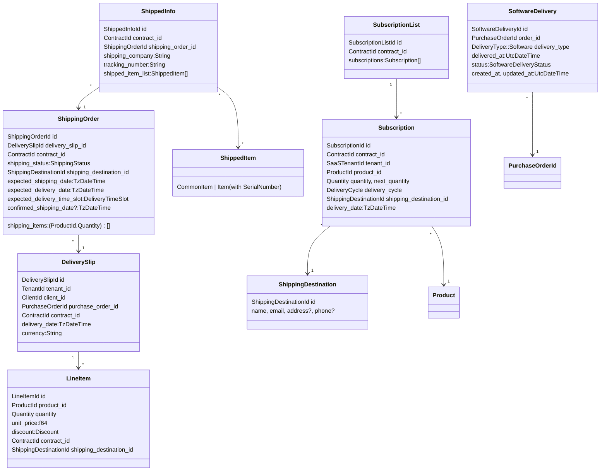

# Delivery ドメインモデルとユビキタス言語

本書は Delivery コンテキストのドメインオブジェクト（特に SoftwareDelivery と ShippingOrder 周辺）の整合性確認、ドメインモデル図、ユビキタス言語の定義をまとめたものです。

## 整合性チェック結果（要約）
- 役割分離: 物理配送は `ShippingOrder`/`ShippedInfo`、ソフト納品は `SoftwareDelivery` に分離され責務が明確。直接の重複や衝突はなし。
- SoftwareDelivery 構成: `delivery_type` は `DeliveryType::Software` を格納し、`access_url`/`SoftwareCredentials` を内包。型の表現力は十分。
- 物理配送モデル: `ShippingOrder` は配送依頼の集約（`delivery_slip_id`/`contract_id`/`shipping_items`/期日/時間帯/配送先）。実績は `ShippedInfo`/`ShippedItem` で管理。整合的。
- 購入関連IDの型: `SoftwareDelivery` は `PurchaseOrderId` 型を使用。一方 `DeliverySlip.purchase_order_id` は `String` で、型統一の余地あり。
- ID接頭辞の紛らわしさ: `SoftwareDeliveryId` は `sd_…`、`ShippingDestinationId` は `sd…`（アンダースコアなし）で、人間には紛れやすい（衝突はしない）。

## 改善提案（任意）
- 受容状態の絞り込み: `SoftwareDelivery` コンストラクタで `delivery_type.is_software()` を検証、または専用型（例: `SoftwareDeliveryDetails`）に置換。
- PO ID 型統一: `DeliverySlip.purchase_order_id` を `types::PurchaseOrderId` に変更し型の一貫性を向上。
- 住所表現の重複回避: `DeliveryType::Physical` の `ShippingAddress` を `ShippingDestination`（または `value_object::Address`）に寄せる検討。
- ID プリフィックスの改善: 将来の破壊的変更の機会に `ShippingDestinationId` の短縮名見直し（例: `sdest_`）。

## ドメインモデル図

## ユビキタス言語（Delivery）
- DeliverySlip: 納品書。契約に基づく品目と金額・納品日を確定するドキュメント。
- LineItem: 品目。商品ID・数量・単価・割引・納品先を持つ。
- Product: 商品。`ProductKind`（物理/サブスク）と `BillingCycle` を持つ。
- ShippingOrder: 出庫/配送依頼。納品書と紐づき、配送品目・希望日・時間帯・配送先を持つ。
- ShippingStatus: 出庫ステータス。Picking/Packed/Shipped などの状態遷移。
- DeliveryTimeSlot: 配達希望時間帯。
- ShippingDestination: 納品先（住所・電話含む）。`can_ship_physically()` で物理配送可否を提供。
- ShippedInfo: 出荷情報。配送会社・追跡番号・出荷品（シリアル有/無）を持つ。
- ShippedItem/CommonItem/Item: 出荷品。個体識別の有無や保証・位置状態を含む。
- SerialNumber: シリアル番号。
- WarrantyStatus: 保証状態（Active/Used/Expired）。
- PositionStatus: 位置状態（Delivered/Returned/Lost/Shipping）。
- SubscriptionList: 同一契約に属するサブスクリプション集合。
- Subscription: 継続納品の単位（数量/次回数量/サイクル/納品日/納品先）。
- DeliveryCycle: 納品サイクル（更新周期）。
- DeliveryType: 納品タイプ。物理(住所/追跡) または ソフト(アクセスURL/認証)。
- SoftwareCredentials: ソフトアクセス認証（operator_id/email/api_key 等）。
- SoftwareDelivery: ソフトウェア納品エンティティ（注文ID、認証、ステータス）。
- SoftwareDeliveryStatus: ソフト納品状態（Processing/Delivered/Failed/Cancelled）。
- PurchaseOrderId / PurchaseOrderInfo: Delivery専用の注文書識別子/最小情報。

## 実装メモ（参考）
- `DeliverySlip.purchase_order_id` は `String` のため、将来的に `types::PurchaseOrderId` へ移行すると型一貫性が高まります。
- `SqlxShippingOrderRepository::insert` では `expected_delivery_time_slot` と `timezone` のバインド順に注意が必要です（列順と引数順の不一致があるため、投入時に入れ替わる可能性）。

---
最終更新: 自動生成（Deliveryコンテキストの整合性レビューに基づく）
