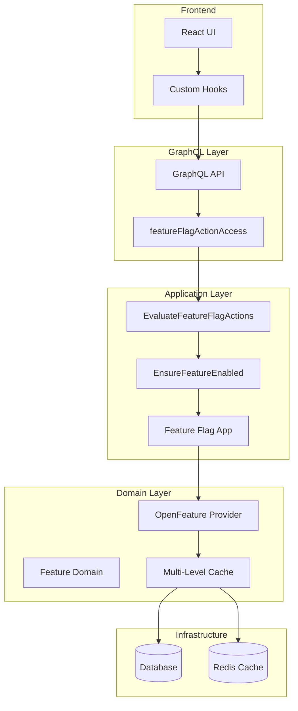

# Feature Flag Service 概要

Tachyon Appsにおけるフィーチャーフラグシステムの概要とコンポーネント構成です。

## 概要

Feature Flag ServiceはTachyon Appsの機能を動的に制御するためのサービスです。デプロイなしでの機能有効/無効切り替え、段階的ロールアウト、A/Bテスト、緊急時のKill Switch機能を提供します。

## 主要コンポーネント

### 1. Feature Flag Service
- **目的**: フィーチャーフラグの評価とキャッシュ管理
- **実装**: `packages/feature_flag/src/app.rs`
- **機能**: OpenFeature統合、L1/L2キャッシュ、メトリクス収集

### 2. OpenFeature Provider
- **目的**: 標準的なフィーチャーフラグ評価API
- **実装**: `packages/feature_flag/src/openfeature/provider.rs`
- **機能**: 条件評価、バリアント管理、コンテキスト処理

### 3. Policy Action統合
- **目的**: 既存のPolicy Action（107個）をフィーチャーフラグとして活用
- **詳細**: [Policy Action統合](./policy-action-integration.md)
- **機能**: Action文字列ベースの機能制御、自動登録、一括評価

## アーキテクチャ



## フィーチャーフラグの種類

### 1. システム機能フラグ
- 基本的な機能の有効/無効制御
- 例: ユーザー登録、Agent API実行、決済処理

### 2. 実験的機能フラグ
- 新機能の段階的ロールアウト
- A/Bテスト対応
- カナリア配信

### 3. Kill Switchフラグ
- 緊急時の機能無効化
- パフォーマンス問題時の一時的な機能停止

## 管理方法

### GraphQL API
```graphql
# フィーチャーフラグ評価
query FeatureFlagActionAccess($actions: [FeatureFlagActionInput!]!) {
  featureFlagActionAccess(actions: $actions) {
    action
    context
    featureEnabled
    policyAllowed
    featureError
    policyError
  }
}

# フィーチャーフラグ一覧
query FeatureFlags {
  featureFlags {
    id
    key
    name
    enabled
    description
  }
}
```

### 管理UI
- **場所**: `/v1beta/{tenant_id}/feature-flags`
- **機能**: フラグ一覧、作成、編集、削除、トグル
- **権限**: Feature Flag管理Actionによる制御

## パフォーマンス

### キャッシュ戦略
- **L1キャッシュ**: メモリ内LRU（TTL: 60秒）
- **L2キャッシュ**: Redis（TTL: 5分）
- **キャッシュヒット率**: > 95%

### 応答時間
- **目標**: < 5ms/評価
- **実測**: 平均 2-3ms（キャッシュヒット時）

## セキュリティ

### アクセス制御
- Policy管理システムとの統合
- テナント別の設定分離
- ロールベースアクセス制御

### 監査
- フラグ変更履歴の記録
- アクセスログの保持
- 異常な評価パターンの検出

## 運用

### モニタリング
- フラグ評価メトリクス
- キャッシュパフォーマンス
- エラー率とレスポンス時間

### アラート
- 評価エラー率の急上昇
- キャッシュミス率の上昇
- 重要フラグの無効化

## 関連ドキュメント

- [Policy Action統合](./policy-action-integration.md) - Action文字列を使用した統合管理
- [Feature Flagアクション権限REST API](./action-evaluate-rest-api.md) - `/v1/feature-flags/actions/evaluate` のREST仕様
- [OpenFeature統合](./openfeature-integration.md) - 標準フィーチャーフラグAPI
- [マルチテナンシー構造](../authentication/multi-tenancy.md) - テナント別設定
- [Policy管理システム](../authentication/policy-management.md) - 権限制御との連携

## 今後の改善予定

- [ ] パーセンテージベースロールアウト
- [ ] 高度なターゲティング機能
- [ ] 自動フラグライフサイクル管理
- [ ] パフォーマンス分析ダッシュボード
