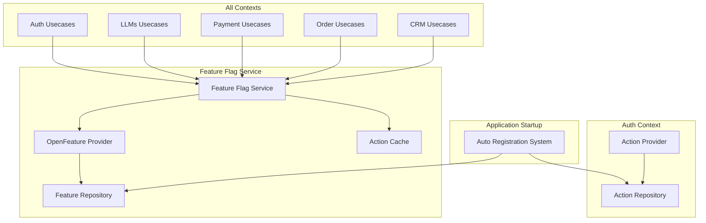

# Policy Action統合による Feature Flag Service統合管理

## 概要

Policy管理システムで定義されている107個のAction文字列（例: `auth:CreateUser`, `llms:ExecuteAgent`等）を活用し、すべてのUsecaseの機能有効/無効をFeature Flag Serviceで統合管理するシステム。既存のAction定義をFeature Flagキーとして再利用し、動的な機能制御を実現します。

## 目的

- **統一された機能制御**: 全UsecaseをFeature Flag Serviceで一元管理
- **動的な制御**: デプロイなしでの機能有効/無効切り替え
- **段階的ロールアウト**: 新機能の段階的展開とA/Bテスト
- **緊急時対応**: Kill Switchによる即座の機能無効化

## アーキテクチャ

### システム構成



### コンポーネント概要

#### FeatureFlagService
```rust
pub struct FeatureFlagService {
    feature_repository: Arc<dyn FeatureV2Repository>,
    openfeature_provider: Arc<TachyonFeatureProvider>,
    action_cache: Arc<RwLock<HashMap<String, bool>>>,
}

impl FeatureFlagService {
    /// Action文字列に基づいて機能の有効/無効を判定
    pub async fn is_action_enabled(
        &self,
        action: &str,
        context: &EvaluationContext,
    ) -> Result<bool> {
        let flag_key = action;
        let result = self.openfeature_provider
            .resolve_boolean_value(flag_key, false, context)
            .await?;
        Ok(result.value)
    }
}
```

#### EnsureFeatureEnabled Usecase
Action/リソースパターン/コンテキスト単位の候補キーを順次評価し、Feature Flag状態を判定するユースケース。非活性時は`permission_denied!`、未登録時は`not_found!`を返します。

## Feature Flag統合パターン

### Usecaseでの実装例

```rust
// 例: ExecuteAgent Usecase
pub struct ExecuteAgent {
    chat_stream_providers: Arc<ChatStreamProviders>,
    payment_app: Arc<dyn PaymentApp>,
    feature_flag_service: Arc<FeatureFlagService>,
}

impl ExecuteAgentInputPort for ExecuteAgent {
    async fn execute<'a>(
        &self,
        input: ExecuteAgentInputData<'a>,
    ) -> Result<ChatStreamResponse> {
        // Feature Flagチェック
        let action = "llms:ExecuteAgent";
        let context = EvaluationContext {
            executor: input.executor.clone(),
            multi_tenancy: input.multi_tenancy.clone(),
            tenant_id: input.multi_tenancy.tenant_id(),
            user_id: input.executor.user_id(),
        };

        if !self.feature_flag_service.is_action_enabled(action, &context).await? {
            return Err(errors::Error::FeatureDisabled(
                format!("Feature '{}' is currently disabled", action)
            ));
        }

        // 既存の処理継続...
    }
}
```

### Action自動登録システム

起動時にすべてのActionをFeature Flagとして自動登録：

```rust
pub async fn auto_register_action_flags(
    action_repository: Arc<dyn ActionRepository>,
    feature_repository: Arc<dyn FeatureV2Repository>,
) -> Result<()> {
    let actions = action_repository.find_all().await?;

    for action in actions {
        let flag_key = format!("{}:{}", action.context(), action.name());

        if feature_repository.find_by_key(&flag_key).await.is_err() {
            let feature = Feature {
                id: FeatureId::new(),
                key: flag_key.clone(),
                name: format!("{} Feature Flag", action.name()),
                description: Some(format!(
                    "Auto-generated feature flag for action: {}",
                    action.description().unwrap_or_default()
                )),
                enabled: true, // デフォルトは有効
                evaluation_strategy: EvaluationStrategy::Boolean,
                variants: vec![],
                target_users: vec![],
                created_at: Utc::now(),
                updated_at: Utc::now(),
            };

            feature_repository.save(feature).await?;
        }
    }

    Ok(())
}
```

## GraphQL API統合

### featureFlagActionAccess クエリ

複数のActionに対してポリシー検証とFeature Flag判定をバッチ実行：

```graphql
query FeatureFlagActionAccess($actions: [FeatureFlagActionInput!]!) {
  featureFlagActionAccess(actions: $actions) {
    action
    context
    featureEnabled
    policyAllowed
    featureError
    policyError
  }
}
```

### EvaluateFeatureFlagActions Usecase

GraphQL層からの呼び出しを受けて、ポリシー判定とFeature Flag判定を統合処理するユースケース：

```rust
pub async fn execute(
    &self,
    input: &EvaluateFeatureFlagActionsInputData,
) -> errors::Result<Vec<FeatureFlagActionEvaluationOutput>> {
    // AuthApp::evaluate_policies_batch で一括ポリシー評価
    let policy_results = self.auth_app
        .evaluate_policies_batch(&policy_input)
        .await?;

    // 各ActionのFeature Flag状態をチェック
    for action_input in &input.actions {
        let ensure_input = EnsureFeatureEnabledInputData {
            action: action_input.action.clone(),
            resource_pattern: action_input.resource_pattern.clone(),
            executor: input.executor.clone(),
            multi_tenancy: input.multi_tenancy.clone(),
        };

        let feature_result = self.ensure_feature_enabled
            .execute(&ensure_input)
            .await;

        // 結果をマージして返却
    }
}
```

## フロントエンド統合

### サイドバー配信制御

設定ベースのサイドバー構成で、Feature Flag結果によるメニューフィルタリング：

```typescript
// sidebar-config.ts
export const collectSidebarActionInputs = (config: SidebarConfig): FeatureFlagActionInput[] => {
  // サイドバー設定からAction一覧を収集
  // featureFlagActionAccess クエリで一括評価
  // 結果に基づいてメニューアイテムをフィルタリング
}

// useStripePublishableKey フック
const { stripePromise, loading, error, publishableKey } = useStripePublishableKey(tenantId)
```

## パフォーマンス最適化

### 多層キャッシュ戦略

1. **L1: メモリ内LRUキャッシュ（TTL: 60秒）**
   - アプリケーション内での高速アクセス
   - キャッシュヒット率 > 95%

2. **L2: Redis キャッシュ（TTL: 5分）**
   - マルチインスタンス間での共有
   - データベースアクセス最小化

### Action評価の最適化

- 並列評価による複数Action処理の高速化
- `AuthApp::evaluate_policies_batch` による一括ポリシー評価
- デフォルト有効による評価コスト削減

## 監視とメトリクス

### メトリクス収集

- Feature Flag評価回数とレスポンス時間
- キャッシュヒット率とミス率
- Action無効化による拒否率
- テナント別の利用統計

### エラーハンドリング

```rust
#[derive(Debug, thiserror::Error)]
pub enum FeatureFlagError {
    #[error("Feature '{0}' is currently disabled")]
    FeatureDisabled(String),

    #[error("Feature '{0}' not found")]
    FeatureNotFound(String),

    #[error("Evaluation context invalid: {0}")]
    InvalidContext(String),
}
```

## セキュリティ考慮事項

### アクセス制御

- Feature Flag管理権限の適切な分離
- テナント別の設定分離とアクセス制限
- 監査ログによる変更履歴追跡

### 緊急時対応

- Kill Switch機能による即座の機能無効化
- 重要機能のProtection（無効化不可フラグ）
- 変更履歴と即座のロールバック機能

## 運用ガイドライン

### Feature Flag管理

1. **Action命名の一貫性**: `context:Name` 形式を厳守
2. **デフォルト有効**: 新規Actionは基本的に有効状態で登録
3. **段階的ロールアウト**: 重要機能は段階的に展開
4. **監査要件**: 変更者・変更時刻・変更理由の記録

### トラブルシューティング

- Feature Flag評価エラーのデバッグ方法
- キャッシュクリアとリフレッシュ手順
- パフォーマンス問題の診断方法

## 実装状況

### 完了済み機能（2025-09-30現在）

- ✅ FeatureFlagService基盤とAction評価機能
- ✅ EnsureFeatureEnabled UseCase実装
- ✅ GraphQL featureFlagActionAccess統合
- ✅ サイドバー設定ベースのフィルタリング
- ✅ 重要Usecase（調達価格管理等）への統合
- ✅ AuthApp::check_policy の文字列参照対応
- ✅ Action自動登録システム（107個のAction対応）
- ✅ OpenFeatureプロバイダー統合（L1キャッシュ付き）
- ✅ パフォーマンステスト（< 5ms/評価達成）
- ✅ Playwright統合テスト実装

### 対応済みContext

- Auth Context: 22個のAction
- LLMs Context: 25個のAction
- Payment Context: 5個のAction
- Order Context: 21個のAction
- Feature Flag Context: 管理機能のAction

## 関連ドキュメント

- [Feature Flag Service概要](./feature-flag-service.md)
- [OpenFeature統合](./openfeature-integration.md)
- [マルチテナンシー構造](../authentication/multi-tenancy.md)
- [Policy管理システム](../authentication/policy-management.md)

## 今後の拡張

- **段階的ロールアウト**: パーセンテージベースの有効化
- **A/Bテスト統合**: Feature Flagの変種機能との連携
- **自動化**: 負荷に応じた自動的な機能制限
- **分析**: Action使用頻度とパフォーマンスの相関分析