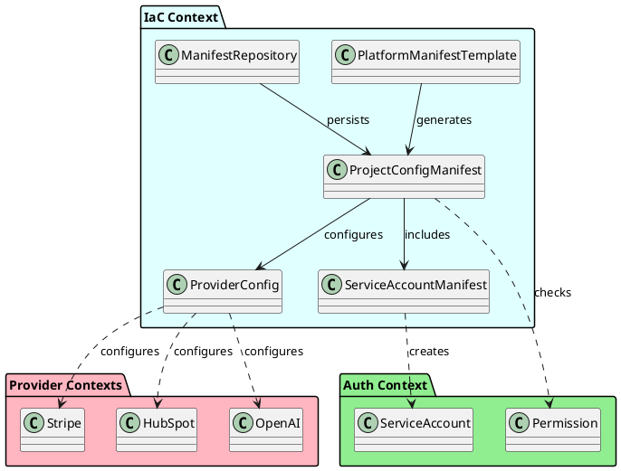
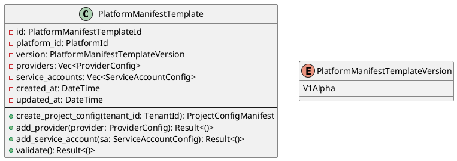
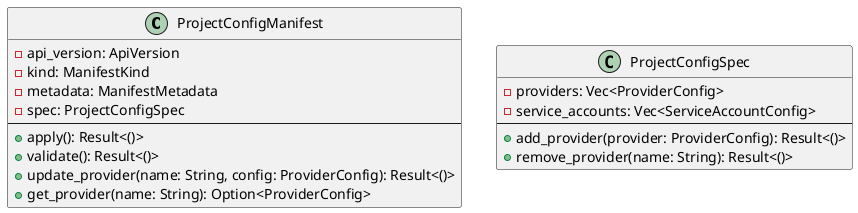
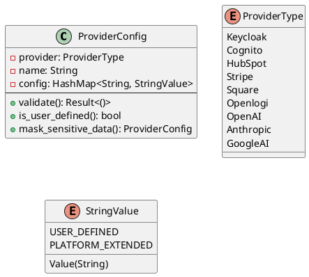
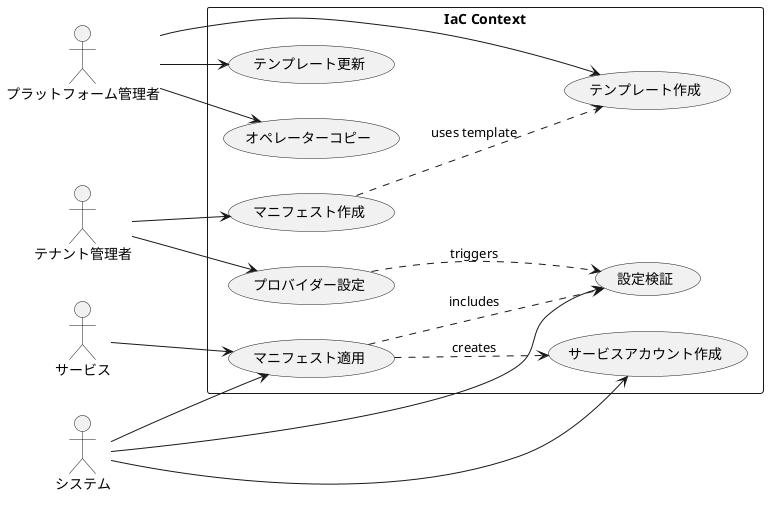
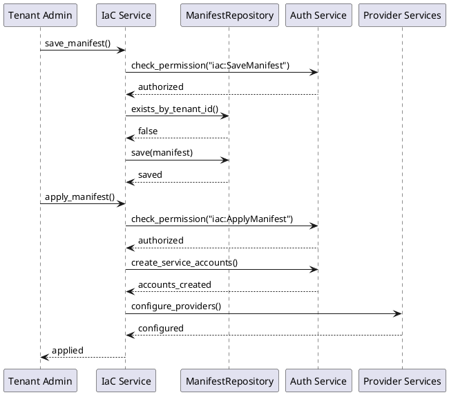
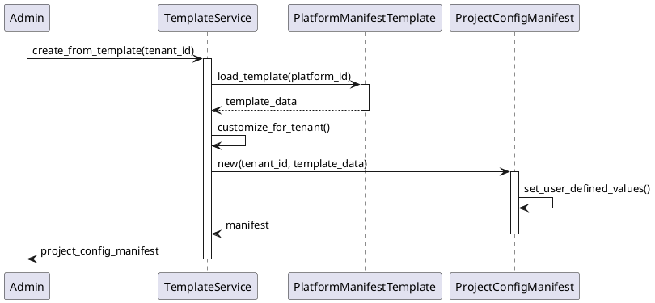

# IaC Context Specification

## 概要

IaC Context（Infrastructure as Code 境界付けられたコンテキスト）は、マルチテナントSaaSアプリケーションのインフラストラクチャ設定を宣言的に管理するドメインです。Kubernetesスタイルのマニフェスト形式を採用し、プラットフォーム全体とテナント固有の設定を統一的に管理します。

## 境界付けられたコンテキスト



## ドメインモデル

### エンティティの役割と責務

#### 1. PlatformManifestTemplate（プラットフォームマニフェストテンプレート）
**役割**: プラットフォーム全体の標準設定テンプレートを定義する集約ルート。新しいテナントのオンボーディング時の基準設定を提供。

**責務**:
- 標準的なプロバイダー設定の定義
- デフォルトのサービスアカウント設定
- テナント固有設定の生成元
- プラットフォームポリシーの実装
- バージョン管理

**ビジネス価値**:
- 新規テナントの迅速なオンボーディング
- プラットフォーム全体の設定標準化
- ガバナンスとコンプライアンスの確保

#### 2. ProjectConfigManifest（プロジェクト設定マニフェスト）
**役割**: テナント固有のインフラストラクチャ設定を管理するエンティティ。各テナントに1つのみ存在する重要な設定文書。

**責務**:
- テナント固有のプロバイダー設定管理
- API認証情報の安全な保管
- サービスアカウントの設定
- 設定の検証と整合性維持
- 監査ログの提供

**ビジネス価値**:
- テナントごとのカスタマイズ対応
- セキュアな認証情報管理
- 設定の一元管理による運用効率化

#### 3. ServiceAccountManifest（サービスアカウントマニフェスト）
**役割**: サービス間認証とアクセス制御のための設定を定義。Authコンテキストと連携してサービスアカウントを管理。

**責務**:
- サービスアカウントの定義
- ポリシーとリソースの関連付け
- 権限スコープの管理
- アカウント生成の指示

**ビジネス価値**:
- ゼロトラストセキュリティの実現
- 細かな権限制御
- サービス間通信の安全性確保

### 値オブジェクトの役割と責務

#### 1. ProviderConfig（プロバイダー設定）
**役割**: 外部サービスプロバイダーとの統合設定を表現する値オブジェクト。

**責務**:
- プロバイダー種別の識別
- 認証情報の保持
- 設定パラメータの管理
- バリデーション

**ビジネス価値**:
- 外部サービスとのシームレスな統合
- 設定の再利用性
- プロバイダー切り替えの容易性

#### 2. ManifestMetadata（マニフェストメタデータ）
**役割**: マニフェストの識別情報とテナント関連付けを管理する値オブジェクト。

**責務**:
- テナントIDの保持
- マニフェスト名の管理
- 作成日時の記録

**ビジネス価値**:
- マニフェストの追跡可能性
- テナント隔離の保証
- 監査要件への対応

### 集約（Aggregates）

#### PlatformManifestTemplate（プラットフォームマニフェストテンプレート）



### エンティティ（Entities）

#### ProjectConfigManifest（プロジェクト設定マニフェスト）



### 値オブジェクト（Value Objects）

#### ProviderConfig（プロバイダー設定）



## ユースケース図



## ユースケース仕様

### UC1: テンプレート作成

**アクター**: プラットフォーム管理者  
**事前条件**: プラットフォーム管理者権限を持つ  
**事後条件**: 新しいプラットフォームマニフェストテンプレートが作成される

**基本フロー**:
1. 管理者がテンプレート作成を開始
2. プラットフォームIDを指定
3. デフォルトプロバイダー設定を追加
4. デフォルトサービスアカウント設定を追加
5. テンプレートを保存

### UC4: マニフェスト適用

**アクター**: システム  
**事前条件**: 有効なProjectConfigManifestが存在する  
**事後条件**: インフラストラクチャが設定される

**基本フロー**:
1. システムがマニフェストを読み込み
2. 権限チェック（iac:ApplyManifest）
3. サービスアカウントを作成/更新
4. プロバイダー設定を適用
5. 適用結果を記録

## データフロー



## エンティティ間の相互作用

### テンプレートからマニフェスト生成フロー



### エンティティの協調関係

1. **PlatformManifestTemplate ↔ ProjectConfigManifest**
   - テンプレートがマニフェストの生成元
   - USER_DEFINED値の置換が必要
   - プラットフォーム標準からのカスタマイズ

2. **ProjectConfigManifest ↔ ServiceAccountManifest**
   - プロジェクト設定がサービスアカウントを含む
   - 一括適用による整合性維持
   - 権限スコープの継承

3. **ProjectConfigManifest ↔ ProviderConfig**
   - マニフェストが複数のプロバイダー設定を保持
   - プロバイダーごとの独立した設定
   - 検証とマスキング機能

## ビジネスルール

### マニフェスト管理ルール

1. **一意性制約**
   - テナントごとに1つのProjectConfigManifestのみ
   - 名前の重複を許可しない
   - プラットフォームごとに1つのテンプレート

2. **セキュリティルール**
   - API認証情報は暗号化して保存
   - USER_DEFINED値は必須入力
   - 機密情報のマスキング

3. **バリデーションルール**
   - 必須プロバイダーの存在確認
   - APIバージョンの互換性チェック
   - 設定値の形式検証

4. **権限ルール**
   ```
   アクション              | 必要な権限
   --------------------|------------------
   テンプレート作成      | platform:admin
   マニフェスト保存      | iac:SaveManifest
   マニフェスト適用      | iac:ApplyManifest
   オペレーターコピー    | iac:CopyOperator
   ```

## サポートされるプロバイダー

### 認証プロバイダー
- **Keycloak**: OIDCベースの認証
- **Cognito**: AWS認証サービス

### 外部サービスプロバイダー
- **HubSpot**: CRM統合
- **Stripe**: 決済処理
- **Square**: 決済処理
- **Openlogi**: 物流管理

### AIプロバイダー
- **OpenAI**: GPTモデルアクセス
- **Anthropic**: Claudeモデルアクセス
- **Google AI**: Geminiモデルアクセス

## 統合ポイント

### 他のコンテキストとの連携

1. **Auth Context**
   - **役割**: サービスアカウントの作成先
   - **連携方法**:
     - ServiceAccountManifestからの作成要求
     - 権限チェックの実行
   - **データフロー**: IaC → Auth

2. **Provider Contexts（各種プロバイダー）**
   - **役割**: 設定の適用先
   - **連携方法**:
     - プロバイダー固有の設定適用
     - 接続テストの実行
   - **データフロー**: IaC → Providers

3. **Platform Context**
   - **役割**: プラットフォーム情報の提供元
   - **連携方法**:
     - プラットフォームIDの参照
     - プラットフォームポリシーの取得
   - **データフロー**: Platform → IaC

## 非機能要件

### セキュリティ
- API認証情報の暗号化
- 監査ログの完全性
- テナント間の隔離
- 最小権限の原則

### 可用性
- 設定の高速読み込み
- キャッシュによる性能向上
- 設定変更の即時反映

### 保守性
- 宣言的設定による可読性
- バージョン管理による互換性
- 設定のバックアップとリストア

## 実装上の考慮事項

### マニフェスト形式
```yaml
apiVersion: apps.tachy.one/v1alpha
kind: ProjectConfig
metadata:
  name: tenant-config
  tenantId: tn_xxxxx
spec:
  providers:
    - name: stripe
      provider: stripe
      config:
        api_key: sk_test_xxxxx
  serviceAccounts:
    - name: api-service
      policies:
        - order:CreateQuote
      resources:
        - trn:tachyon-apps:library:global:self:quote:*
```

### エラーハンドリング
- 設定検証エラーの詳細な報告
- ロールバック機能
- 部分的な適用の防止

### 拡張性
- 新しいプロバイダータイプの追加
- カスタムバリデーターの実装
- ウェブフックによる通知

## 今後の拡張計画

1. **GitOpsサポート**
   - Gitリポジトリからの設定同期
   - Pull Requestベースの変更管理
   - 設定の差分表示

2. **高度な検証機能**
   - プロバイダー接続テスト
   - 依存関係チェック
   - セキュリティスキャン

3. **UI/UXの改善**
   - ビジュアルエディタ
   - 設定ウィザード
   - リアルタイムプレビュー

## 関連ドキュメント

- [IaC概要](./overview.md)
- [オペレーターマニフェストコピー](./copy_operator_manifest.md)
- [Auth Context仕様](../auth/auth-context-specification.md)
- [プラットフォーム管理](../platform/platform-context-specification.md)