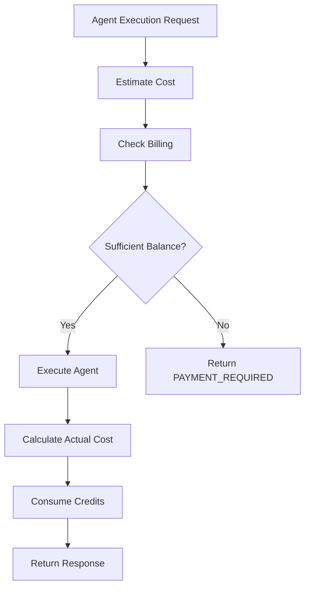

# Agent API Cost Estimation System

## Overview

The Agent API cost estimation system provides accurate billing calculations for LLM-based operations, including token usage, tool invocations, and base execution costs. All calculations are performed in NanoDollar units to ensure precision down to sub-cent levels.

## Architecture

### Cost Components

```yaml
cost_structure:
  base_cost: 100_000_000 nanodollars  # $0.10 per execution
  token_costs:
    prompt: model_specific              # e.g., 3,000 nanodollars for Claude 3.5 Sonnet
    completion: model_specific          # e.g., 15,000 nanodollars for Claude 3.5 Sonnet
  tool_costs:
    mcp_search: 500_000_000             # $0.50
    mcp_read: 200_000_000               # $0.20
    mcp_write: 300_000_000              # $0.30
    web_search: 500_000_000             # $0.50
    code_execution: 300_000_000         # $0.30
```

### Calculation Flow



## NanoDollar System

### Base Unit

**1 NanoDollar = $0.000000001 (10^-9 USD)**

This allows precise representation of:
- Sub-cent amounts (e.g., $0.000003 per token)
- Large aggregations without floating-point errors
- Stripe cent conversions (1 cent = 10,000,000 nanodollars)

### Conversion Examples

```rust
// Token pricing (Claude 3.5 Sonnet)
prompt_token_price: 3_000 nanodollars      // $0.000003
completion_token_price: 15_000 nanodollars // $0.000015

// Example execution
500 prompt tokens:
  500 × 3,000 = 1,500,000 nanodollars

350 completion tokens:
  350 × 15,000 = 5,250,000 nanodollars

Base cost:
  100_000_000 nanodollars

MCP tool usage (2 reads):
  2 × 200_000_000 = 400_000_000 nanodollars

Total:
  100,000,000 + 1,500,000 + 5,250,000 + 400,000,000
  = 506,750,000 nanodollars
  = $0.50675
```

## REST API

### Estimate Service Cost

**Endpoint**: `POST /v1/catalog/service-cost/estimate`

**Headers**:
```http
x-operator-id: tn_01hjryxysgey07h5jz5wagqj0m
Authorization: Bearer <token>
```

**Request Body**:
```json
{
  "service_type": "agent_execution",
  "usage": {
    "model": "claude-sonnet-4-5-20250929",
    "prompt_tokens": 500,
    "completion_tokens": 350,
    "tools_used": [
      { "tool_type": "mcp_read", "count": 2 },
      { "tool_type": "web_search", "count": 1 }
    ]
  }
}
```

**Response**:
```json
{
  "subtotal_nanodollars": 506750000,
  "subtotal_display": "$0.50675",
  "discounts": [],
  "total_nanodollars": 506750000,
  "total_display": "$0.50675",
  "currency": "USD",
  "items": [
    {
      "name": "Base Execution Cost",
      "quantity": 1,
      "unit_price_nanodollars": 100000000,
      "unit_price_display": "$0.10",
      "total_nanodollars": 100000000,
      "total_display": "$0.10"
    },
    {
      "name": "Prompt Tokens",
      "quantity": 500,
      "unit_price_nanodollars": 3000,
      "unit_price_display": "$0.000003",
      "total_nanodollars": 1500000,
      "total_display": "$0.0015"
    },
    {
      "name": "Completion Tokens",
      "quantity": 350,
      "unit_price_nanodollars": 15000,
      "unit_price_display": "$0.000015",
      "total_nanodollars": 5250000,
      "total_display": "$0.005250"
    },
    {
      "name": "MCP Read Tool",
      "quantity": 2,
      "unit_price_nanodollars": 200000000,
      "unit_price_display": "$0.20",
      "total_nanodollars": 400000000,
      "total_display": "$0.40"
    }
  ]
}
```

## GraphQL API

### Query: estimateAgentCost

```graphql
query EstimateAgentCost($input: AgentCostEstimateInput!) {
  estimateAgentCost(input: $input) {
    totalNanodollars
    totalDisplay
    currency
    breakdown {
      baseCostNanodollars
      baseCostDisplay
      tokenCostNanodollars
      tokenCostDisplay
      toolCostNanodollars
      toolCostDisplay
    }
    items {
      name
      quantity
      unitPriceNanodollars
      unitPriceDisplay
      totalNanodollars
      totalDisplay
    }
  }
}
```

**Variables**:
```json
{
  "input": {
    "modelId": "claude-sonnet-4-5-20250929",
    "estimatedPromptTokens": 500,
    "estimatedCompletionTokens": 350,
    "toolUsage": [
      { "toolType": "MCP_READ", "count": 2 }
    ]
  }
}
```

## Billing Integration

### Pre-Execution Check

```rust
// In execute_agent usecase
let estimated_cost = self.cost_calculator.estimate_cost(...);

// Check if tenant has sufficient balance
self.payment_app.check_billing(&CheckBillingInput {
    executor: input.executor,
    multi_tenancy: input.multi_tenancy,
    estimated_cost, // NanoDollar value
    resource_type: "agent_execution",
}).await?;
```

### Post-Execution Billing

```rust
// After execution completes
let actual_cost = self.cost_calculator.calculate_actual_cost(
    &usage_metrics
);

self.payment_app.consume_credits(&ConsumeCreditsInput {
    executor: input.executor,
    multi_tenancy: input.multi_tenancy,
    amount: actual_cost,
    description: format!("Agent execution: {}", execution_id),
    metadata: execution_metadata,
}).await?;
```

## Model Pricing

### Current Supported Models

| Model | Provider | Prompt (per 1M tokens) | Completion (per 1M tokens) | Notes |
|-------|----------|------------------------|---------------------------|-------|
| claude-sonnet-4-5-20250929 | Anthropic | $3.00 | $15.00 | Default model |
| claude-opus-4-1-20250805 | Anthropic | $15.00 | $75.00 | Highest quality |
| gpt-4.1 | OpenAI | $2.00 | $8.00 | Balanced |
| gemini-2.5-flash-lite | Google | $0.10 | $0.40 | Lowest cost |
| gemini-2.5-pro | Google | $1.25 | $10.00 | High quality |

### Tool Pricing

| Tool Type | Cost per Invocation | Description |
|-----------|---------------------|-------------|
| MCP Search | $0.50 | Model Context Protocol search operations |
| MCP Read | $0.20 | Reading files/resources via MCP |
| MCP Write | $0.30 | Writing/modifying files via MCP |
| MCP Execute | $0.40 | Executing commands via MCP |
| Web Search | $0.50 | External web search API calls |
| Code Execution | $0.30 | Sandboxed code execution |
| File Operation | $0.20 | File system operations |

## Error Handling

### Insufficient Funds

**Status Code**: `402 Payment Required`

**Response**:
```json
{
  "error": "payment_required",
  "code": "INSUFFICIENT_FUNDS",
  "message": "Insufficient balance for this operation",
  "details": {
    "required_nanodollars": 506750000,
    "required_display": "$0.50675",
    "current_balance_nanodollars": 100000000,
    "current_balance_display": "$0.10",
    "shortfall_nanodollars": 406750000,
    "shortfall_display": "$0.40675"
  }
}
```

### Invalid Model

**Status Code**: `400 Bad Request`

**Response**:
```json
{
  "error": "invalid_request",
  "code": "INVALID_MODEL",
  "message": "Unsupported model: invalid-model-id",
  "supported_models": [
    "claude-sonnet-4-5-20250929",
    "claude-opus-4-1-20250805",
    "gpt-4.1"
  ]
}
```

## Testing

### Unit Tests

```bash
# Catalog context - cost calculation
cargo test -p catalog test_service_cost_calculator
cargo test -p catalog test_simple_calculate_service_cost

# Payment context - billing checks
cargo test -p payment test_check_billing_with_nanodollars
```

### Scenario Tests

```bash
# Full Agent API flow with billing
mise run tachyon-api-scenarios

# Specific cost estimation test
cargo test -p tachyon-api --test run_tests \
  -- --ignored catalog_service_cost
```

### Manual Testing

```bash
# 1. Start API server
mise run dev-backend

# 2. Estimate cost
curl -X POST http://localhost:50054/v1/catalog/service-cost/estimate \
  -H "x-operator-id: tn_01hjryxysgey07h5jz5wagqj0m" \
  -H "Authorization: Bearer dummy-token" \
  -H "Content-Type: application/json" \
  -d '{
    "service_type": "agent_execution",
    "usage": {
      "model": "claude-sonnet-4-5-20250929",
      "prompt_tokens": 500,
      "completion_tokens": 350
    }
  }'

# 3. Verify response shows correct nanodollar values
```

## Frontend Integration

### React Hook Example

```typescript
import { useQuery } from '@apollo/client'
import { ESTIMATE_AGENT_COST } from './queries'

export function useAgentCostEstimate(
  modelId: string,
  estimatedTokens: { prompt: number; completion: number }
) {
  const { data, loading, error } = useQuery(ESTIMATE_AGENT_COST, {
    variables: {
      input: {
        modelId,
        estimatedPromptTokens: estimatedTokens.prompt,
        estimatedCompletionTokens: estimatedTokens.completion,
      },
    },
  })

  return {
    estimatedCost: data?.estimateAgentCost?.totalDisplay,
    estimatedNanodollars: data?.estimateAgentCost?.totalNanodollars,
    breakdown: data?.estimateAgentCost?.breakdown,
    loading,
    error,
  }
}
```

### Display Component

```typescript
export function CostEstimate({
  modelId,
  promptTokens,
  completionTokens
}: Props) {
  const { estimatedCost, breakdown, loading } = useAgentCostEstimate(
    modelId,
    { prompt: promptTokens, completion: completionTokens }
  )

  if (loading) return <Skeleton />

  return (
    <Card>
      <CardHeader>
        <CardTitle>Estimated Cost</CardTitle>
      </CardHeader>
      <CardContent>
        <div className="text-2xl font-bold">{estimatedCost}</div>
        <div className="text-sm text-muted-foreground">
          <div>Base: {breakdown?.baseCostDisplay}</div>
          <div>Tokens: {breakdown?.tokenCostDisplay}</div>
          <div>Tools: {breakdown?.toolCostDisplay}</div>
        </div>
      </CardContent>
    </Card>
  )
}
```

## Configuration

### Environment Variables

```bash
# Payment context
PAYMENT_SKIP_BILLING=false  # Enable billing checks
STRIPE_SECRET_KEY=sk_test_... # Stripe integration

# Catalog context (pricing overrides)
AGENT_BASE_COST_NANODOLLARS=100000000  # $0.10
```

### Database Schema

```sql
-- Product usage pricing
CREATE TABLE `product_usage_pricing` (
  `id` VARCHAR(29) PRIMARY KEY,
  `product_id` VARCHAR(29) NOT NULL,
  `resource_type` VARCHAR(50) NOT NULL,
  `unit` VARCHAR(20) NOT NULL,
  `rate_per_unit_nanodollar` BIGINT,      -- New: NanoDollar-based
  `rate_per_unit` DECIMAL(20,10),          -- Legacy: Credit-based
  `currency` VARCHAR(3) DEFAULT 'USD',
  `created_at` TIMESTAMP DEFAULT CURRENT_TIMESTAMP,
  INDEX idx_product_resource (product_id, resource_type)
);

-- Usage records
CREATE TABLE `agent_execution_costs` (
  `id` VARCHAR(32) PRIMARY KEY,
  `agent_execution_id` VARCHAR(32) NOT NULL,
  `tenant_id` VARCHAR(29) NOT NULL,
  `base_cost` BIGINT NOT NULL,                -- NanoDollar
  `token_cost` BIGINT NOT NULL,               -- NanoDollar
  `tool_cost` BIGINT NOT NULL,                -- NanoDollar
  `total_cost` BIGINT NOT NULL,               -- NanoDollar
  `tool_usage_details` JSON,
  `created_at` TIMESTAMP DEFAULT CURRENT_TIMESTAMP,
  UNIQUE KEY (`agent_execution_id`),
  INDEX idx_tenant_created (tenant_id, created_at)
);
```

## Related Documentation

- [NanoDollar System Architecture](/docs/src/architecture/nanodollar-system.md)
- [Billing System Overview](/docs/src/tachyon-apps/payment/billing-system.md)
- [Agent API Overview](/docs/src/tachyon-apps/llms/agent-api/overview.md)
- [Stripe Integration](/docs/src/tachyon-apps/payment/stripe-dynamic-key-switching.md)

## Version History

- **v0.15.0** (2025-10-10): Fixed NanoDollar conversion bug, added REST endpoint
- **v0.9.0** (2025-01-26): Migrated from credit system to NanoDollar
- **v0.1.0** (2024-12-01): Initial implementation with credit-based billing
