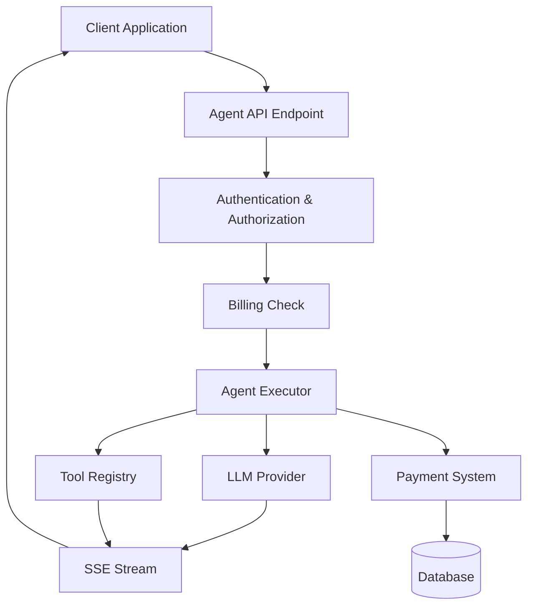

# Agent API Overview

## Introduction

The Agent API provides a powerful, LLM-based execution environment that enables users to automate complex tasks through natural language instructions. Built on top of the LLMs context, it integrates billing, tool execution, and streaming capabilities into a unified API.

## Related Documents

### API仕様書
- [Agent Execute API 仕様](./execute-api-specification.md) — リクエスト/レスポンス、SSEイベント、ツールモード等の詳細仕様
- [Agent Messages API 仕様](./messages-api-specification.md) — 履歴取得、チャンク統合ロジック、永続化の仕組み

### 設計・実装ドキュメント
- [Codex/Claude CLI統括実行](./codex-cli-orchestration.md)
- [AgentProtocol ToolCall統合](./agent-protocol-tool-call.md)
- [Agent API ツール実行基盤](./tool-execution.md)
- [Agent API MCP初期化高速化](./mcp-initialization-performance.md)
- [GetAgentHistory 履歴再生テスト仕様](./get-agent-history-test-coverage.md)
- [Agent API Mock LLM Provider Test Strategy](./mock-llm-provider-tests.md)
- [Auto Chatroom Naming](./auto-chatroom-naming.md)

## Key Features

### 1. Multi-Model Support
- Support for multiple LLM providers (Anthropic, OpenAI, Google AI, xAI, AWS Bedrock)
- AWS Bedrock support includes Claude 4.5 Sonnet and Haiku via `bedrock/claude-*` model aliases
- Automatic model selection based on task complexity
- Cost-optimized model routing

### 2. Tool Integration
- **MCP (Model Context Protocol)**: Search, read, write, and execute operations
- **Web Search**: External search API integration
- **Code Execution**: Sandboxed code execution environment
- **File Operations**: Safe file system access

### 3. Billing & Cost Management
- Precise NanoDollar-based cost calculation
- Pre-execution balance checks
- Real-time cost estimation
- Detailed usage breakdowns
- Procurement-linked price mappings must be synchronized to fixed NanoDollar prices; missing fixed prices now trigger a BusinessLogicError before execution.

### 4. Streaming Responses
- Server-Sent Events (SSE) for real-time updates
- Token-by-token streaming
- Progress indicators for tool executions
- Error recovery mechanisms
- Ask follow-up questions are emitted as single `ask` events without duplicate tool payloads（[詳細](./ask-followup-question-streaming.md)）

### 5. Catalog-Aligned Model Listing
- `/v1/llms/models` filters out models that lack Catalog products
- `ExecuteAgent` returns `errors::not_found` when unregistered models are requested
- 詳細仕様: [モデルカタログ整合性](./model-catalog-filtering.md)

## Architecture



## Core Components

### Agent Executor
- Orchestrates LLM calls and tool executions
- Manages conversation context
- Handles error recovery
- Tracks usage metrics

### Cost Calculator
- Estimates execution costs before billing
- Calculates actual costs after completion
- Breaks down costs by:
  - Base execution fee
  - Token usage (prompt/completion)
  - Tool invocations

### Billing Integration
- Pre-execution balance checks
- Post-execution credit consumption
- Transaction logging
- Balance management

### Procurement Requirements
- Register supplier contracts and procurement prices before enabling a new LLM provider. Missing procurement data now surfaces as a `BusinessLogicError` during cost calculation.
- Synchronize procurement-linked price mappings to fixed NanoDollar values (`service_price_mappings.price_mode = 'procurement_linked'`) using the catalog tooling or migration scripts.
- Monitor `ProcurementAppService::get_llm_cost` warnings to detect expired contracts or missing API keys.

### Tool Registry
- Dynamic tool discovery
- Permission-based tool access
- Tool execution tracking
- Usage cost calculation

## API Endpoints

### Execute Agent
```
POST /v1/agent/execute
```

Execute an agent with streaming response.

**Request**:
```json
{
  "model": "claude-sonnet-4-5-20250929",
  "messages": [
    {
      "role": "user",
      "content": "Analyze the codebase and suggest improvements"
    }
  ],
  "tools": ["mcp_search", "mcp_read", "code_execution"],
  "max_tokens": 4096,
  "temperature": 0.7
}
```

**Response** (SSE):
```
event: start
data: {"execution_id": "exec_01..."}

event: token
data: {"delta": "Based"}

event: token
data: {"delta": " on"}

event: tool_use
data: {"tool": "mcp_search", "input": {...}}

event: tool_result
data: {"tool": "mcp_search", "result": {...}}

event: complete
data: {
  "total_tokens": 850,
  "cost_nanodollars": 506750000,
  "cost_display": "$0.50675",
  "usage": {
    "prompt_tokens": 500,
    "completion_tokens": 350,
    "tools_used": {"mcp_search": 2}
  }
}
```

### Estimate Cost
```
POST /v1/catalog/service-cost/estimate
```

Get cost estimate before execution. See [Cost Estimation](./cost-estimation.md) for details.

## Usage Examples

### Basic Execution

```typescript
import { EventSource } from 'eventsource'

const eventSource = new EventSource('/v1/agent/execute', {
  method: 'POST',
  headers: {
    'Authorization': 'Bearer <token>',
    'x-operator-id': '<tenant-id>',
    'Content-Type': 'application/json',
  },
  body: JSON.stringify({
    model: 'claude-sonnet-4-5-20250929',
    messages: [{ role: 'user', content: 'Hello, world!' }],
  }),
})

eventSource.addEventListener('token', (event) => {
  const { delta } = JSON.parse(event.data)
  process.stdout.write(delta)
})

eventSource.addEventListener('complete', (event) => {
  const { cost_display } = JSON.parse(event.data)
  console.log(`\nCost: ${cost_display}`)
  eventSource.close()
})

eventSource.addEventListener('error', (event) => {
  console.error('Error:', event)
  eventSource.close()
})
```

### React Hook Integration

```typescript
export function useAgentExecution() {
  const [response, setResponse] = useState('')
  const [cost, setCost] = useState<string | null>(null)
  const [loading, setLoading] = useState(false)

  const execute = async (message: string) => {
    setLoading(true)
    const eventSource = new EventSource('/v1/agent/execute', {
      method: 'POST',
      headers: {
        'Authorization': `Bearer ${getToken()}`,
        'x-operator-id': getTenantId(),
        'Content-Type': 'application/json',
      },
      body: JSON.stringify({
        model: 'claude-sonnet-4-5-20250929',
        messages: [{ role: 'user', content: message }],
      }),
    })

    eventSource.addEventListener('token', (event) => {
      const { delta } = JSON.parse(event.data)
      setResponse((prev) => prev + delta)
    })

    eventSource.addEventListener('complete', (event) => {
      const { cost_display } = JSON.parse(event.data)
      setCost(cost_display)
      setLoading(false)
      eventSource.close()
    })

    eventSource.addEventListener('error', () => {
      setLoading(false)
      eventSource.close()
    })
  }

  return { response, cost, loading, execute }
}
```

## Pricing

See [Cost Estimation](./cost-estimation.md) for detailed pricing information.

### Example Costs

| Operation | Estimated Cost |
|-----------|----------------|
| Simple Q&A (500 tokens) | $0.10 - $0.15 |
| Code analysis with MCP | $0.50 - $1.00 |
| Multi-step automation | $2.00 - $5.00 |
| Large document processing | $5.00 - $20.00 |

## Error Handling

### Insufficient Balance
```json
{
  "error": "payment_required",
  "code": "INSUFFICIENT_FUNDS",
  "message": "Insufficient balance for this operation",
  "details": {
    "required_display": "$0.50",
    "current_balance_display": "$0.10",
    "shortfall_display": "$0.40"
  }
}
```

### Model Not Available
```json
{
  "error": "invalid_request",
  "code": "MODEL_NOT_AVAILABLE",
  "message": "Requested model is not available",
  "available_models": [
    "claude-sonnet-4-5-20250929",
    "gpt-4.1"
  ]
}
```

### Tool Permission Denied
```json
{
  "error": "permission_denied",
  "code": "TOOL_PERMISSION_DENIED",
  "message": "You do not have permission to use this tool",
  "tool": "mcp_write"
}
```

## Rate Limits

| Tier | Requests/minute | Max tokens/request | Max concurrent |
|------|-----------------|-------------------|----------------|
| Free | 10 | 4,096 | 1 |
| Basic | 60 | 8,192 | 3 |
| Pro | 300 | 32,768 | 10 |
| Enterprise | Custom | Custom | Custom |

## Security

### Authentication
- Bearer token required in `Authorization` header
- Tenant ID required in `x-operator-id` header
- Token expires after 24 hours

### Authorization
- Role-based access control
- Tool-level permissions
- Resource-level access control

### Data Privacy
- Conversation data encrypted at rest
- PII detection and masking
- Audit logging for all operations

## Monitoring & Observability

### Metrics
- Request latency (p50, p95, p99)
- Token throughput
- Tool execution times
- Error rates

### Logging
- Structured JSON logs
- Correlation IDs for tracing
- User action audit trail

### Alerts
- High error rates
- Unusual cost patterns
- Rate limit violations

## Related Documentation

- [Cost Estimation](./cost-estimation.md) - Detailed pricing and billing
- [LLMs Overview](../overview.md) - Core LLM functionality
- [Agent Specification](../agent.md) - Agent architecture
- [Tool System](../tool.md) - Available tools
- [Billing System](../../payment/overview.md) - Payment integration

## Version History

- **v0.15.0** (2025-10-10): Fixed NanoDollar conversion, added cost estimation API
- **v0.14.0** (2025-10-08): Better Auth integration
- **v0.12.0** (2025-10-05): Feature flag integration
- **v0.9.0** (2025-01-26): USD billing system migration
- **v0.1.0** (2024-12-01): Initial release
