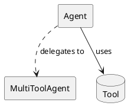
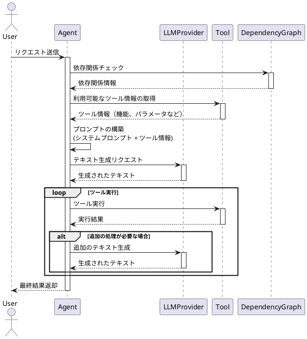
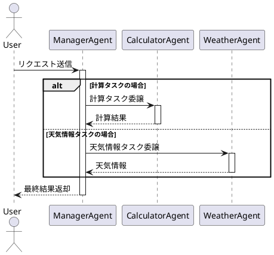

# エージェント (agent.rs)

`agent.rs` は、エージェントの抽象化と基本的な実装を提供します。エージェントは、LLMプロバイダーとツールを組み合わせて、特定のタスクを実行するエンティティです。

## エージェントの特性

- **LLMプロバイダー**: エージェントは、テキスト生成のためにLLMプロバイダーを使用します。
- **ツール**: エージェントは、特定のタスクを実行するためのツールを保持します。
- **依存関係グラフ**: エージェントは、ツール間の依存関係を管理するためのグラフを持ちます。

## `Agent` トレイト

`Agent` トレイトは、エージェントの基本的なインターフェースを定義します。

```rust
pub trait Agent: Tool + Send + Sync {
    fn system_prompt(&self) -> String;
    fn llm_provider(&self) -> Arc<dyn provider::LLMProvider>;
    fn tools(&self) -> Vec<&dyn Tool>;
    fn dependency_graph(&self) -> &DependencyGraph;

    async fn generate_text(&self, input: &str) -> Result<ChatOutput>;
    fn dependency_graph_json(&self) -> Result<String>;
    fn detailed_dependency_graph_json(&self) -> Result<String>;
}
```

- `system_prompt`: エージェントのシステムプロンプトを返します。
- `llm_provider`: エージェントが使用するLLMプロバイダーを返します。
- `tools`: エージェントが使用するツールのリストを返します。
- `dependency_graph`: エージェントの依存関係グラフを返します。
- `generate_text`: 入力テキストに基づいてテキストを生成します。
- `dependency_graph_json`: 依存関係グラフをJSON形式で返します。
- `detailed_dependency_graph_json`: 詳細な依存関係グラフをJSON形式で返します。

## `AgentBase` 構造体

`AgentBase` 構造体は、`Agent` トレイトの基本的な実装を提供します。

```rust
pub struct AgentBase {
    name: String,
    system_prompt: String,
    llm_provider: Arc<dyn provider::LLMProvider>,
    tools: HashMap<String, Box<dyn Tool>>,
    dependency_graph: DependencyGraph,
}
```

- `name`: エージェントの名前。
- `system_prompt`: エージェントのシステムプロンプト。
- `llm_provider`: エージェントが使用するLLMプロバイダー。
- `tools`: エージェントが使用するツールのマップ。
- `dependency_graph`: エージェントの依存関係グラフ。

## `AgentBuilder` 構造体

`AgentBuilder` 構造体は、`AgentBase` の構築を容易にするためのビルダーパターンを提供します。

```rust
pub struct AgentBuilder {
    name: String,
    system_prompt: String,
    llm_provider: Arc<dyn provider::LLMProvider>,
    tools: HashMap<String, Box<dyn Tool>>,
    dependency_graph: DependencyGraph,
}
```

## PlantUML ダイアグラム



この図は、エージェントがツールを直接使用し、マルチツールエージェントにタスクを委譲する様子を示しています。

## シーケンス図

以下のシーケンス図は、エージェントの基本的な処理フローを示しています：



このシーケンス図は以下の主要なステップを示しています：

1. ユーザーからエージェントへのリクエスト送信
2. エージェントによる依存関係グラフのチェック
3. 利用可能なツール情報の取得
4. プロンプトの構築（システムプロンプトとツール情報の組み合わせ）
5. LLMプロバイダーを使用したテキスト生成
6. 必要なツールの実行
7. 必要に応じた追加のLLM処理
8. 最終結果のユーザーへの返却

各ステップは非同期で実行され、エラーハンドリングも含まれてい���す。

## マルチエージェントの例

マルチエージェントの例では、複数のエージェントが協力して作業を行う方法を示します。この例では、以下の2つのエージェントが登場します：

1. **マネージャーエージェント**: タスクを分析し、適切なエージェントに作業を委譲します。
2. **スペシャリストエージェント**: 特定の分野（計算や天気情報など）に特化したタスクを実行します。

### タスクの流れ

1. ユーザーからの入力をマネージャーエージェントが受け取ります。
2. マネージャーエージェントは入力を分析し、必要なスペシャリストエージェントを選択します。
3. スペシャリストエージェントがタスクを実行し、結果をマネージャーエージェントに返します。
4. マネージャーエージェントは結果を集約し、ユーザーに最終的な回答を提供します。



### 実装例

実装例は `examples/multi_agent.rs` で確認できます。以下のコマンドで実行できます：

```shell
cargo run -p llms --example multi_agent
```

この例では、以下のような機能を実装しています：

1. マネージャーエージェントの作成と設定
2. スペシャリストエージェント（計算機、天気情報）の作成
3. エージェント間の通信処理
4. エラーハンドリングとリカバリー処理

マルチエージェントシステムを使用することで、複雑なタスクを小さな単位に分割し、専門化されたエージェントに効率的に処理させることができます。
