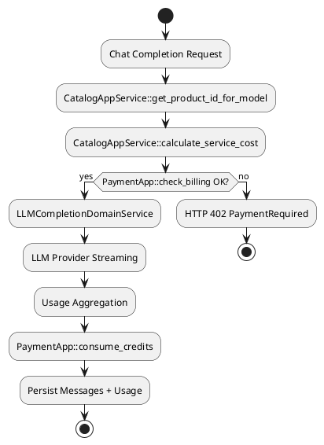

# チャット課金とモデルルーティング仕様

## 概要

v0.15.0 でチャット補完 API に NanoDollar 課金と正確なモデルルーティングを導入した。UI が指定した `provider/model` 形式のモデル ID をそのまま受け取り、Catalog / Payment コンテキストと連携して実利用分を課金する。

- サポート形式: `provider/model`, `provider:model`, 既存のショートハンド (`large`, `small`)
- 対応 API: `POST /v1/llms/chat/completions`, `POST /v1/llms/chatrooms/{chatroom_id}/chat/completions`
- 課金フロー: Catalog で単価算出 → Payment で残高チェック・消費 → LLM usage 保存

## モデルルーティング

1. `LLMModelName::from_str` が入力文字列を解析し、`LLMProvider` とモデル識別子を抽出。
2. `LLMProviders` が適切なプロバイダー実装（OpenAI / Anthropic / Google など）を選択。
3. 指定モードが存在しない場合は 400 を返却。フォールバックは行わない。
4. UI から送信されたモデル文字列はレスポンスの `model` フィールドにも反映される。

### 例

```yaml
input: "anthropic/claude-3-5-sonnet-20241022"
provider: "anthropic"
model: "claude-3-5-sonnet-20241022"
```

## 課金フロー



- `estimated_cost_nanodollars` は初回実行時の推定値として `check_billing` に渡す。
- ストリーム完了後に確定した `ServiceCostBreakdown.total_nanodollars` を `consume_credits` に提供する。
- `NoOpPaymentApp` 環境では `check_billing` / `consume_credits` が早期リターンする。

## ストリーミング usage 収集

- `llms_provider::StreamOutput` に `usage` フィールドを追加。
- OpenAI / Anthropic SSE ハンドラは `usage` イベントを検出し、`prompt_tokens` / `completion_tokens` を抽出。
- `LLMCompletionDomainServiceImpl::stream_completion` はストリーム終了時点で usage を確定し、`tachyon_apps_llms.llm_usages` へ記録。
- usage が提供されない場合は Catalog の推定値を利用しつつ警告ログを出力。

## エラーハンドリング

| ケース | 応答 | 備考 |
|--------|------|------|
| 残高不足 | 402 PaymentRequired | メッセージは保存されない |
| モデル未対応 | 400 BadRequest | `unsupported_model` コード |
| プロバイダー API エラー | 502 BadGateway | 外部エラーメッセージはマスク |
| usage 欠損 | 200 (警告) | Catalog 推定値で課金、`warn!` ログ |

## 永続化

- `chat_room_messages` への保存は `consume_credits` 成功後に実施。
- `llm_usages` テーブルに `prompt_tokens`, `completion_tokens`, `total_nanodollars`, `model_id`, `provider` を保存。
- 課金に使用した `service_cost_breakdown_id` を紐付け、決済監査時に追跡可能。

## テスト

- `cargo test -p llms` でユースケース・サービス層の単体テストを実施。
- `cargo test -p providers` で SSE usage 抽出の回帰を防止。
- Playwright MCP シナリオで Anthropic モデルのチャット送信と課金挙動を目視確認。

## 変更履歴

- v0.15.0 (2025-10-12): チャット課金とモデルルーティングの正式対応。
