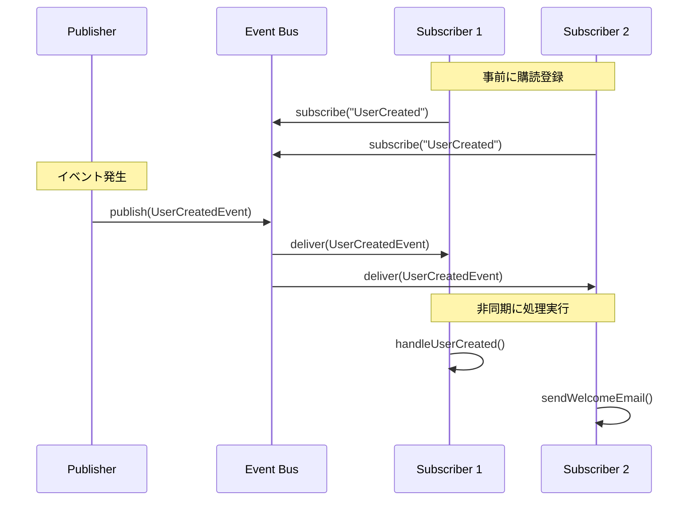

# LLMs Agent APIのイベント駆動アーキテクチャ

## 概要

LLMs Agent APIにおけるイベント駆動アーキテクチャの設計文書です。コンテキスト間の疎結合な通信を実現し、スケーラブルで拡張性の高いシステムを構築します。

## イベントバスを使用する理由

### 1. コンテキスト境界の保護
- LLMsコンテキストとPaymentコンテキストの直接的な依存を回避
- 各コンテキストが独立して進化できる設計
- ドメイン知識の漏洩を防ぐ

### 2. 非同期処理の実現
- Agent実行後の課金処理を非同期化
- システムの応答性能向上
- バッチ処理による効率化

### 3. 拡張性とスケーラビリティ
- 新しいイベントハンドラの追加が容易
- 水平スケーリングが可能
- 複数のコンシューマーによる並列処理

## イベント定義

### LLMsコンテキストから発行されるイベント

```yaml
events:
  # Agent実行完了イベント
  AgentExecutedEvent:
    producer: LLMs Context
    consumers: 
      - Payment Context (課金処理)
      - Analytics Context (統計収集)
      - Audit Context (監査ログ)
    payload:
      - tenant_id: TenantId
      - execution_id: String
      - model: String
      - prompt_tokens: u32
      - completion_tokens: u32
      - tool_calls: Vec<ToolUsage>
      - cost_details: AgentExecutionCost
      - timestamp: DateTime<Utc>
    description: "Agent実行が完了した際に発行される"
    
  # Chat完了イベント  
  ChatCompletedEvent:
    producer: LLMs Context
    consumers:
      - Payment Context (課金処理)
      - Analytics Context (統計収集)
    payload:
      - tenant_id: TenantId
      - chatroom_id: ChatRoomId
      - message_count: u32
      - total_tokens: u32
      - cost_details: ChatCost
      - timestamp: DateTime<Utc>
    description: "チャットセッションが完了した際に発行される"
```

### Paymentコンテキストから発行されるイベント

```yaml
events:
  # クレジット消費イベント
  CreditConsumedEvent:
    producer: Payment Context
    consumers:
      - Analytics Context (使用量分析)
      - Notification Context (アラート判定)
    payload:
      - tenant_id: TenantId
      - transaction_id: Ulid
      - amount: i64
      - balance_after: i64
      - resource_type: String
      - resource_id: String
      - timestamp: DateTime<Utc>
    description: "クレジットが消費された際に発行される"
    
  # クレジットチャージイベント
  CreditChargedEvent:
    producer: Payment Context
    consumers:
      - Notification Context (購入完了通知)
      - Order Context (請求書生成)
    payload:
      - tenant_id: TenantId
      - transaction_id: Ulid
      - amount: i64
      - bonus_amount: i64
      - total_balance: i64
      - payment_method: String
      - timestamp: DateTime<Utc>
    description: "クレジットが購入された際に発行される"
    
  # 低残高アラートイベント
  LowBalanceEvent:
    producer: Payment Context
    consumers:
      - Notification Context (警告通知)
      - Analytics Context (行動分析)
    payload:
      - tenant_id: TenantId
      - current_balance: i64
      - threshold: i64
      - timestamp: DateTime<Utc>
    description: "残高が閾値を下回った際に発行される"
    
  # 残高不足イベント
  InsufficientCreditsEvent:
    producer: Payment Context
    consumers:
      - Notification Context (エラー通知)
      - Analytics Context (失敗分析)
    payload:
      - tenant_id: TenantId
      - attempted_amount: i64
      - available_amount: i64
      - resource_type: String
      - resource_id: String
      - timestamp: DateTime<Utc>
    description: "残高不足で実行できなかった際に発行される"
```

## イベントバスの基本概念

### 1. コンポーネント

```yaml
event_bus_components:
  publisher:
    description: "イベントを発行するコンポーネント"
    責務:
      - イベントの生成
      - イベントバスへの送信
    
  subscriber:
    description: "イベントを購読するコンポーネント"
    責務:
      - 特定のイベントタイプの購読
      - イベント受信時の処理実行
    
  event_bus:
    description: "イベントの仲介役"
    責務:
      - イベントのルーティング
      - 購読者管理
      - 配信保証
```

### 2. 動作フロー



## 実装パターン

## イベントバスの実装

### 基本インターフェース

```rust
// packages/event_bus/src/lib.rs

/// イベントのトレイト
pub trait Event: Send + Sync + 'static {
    fn event_type(&self) -> &'static str;
    fn tenant_id(&self) -> Option<&TenantId>;
}

/// イベントハンドラのトレイト
#[async_trait::async_trait]
pub trait EventHandler<E: Event>: Send + Sync {
    async fn handle(&self, event: E) -> Result<(), EventError>;
}

/// イベントパブリッシャーのトレイト
#[async_trait::async_trait]
pub trait EventPublisher: Send + Sync {
    async fn publish<E: Event>(&self, event: E) -> Result<(), EventError>;
}

/// イベントバスの実装
pub struct EventBus {
    handlers: HashMap<TypeId, Vec<Box<dyn Any + Send + Sync>>>,
    publisher: Arc<dyn EventPublisher>,
}

impl EventBus {
    /// イベントハンドラを登録
    pub fn subscribe<E: Event>(&mut self, handler: Box<dyn EventHandler<E>>) {
        let type_id = TypeId::of::<E>();
        self.handlers
            .entry(type_id)
            .or_insert_with(Vec::new)
            .push(Box::new(handler));
    }
    
    /// イベントを発行
    pub async fn publish<E: Event>(&self, event: E) -> Result<(), EventError> {
        // 内部ハンドラの実行
        if let Some(handlers) = self.handlers.get(&TypeId::of::<E>()) {
            for handler in handlers {
                if let Some(h) = handler.downcast_ref::<Box<dyn EventHandler<E>>>() {
                    h.handle(event.clone()).await?;
                }
            }
        }
        
        // 外部パブリッシャーへの送信（Redis等）
        self.publisher.publish(event).await
    }
}
```

### Redis実装（プロダクション環境）

```rust
// packages/event_bus/src/redis_publisher.rs

use redis::aio::ConnectionManager;
use serde::{Serialize, Deserialize};

pub struct RedisEventPublisher {
    redis: ConnectionManager,
    channel_prefix: String,
}

#[async_trait::async_trait]
impl EventPublisher for RedisEventPublisher {
    async fn publish<E: Event>(&self, event: E) -> Result<(), EventError> 
    where
        E: Serialize,
    {
        let channel = format!("{}.{}", self.channel_prefix, event.event_type());
        let payload = serde_json::to_string(&event)?;
        
        self.redis
            .publish::<_, _, ()>(channel, payload)
            .await
            .map_err(|e| EventError::PublishFailed(e.to_string()))?;
            
        Ok(())
    }
}

/// Redisサブスクライバー（ワーカープロセス用）
pub struct RedisEventSubscriber {
    redis: ConnectionManager,
    channel_prefix: String,
}

impl RedisEventSubscriber {
    pub async fn subscribe<E>(&mut self, handler: Box<dyn EventHandler<E>>) 
    where
        E: Event + DeserializeOwned,
    {
        let channel = format!("{}.{}", self.channel_prefix, E::event_type());
        let mut pubsub = self.redis.as_pubsub();
        pubsub.subscribe(&channel).await?;
        
        // バックグラウンドタスクでメッセージを処理
        tokio::spawn(async move {
            let mut stream = pubsub.on_message();
            while let Some(msg) = stream.next().await {
                let payload: String = msg.get_payload()?;
                if let Ok(event) = serde_json::from_str::<E>(&payload) {
                    if let Err(e) = handler.handle(event).await {
                        tracing::error!("Failed to handle event: {:?}", e);
                    }
                }
            }
        });
    }
}
```

### インメモリ実装（開発・テスト環境）

```rust
// packages/event_bus/src/in_memory_publisher.rs

use tokio::sync::mpsc;

pub struct InMemoryEventPublisher {
    sender: mpsc::UnboundedSender<Box<dyn Event>>,
}

#[async_trait::async_trait]
impl EventPublisher for InMemoryEventPublisher {
    async fn publish<E: Event>(&self, event: E) -> Result<(), EventError> {
        self.sender
            .send(Box::new(event))
            .map_err(|_| EventError::PublishFailed("Channel closed".to_string()))?;
        Ok(())
    }
}
```

### 1. シンプルなインメモリイベントバス（既存のコード例）

```rust
// packages/event_bus/src/lib.rs

use std::collections::HashMap;
use std::sync::Arc;
use tokio::sync::RwLock;
use async_trait::async_trait;
use serde::{Serialize, Deserialize};

/// イベントの基底トレイト
pub trait Event: Send + Sync + 'static {
    fn event_type(&self) -> &'static str;
}

/// イベントハンドラーのトレイト
#[async_trait]
pub trait EventHandler<E: Event>: Send + Sync {
    async fn handle(&self, event: &E) -> Result<(), Box<dyn std::error::Error>>;
}

/// イベントバスの実装
#[derive(Debug, Clone)]
pub struct EventBus {
    handlers: Arc<RwLock<HashMap<&'static str, Vec<Arc<dyn EventHandler<dyn Event>>>>>>,
}

impl EventBus {
    pub fn new() -> Self {
        Self {
            handlers: Arc::new(RwLock::new(HashMap::new())),
        }
    }
    
    /// イベントハンドラーを登録
    pub async fn subscribe<E: Event>(
        &self,
        event_type: &'static str,
        handler: Arc<dyn EventHandler<E>>,
    ) {
        let mut handlers = self.handlers.write().await;
        handlers
            .entry(event_type)
            .or_insert_with(Vec::new)
            .push(handler);
    }
    
    /// イベントを発行
    pub async fn publish<E: Event>(&self, event: E) -> Result<(), Box<dyn std::error::Error>> {
        let event_type = event.event_type();
        let handlers = self.handlers.read().await;
        
        if let Some(event_handlers) = handlers.get(event_type) {
            for handler in event_handlers {
                // 非同期で各ハンドラーを実行
                let handler_clone = handler.clone();
                let event_clone = Arc::new(event);
                
                tokio::spawn(async move {
                    if let Err(e) = handler_clone.handle(&*event_clone).await {
                        tracing::error!("Event handler error: {:?}", e);
                    }
                });
            }
        }
        
        Ok(())
    }
}
```

## 実装例

### Agent実行完了イベントの発行（LLMsコンテキスト）

```rust
// packages/llms/src/event/agent_executed.rs

#[derive(Debug, Clone, Serialize, Deserialize)]
pub struct AgentExecutedEvent {
    pub tenant_id: TenantId,
    pub execution_id: String,
    pub model: String,
    pub prompt_tokens: u32,
    pub completion_tokens: u32,
    pub tool_calls: Vec<ToolUsage>,
    pub cost_details: AgentExecutionCost,
    pub timestamp: DateTime<Utc>,
}

impl Event for AgentExecutedEvent {
    fn event_type(&self) -> &'static str {
        "agent.executed"
    }
    
    fn tenant_id(&self) -> Option<&TenantId> {
        Some(&self.tenant_id)
    }
}

// packages/llms/src/usecase/execute_agent.rs

impl ExecuteAgent {
    async fn publish_execution_event(&self, execution_data: ExecutionData) {
        let event = AgentExecutedEvent {
            tenant_id: execution_data.tenant_id,
            execution_id: execution_data.execution_id,
            model: execution_data.model,
            prompt_tokens: execution_data.prompt_tokens,
            completion_tokens: execution_data.completion_tokens,
            tool_calls: execution_data.tool_calls,
            cost_details: execution_data.cost_details,
            timestamp: Utc::now(),
        };
        
        if let Err(e) = self.event_bus.publish(event).await {
            tracing::error!("Failed to publish agent executed event: {:?}", e);
        }
    }
}
```

### 課金イベントハンドラ（Paymentコンテキスト）

```rust
// packages/payment/src/event_handler/agent_billing.rs

pub struct AgentBillingEventHandler {
    credit_service: Arc<CreditService>,
    transaction_service: Arc<TransactionService>,
    policy_service: Arc<BillingPolicyService>,
}

#[async_trait::async_trait]
impl EventHandler<AgentExecutedEvent> for AgentBillingEventHandler {
    async fn handle(&self, event: AgentExecutedEvent) -> Result<(), EventError> {
        // 課金ポリシーの取得
        let policy = self.policy_service
            .get_or_default(event.tenant_id.clone())
            .await?;
            
        // 課金が無効な場合はスキップ
        if !policy.requires_billing() {
            return Ok(());
        }
        
        // 重複処理の防止
        if self.transaction_service
            .exists_for_execution(&event.execution_id)
            .await?
        {
            return Ok(());
        }
        
        // クレジット消費の記録
        let transaction = CreditTransaction {
            id: Ulid::new(),
            tenant_id: event.tenant_id.clone(),
            transaction_type: TransactionType::Usage,
            amount: -event.cost_details.total_cost,
            description: format!("Agent execution: {}", event.execution_id),
            metadata: serde_json::to_value(&event.cost_details)?,
            resource_type: Some("agent_execution".to_string()),
            resource_id: Some(event.execution_id),
            created_at: event.timestamp,
        };
        
        self.transaction_service
            .create_transaction(transaction)
            .await?;
            
        // クレジット消費イベントの発行
        self.event_bus.publish(CreditConsumedEvent {
            tenant_id: event.tenant_id,
            transaction_id: transaction.id,
            amount: event.cost_details.total_cost,
            balance_after: balance.balance,
            resource_type: "agent_execution".to_string(),
            resource_id: event.execution_id,
            timestamp: Utc::now(),
        }).await?;
        
        Ok(())
    }
}
```

### イベントハンドラの登録

```rust
// apps/tachyon-api/src/event_setup.rs

pub fn setup_event_handlers(
    event_bus: &mut EventBus,
    payment_app: Arc<dyn PaymentApp>,
    notification_app: Arc<dyn NotificationApp>,
) {
    // Agent実行イベントのハンドラ登録
    event_bus.subscribe::<AgentExecutedEvent>(
        Box::new(AgentBillingEventHandler::new(
            payment_app.clone(),
        ))
    );
    
    // クレジット消費イベントのハンドラ登録
    event_bus.subscribe::<CreditConsumedEvent>(
        Box::new(CreditAnalyticsHandler::new(
            analytics_service.clone(),
        ))
    );
    
    // 低残高イベントのハンドラ登録
    event_bus.subscribe::<LowBalanceEvent>(
        Box::new(LowBalanceNotificationHandler::new(
            notification_app.clone(),
        ))
    );
    
    // クレジットチャージイベントのハンドラ登録
    event_bus.subscribe::<CreditChargedEvent>(
        Box::new(PurchaseNotificationHandler::new(
            notification_app.clone(),
        ))
    );
}
```

### 2. LLM課金システムでの実装例（既存コードとの統合）

```rust
// packages/llms/event/mod.rs

use chrono::{DateTime, Utc};
use serde::{Serialize, Deserialize};
use value_object::TenantId;

/// Agent実行完了イベント
#[derive(Debug, Clone, Serialize, Deserialize)]
pub struct AgentExecutedEvent {
    pub tenant_id: TenantId,
    pub execution_id: String,
    pub prompt_tokens: u32,
    pub completion_tokens: u32,
    pub tool_executions: Vec<ToolExecution>,
    pub timestamp: DateTime<Utc>,
}

#[derive(Debug, Clone, Serialize, Deserialize)]
pub struct ToolExecution {
    pub tool_name: String,
    pub execution_count: u32,
}

impl Event for AgentExecutedEvent {
    fn event_type(&self) -> &'static str {
        "agent.executed"
    }
}

// packages/payment/src/event_handler/billing_handler.rs

use async_trait::async_trait;
use std::sync::Arc;

/// Agent実行イベントを受けて課金処理を行うハンドラー
pub struct AgentBillingHandler {
    credit_service: Arc<CreditService>,
    cost_calculator: Arc<AgentCostCalculator>,
    transaction_service: Arc<TransactionService>,
}

#[async_trait]
impl EventHandler<AgentExecutedEvent> for AgentBillingHandler {
    async fn handle(&self, event: &AgentExecutedEvent) -> Result<(), Box<dyn std::error::Error>> {
        // 1. コスト計算
        let cost = self.cost_calculator.calculate_from_event(
            event.prompt_tokens,
            event.completion_tokens,
            &event.tool_executions,
        )?;
        
        // 2. クレジット消費
        let mut balance = self.credit_service
            .get_balance(&event.tenant_id)
            .await?;
            
        balance.consume(cost.total_cost)?;
        self.credit_service.update_balance(&balance).await?;
        
        // 3. トランザクション記録
        let transaction = CreditTransaction {
            id: Ulid::new(),
            tenant_id: event.tenant_id.clone(),
            transaction_type: TransactionType::Usage,
            amount: -cost.total_cost,
            balance_after: balance.balance,
            description: format!("Agent execution: {}", event.execution_id),
            metadata: serde_json::to_value(&cost)?,
            created_at: Utc::now(),
        };
        
        self.transaction_service.create(transaction).await?;
        
        // 4. 低残高チェック
        if balance.balance < 1000 {
            // 低残高イベントを発行（ここでは省略）
        }
        
        Ok(())
    }
}
```

### 3. アプリケーションでの統合

```rust
// apps/tachyon-api/src/main.rs

#[tokio::main]
async fn main() -> Result<(), Box<dyn std::error::Error>> {
    // イベントバスの初期化
    let event_bus = Arc::new(EventBus::new());
    
    // ハンドラーの登録
    if config.billing.enabled {
        let billing_handler = Arc::new(AgentBillingHandler::new(
            credit_service.clone(),
            cost_calculator.clone(),
            transaction_service.clone(),
        ));
        
        event_bus.subscribe(
            "agent.executed",
            billing_handler,
        ).await;
    }
    
    // 通知ハンドラーの登録
    let notification_handler = Arc::new(NotificationHandler::new(
        notification_service.clone(),
    ));
    
    event_bus.subscribe(
        "credit.low_balance",
        notification_handler,
    ).await;
    
    // ユースケースにイベントバスを注入
    let execute_agent = Arc::new(ExecuteAgent::new(
        chat_stream_providers.clone(),
        chat_message_repo.clone(),
        event_bus.clone(), // イベントバスを追加
    ));
    
    // ... アプリケーション起動
}
```

### 4. ユースケースでのイベント発行

```rust
// packages/llms/usecase/execute_agent.rs

pub struct ExecuteAgent {
    chat_stream_providers: Arc<ChatStreamProviders>,
    chat_message_repo: Arc<dyn ChatMessageRepository>,
    event_bus: Arc<EventBus>, // イベントバスを追加
}

impl ExecuteAgentInputPort for ExecuteAgent {
    async fn execute<'a>(
        &self,
        input: ExecuteAgentInputData<'a>,
    ) -> Result<ChatStreamResponse> {
        // ... Agent実行処理
        
        // ストリーム処理中でトークン使用量を収集
        let mut total_prompt_tokens = 0;
        let mut total_completion_tokens = 0;
        let mut tool_executions = Vec::new();
        
        // CommandStack実行
        let stream = command_stack.handle().await?;
        
        // ストリーム完了後にイベントを発行
        let event = AgentExecutedEvent {
            tenant_id: input.multi_tenancy.tenant_id(),
            execution_id: input.chatroom_id.to_string(),
            prompt_tokens: total_prompt_tokens,
            completion_tokens: total_completion_tokens,
            tool_executions,
            timestamp: Utc::now(),
        };
        
        // イベントを非同期で発行（エラーがあってもAgent実行は継続）
        if let Err(e) = self.event_bus.publish(event).await {
            tracing::error!("Failed to publish agent executed event: {:?}", e);
        }
        
        Ok(stream)
    }
}
```

## イベントストアとイベントソーシング

将来的な拡張として、イベントストアの実装を検討：

```yaml
event_store:
  storage: "PostgreSQL / EventStore"
  features:
    - イベントの永続化
    - イベント再生による状態復元
    - 監査ログとしての活用
    - タイムトラベルデバッグ
  
  schema:
    events:
      - id: ULID
      - aggregate_id: String (tenant_id, execution_id等)
      - aggregate_type: String (credit_balance, agent_execution等)
      - event_type: String
      - event_version: i32
      - event_data: JSONB
      - metadata: JSONB
      - created_at: DateTime
      - created_by: String
```

## パフォーマンス最適化

### 1. バッチ処理
```rust
// 一定期間のイベントをまとめて処理
pub struct BatchingEventHandler<E: Event> {
    batch_size: usize,
    batch_timeout: Duration,
    buffer: Arc<Mutex<Vec<E>>>,
    handler: Arc<dyn BatchHandler<E>>,
}
```

### 2. 並列処理
```rust
// テナントごとに並列処理
pub struct ParallelEventProcessor {
    worker_count: usize,
    queue: Arc<SegmentedQueue<TenantId, Box<dyn Event>>>,
}
```

### 3. サーキットブレーカー
```rust
// 障害時の連鎖的失敗を防ぐ
pub struct CircuitBreakerHandler<E: Event> {
    inner: Box<dyn EventHandler<E>>,
    failure_threshold: usize,
    reset_timeout: Duration,
}
```

## モニタリングとデバッグ

### メトリクス
```yaml
metrics:
  events_published_total:
    type: counter
    labels: [event_type, tenant_id]
    
  events_processed_total:
    type: counter
    labels: [event_type, handler, status]
    
  event_processing_duration:
    type: histogram
    labels: [event_type, handler]
    
  event_queue_depth:
    type: gauge
    labels: [event_type]
```

### トレーシング
```rust
// イベント処理のトレース
#[tracing::instrument(skip(event))]
async fn handle_event<E: Event>(event: E) {
    let span = tracing::span!(
        tracing::Level::INFO,
        "handle_event",
        event_type = event.event_type(),
        tenant_id = ?event.tenant_id(),
    );
    
    // 処理の実行...
}
```

## テスト戦略

### 単体テスト
```rust
#[tokio::test]
async fn test_agent_billing_handler() {
    let mock_credit_service = MockCreditService::new();
    let handler = AgentBillingEventHandler::new(mock_credit_service);
    
    let event = AgentExecutedEvent {
        // テストデータ
    };
    
    let result = handler.handle(event).await;
    assert!(result.is_ok());
}
```

### 統合テスト
```rust
#[tokio::test]
async fn test_event_flow_integration() {
    let event_bus = setup_test_event_bus();
    let payment_app = setup_test_payment_app();
    
    // イベントハンドラの登録
    setup_event_handlers(&mut event_bus, payment_app);
    
    // Agent実行イベントの発行
    event_bus.publish(AgentExecutedEvent { /* ... */ }).await?;
    
    // 結果の検証
    assert_credit_consumed();
    assert_notification_sent();
}
```

## まとめ

このイベント駆動アーキテクチャにより：

1. **疎結合**: コンテキスト間の直接的な依存を排除
2. **拡張性**: 新しいイベントハンドラの追加が容易
3. **信頼性**: 非同期処理とリトライによる高可用性
4. **監査性**: すべてのイベントが追跡可能
5. **パフォーマンス**: 非同期処理による応答性能向上

今後の拡張として、イベントソーシングやCQRSパターンの採用も検討可能です。