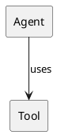
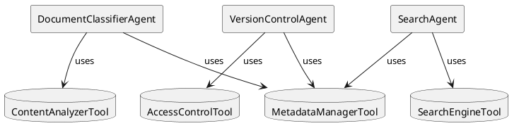
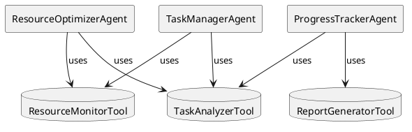
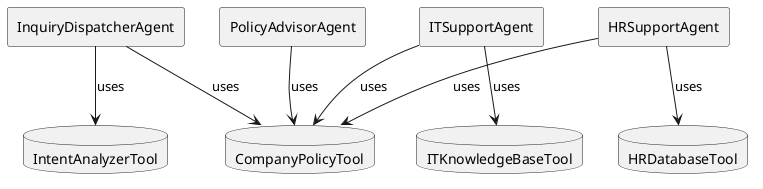
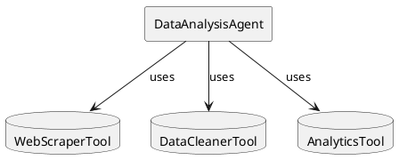
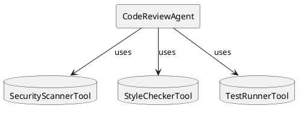
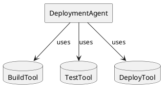
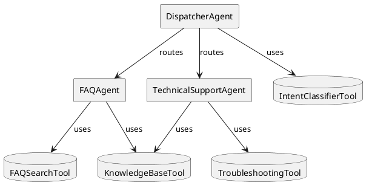

# 依存関係グラフ (graph.rs)

`graph.rs` は、エージェントとツール間の依存関係を管理するためのグラフ構造を提供します。このグラフは、エージェントがどのツールを使用できるか、またツール間の依存関係を追跡するために使用されます。

## グラフの要素

- **ノード (Node)**: エージェントまたはツールを表します。
- **エッジ (Edge)**: ノード間の依存関係を表します。

## `NodeType` 列挙型

`NodeType` 列挙型は、ノードの種類を定義します。

```rust
pub enum NodeType {
    Agent,
    Tool,
}
```

- `Agent`: 特定の目的のために設計された単一の責任を持つエージェント。
- `Tool`: 特定のタスクを実行するツール。単一の明確な責任を持ちます。

### `NodeType` のメソッド

- `as_plantuml()`: PlantUML でのノードの表現を返します。
- `is_agent()`: ノードがエージェントかどうかを判定します。
- `is_tool()`: ノードがツールかどうかを判定します。

## `EdgeType` 列挙型

`EdgeType` 列挙型は��ッジの種類を定義します。

```rust
pub enum EdgeType {
    Direct,
}
```

- `Direct`: 直接的な依存関係。

### `EdgeType` のメソッド

- `as_plantuml()`: PlantUML でのエッジの表現を返します。

## `DependencyGraph` 構造体

`DependencyGraph` 構造体は、依存関係グラフを表現します。

```rust
pub struct DependencyGraph {
    nodes: HashMap<String, Node>,
    edges: Vec<Edge>,
}
```

- `nodes`: グラフのノードを格納するマップ。
- `edges`: グラフのエッジを格納するベクター。

### `DependencyGraph` のメソッド

- `new()`: 新しい `DependencyGraph` を作成します。
- `add_node()`: グラフに新しいノードを追加します。
- `add_edge()`: グラフに新しいエッジを追加します。
    - ツール間の循環依存を検出し、エラーを返します。
- `would_create_tool_cycle()`: ツールを含む循環依存が作成されるかどうかをチックします。
- `nodes()`: グラフのノード一覧を返します。
- `edges()`: グラフのエッジ一覧を返します。
- `get_dependencies_by_type()`: 特定のノードの依存関係をエッジの種類で分類して返します。
- `get_dependents_by_type()`: 特定のノードに依存しているノードをエッジの種類で分類して返します。
- `to_json()`: グラフをJSON形式で出力します。
- `to_detailed_json()`: グラフを詳細なJSON形式で出力します。
- `to_plantuml()`: グラフをPlantUML形式で出力します。
- `to_detailed_plantuml()`: グラフを詳細なPlantUML形式で出力します。

## PlantUML ダイアグラム



この図は、エージェントがツールを直接使用する様子を示しています。

## 依存関係のチェック

`DependencyGraph` は、ツール間の循環依存を防止するためのチェック機能を提供します。エージェント間の循環依存は許可されますが、ツール間の循環依存はエラーとなります。

このグラフ構造により、エージェントとツールの複雑な依存関係を管理し、システムの整合性を保つことができます。

## ユースケース

依存関係グラフを使用した具体的なユースケースを以下に示します。

### 1. ドキュメント管理システム

**目的**: 社内文書の自動分類、バージョン管理、検索を行い、効率的なドキュメント管理を実現します。

**ユースケース例**:
- 文書の動分類とメタデータ付与
- バージョン管理と更新通知
- 関連文書の検索と推薦
- アクセス権限の管理



このシステムでは、複数のエージェントが連携してドキュメント管理を行います：

- `DocumentClassifierAgent`: 文書の分類とメタデータ管理を担当
  - `ContentAnalyzerTool`: 文書内容の解析
  - `MetadataManagerTool`: メタデータの管理（他のエージェントと共有）
- `VersionControlAgent`: バージョン管理と更新通知を担当
  - `MetadataManagerTool`: メタデータの参照
  - `AccessControlTool`: アクセス権限の管理
- `SearchAgent`: 文書検索と推薦を担当
  - `SearchEngineTool`: 全文検索の実行
  - `MetadataManagerTool`: メタデータを使用した検索強化

### 2. タスク管理システム

**目的**: プロジェクトのタスク割り当て、進捗管理、リソース最適化を自動化します。

**ユースケース例**:
- タスクの自動割り当てと優先順位付け
- 進捗状況の監視とレポート生成
- リソースの最適配分
- ボトルネックの検出と警告



このシステムでは、以下のエージェントが連携してタスク管理を行います：

- `TaskManagerAgent`: タスクの割り当てと優先順位付けを担当
  - `TaskAnalyzerTool`: タスクの複雑さと要件の分析
  - `ResourceMonitorTool`: リソースの利用状況監視
- `ResourceOptimizerAgent`: リソースの最適化を担当
  - `ResourceMonitorTool`: リソースの利用状況監視
  - `TaskAnalyzerTool`: タスク要件の分析
- `ProgressTrackerAgent`: 進捗管理とレポート生成を担当
  - `ReportGeneratorTool`: 進捗レポートの生成
  - `TaskAnalyzerTool`: タスク状況の分析

### 3. 内部問い合わせ対応システム

**目的**: 社内からの各種問い合わせを自動的に適切な部門に振り分け、効率的な回答を提供します。

**ユースケース例**:
- 問い合わせの自動分類と担当部門への振り分け
- IT関連の技術サポート
- 人事関連の問い合わせ対応
- 社内規定に関する質問対応



このシステムでは、以下のエージェントが連携して問い合わせ対応を行います：

- `InquiryDispatcherAgent`: 問い合わせの分類と振り分けを担当
  - `IntentAnalyzerTool`: 問い合わせ内容の分析
  - `CompanyPolicyTool`: 社内規定の参照（共有）
- `ITSupportAgent`: IT関連の問題解決を担当
  - `ITKnowledgeBaseTool`: IT関連の知識ベース
  - `CompanyPolicyTool`: IT関連の規定参照
- `HRSupportAgent`: 人事関連の問い合わせ対応を担当
  - `HRDatabaseTool`: 人事情報データ���ース
  - `CompanyPolicyTool`: 人事関連の規定参照
- `PolicyAdvisorAgent`: 社内規定に関する質問対応を担当
  - `CompanyPolicyTool`: 社内規定の解釈と説明

このパターンは、カスタマーサポートの効率化や、24時間対応の実現に特に有用です。また、エージェント間の協力により、より質の高いサポートを提供することができます。

### 4. 情報収集・分析システム

**目的**: Webサイトやデータソースから情報を収集し、データを整形・分析して、意思決定に役立つインサイトを提供します。

**ユースケース例**:
- ソーシャルメディアの感情分析
- 市場動向の分析
- 競合他社の情報収集
- ユーザーフィードバックの分析



このシステムでは、`DataAnalysisAgent`が以下のツールを使用して情報収集と分析を行います：
- `WebScraperTool`: Webからデータを収集
- `DataCleanerTool`: 収集したデータを整形
- `AnalyticsTool`: データを分析

### 5. コードレビューシステム

**目的**: コードの品質を自動的にチェックし、セキュリティ、コーディング規約、テストカバレッジなどの観点から包括的なレビューを提供します。

**ユースケース例**:
- プルリクエストの自動レビュー
- セキュリティ脆弱性のスキャン
- コーディング規約の遵守確認
- テスト実行の自動化



このシステムでは、`CodeReviewAgent`が以下のツールを使用してコードレビューを実施します：
- `SecurityScannerTool`: セキュリティ脆弱性のチェック
- `StyleCheckerTool`: コーディング規約の確認
- `TestRunnerTool`: テストの実行

### 6. 自動デプロイメントシステム

**目的**: アプリケーションのビルド、テスト、デプロイを自動化し、継続的デリバリー（CD）パイプラインを実現します。

**ユースケース例**:
- 本番環境へのデプロイ自動化
- ステージング環境でのテスト実行
- ロールバック処理の自動化
- デプロイ状態のモニタリング



このシステムでは、`DeploymentAgent`が以下のツールを使用して自動デプロイを実行します：
- `BuildTool`: アプリケーションのビルド
- `TestTool`: テストの実行
- `DeployTool`: デプロイの実行

### 7. カスタマーサポート自動化システム

**目的**: 複数のエージェントが連携して、カスタマー問い合わせの自動対応から解決までを一貫して処理します。

**ユースケース例**:
- 問い合わせ内容の自動分類と適切なエージェントへの振り分け
- FAQ検索と回答の自動生成
- 技術的な問題の診断と解決手順の提供
- エスカレーションが必要な場合の人間のオペレーターへの引き継ぎ



このシステムでは、複数のエージェントが連携してカスタマーサポートを提供します：

- `DispatcherAgent`: 問い合わせを分析し、適切なエージェントに振り分けます
  - `IntentClassifierTool`: 問い合わせの意図を分類
- `FAQAgent`: 一般的な質問に回答します
  - `FAQSearchTool`: FAQ データベースの検索
  - `KnowledgeBaseTool`: ナレッジベースの参照（`TechnicalSupportAgent`と共有）
- `TechnicalSupportAgent`: 技術的な問題の解決を支援します
  - `TroubleshootingTool`: 問題診断と解決手順の生成
  - `KnowledgeBaseTool`: 技術文書の参照（`FAQAgent`と共有）

このパターンは、カスタマーサポートの効率化や、24時間対応の実現に特に有用です。また、エージェント間の協力により、より質の高いサポートを提供することができます。
