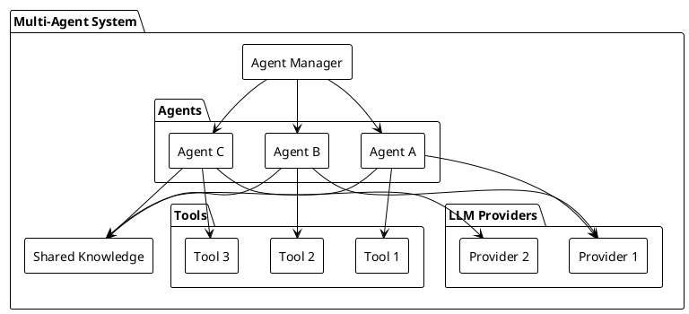
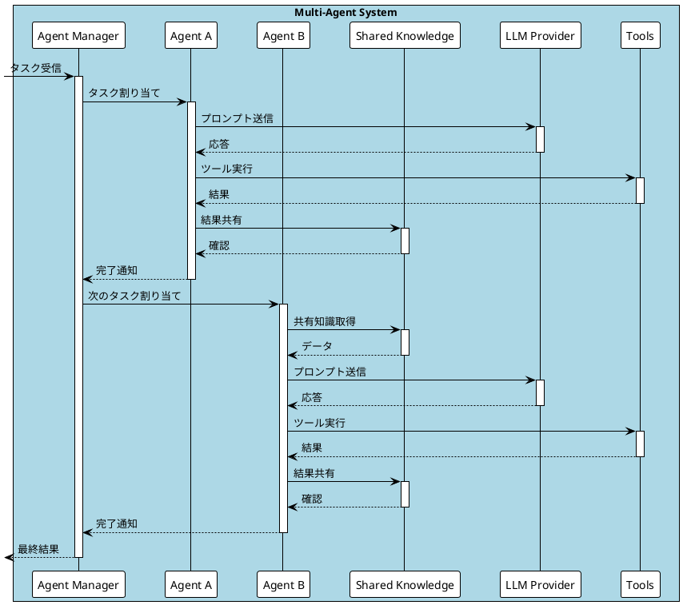
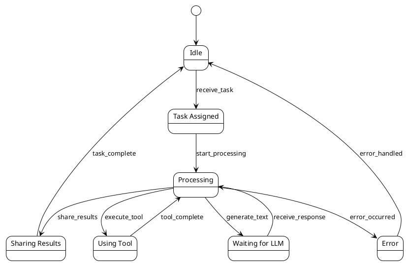

# マルチエージェントシステム (MAS)

このドキュメントでは、`agent.rs` と `graph.rs` を基盤としたマルチエージェントシステム (MAS) の設計と実装について説明します。このシステムでは、複数のエージェントが連携してタスクを遂行します。

## システムアーキテクチャ



## 実行フロー



## エージェントの状態遷移



## システムの概要

マルチエージェントシステムは、以下の特徴を持つ分散型のインテリジェントシステムです：

1. **自律性**: 各エージェントは独自の判断で行動できます
2. **協調性**: エージェント間で情報を共有し、協力してタスクを実行します
3. **専門性**: 各エージェントは特定の領域で専門的な能力を持ちます
4. **柔軟性**: システムの構成を動的に変更できます

## エージェント (`agent.rs`)

`agent.rs` は、エージェントの抽象化と基本的な実装を提供します。

### エージェントの特性

- **LLMプロバイダー**: エージェントは、テキスト生成のためにLLMプロバイダーを使用します。
- **ツール**: エージェントは、特定のタスクを実行するためのツールを保持します。
- **依存関係グラフ**: エージェントは、ツール間の依存関係を管理するためのグラフを持ちます。

### `Agent` トレイト

```rust
pub trait Agent: Tool + Send + Sync {
    fn system_prompt(&self) -> String;
    fn llm_provider(&self) -> Arc<dyn provider::LLMProvider>;
    fn tools(&self) -> Vec<&dyn Tool>;
    fn dependency_graph(&self) -> &DependencyGraph;

    async fn generate_text(&self, input: &str) -> Result<ChatOutput>;
    fn dependency_graph_json(&self) -> Result<String>;
    fn detailed_dependency_graph_json(&self) -> Result<String>;
}
```

### `AgentBase` 構造体

```rust
pub struct AgentBase {
    name: String,
    system_prompt: String,
    llm_provider: Arc<dyn provider::LLMProvider>,
    tools: HashMap<String, Box<dyn Tool>>,
    dependency_graph: DependencyGraph,
}
```

### `AgentBuilder` 構造体

```rust
pub struct AgentBuilder {
    name: String,
    system_prompt: String,
    llm_provider: Arc<dyn provider::LLMProvider>,
    tools: HashMap<String, Box<dyn Tool>>,
    dependency_graph: DependencyGraph,
}
```

## エージェント間の協調

エージェントは以下の方法で協調します：

1. **直接通信**: エージェント間で直接メッセージを交換
2. **共有メモリ**: 共有データストアを介した情報共有
3. **イベント駆動**: イベントの発行と購読による非同期通信

例：
```rust
let shared_knowledge = Arc::new(SharedKnowledge::new());

let agent_a = CooperativeAgent::new(
    "AgentA".to_string(),
    provider.clone(),
    shared_knowledge.clone(),
);

let agent_b = CooperativeAgent::new(
    "AgentB".to_string(),
    provider.clone(),
    shared_knowledge.clone(),
);

let agent_c = CooperativeAgent::new(
    "AgentC".to_string(),
    provider.clone(),
    shared_knowledge.clone(),
);

// 並行して処理を実行
let (result_a, result_b, result_c) = tokio::join!(
    agent_a.process_and_share("Task for A"),
    agent_b.process_and_share("Task for B"),
    agent_c.process_and_share("Task for C")
);
```

## システムの利点と課題

### 利点
- **並列処理**: 複数のエージェントが同時にタスクを実行できます
- **耐障害性**: 一部のエージェントが失敗しても、システム全体は機能し続けます
- **スケーラビリティ**: 必要に応じてエージェントを追加・削除できます
- **専門性の活用**: 各エージェントが得意分野に特化できます

### 課題
- **調整オーバーヘッド**: エージェント間の通信と調整にコストがかかります
- **一貫性の維持**: 分散システムにおける状態の一貫性を保つ必要があります
- **デバッグの複雑さ**: 並行処理による問題の特定が難しくなります

## 今後の展望

1. **自己学習機能の強化**
   - エージェントの行動パターンの最適化
   - 新しいツールの自動統合

2. **セキュリティの向上**
   - エージェント間通信の暗号化
   - アクセス制御の強化

3. **モニタリングの改善**
   - システム状態の可視化
   - パフォーマ��ス指標の追跡

具体的なユースケースについては、`graph.md`を参照してください。
