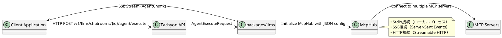

# Tachyon API - MCP統合仕様

Tachyon APIは、Model Context Protocol (MCP) サーバーを統合的に管理・利用するためのHTTP APIを提供します。クライアントは動的にMCP設定を提供し、エージェントがMCPツールを活用してタスクを実行できます。

## アーキテクチャ概要



## API エンドポイント

### エージェント実行エンドポイント

**エンドポイント:** `POST /v1/llms/chatrooms/{chatroom_id}/agent/execute`

**説明:** MCPツールを利用可能なエージェントを実行し、SSEストリームでリアルタイム結果を返します。

#### リクエスト仕様

**ヘッダー:**
```http
Content-Type: application/json
Accept: text/event-stream
Authorization: Bearer <token>
x-tenant-id: <tenant_id>
x-user-id: <user_id>
```

**リクエストボディ (`AgentExecuteRequest`):**
```json
{
  "task": "GitHubからコードを取得して、バグを修正してください",
  "user_custom_instructions": "日本語でコメントを追加してください",
  "assistant_name": "プログラミングアシスタント",
  "additional_tool_description": "特別なGitHub操作ツールが利用可能です",
  "auto_approve": false,
  "max_requests": 20,
  "model": "claude-sonnet-4-5-20250929",
  "mcp_hub_config_json": "{\"mcp_servers\":{\"git\":{\"command\":\"uvx\",\"args\":[\"mcp-server-git\",\"--repository\",\".\"],\"timeout\":45}}}"
}
```

**パラメータ詳細:**

| フィールド | 型 | 必須 | 説明 |
|-----------|----|----|------|
| `task` | string | ✅ | エージェントが実行するタスクの説明 |
| `user_custom_instructions` | string | ❌ | ユーザーからの追加指示 |
| `assistant_name` | string | ❌ | エージェントの名前（システムプロンプトに使用） |
| `additional_tool_description` | string | ❌ | 利用可能なツールの追加説明 |
| `auto_approve` | boolean | ❌ | `ask`イベントの自動承認（デフォルト: false） |
| `max_requests` | number | ❌ | 最大リクエスト数（デフォルト: 10） |
| `model` | string | ❌ | 使用するLLMモデル |
| `mcp_hub_config_json` | string | ❌ | MCP設定のJSON文字列 |

## MCP設定仕様

### JSON設定フォーマット

```json
{
  "mcp_servers": {
    "サーバー名": <McpServerConfig>
  }
}
```

### McpServerConfig構造

**Stdio接続（ローカルプロセス）:**
```json
{
  "command": "python",
  "args": ["server.py", "--port", "8080"],
  "env": {
    "PYTHONPATH": "/path/to/modules",
    "API_KEY": "secret"
  },
  "always_allow": ["safe_tool", "read_only_tool"],
  "disabled": false,
  "timeout": 30
}
```

**Remote接続（SSE/HTTP）:**
```json
{
  "url": "https://api.example.com/mcp",
  "transport": "sse",
  "headers": {
    "Authorization": "Bearer your-token",
    "X-Custom-Header": "value"
  },
  "always_allow": ["web_search", "data_fetch"],
  "disabled": false,
  "timeout": 60
}
```

### 設定パラメータ詳細

#### 共通パラメータ
| フィールド | 型 | 必須 | デフォルト | 説明 |
|-----------|----|----|----------|------|
| `always_allow` | string[] | ❌ | `[]` | 常に許可するツール名のリスト |
| `disabled` | boolean | ❌ | `false` | サーバーの無効化フラグ |
| `enabled` | boolean | ❌ | `true` | サーバーの有効化フラグ |
| `timeout` | number | ❌ | `30` | タイムアウト時間（秒） |

#### Stdio接続パラメータ
| フィールド | 型 | 必須 | 説明 |
|-----------|----|----|------|
| `command` | string | ✅ | 実行するコマンド |
| `args` | string[] | ❌ | コマンドライン引数 |
| `env` | object | ❌ | 環境変数のキー・バリューペア |

#### Remote接続パラメータ
| フィールド | 型 | 必須 | デフォルト | 説明 |
|-----------|----|----|----------|------|
| `url` | string | ✅ | - | MCPサーバーのURL |
| `transport` | "sse"\\|"http" | ❌ | "sse" | トランスポート方式 |
| `headers` | object | ❌ | `{}` | HTTPヘッダー |

## レスポンス仕様

### SSEストリーム形式

レスポンスはServer-Sent Events (SSE) 形式で、以下のイベントタイプを含みます：

```
data: {"type": "tool_call", "data": {...}}

data: {"type": "tool_result", "data": {...}}

data: {"type": "say", "data": {...}}

data: [DONE]
```

### AgentChunkイベント型

#### 1. tool_call - ツール呼び出し開始
```json
{
  "type": "tool_call",
  "data": {
    "id": "call_123",
    "name": "git_commit",
    "server_name": "git"
  }
}
```

#### 2. tool_call_args - ツール引数
```json
{
  "type": "tool_call_args",
  "data": {
    "id": "call_123",
    "arguments": "{\"message\": \"Fix bug in parser\"}"
  }
}
```

#### 3. tool_result - ツール実行結果
```json
{
  "type": "tool_result",
  "data": {
    "id": "call_123",
    "result": "[git] Committed successfully: abc123"
  }
}
```

#### 4. thinking - エージェントの思考
```json
{
  "type": "thinking",
  "data": {
    "content": "ファイルの変更を確認して、適切なコミットメッセージを考えています..."
  }
}
```

#### 5. say - エージェントの発言
```json
{
  "type": "say",
  "data": {
    "content": "バグを修正しました。変更内容をコミットしました。"
  }
}
```

#### 6. ask - ユーザーへの質問
```json
{
  "type": "ask",
  "data": {
    "content": "この変更をプッシュしますか？ (y/n)"
  }
}
```

#### 7. attempt_completion - タスク完了
```json
{
  "type": "attempt_completion",
  "data": {
    "content": "タスクが完了しました。バグを修正し、変更をコミットしました。"
  }
}
```

## MCP設定例

### 1. 基本的なGit操作
```json
{
  "mcp_servers": {
    "git": {
      "command": "uvx",
      "args": ["mcp-server-git", "--repository", "."],
      "timeout": 45,
      "disabled": false
    }
  }
}
```

### 2. Web検索とファイルシステム
```json
{
  "mcp_servers": {
    "brave_search": {
      "url": "https://api.brave.com/mcp",
      "transport": "sse",
      "headers": {
        "Authorization": "Bearer brave-api-key"
      },
      "timeout": 30
    },
    "filesystem": {
      "command": "npx",
      "args": ["@modelcontextprotocol/server-filesystem", "/workspace"],
      "timeout": 15
    }
  }
}
```

### 3. 複数のリモートサーバー
```json
{
  "mcp_servers": {
    "github": {
      "url": "https://api.github.com/mcp",
      "transport": "sse",
      "headers": {
        "Authorization": "Bearer github-token"
      }
    },
    "slack": {
      "url": "http://localhost:3000/mcp",
      "transport": "http",
      "headers": {
        "X-API-Key": "slack-api-key"
      }
    },
    "database": {
      "url": "https://db.example.com/mcp/sse",
      "transport": "sse",
      "timeout": 120
    }
  }
}
```

## エラーハンドリング

### HTTPエラーレスポンス

**認証エラー (401):**
```json
{
  "error": "Unauthorized",
  "message": "Valid authorization token required"
}
```

**バリデーションエラー (400):**
```json
{
  "error": "Bad Request",
  "message": "Invalid MCP configuration: missing required field 'command'"
}
```

**内部サーバーエラー (500):**
```json
{
  "error": "Internal Server Error",
  "message": "Failed to initialize MCP hub"
}
```

### SSEエラーイベント

```json
{
  "type": "error",
  "data": {
    "message": "MCP server 'git' connection failed: timeout",
    "server_name": "git",
    "error_code": "CONNECTION_TIMEOUT"
  }
}
```

## 実装詳細

### McpHub初期化フロー

1. **設定パース**: `mcp_hub_config_json`からJSON設定を解析
2. **サーバー検証**: 各サーバー設定のバリデーション
3. **接続確立**: 並列でMCPサーバーに接続
4. **ツール取得**: 各サーバーから利用可能ツールを取得
5. **ハブ準備完了**: CommandStackで利用可能に

### CommandStackでのMCP統合

```rust
// MCPツール呼び出しの内部実装
async fn use_mcp_tool(
    tool_name: &str, 
    arguments: Option<Value>
) -> Result<String> {
    let mcp_hub = get_mcp_hub().await?;
    
    // サーバー名とツール名を分離
    let (server_name, tool) = parse_tool_name(tool_name)?;
    
    // ツール実行
    let result = mcp_hub.call_tool(server_name, tool, arguments).await?;
    
    Ok(result)
}
```

### タイムアウト管理

- **リクエストレベル**: 全体で10分のタイムアウト
- **MCPサーバーレベル**: 個別のタイムアウト設定
- **ツールレベル**: ツール実行ごとのタイムアウト

### セキュリティ考慮事項

1. **認証・認可**
   - Bearer token必須
   - テナント分離（x-tenant-id）
   - ユーザー識別（x-user-id）

2. **MCP設定の検証**
   - URLのホワイトリスト制御
   - コマンド実行の制限
   - 環境変数の検証

3. **リソース制限**
   - 最大同時接続数の制限
   - メモリ使用量の監視
   - CPU使用率の制御

## 利用例

### cURL使用例

```bash
curl -N \
  -H "Content-Type: application/json" \
  -H "Accept: text/event-stream" \
  -H "Authorization: Bearer your-token" \
  -H "x-tenant-id: tenant_123" \
  -d '{
    "task": "現在のリポジトリの状態を確認して、未コミットの変更があれば適切にコミットしてください",
    "auto_approve": false,
    "max_requests": 15,
    "mcp_hub_config_json": "{\"mcp_servers\":{\"git\":{\"command\":\"uvx\",\"args\":[\"mcp-server-git\",\"--repository\",\".\"],\"timeout\":45}}}"
  }' \
  https://api.tachyon.com/v1/llms/chatrooms/room_123/agent/execute
```

### JavaScript使用例

```javascript
const eventSource = new EventSource('/v1/llms/chatrooms/room_123/agent/execute', {
  method: 'POST',
  headers: {
    'Content-Type': 'application/json',
    'Authorization': 'Bearer your-token',
    'x-tenant-id': 'tenant_123'
  },
  body: JSON.stringify({
    task: 'GitHubから最新のissueを取得して分析してください',
    mcp_hub_config_json: JSON.stringify({
      mcp_servers: {
        github: {
          url: 'https://api.github.com/mcp',
          transport: 'sse',
          headers: {
            'Authorization': 'Bearer github-token'
          }
        }
      }
    })
  })
});

eventSource.onmessage = (event) => {
  if (event.data === '[DONE]') {
    eventSource.close();
    return;
  }
  
  const chunk = JSON.parse(event.data);
  console.log('Received:', chunk.type, chunk.data);
};
```

## トラブルシューティング

### よくある問題

1. **MCP設定エラー**
   ```
   Invalid MCP configuration: missing required field 'command'
   ```
   → Stdio設定で`command`フィールドが必須です

2. **接続タイムアウト**
   ```
   MCP server 'remote' connection failed: timeout
   ```
   → `timeout`値を増やすか、サーバーの応答性を確認してください

3. **認証エラー**
   ```
   MCP server returned 401: Unauthorized
   ```
   → `headers`の認証情報を確認してください

### デバッグ情報

サーバーログでMCP関連の詳細情報を確認できます：

```rust
// ログレベルをDEBUGに設定
RUST_LOG=debug cargo run

// MCPハブの状態確認
let servers = mcp_hub.get_servers().await;
for server in servers {
    tracing::debug!("Server: {} - Status: {:?}", server.name, server.status);
}
```

## 関連ドキュメント

- [MCP Transport Support - SSE and Streamable HTTP](./mcp-transport-support.md)
- [MCP Implementation Guide](../../mcp-implementation.md)
- [CommandStack Example](../../mcp-command-stack-example.md)