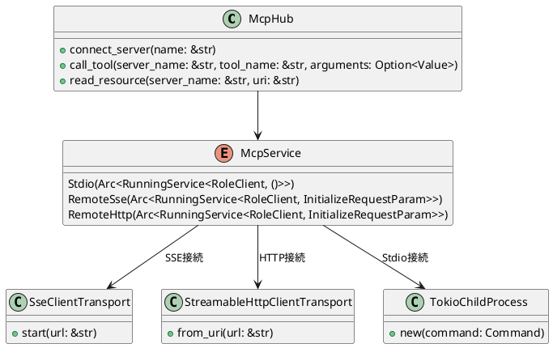

# MCP Transport Support - SSE and Streamable HTTP

McpHubは、Model Context Protocol (MCP) サーバーとの通信において、複数のトランスポート方式をサポートしています。

## サポートしているトランスポート

### 1. Stdio接続
ローカルプロセスとの標準入出力を使用した通信方式です。

**特徴:**
- ローカルプロセスとの直接通信
- 低レイテンシ
- プロセス管理が必要

**設定例:**
```json
{
  "mcp_servers": {
    "local_server": {
      "command": "python",
      "args": ["server.py"],
      "env": {
        "PYTHONPATH": "/path/to/modules"
      },
      "timeout": 30,
      "disabled": false
    }
  }
}
```

### 2. SSE接続 (Server-Sent Events)
リモートサーバーとのServer-Sent Eventsを使用した通信方式です。

**特徴:**
- リアルタイム通信
- HTTP/2対応
- ファイアウォール通過が容易
- **デフォルトのトランスポート方式**

**設定例:**
```json
{
  "mcp_servers": {
    "remote_sse_server": {
      "url": "https://example.com/mcp/sse",
      "transport": "sse",
      "timeout": 30,
      "disabled": false,
      "headers": {
        "Authorization": "Bearer token123"
      }
    }
  }
}
```

### 3. Streamable HTTP接続
リモートサーバーとのStreamable HTTPを使用した通信方式です。

**特徴:**
- HTTP/1.1ベース
- シンプルな実装
- 既存のHTTPインフラとの互換性

**設定例:**
```json
{
  "mcp_servers": {
    "remote_http_server": {
      "url": "http://localhost:8000",
      "transport": "http",
      "timeout": 30,
      "disabled": false
    }
  }
}
```

## 設定仕様

### RemoteConfig構造体

```rust
#[derive(Debug, Clone, Serialize, Deserialize, Default)]
pub struct RemoteConfig {
    pub url: String,                              // 必須: サーバーURL
    #[serde(default)]
    pub transport: RemoteTransportType,           // オプション: トランスポート種別（デフォルト: SSE）
    pub headers: Option<HashMap<String, String>>, // オプション: HTTPヘッダー
    pub always_allow: Option<Vec<String>>,        // オプション: 常に許可するツール
    pub disabled: Option<bool>,                   // オプション: サーバー無効化フラグ
    pub enabled: Option<bool>,                    // オプション: サーバー有効化フラグ
    pub timeout: Option<u32>,                     // オプション: タイムアウト（秒）
}
```

### RemoteTransportType列挙型

```rust
#[derive(Debug, Clone, Serialize, Deserialize)]
pub enum RemoteTransportType {
    #[serde(rename = "sse")]
    Sse,    // Server-Sent Events
    #[serde(rename = "http")]
    Http,   // Streamable HTTP
}

impl Default for RemoteTransportType {
    fn default() -> Self {
        RemoteTransportType::Sse  // デフォルトはSSE
    }
}
```

## 実装詳細

### アーキテクチャ



### 接続フロー

1. **設定読み込み**: JSON設定ファイルから接続情報を読み込み
2. **トランスポート選択**: `transport`フィールドに基づいてトランスポート方式を決定
3. **クライアント作成**: 選択されたトランスポートでクライアントを作成
4. **サービス開始**: `ClientInfo`を使用してサービスを開始
5. **ツール取得**: `list_all_tools()`でサーバーの利用可能ツールを取得

### エラーハンドリング

- **接続失敗**: サーバーステータスを`Disconnected`に設定し、エラー情報を保存
- **タイムアウト**: 設定されたタイムアウト値でリクエストを制限
- **無効なサーバー**: `disabled: true`のサーバーは接続をスキップ

## 使用例

### 複数トランスポートの混在設定

```json
{
  "mcp_servers": {
    "local_python_server": {
      "command": "python",
      "args": ["mcp_server.py"],
      "timeout": 30,
      "disabled": false
    },
    "remote_sse_server": {
      "url": "https://api.example.com/mcp/sse",
      "transport": "sse",
      "timeout": 60,
      "disabled": false,
      "headers": {
        "Authorization": "Bearer your-token"
      }
    },
    "remote_http_server": {
      "url": "http://localhost:8000",
      "transport": "http",
      "timeout": 30,
      "disabled": false
    },
    "default_transport_server": {
      "url": "https://mcp.example.com/endpoint",
      "timeout": 45,
      "disabled": false
    }
  }
}
```

### プログラムでの使用

```rust
use llms::usecase::command_stack::mcp::McpHub;
use std::path::PathBuf;

#[tokio::main]
async fn main() -> anyhow::Result<()> {
    // McpHubの初期化
    let workspace_path = PathBuf::from("./workspace");
    let settings_path = PathBuf::from("./mcp_config.json");
    
    let mcp_hub = McpHub::new(workspace_path, Some(settings_path)).await?;
    
    // 全サーバーに接続
    mcp_hub.connect_all_servers().await?;
    
    // ツール呼び出し
    let result = mcp_hub.call_tool(
        "remote_sse_server",
        "search",
        Some(serde_json::json!({
            "query": "rust programming"
        }))
    ).await?;
    
    println!("Result: {:?}", result);
    
    Ok(())
}
```

## 参考実装

- **SSE実装**: [rust-sdk/examples/clients/src/sse.rs](https://github.com/modelcontextprotocol/rust-sdk/blob/main/examples/clients/src/sse.rs)
- **HTTP実装**: [rust-sdk/examples/clients/src/streamable_http.rs](https://github.com/modelcontextprotocol/rust-sdk/blob/main/examples/clients/src/streamable_http.rs)

## 制限事項

- **同時接続数**: 設定されたサーバー数に依存
- **タイムアウト**: サーバーごとに個別設定可能
- **認証**: HTTPヘッダーベースの認証のみサポート
- **プロトコルバージョン**: MCP 1.0準拠

## トラブルシューティング

### よくある問題

1. **接続失敗**
   - URLの確認
   - ネットワーク接続の確認
   - サーバーの起動状態確認

2. **タイムアウト**
   - `timeout`値の調整
   - サーバーの応答時間確認

3. **認証エラー**
   - `headers`の`Authorization`設定確認
   - トークンの有効性確認

### ログ確認

```rust
// ログの有効化
telemetry::init_simple_tracing();

// デバッグログでの接続状況確認
let servers = mcp_hub.get_servers().await;
for server in servers {
    println!("Server: {} - Status: {:?}", server.name, server.status);
    if let Some(error) = &server.error {
        println!("Error: {}", error);
    }
}
