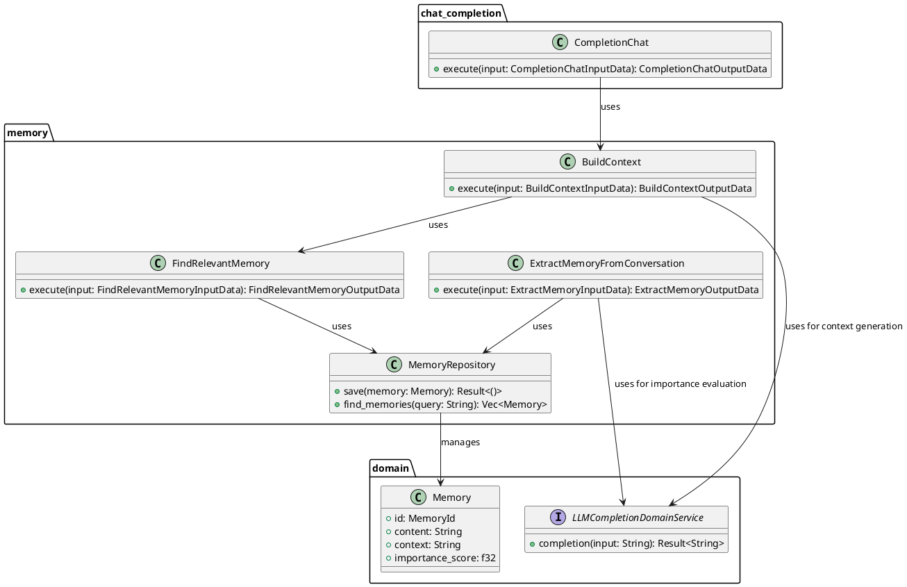
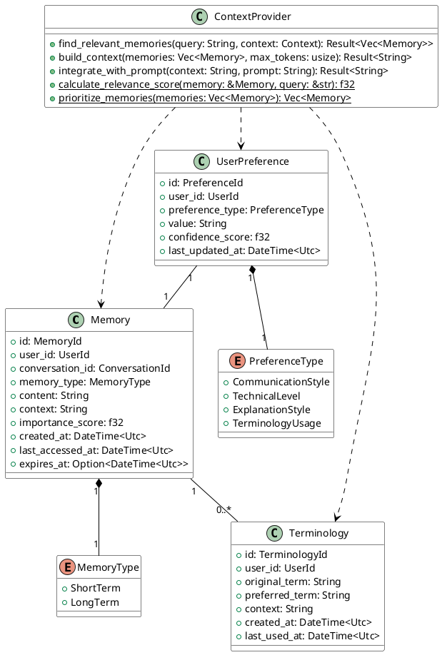
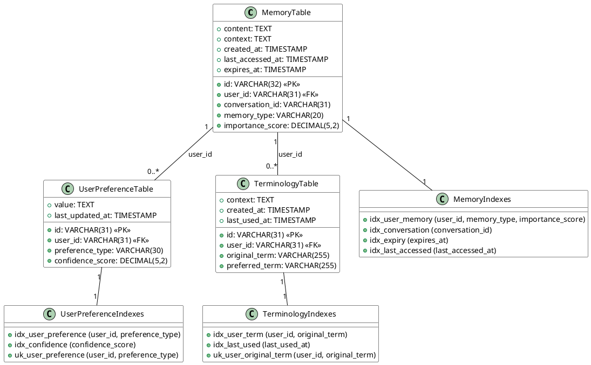

---

title: "llms memory"
emoji: ""
type: "tech"
topics: []
published: true
targetFiles: ["packages/llms", "packages/llms/domain", "packages/llms/provider"]
github: "https://github.com/quantum-box/tachyon-apps/blob/main/docs/src/tachyon-apps/llms/memory.md"

---

# Memory

### 目的
- チーザーとの会話スタイルのパーソナライズ化
- ユーザー固有の用語や文脈の理解
- 一貫性のある会話体験の提供
- ユーザーとの会話から重要な情報を抽出し、将来の会話で活用

### シチュエーション例

- ユーザーが特定のプロジェクトやチームについて相談した場合、そのプロジェクトやチームに関する情報を記憶に追加
- その後他のチャットでその情報を使用して回答する

### 機能要件

1. **ユーザー固有の情報管理**
   - 呼び方や略称の記憶（例: プロジェクト名、チーム名）
   - 技術用語の使い方（例: 社内独自の用語）
   - コミュニケーションスタイルの傾向

2. **会話スタイルの適応**
   - ユーザーの専門性レベルに応じた説明の調整
   - 好みの説明方法の記憶（例: コード例重視、図解重視）
   - 使用言語やフレームワークの優先順位

3. **文脈の継続性維持**
   - 進行中のプロジェクトの状態追跡
   - 過去の技術選定や設計判断の背景
   - 未解決の課題や保留事項の管理

4. **インタラクションの最適化**
   - 説明の詳細度の自動調整
   - エラーメッセージやデバッグ情報の表示レベル
   - コードスニペットのスタイル設定

### 非機能要件

tachyonの標準要件を満たすこと。

### 制約事項
- 1つの記憶あたりの最大サイズ: 4KB
- プロンプトへの注入コンテキスト: 最大2000トークン
- 記憶検索の最大結果数: 100件
- バッチ処理の実行時間: 深夜1-5時

### 前提条件
- TiDBによるデータ永続化
- ベクトルデータベースによる類似性検索
- 非同期処理によるバッチ実行
- OpenAI APIによるテキスト解析

### 利用シナリオ例

1. **プロジェクト固有の用語理解**
   ```text
   User: "Auth基盤のPoCについて相談したい"
   Assistant: "はい、先週議論した認証基盤のProof of Conceptについて、続きを..."
   ```
   - 記憶: "ユーザーは'Auth基盤'を認証基盤の略称として使用"

2. **説明レベルの適応**
   ```text
   User: "Rustのライフタイムについて詳しく知りたい"
   Assistant: "所有権とライフタイムについて、まずは基本的な..."
   User: "いや、もっと高度な話を"
   ```
   - 記憶: "ユーザーはRustの上級者、基礎的な説明は不要"

3. **プロジェクト文脈の維持**
   ```text
   User: "フロントエンドのパフォーマンス改善について"
   Assistant: "先月議論したNext.jsのISRの導入は、この文脈で..."
   ```
   - 記憶: "進行中のパフォーマンス改善タスク: ISR導入検討中"

## chat_completion統合

### 統合アーキテクチャ



### 統合フロー

1. ユーザー入力を受け取る
2. ユーザーの認可をチェック
3. BuildContextを使用して関連するメモリとユーザー設定を取得
4. 取得したコンテキストをプロンプトに統合
5. ユーザー設定に基づいてプロンプトをカスタマイズ
6. カスタマイズされたプロンプトを使用してLLMで応答生成
7. 使用状況を記録
8. 生成された応答をユーザーに返す

### 統合ポイント

- **コンテキスト注入**: 関連するメモリを自動的にプロンプトに注入
- **パーソナライゼーション**: ユーザー設定に基づいて応答スタイルを調整
- **会話管理**: 会話履歴を自動的に追跡・更新
- **使用状況記録**: トークン使用量などの統計情報を記録

### 実装済み機能

1. **ユーザー設定の反映**
   - コミュニケーションスタイル（フォーマル、カジュアル、技術的）
   - 技術レベル（初級、中級、上級）
   - 説明スタイル（コード重視、図解重視、概念重視）

2. **コンテキスト管理**
   - 関連メモリの検索と統合
   - コンテキストの重要度に基づく優先順位付け
   - トークン制限を考慮したコンテキスト最適化

3. **使用状況の追跡**
   - プロンプトトークン数
   - 応答トークン数
   - 合計トークン数
   - 使用時刻

## ドメインモデル



### エンティティ

#### Memory（記憶）
- 目的: ユーザーとの会話から抽出された重要な情報を保持
- 特徴:
  - 一意のIDで識別
  - ユーザーと会話に紐付け
  - 短期/長期の区別
  - コンテキスト情報の保持
  - 重要度による優先順位付け
- 責務:
  - 会話コンテキストの保持
  - 重要情報の構造化
  - 時間経過による情報の劣化表現

#### UserPreference（ユーザー設定）
- 目的: ユーザーの好みや傾向を記録
- 特徴:
  - コミュニケーションスタイル
  - 技術レベル
  - 説明方法の好み
  - 用語使用の傾向
- 責務:
  - パーソナライズ化の基準提供
  - ユーザー体験の一貫性確保
  - 適応的な応答の支援

#### Terminology（用語）
- 目的: ユーザー固有の用語や略称を管理
- 特徴:
  - オリジナルの用語と好みの表現の対応
  - 使用コンテキストの記録
  - 使用頻度の追跡
- 責務:
  - 用語の一貫性確保
  - コミュニケーションの効率化
  - 文脈に応じた適切な用語選択

#### Memory（記憶）とUserPreference（ユーザー設定）の違い

Memory と UserPreference は以下の点で異なります：

1. **時間的特性**
   - Memory: 特定の会話や出来事に紐づく具体的な情報（例: "先週のミーティングでJWTを採用することに決定"）
   - UserPreference: 時間に依存しない一般的な傾向や好み（例: "技術的な説明は常に詳細なものを好む"）

2. **更新頻度**
   - Memory: 会話ごとに新しい記憶が作成され、有効期限により管理
   - UserPreference: 長期的な観察から徐々に構築され、確信度に応じて更新

3. **使用目的**
   - Memory: 具体的な文脈の再現や過去の決定事項の参照
   - UserPreference: 応答スタイルのカスタマイズやコミュニケーション方法の最適化

4. **データ構造**
   - Memory: 具体的な内容（content）とその文脈（context）を持つ
   - UserPreference: 設定の種類（preference_type）と値（value）の組み合わせ

### ドメインサービス

#### ContextProvider
- 目的: 会話コンテキストの最適化と提供
- 主要機能:
  - 関連記憶の検索と優先順位付け
  - コンテキストの構築と最適化
  - プロンプトへの統合
- 最適化戦略:
  - キャッシュの活用
  - ベクトル検索の利用
  - トークン数の動的調整
- 品質管理:
  - コンテキストの一貫性確保
  - 重要情報の優先的な含有
  - ノイズの除去

### データベース設計



#### テーブル設計の特徴

1. **memories**
   - 会話から抽出された具体的な情報を保存
   - `context`カラムで関連する文脈情報を保持
   - `importance_score`による優先順位付け
   - `expires_at`による有効期限管理
   - 適切なインデックスによる検索最適化

2. **user_preferences**
   - ユーザーの一般的な傾向や好みを管理
   - ENUMによる`preference_type`の制限
   - `confidence_score`による確信度の管理
   - ユーザーごとに各設定タイプは1つのみ
   - 更新頻度を考慮したインデックス設計

3. **terminologies**
   - ユーザー固有の用語マッピングを管理
   - オリジナルの用語と好みの表現を紐付け
   - `context`による使用文脈の記録
   - `last_used_at`による使用頻度の追跡
   - ユーザーごとの用語の一意性を保証

#### インデックス戦略

1. **検索パフォーマンスの最適化**
   - 頻繁に使用される検索条件に対するインデックス
   - 複合インデックスによる効率的なフィルタリング
   - 有効期限や最終アクセス日時による絞り込みの最適化

2. **一意性制約**
   - ユーザーごとの設定の重複を防止
   - 用語の一意性を保証
   - データの整合性を確保

3. **更新頻度への考慮**
   - 更新頻度の高いカラムのインデックスを最小限に
   - 読み取り最適化と書き込みオーバーヘッドのバランス

## ユースケース詳細

### 1. FindRelevantMemory
- **目的**: 現在の会話に関連する過去のメモリを検索する
- **入力**:
  ```rust
  pub struct FindRelevantMemoryInputData<'a> {
      pub tenant_id: TenantId,
      pub user_id: UserId,
      pub query: String,      // 現在の会話内容
      pub context: String,    // 現在の文脈
      pub min_relevance_score: Option<f32>,  // 最小関連性スコア（デフォルト: 0.5）
      pub max_results: Option<usize>,        // 最大結果数
  }
  ```
- **出力**:
  ```rust
  pub struct FindRelevantMemoryOutputData {
      pub relevant_memories: Vec<MemoryWithRelevance>,  // 関連性スコア付きメモリ
  }
  ```
- **処理フロー**:
  1. ユーザーの全メモリを取得
  2. LLMを使用して各メモリの関連性をスコアリング
  3. 最小スコアでフィルタリング
  4. スコアの降順でソート
  5. 最大結果数で制限

### 2. BuildContext
- **目的**: 関連メモリを使用して現在の会話のコンテキストを構築する
- **入力**:
  ```rust
  pub struct BuildContextInputData {
      pub tenant_id: TenantId,
      pub user_id: UserId,
      pub current_input: String,  // 現在のユーザー入力
      pub max_memories: Option<usize>,
      pub min_relevance_score: Option<f32>,
  }
  ```
- **出力**:
  ```rust
  pub struct BuildContextOutputData {
      pub context: String,            // 構築されたコンテキスト
      pub source_memories: Vec<Memory> // 使用されたメモリ
  }
  ```
- **処理フロー**:
  1. FindRelevantMemoryを使用して関連メモリを検索
  2. 関連メモリから重要な情報を抽出
  3. コンテキストとして自然な形に統合

### 3. IntegratePrompt
- **目的**: 構築したコンテキストをベースプロンプトと統合する
- **入力**:
  ```rust
  pub struct IntegratePromptInputData {
      pub tenant_id: TenantId,
      pub user_id: UserId,
      pub base_prompt: String,    // 基本プロンプト
      pub current_input: String,  // 現在の入力
      pub max_memories: Option<usize>,
      pub min_relevance_score: Option<f32>,
  }
  ```
- **出力**:
  ```rust
  pub struct IntegratePromptOutputData {
      pub integrated_prompt: String,   // 統合されたプロンプト
      pub source_memories: Vec<Memory> // 使用されたメモリ
  }
  ```
- **処理フロー**:
  1. BuildContextを使用してコンテキストを構築
  2. ベースプロンプトとコンテキストを統合
  3. 現在の入力に関連する情報を追加

### 4. ExtractMemoryFromConversation
- **目的**: 会話から重要な情報を抽出してメモリとして保存
- **入力**:
  ```rust
  pub struct ExtractMemoryInputData {
      pub tenant_id: TenantId,
      pub user_id: UserId,
      pub conversation: String,   // 会話内容
      pub context: String,        // 会話の文脈
  }
  ```
- **出力**:
  ```rust
  pub struct ExtractMemoryOutputData {
      pub memory: Memory,         // 抽出されたメモリ
      pub importance_score: f32   // 重要度スコア
  }
  ```
- **処理フロー**:
  1. LLMを使用して会話から重要な情報を抽出
  2. 情報の重要度を評価
  3. メモリとして適切な形式に変換
  4. リポジトリに保存

### 5. SaveUserPreference
- **目的**: ユーザーの設定や好みを保存
- **入力**:
  ```rust
  pub struct SaveUserPreferenceInputData {
      pub tenant_id: TenantId,
      pub user_id: UserId,
      pub preference_type: PreferenceType,
      pub value: String,
      pub confidence_score: f32,
  }
  ```
- **出力**:
  ```rust
  pub struct SaveUserPreferenceOutputData {
      pub preference: UserPreference
  }
  ```
- **処理フロー**:
  1. 既存の設定を確認
  2. 新しい設定を保存または更新
  3. 確信度スコアを更新

## 実装計画とリリーススケジュール

### 1. リリース計画

#### Release 1.0 (MVP) - ✅ DONE
- **目的**: 基本的な記憶管理とパーソナライゼーション
- **主要機能**:
  - ✅ 会話からの記憶抽出と保存
    - ✅ `ExtractMemoryFromConversation`
    - ✅ `CreateMemory`
  - ✅ 基本的なユーザー設定管理
    - ✅ `SaveUserPreference`
    - ✅ `GetUserPreference`
  - ✅ シンプルなコンテキスト検索
    - ✅ `FindMemory`
    - ✅ `FindRelevantMemory`
  - ✅ 最適化機能
    - ✅ `ScoreImportance`
  - ✅ GraphQL API
    - ✅ スキーマ定義
      - ✅ 基本型: `Memory`, `MemoryType`, `PageInfo`
      - ✅ 入力型: `PaginationInput`, `UpdateMemoryInput`
      - ✅ ページネーション型: `MemoryPage`
    - ✅ Query実装
      - ✅ `memories`: ページネーション付きメモリ一覧
      - ✅ `memory`: 単一メモリ取得
    - ✅ Mutation実装
      - ✅ `deleteMemory`: メモリ削除
      - ✅ `updateMemory`: メモリ更新
- **技術的範囲**:
  - ✅ 基本的なデータ構造とリポジトリ
  - ✅ シンプルなコンテキストプロバイダー
  - ✅ 基本的なデータベース操作

追加タスク
- ✅ `DeleteMemory`: メモリを削除する
   - 入力: `DeleteMemoryInputData` (executor, multi_tenancy, tenant_id, memory_id)
   - 出力: `()`
   - 処理: メモリの存在確認と削除
- ✅ `UpdateMemory`: メモリを更新する
   - 入力: `UpdateMemoryInputData` (executor, multi_tenancy, tenant_id, memory_id, memory_type, content, context, importance_score, expires_at)
   - 出力: `Memory`
   - 処理: メモリの存在確認と更新

#### Release 1.1 - 🔄 IN PROGRESS
- **目的**: コンテキスト管理の強化とchat_completion統合
- **主要機能**:
  - ✅ コンテキスト最適化
    - ✅ `BuildContext`
    - ✅ `IntegratePrompt`
  - ✅ chat_completion統合
    - ✅ completion_chat usecaseに統合する
    - ✅ メモリコンテキストの自動注入
    - ✅ ユーザー設定に基づく応答の最適化

#### Release 1.2 - 📝 TODO
- **目的**: chat_completionの高度なパーソナライゼーション
- **主要機能**:
  - 📝 ユーザー設定の拡張
    - 📝 コミュニケーションスタイルの学習
    - 📝 技術レベルの推定
    - 📝 説明方法の最適化
  - 📝 用語管理
    - 📝 用語の抽出と登録
    - 📝 コンテキストに応じた用語の選択
    - 📝 用語使用頻度の追跡

#### Release 1.3 - 📝 TODO
- **目的**: パフォーマンスと運用管理の最適化
- **主要機能**:
  - 📝 パフォーマンス改善
    - 📝 キャッシュ戦略の実装
    - 📝 検索パフォーマンスの最適化
  - 📝 メンテナンス機能
    - 📝 重要度の低い記憶の整理
    - 📝 有効期限切れデータの管理
    - 📝 データクリーンアップ
  - 📝 デバッグ・分析
    - 📝 ログ収集
    - 📝 使用状況の分析
    - 📝 品質メトリクスの収集
