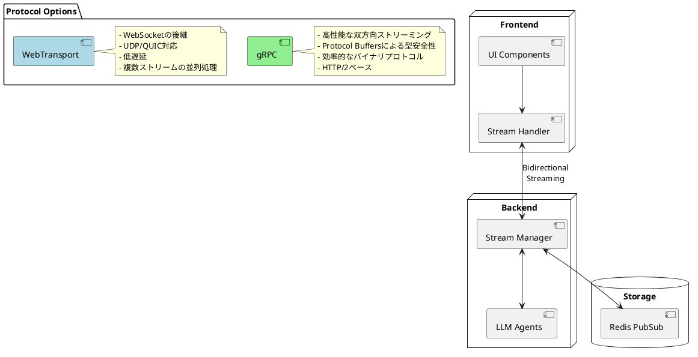

# Streaming

streamingでのllm agentの実装。処理は常にバックエンドで行う。
フロントエンドはstreamingでイベントを受け取り常に表示するだけ。

## システム概要

### アーキテクチャの特徴
- フロントエンド（UI）とバックエンド（LLMエージェント）の明確な分離
- 双方向通信プロトコルによる効率的な通信
- マルチエージェントアーキテクチャ

### 主要な特徴
- **リアルタイム処理**:
  - ユーザーのメッセージに対して即時的なレスポンス
  - ストリーミング形式でのデータ配信
  - 継続的な処理状態の更新

- **マルチエージェントシステム**:
  - 同期エージェント（メインエージェント、プランナー）
  - 非同期エージェント
  - エージェント間の依存関係管理

- **UI/UX**:
  - リアルタイムでのメッセージ表示
  - チャンクベースの表示更新
  - タイプとIDに基づいた適切なUIコンポーネントへの表示振り分け

### 通信プロトコル



### プロトコル定義（gRPC）

```protobuf
syntax = "proto3";

package tachyon.agent;

service AgentService {
  // 双方向ストリーミングRPC
  rpc ProcessConversation (stream ClientMessage) returns (stream ServerMessage) {}
}

message ClientMessage {
  string conversation_id = 1;
  oneof message {
    StartConversation start = 2;
    Command command = 3;
  }
}

message StartConversation {
  OperationType operation_type = 1;
  string initial_message = 2;
  map<string, string> metadata = 3;
}

message Command {
  CommandType type = 1;
  string content = 2;
  map<string, string> metadata = 3;
}

message ServerMessage {
  string conversation_id = 1;
  string chunk_id = 2;
  ChunkType type = 3;
  string content = 4;
  ChunkMetadata metadata = 5;
}

message ChunkMetadata {
  OperationType operation_type = 1;
  oneof details {
    DocumentMetadata document = 2;
    CalendarMetadata calendar = 3;
  }
}

enum OperationType {
  OPERATION_TYPE_UNSPECIFIED = 0;
  DOCUMENT_UPDATE = 1;
  CALENDAR_EVENT = 2;
  CODE_GENERATION = 3;
  DATA_ANALYSIS = 4;
}

enum ChunkType {
  CHUNK_TYPE_UNSPECIFIED = 0;
  THINKING = 1;
  MESSAGE = 2;
  CONFIRM_REQUEST = 3;
  PROGRESS = 4;
  COMPLETE = 5;
  ERROR = 6;
  TOOL_CALL = 7;
  TOOL_RESULT = 8;
}

enum CommandType {
  COMMAND_TYPE_UNSPECIFIED = 0;
  INTERRUPT = 1;
  MODIFY = 2;
  CANCEL = 3;
  ADD_CONTEXT = 4;
  CONFIRM = 5;
  REJECT = 6;
}

message DocumentMetadata {
  string document_id = 1;
  string version = 2;
  repeated DocumentChange changes = 3;
}

message DocumentChange {
  string path = 1;
  string old_content = 2;
  string new_content = 3;
}

message CalendarMetadata {
  string event_id = 1;
  string start_time = 2;
  string end_time = 3;
  string title = 4;
  string description = 5;
  repeated string attendees = 6;
}
```

## 実装上の注意点

### 双方向ストリーミング
- gRPCによる永続的な接続の管理
- バックエンドでのPubSubシステムの実装（例：Redis）
- エージェントからのストリームデータの適切なチャンク分割
- クライアントサイドでのチャンクの再構築とUI更新
- エラーハンドリングとリカバリー機能

### 追加指示の処理
- エージェントの状態管理
- 安全な中断ポイントの設定
- コマンドの優先順位付け
- 処理のロールバック機能
- 複数エージェント間の同期

### 考慮すべき技術的課題
- 長時間接続の管理
- 接続断時の再接続ロジック
- バックプレッシャーの制御
- メモリ使用量の最適化

// ... シチュエーション例は残す ...
