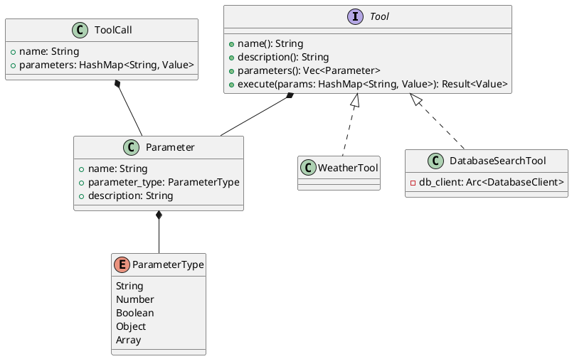

# Tool

ツール（Tool）は、エージェントが特定のタスクを実行するために使用する機能を定義するインターフェースです。

## 概要

ツールは以下の要素で構成されます：

- **名前**: ツールを識別するための一意の名前
- **説明**: ツールの機能を説明するテキスト
- **パラメータ**: ツールが受け付ける入力パラメータの定義
- **実行メソッド**: 実際の処理を行うメソッド

## パラメータの定義

```rust
pub struct Parameter {
    pub name: String,
    pub parameter_type: ParameterType,
    pub description: String,
}

pub enum ParameterType {
    String,
    Number,
    Boolean,
    Object(Vec<Parameter>),
    Array(Box<ParameterType>),
}
```

### パラメータの種類

- **String**: 文字列型のパラメータ
- **Number**: 数値型のパラメータ
- **Boolean**: 真偽値型のパラメータ
- **Object**: 複数のパラメータを持つオブジェクト型
- **Array**: 配列型のパラメータ

## ツールの実装例

### 1. 天気情報取得ツール

```rust
#[derive(Default)]
struct WeatherTool;

#[async_trait]
impl Tool for WeatherTool {
    fn name(&self) -> String {
        "weather".to_string()
    }

    fn description(&self) -> String {
        "Get weather information for a specified city.".to_string()
    }

    fn parameters(&self) -> Vec<Parameter> {
        vec![Parameter {
            name: "city".to_string(),
            parameter_type: ParameterType::String,
            description: "The name of the city".to_string(),
        }]
    }

    async fn execute(
        &self,
        params: HashMap<String, Value>,
    ) -> Result<Value> {
        let city = params
            .get("city")
            .and_then(|v| v.as_str())
            .ok_or_else(|| Error::invalid_argument("city is required"))?;
        
        // 天気情報を取得する処理
        Ok(json!({
            "city": city,
            "weather": "sunny",
            "temperature": 25
        }))
    }
}
```

### 2. データベース検索ツール

```rust
struct DatabaseSearchTool {
    db_client: Arc<DatabaseClient>,
}

#[async_trait]
impl Tool for DatabaseSearchTool {
    fn name(&self) -> String {
        "database_search".to_string()
    }

    fn description(&self) -> String {
        "Search records in the database".to_string()
    }

    fn parameters(&self) -> Vec<Parameter> {
        vec![
            Parameter {
                name: "query".to_string(),
                parameter_type: ParameterType::String,
                description: "Search query".to_string(),
            },
            Parameter {
                name: "limit".to_string(),
                parameter_type: ParameterType::Number,
                description: "Maximum number of results".to_string(),
            }
        ]
    }

    async fn execute(
        &self,
        params: HashMap<String, Value>,
    ) -> Result<Value> {
        // データベース検索の実装
        Ok(json!({ "results": [] }))
    }
}
```

## ツールの呼び出し

ツールは`ToolCall`構造体を通じて呼び出されます：

```rust
pub struct ToolCall {
    pub name: String,
    pub parameters: HashMap<String, Value>,
}
```

### 呼び出し例

```rust
let tool_call = ToolCall {
    name: "weather".to_string(),
    parameters: HashMap::from([
        ("city".to_string(), json!("Tokyo")),
    ]),
};
```

## アーキテクチャ



## テスト

ツールのテストは以下のように実装できます：

```rust
#[cfg(test)]
mod tests {
    use super::*;

    #[tokio::test]
    async fn test_weather_tool() -> Result<()> {
        let tool = WeatherTool::default();
        let params = HashMap::from([
            ("city".to_string(), json!("Tokyo")),
        ]);

        let result = tool.execute(params).await?;
        assert!(result.get("weather").is_some());
        assert!(result.get("temperature").is_some());
        
        Ok(())
    }
}
```

## ベストプラクティス

1. **明確な命名**: ツールの名前は機能を明確に表すものにする
2. **詳細な説明**: ツールの説明は具体的で分かりやすいものにする
3. **適切なパラメータ定義**: 必要最小限のパラメータを定義し、各パラメータの説明を詳細に記述する
4. **エラーハンドリング**: パラメータの検証やエラー処理を適切に実装する
5. **テストの充実**: 様々なケースをカバーするテストを実装する

## 注意点

- パラメータの型は適切に選択する
- 非同期処理は適切に実装する
- エラーは具体的なメッセージとともに返す
- 大きな処理は適切に分割する
- セキュリティに関する考慮を行う
