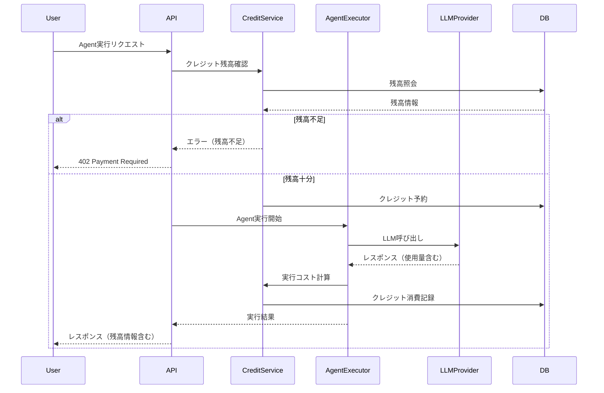

# LLM Agent API課金システム

## 概要

本ドキュメントは、Tachyon AppsにおけるLLM（Large Language Model）サービス、特にAgent APIの使用量測定と課金管理システムの設計と実装詳細をまとめたものです。クレジットチャージ式の使用量ベース課金を採用し、既存のコード資産を最大限に活用して効率的な課金システムを構築することを目的としています。

## 実装完了ステータス（2025/01/07）

### ✅ 完了済み

#### フェーズ1: クレジットシステム基盤
- PaymentAppインターフェース定義（`packages/tachyon_apps/src/payment/mod.rs`）
- ドメインモデル実装:
  - CreditBalance（クレジット残高管理）
  - CreditTransaction（取引履歴）
  - BillingPolicy（課金ポリシー）
- リポジトリ実装（SQLx）:
  - SqlxCreditRepository
  - SqlxTransactionRepository
  - SqlxBillingPolicyRepository
- ユースケース実装:
  - CheckBilling（課金可能性チェック）
  - ConsumeCredits（クレジット消費）
  - GetCreditBalance（残高照会）
  - ChargeCredits（クレジット購入準備）
- データベースマイグレーション作成
- NoOpPaymentApp実装（開発環境用）

#### フェーズ2: Agent API課金統合
- AgentCostCalculator実装（コスト計算ロジック）
- ExecuteAgentへのPaymentApp統合
- ストリーミング内での使用量追跡機能
- 実行後のクレジット消費処理
- Agent実行コストテーブルのマイグレーション

### 📝 未実装

- GraphQLスキーマ拡張（PaymentQuery/Mutation）
- Stripe決済統合
- UI実装（クレジットダッシュボード）
- 高度な機能（アラート、自動チャージ等）

## 既存実装の活用

### 1. LLM使用量測定（packages/llms）

現在、以下の使用量測定機能が実装済みです：

#### 使用量エンティティ
```rust
pub struct LlmUsage {
    id: LlmUsageId,
    tenant_id: TenantId,
    prompt_tokens: u32,
    completion_tokens: u32,
    total_tokens: u32,
    created_at: DateTime<Utc>,
}
```

#### 使用量記録フロー
1. LLMプロバイダー（OpenAI、Anthropic、Google AI）からのレスポンスを受信
2. 統一フォーマット（`llms_provider::Usage`）に変換
3. `llms_usages`テーブルに保存
4. テナント別・月次での集計が可能

#### 既存の集計機能
- `calc_total_tokens_current_month()`: 当月の総トークン数
- `calc_prompt_tokens_current_month()`: 当月のプロンプトトークン数
- `calc_completion_tokens_current_month()`: 当月の完了トークン数

### 2. 決済基盤（packages/payment、packages/order）

#### Stripe統合
- 商品（Product）管理
- 価格（Price）管理
- サブスクリプション管理
- 顧客管理
- チェックアウト機能

#### 価格体系
```rust
pub struct Price {
    pub id: String,
    pub active: bool,
    pub unit_amount: i64,
    pub currency: String,
    pub recurring: Option<Recurring>,
}
```

#### 請求サイクル
- MONTHLY（月次）
- YEARLY（年次）
- WEEKLY（週次）
- DAILY（日次）
- ONCE（買い切り）

## 課金システムの設計

### 1. クレジットチャージ式課金体系

#### 基本コンセプト
- **前払い制**: ユーザーは事前にクレジットを購入
- **使用量ベース**: Agent API実行時にクレジットを消費
- **透明性**: リアルタイムでクレジット残高を確認可能
- **柔軟性**: 必要に応じて追加チャージ可能

#### クレジットパッケージ
```yaml
credit_packages:
  # 日本円（JPY）価格
  - name: "Starter Pack"
    credits: 10000
    price_jpy: 10000    # ¥10,000
    price_usd: 100      # $100
    bonus: 0            # ボーナスなし
    
  - name: "Standard Pack"
    credits: 50000
    price_jpy: 45000    # ¥45,000（10%お得）
    price_usd: 450      # $450（10%お得）
    bonus: 5000         # 10%ボーナス
    
  - name: "Pro Pack"
    credits: 100000
    price_jpy: 80000    # ¥80,000（20%お得）
    price_usd: 800      # $800（20%お得）
    bonus: 20000        # 20%ボーナス
    
  - name: "Enterprise Pack"
    credits: 500000
    price_jpy: 350000   # ¥350,000（30%お得）
    price_usd: 3500     # $3,500（30%お得）
    bonus: 150000       # 30%ボーナス
```

#### Agent API使用時のクレジット消費
```yaml
# クレジットレート
credit_rates:
  JPY: 1 credit = ¥1
  USD: 1 credit = $0.01

# API使用コスト
agent_api_costs:
  # ベースコスト（API呼び出しごと）
  base_cost: 10  # 10クレジット（¥10 or $0.10）
  
  # トークンベースコスト
  token_costs:
    prompt_tokens: 0.01      # クレジット/トークン
    completion_tokens: 0.02  # クレジット/トークン
    
  # ツール使用追加コスト
  tool_costs:
    web_search: 50      # 50クレジット/回（¥50 or $0.50）
    code_execution: 30  # 30クレジット/回（¥30 or $0.30）
    file_operation: 20  # 20クレジット/回（¥20 or $0.20）
    database_query: 40  # 40クレジット/回（¥40 or $0.40）
```

#### モデル別価格設定
```yaml
model_pricing:
  # OpenAI
  - model: "gpt-4"
    prompt_cost: 0.03    # $/1K tokens
    completion_cost: 0.06 # $/1K tokens
    
  - model: "gpt-3.5-turbo"
    prompt_cost: 0.0005
    completion_cost: 0.0015
    
  # Anthropic
  - model: "claude-3-opus"
    prompt_cost: 0.015
    completion_cost: 0.075
    
  - model: "claude-3-sonnet"
    prompt_cost: 0.003
    completion_cost: 0.015
```

### 2. 原価管理と利益率

#### 原価計算
```rust
pub struct CostCalculation {
    pub provider_cost: f64,      // プロバイダーへの支払額
    pub infrastructure_cost: f64, // インフラコスト（推定）
    pub total_cost: f64,         // 総原価
    pub selling_price: f64,      // 販売価格
    pub profit_margin: f64,      // 利益率（%）
}
```

#### 利益率の設定
- 目標利益率: 30-50%
- 最低利益率: 20%（インフラコストを含む）

### 3. クレジット管理システム

#### クレジット残高管理
```rust
pub struct CreditBalance {
    pub tenant_id: TenantId,
    pub current_balance: i64,      // 現在のクレジット残高
    pub reserved_credits: i64,     // 実行中のタスクで予約済みクレジット
    pub available_credits: i64,    // 利用可能クレジット
    pub currency: Currency,        // JPY or USD
    pub last_updated: DateTime<Utc>,
}

pub enum Currency {
    JPY,  // 日本円
    USD,  // 米ドル
}

pub struct CreditTransaction {
    pub id: CreditTransactionId,
    pub tenant_id: TenantId,
    pub transaction_type: TransactionType,  // Charge, Usage, Refund
    pub amount: i64,                        // 正: チャージ、負: 使用
    pub balance_after: i64,
    pub currency: Currency,                 // JPY or USD
    pub exchange_rate: Option<f64>,         // USDの場合の為替レート
    pub amount_in_jpy: Option<i64>,         // 円換算額（USDの場合）
    pub description: String,
    pub metadata: serde_json::Value,        // API実行詳細など
    pub created_at: DateTime<Utc>,
}
```

#### Agent API実行時のクレジット処理
```rust
pub struct AgentExecutionCost {
    pub base_cost: i64,
    pub token_cost: i64,
    pub tool_costs: Vec<ToolUsageCost>,
    pub total_cost: i64,
}

pub struct ToolUsageCost {
    pub tool_name: String,
    pub usage_count: u32,
    pub cost_per_use: i64,
    pub total_cost: i64,
}
```

## アーキテクチャ詳細

### コンテキスト境界の明確化

Clean Architectureの原則に従い、LLMsコンテキストとPaymentコンテキストの責務を明確に分離：

```yaml
contexts:
  llms:
    responsibilities:
      - "LLMプロバイダーとの通信"
      - "使用量の測定と記録"
      - "Agent/Chat実行ロジック"
      - "コスト見積もり計算"
    boundaries:
      - "課金の実行は行わない（Paymentに委譲）"
      - "クレジット残高の管理は行わない"
    
  payment:
    responsibilities:
      - "クレジット残高管理"
      - "取引履歴の記録"
      - "Stripe決済処理"
      - "課金ルールの実行"
    boundaries:
      - "LLM実行ロジックには関与しない"
      - "使用量データは参照のみ（所有しない）"
```

### PaymentAppインターフェース

AuthAppパターンに従った統一インターフェース：

```rust
// packages/tachyon_apps/src/payment/mod.rs
#[async_trait::async_trait]
pub trait PaymentApp: Debug + Send + Sync + 'static {
    /// 課金可能かチェックする
    async fn check_billing<'a>(
        &self,
        input: &CheckBillingInput<'a>,
    ) -> errors::Result<()>;
    
    /// クレジットを消費する
    async fn consume_credits<'a>(
        &self,
        input: &ConsumeCreditsInput<'a>,
    ) -> errors::Result<ConsumeCreditsOutput>;
    
    /// クレジット残高を取得する
    async fn get_credit_balance<'a>(
        &self,
        input: &GetCreditBalanceInput<'a>,
    ) -> errors::Result<CreditBalance>;
    
    /// クレジットをチャージする
    async fn charge_credits<'a>(
        &self,
        input: &ChargeCreditsInput<'a>,
    ) -> errors::Result<ChargeCreditsOutput>;
}
```

### ExecuteAgentへの統合

PaymentAppを必須依存として受け取る設計：

```rust
// packages/llms/src/usecase/execute_agent.rs
pub struct ExecuteAgent {
    chat_stream_providers: Arc<ChatStreamProviders>,
    chat_message_repo: Arc<dyn ChatMessageRepository>,
    cost_calculator: Arc<AgentCostCalculator>,
    payment_app: Arc<dyn PaymentApp>, // 必須
}

impl ExecuteAgentInputPort for ExecuteAgent {
    async fn execute<'a>(
        &self,
        input: ExecuteAgentInputData<'a>,
    ) -> Result<ChatStreamResponse> {
        // 1. コスト見積もり
        let estimated_cost = self.cost_calculator.estimate_cost(input.max_requests);
        
        // 2. 課金チェック（PaymentApp内で課金有効/無効を判断）
        self.payment_app.check_billing(&CheckBillingInput {
            executor: input.executor,
            multi_tenancy: input.multi_tenancy,
            estimated_cost: estimated_cost.total,
            resource_type: "agent_execution",
        }).await?;
        
        // 3. Agent実行とストリーミング
        let stream = command_stack.handle().await?;
        
        // 4. ストリームをラップして使用量追跡と課金
        self.wrap_stream_with_billing(stream, ...).await
    }
}
```

### NoOp実装パターン

開発環境用の課金無効実装：

```rust
#[derive(Debug)]
struct NoOpPaymentApp;

#[async_trait::async_trait]
impl PaymentApp for NoOpPaymentApp {
    async fn check_billing<'a>(
        &self,
        _input: &CheckBillingInput<'a>,
    ) -> errors::Result<()> {
        Ok(()) // 常にOK
    }
    
    async fn consume_credits<'a>(
        &self,
        _input: &ConsumeCreditsInput<'a>,
    ) -> errors::Result<ConsumeCreditsOutput> {
        Ok(ConsumeCreditsOutput {
            transaction_id: None,
            amount_consumed: 0,
            balance_after: i64::MAX,
            was_billed: false,
        })
    }
}
```

## 実装方針

### フェーズ1: クレジットシステム基盤構築（2週間）

1. **クレジット残高管理API**
   ```rust
   // GET /api/v1/credits/balance
   pub async fn get_credit_balance(
       tenant_id: TenantId,
   ) -> Result<CreditBalance>
   
   // POST /api/v1/credits/charge
   pub async fn charge_credits(
       tenant_id: TenantId,
       package_id: String,
       payment_method: PaymentMethod,
   ) -> Result<CreditTransaction>
   ```

2. **Agent API実行時のクレジット処理**
   - API実行前のクレジット残高チェック
   - 実行中のクレジット予約機能
   - 実行完了後の正確なクレジット消費

3. **クレジット管理ダッシュボード（UI）**
   - 現在のクレジット残高表示
   - 使用履歴グラフ
   - チャージボタンとパッケージ選択

### フェーズ2: Agent API課金統合（2週間）

1. **Agent実行コスト計算**
   ```rust
   pub trait CostCalculator {
       fn calculate_base_cost(&self) -> i64;
       fn calculate_token_cost(&self, usage: &LlmUsage) -> i64;
       fn calculate_tool_cost(&self, tools: &[ToolExecution]) -> i64;
   }
   ```

2. **クレジット消費ミドルウェア**
   ```rust
   pub async fn credit_consumption_middleware(
       req: Request,
       next: Next,
   ) -> Result<Response> {
       // 1. 事前のクレジットチェック
       // 2. 実行コストの見積もり
       // 3. クレジット予約
       // 4. API実行
       // 5. 実際のコスト計算とクレジット消費
   }
   ```

3. **使用量詳細の記録**
   - Agent実行ごとの詳細ログ
   - ツール使用回数の記録
   - コスト内訳の保存

### フェーズ3: Stripe決済統合（3週間）

1. **クレジットパッケージ購入フロー**
   ```rust
   pub struct CreditPurchaseService {
       stripe_client: StripeClient,
       credit_repository: Box<dyn CreditRepository>,
   }
   
   impl CreditPurchaseService {
       pub async fn create_checkout_session(&self, 
           package: &CreditPackage
       ) -> Result<CheckoutSession> {
           // 1. Stripe Checkout Session作成
           // 2. メタデータにクレジット情報付与
           // 3. 成功URLとキャンセルURL設定
       }
   }
   ```

2. **Webhook処理**
   - 支払い成功時のクレジット付与
   - 支払い失敗時の処理
   - 返金時のクレジット調整

3. **自動チャージ機能（オプション）**
   - 残高が閾値以下で自動チャージ
   - 事前承認と上限設定
   - 通知機能

### フェーズ4: 高度な機能（3週間）

1. **クレジット残高アラート**
   - 低残高警告（1000、500、100クレジット）
   - メール/Slack通知
   - API実行前の残高不足予測

2. **使用量分析と最適化**
   - ツール使用パターン分析
   - コスト削減の提案
   - 効率的なAgent設計のヒント

3. **エンタープライズ機能**
   - チーム内クレジット配分
   - 部門別使用量追跡
   - 月次請求書とレポート

## データベース拡張

### 1. 既存テーブルの拡張

```sql
-- llms_usagesテーブルに追加
ALTER TABLE `llms_usages` 
ADD COLUMN `model` VARCHAR(100) NOT NULL,
ADD COLUMN `user_id` VARCHAR(29),
ADD COLUMN `api_endpoint` VARCHAR(255),
ADD COLUMN `agent_execution_id` VARCHAR(32),  -- Agent実行との紐付け
ADD INDEX idx_tenant_created (tenant_id, created_at),
ADD INDEX idx_model (model),
ADD INDEX idx_agent_execution (agent_execution_id);
```

### 2. 新規テーブル

```sql
-- クレジット残高
CREATE TABLE `credit_balances` (
    `tenant_id` VARCHAR(29) NOT NULL,
    `current_balance` BIGINT NOT NULL DEFAULT 0,
    `reserved_credits` BIGINT NOT NULL DEFAULT 0,
    `currency` ENUM('JPY', 'USD') NOT NULL DEFAULT 'JPY',
    `last_updated` TIMESTAMP NOT NULL,
    PRIMARY KEY (`tenant_id`)
);

-- クレジット取引履歴
CREATE TABLE `credit_transactions` (
    `id` VARCHAR(32) NOT NULL,
    `tenant_id` VARCHAR(29) NOT NULL,
    `transaction_type` ENUM('charge', 'usage', 'refund', 'adjustment') NOT NULL,
    `amount` BIGINT NOT NULL,  -- 正: チャージ、負: 使用
    `balance_after` BIGINT NOT NULL,
    `currency` ENUM('JPY', 'USD') NOT NULL,
    `exchange_rate` DECIMAL(10,4),  -- USDの場合の為替レート
    `amount_in_jpy` BIGINT,  -- 円換算額
    `description` TEXT NOT NULL,
    `metadata` JSON,
    `stripe_payment_intent_id` VARCHAR(255),
    `created_at` TIMESTAMP NOT NULL,
    PRIMARY KEY (`id`),
    INDEX idx_tenant_created (tenant_id, created_at)
);

-- クレジットパッケージ定義
CREATE TABLE `credit_packages` (
    `id` VARCHAR(32) NOT NULL,
    `name` VARCHAR(255) NOT NULL,
    `credits` BIGINT NOT NULL,
    `price_jpy` DECIMAL(10,2),  -- 円価格
    `price_usd` DECIMAL(10,2),  -- ドル価格
    `bonus_credits` BIGINT NOT NULL DEFAULT 0,
    `stripe_product_id` VARCHAR(255),
    `stripe_price_id_jpy` VARCHAR(255),  -- 円決済用
    `stripe_price_id_usd` VARCHAR(255),  -- ドル決済用
    `is_active` BOOLEAN DEFAULT true,
    `created_at` TIMESTAMP NOT NULL,
    PRIMARY KEY (`id`)
);

-- Agent実行コスト記録
CREATE TABLE `agent_execution_costs` (
    `id` VARCHAR(32) NOT NULL,
    `agent_execution_id` VARCHAR(32) NOT NULL,
    `tenant_id` VARCHAR(29) NOT NULL,
    `base_cost` BIGINT NOT NULL,
    `token_cost` BIGINT NOT NULL,
    `tool_cost` BIGINT NOT NULL,
    `total_cost` BIGINT NOT NULL,
    `tool_usage_details` JSON,  -- ツール別使用回数と料金
    `created_at` TIMESTAMP NOT NULL,
    PRIMARY KEY (`id`),
    UNIQUE KEY (`agent_execution_id`),
    INDEX idx_tenant_created (tenant_id, created_at)
);

-- ツール使用料金設定
CREATE TABLE `tool_pricing` (
    `tool_name` VARCHAR(100) NOT NULL,
    `cost_per_use` BIGINT NOT NULL,
    `effective_from` TIMESTAMP NOT NULL,
    `effective_to` TIMESTAMP,
    PRIMARY KEY (`tool_name`, `effective_from`)
);
```

## 監視とアラート

### 1. メトリクス
- クレジット残高の推移
- Agent API実行数と成功率
- 平均実行コスト（Agent実行あたり）
- ツール使用頻度と傾向
- チャージ頻度と金額

### 2. アラート条件
- クレジット残高低下（1000クレジット未満）
- 異常な消費パターン（1時間で10000クレジット以上）
- 連続実行失敗（クレジット不足）
- 大量ツール使用（1実行で50回以上）

## セキュリティとコンプライアンス

### 1. アクセス制御
- テナント間のデータ分離
- 使用量データへのアクセス権限
- 監査ログの記録

### 2. データ保護
- 使用量データの暗号化
- 個人情報の適切な管理
- GDPR/個人情報保護法への準拠

## Agent API実行フロー

### クレジット消費の流れ



## 実装上の工夫点

### 1. Clean Architecture準拠
- **1 usecase 1 public method原則**: 各ユースケースは単一責任を持つ
- **依存性の向きを維持**: LLMs → Payment（逆方向の依存は禁止）
- **派生ユースケースを作らない**: ExecuteAgentWithBillingのような派生は作成しない

### 2. 柔軟な課金制御
- **BillingPolicyによる制御**: テナントごとの課金ルールを管理
- **内部ユーザー課金スキップ**: skip_billing_for_internalオプション
- **月間制限**: monthly_credit_limitで使いすぎ防止
- **マイナス残高許可**: allow_negative_balanceで柔軟な運用

### 3. ストリーミング対応
- **使用量追跡**: Agent実行のストリーム内でトークンとツール使用を追跡
- **一括課金**: ストリーム終了時に実際の使用量で課金
- **エラーハンドリング**: 課金エラーでもサービス提供は継続

### 4. エラーハンドリング
- **適切なHTTPステータス**: 402 Payment Required
- **明確なエラーコード**: INSUFFICIENT_CREDITS
- **ストリーミング対応**: SSE形式でのエラー返却

## まとめ

Agent API向けのクレジットチャージ式課金システムにより、以下を実現します：

1. **透明性の高い課金**: 使用したAPIとツールに応じた明確な料金体系
2. **前払い制による安心感**: クレジット残高の範囲内でのみ実行可能
3. **柔軟な利用**: 必要に応じてクレジットを追加購入
4. **詳細な使用量追跡**: Agent実行ごとのコスト内訳を記録

既存のLLM使用量測定機能とStripe統合を活用することで、効率的な実装が可能です。

### 実装の特徴
- **コンテキスト境界の明確化**: LLMsとPaymentの責務を分離
- **PaymentAppインターフェース**: AuthAppパターンに従った統一設計
- **NoOp実装**: 開発環境での課金無効化を簡単に実現
- **1原則の遵守**: Clean Architectureの原則を厳守

## 次のステップ

1. クレジットシステムの詳細設計書作成
2. Agent APIとの統合ポイントの特定
3. データベーススキーマのマイグレーション計画
4. MVP機能の定義とスコープ調整

## 参考資料

- [Stripe Usage-based Billing Guide](https://stripe.com/docs/billing/subscriptions/usage-based)
- [OpenAI Pricing](https://openai.com/pricing)
- [Anthropic Claude Pricing](https://www.anthropic.com/api-pricing)
- 既存コード: `packages/llms`, `packages/payment`, `packages/order`