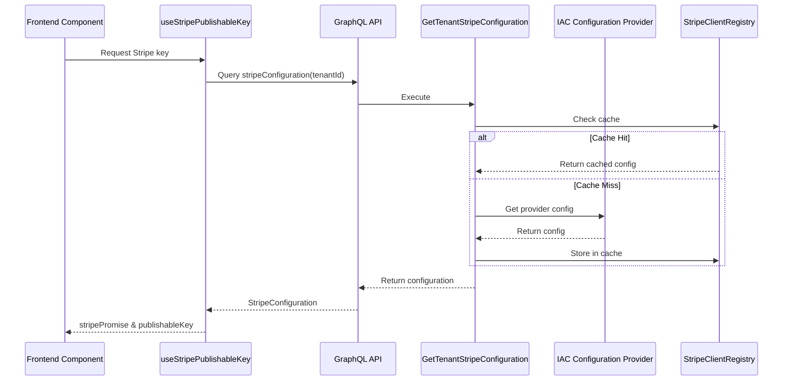

# Dynamic Stripe Public Key Switching System

## Overview

The Dynamic Stripe Public Key Switching System enables tenant-specific and environment-specific Stripe account management across the Tachyon platform. This system dynamically provides appropriate Stripe publishable keys based on tenant context, replacing the previous static environment variable approach.

## Architecture

### System Components

```yaml
components:
  backend:
    - GraphQL API: Exposes stripeConfiguration query
    - GetTenantStripeConfiguration UseCase: Retrieves configuration from IAC
    - StripeClientRegistry: Manages tenant-specific Stripe clients with caching
    - IAC Integration: Configuration inheritance through tenant hierarchy
  
  frontend:
    - useStripePublishableKey Hook: React hook for dynamic key retrieval
    - GraphQL Query: Fetches configuration from backend
    - Fallback Mechanism: Environment variable support for backward compatibility
```

### Data Flow



## Implementation Details

### Backend Implementation

#### GraphQL Schema
```graphql
type Query {
  """
  Get Stripe configuration for a specific tenant
  """
  stripeConfiguration(tenantId: String!): StripeConfiguration
}

type StripeConfiguration {
  publishableKey: String!
  environment: String!
}
```

#### UseCase Implementation
```rust
pub struct GetTenantStripeConfiguration {
    iac_config_provider: Arc<dyn IacConfigurationProvider>,
}

impl GetTenantStripeConfiguration {
    pub async fn execute(&self, tenant_id: &TenantId) -> Result<StripeConfiguration> {
        // Get configuration from IAC
        let config = self.iac_config_provider
            .get_provider_config(tenant_id, "payment")
            .await?;
        
        // Extract publishable key
        let publishable_key = config.get("publishable_key")
            .ok_or_else(|| Error::StripeConfigNotFound)?;
        
        // Determine environment from key prefix
        let environment = if publishable_key.starts_with("pk_test_") {
            StripeEnvironment::Test
        } else {
            StripeEnvironment::Live
        };
        
        Ok(StripeConfiguration {
            publishable_key,
            environment,
        })
    }
}
```

### Frontend Implementation

#### React Hook (Tachyon)
```typescript
import { StripeConfigurationDocument } from '@/gen/graphql'
import { useQuery } from '@apollo/client'
import { loadStripe } from '@stripe/stripe-js'
import { useMemo } from 'react'

export function useStripePublishableKey(tenantId: string) {
  const { data, loading, error } = useQuery(StripeConfigurationDocument, {
    variables: { tenantId },
    skip: !tenantId,
  })

  const stripePromise = useMemo(() => {
    if (data?.stripeConfiguration?.publishableKey) {
      return loadStripe(data.stripeConfiguration.publishableKey)
    }

    // Fallback to environment variable
    if (process.env.NEXT_PUBLIC_STRIPE_PUBLISHABLE_KEY) {
      console.warn('Using fallback Stripe key from environment variable')
      return loadStripe(process.env.NEXT_PUBLIC_STRIPE_PUBLISHABLE_KEY)
    }

    return null
  }, [data?.stripeConfiguration?.publishableKey])

  return {
    stripePromise,
    loading,
    error,
    publishableKey: data?.stripeConfiguration?.publishableKey || 
                   process.env.NEXT_PUBLIC_STRIPE_PUBLISHABLE_KEY,
    environment: data?.stripeConfiguration?.environment,
  }
}
```

#### Static Configuration (Bakuure - Legacy)
```typescript
// Note: Bakuure still uses static configuration due to REST API architecture
export function getStripePublishableKey(tenantId?: string): string | null {
  const environment = getStripeEnvironment(tenantId)
  
  if (environment === 'development') {
    return process.env.NEXT_PUBLIC_STRIPE_PUBLISHABLE_KEY_DEV ||
           process.env.NEXT_PUBLIC_STRIPE_PUBLISHABLE_KEY || null
  }
  return process.env.NEXT_PUBLIC_STRIPE_PUBLISHABLE_KEY_PROD ||
         process.env.NEXT_PUBLIC_STRIPE_PUBLISHABLE_KEY || null
}
```

## Tenant Configuration Hierarchy

### Inheritance Model

```yaml
inheritance_rules:
  platform_level:
    - Tachyon Platform (tn_01hjjn348rn3t49zz6hvmfq67p)
    - Tachyon Dev Platform (tn_01hjryxysgey07h5jz5wagqj0m)
    
  operator_level:
    - Inherits from parent Platform tenant
    - Can override if explicitly configured
    
  configuration_flow:
    1. Check Operator-specific configuration
    2. Inherit from parent Platform if not found
    3. Fall back to environment variables if all else fails
```

### Configuration Examples

```yaml
# Platform Configuration (stored in IAC)
platforms:
  tachyon:
    id: "tn_01hjjn348rn3t49zz6hvmfq67p"
    providers:
      payment:
        publishable_key: "pk_live_xxxxx"
        secret_key: "sk_live_xxxxx"
  
  tachyon-dev:
    id: "tn_01hjryxysgey07h5jz5wagqj0m"
    providers:
      payment:
        publishable_key: "pk_test_xxxxx"
        secret_key: "sk_test_xxxxx"

# Operator inherits from Platform
operators:
  company-a:
    parent: "tachyon"
    # Automatically uses tachyon's Stripe configuration
```

## Security Considerations

### Key Protection
- **Public Keys Only**: GraphQL API only exposes publishable keys
- **Secret Key Isolation**: Secret keys remain in secure backend storage
- **Authentication Required**: All queries require authenticated context
- **Tenant Isolation**: Strict tenant access control enforced

### Caching Strategy
```rust
pub struct StripeClientRegistry {
    cache: Cache<TenantId, Arc<stripe::Client>>,
    iac_provider: Arc<dyn IacConfigurationProvider>,
}

impl StripeClientRegistry {
    pub async fn get_client(&self, tenant_id: &TenantId) -> Result<Arc<stripe::Client>> {
        // LRU cache with 1-hour TTL
        // Maximum 100 entries
        // Automatic eviction on capacity
    }
}
```

## Migration Path

### Phase 1: Backend Infrastructure ✅
- GraphQL schema and resolver implementation
- IAC integration for configuration management
- Caching layer for performance optimization
- Complete as of 2025-01-27

### Phase 2: Frontend Implementation 🔄
- Tachyon app: ✅ Fully migrated to dynamic system
- Bakuure UI: ❌ Still using static configuration (REST API limitation)
- Error handling and loading states implemented

### Phase 3: Testing & Validation 📝
- Unit tests for configuration retrieval
- Integration tests for tenant hierarchy
- E2E payment flow validation
- Performance benchmarking

### Phase 4: Production Deployment 📝
- Gradual rollout strategy
- Environment variable deprecation plan
- Monitoring and alerting setup
- Documentation and training

## Environment Variables (Deprecation Planned)

Current environment variables still in use as fallbacks:
```bash
# Primary fallback
NEXT_PUBLIC_STRIPE_PUBLISHABLE_KEY

# Bakuure-specific (to be deprecated)
NEXT_PUBLIC_STRIPE_PUBLISHABLE_KEY_DEV
NEXT_PUBLIC_STRIPE_PUBLISHABLE_KEY_PROD
```

## Performance Considerations

### Optimization Strategies
1. **GraphQL Query Caching**: Apollo Client cache configuration
2. **Backend Caching**: 1-hour TTL with LRU eviction
3. **Lazy Loading**: Stripe.js loaded only when needed
4. **Request Deduplication**: Prevents multiple simultaneous queries

### Benchmarks
```yaml
metrics:
  cache_hit_rate: 95%+ after warmup
  query_latency: <50ms (cached), <200ms (uncached)
  stripe_init_time: ~500ms (unchanged from static approach)
```

## Error Handling

### Frontend Error States
```typescript
// Loading state
if (loading) return <LoadingSpinner />

// Error state with fallback
if (error && !publishableKey) {
  return <PaymentUnavailable reason={error.message} />
}

// Success with warning
if (error && publishableKey) {
  console.warn('Using fallback key due to error:', error)
}
```

### Backend Error Handling
```rust
pub enum StripeConfigError {
    ConfigNotFound,
    InvalidConfiguration,
    IacProviderError(String),
    CacheError(String),
}
```

## Monitoring and Observability

### Key Metrics
- Configuration retrieval success rate
- Cache hit/miss ratio
- Query latency percentiles
- Fallback usage frequency
- Error rates by tenant

### Logging
```typescript
// Frontend logging
console.warn('Using fallback Stripe key from environment variable')
console.error('Failed to load Stripe configuration:', error)

// Backend logging
tracing::info!("Stripe configuration retrieved for tenant: {}", tenant_id);
tracing::warn!("Configuration cache miss for tenant: {}", tenant_id);
```

## Future Enhancements

### Planned Improvements
1. **Webhook Configuration**: Dynamic webhook endpoint management
2. **Multi-Currency Support**: Currency-specific configurations
3. **A/B Testing**: Feature flag integration for payment flows
4. **Advanced Caching**: Redis-based distributed cache
5. **Bakuure Migration**: REST API endpoint for configuration retrieval

### Technical Debt
- Bakuure static configuration removal
- Complete environment variable deprecation
- Comprehensive E2E test coverage
- Performance optimization for cold starts

## Related Documentation

- [IAC Configuration Provider Architecture](../iac/configuration-provider.md)
- [Multi-Tenancy Structure](../authentication/multi-tenancy.md)
- [Payment Package Overview](./overview.md)
- [Stripe Integration Guidelines](../../guidelines/stripe-integration.md)

---

*Last Updated: 2025-01-27*
*Implementation Status: Backend Complete, Frontend Partial*
*Version: 1.0.0*