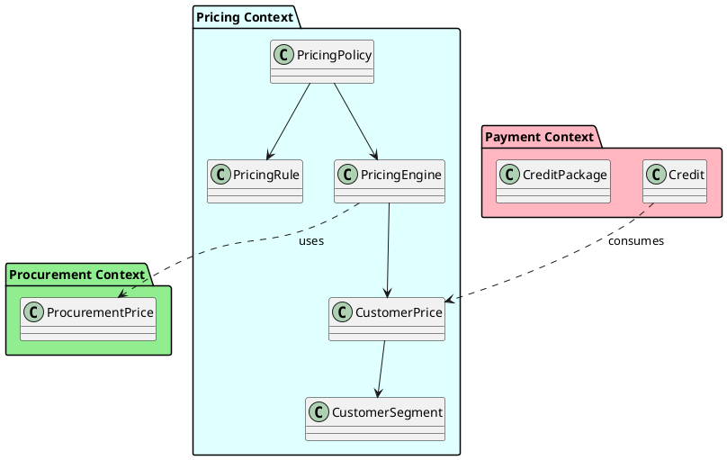
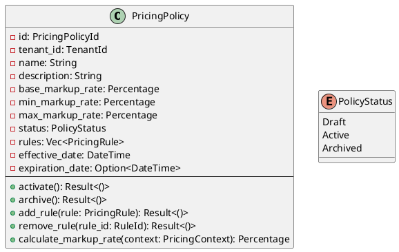
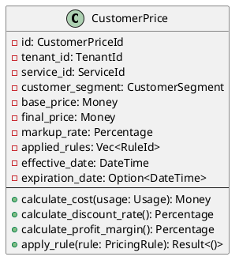
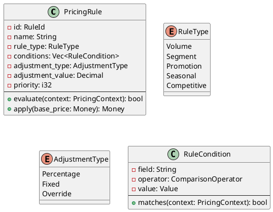
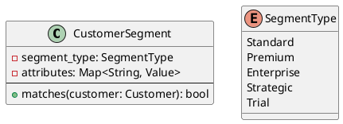
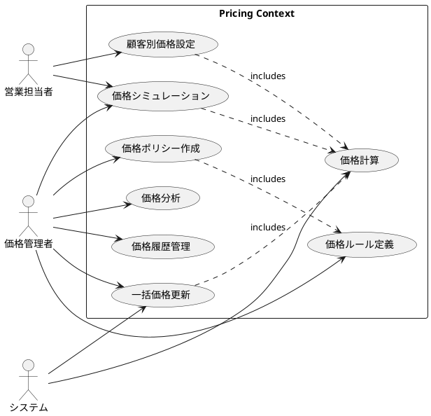
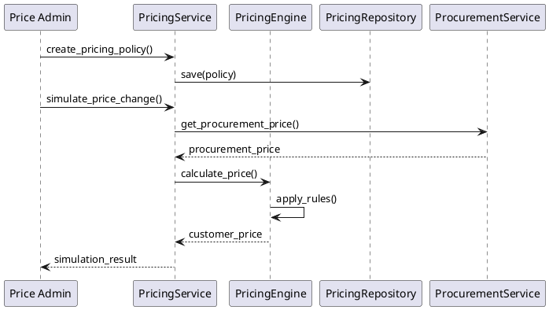
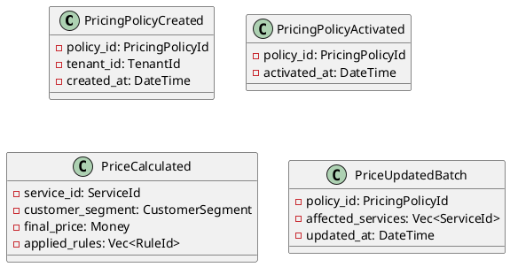
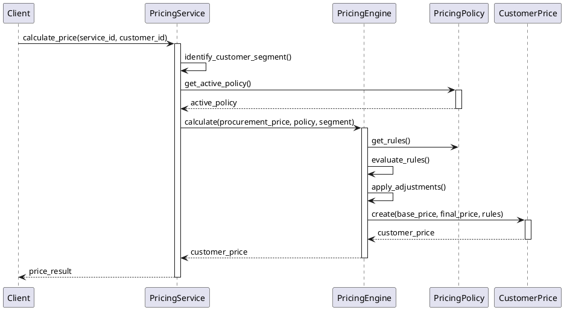

# Pricing Context Specification

## 概要

Pricing Context（価格設定境界付けられたコンテキスト）は、Tachyonシステムにおける価格戦略の中核を担うドメインです。調達価格から顧客価格への変換、柔軟な価格ルールの適用、マルチテナント対応の価格設定を実現します。

## 境界付けられたコンテキスト



## ドメインモデル

### エンティティの役割と責務

#### 1. PricingPolicy（価格設定ポリシー）
**役割**: 価格戦略の中核となる集約ルート。組織全体の価格設定方針を定義し、価格ルールのコンテナとして機能する。

**責務**:
- 基本マークアップ率の管理（調達価格に対する利益率の設定）
- 価格ルールの集約と管理
- ポリシーのライフサイクル管理（Draft → Active → Archived）
- 価格計算時のルール適用順序の制御
- マークアップ率の上限・下限の保証

**ビジネス価値**:
- 組織の価格戦略を一元管理
- 複数の価格ポリシーによるA/Bテスト実現
- 価格変更の段階的移行を可能に

#### 2. CustomerPrice（顧客価格）
**役割**: 特定のサービスと顧客セグメントに対する最終価格を表現するエンティティ。価格計算の結果を保持する。

**責務**:
- 計算された最終価格の保持
- 適用されたルールの追跡
- 使用量に基づくコスト計算
- 利益率と割引率の算出
- 価格の有効期間管理

**ビジネス価値**:
- 顧客への透明性のある価格提示
- 価格決定プロセスの追跡可能性
- 収益性分析の基礎データ提供

#### 3. PricingEngine（価格計算エンジン）
**役割**: 価格計算のビジネスロジックを実行するドメインサービス。複雑な価格計算アルゴリズムをカプセル化。

**責務**:
- 調達価格から顧客価格への変換
- ルールの評価と適用
- 価格計算の最適化
- 計算過程のログ記録

**ビジネス価値**:
- 一貫性のある価格計算の保証
- パフォーマンスの最適化
- 価格計算ロジックの集中管理

### 値オブジェクトの役割と責務

#### 1. PricingRule（価格設定ルール）
**役割**: 価格調整のビジネスルールを表現する値オブジェクト。条件と調整内容をカプセル化。

**責務**:
- ルール条件の評価
- 価格調整の計算
- ルールの優先順位管理

**ビジネス価値**:
- 柔軟な価格設定の実現
- ルールベースの価格最適化
- 市場状況への迅速な対応

#### 2. CustomerSegment（顧客セグメント）
**役割**: 顧客を分類し、セグメント別の価格戦略を可能にする値オブジェクト。

**責務**:
- 顧客属性の評価
- セグメント判定ロジック
- セグメント属性の管理

**ビジネス価値**:
- 顧客価値に応じた価格差別化
- ターゲット市場への最適価格設定
- 顧客ロイヤルティの向上

### 集約（Aggregates）

#### PricingPolicy（価格設定ポリシー）



### エンティティ（Entities）

#### CustomerPrice（顧客価格）



### 値オブジェクト（Value Objects）

#### PricingRule（価格設定ルール）



#### CustomerSegment（顧客セグメント）



## ユースケース図



## ユースケース仕様

### UC1: 価格ポリシー作成

**アクター**: 価格管理者  
**事前条件**: 価格管理者がシステムにログインしている  
**事後条件**: 新しい価格ポリシーがDraft状態で作成される

**基本フロー**:
1. 価格管理者が新規価格ポリシー作成を選択
2. ポリシー名、説明、基本マークアップ率を入力
3. 最小・最大マークアップ率を設定
4. 有効期間を指定
5. システムがポリシーを保存

### UC3: 価格計算

**アクター**: システム  
**事前条件**: 有効な価格ポリシーが存在する  
**事後条件**: 顧客価格が計算される

**基本フロー**:
1. システムが調達価格を取得
2. 適用可能な価格ポリシーを特定
3. 顧客セグメントを判定
4. 該当するルールを評価・適用
5. 最終価格を算出

## データフロー



## ドメインイベント

### イベントの役割と発生タイミング



#### イベントの詳細

1. **PricingPolicyCreated**
   - **発生タイミング**: 新しい価格ポリシーが作成された時
   - **用途**: 監査ログ、他システムへの通知
   - **購読者**: 監査システム、通知サービス

2. **PricingPolicyActivated**
   - **発生タイミング**: 価格ポリシーがアクティベートされた時
   - **用途**: 価格の再計算トリガー、キャッシュの無効化
   - **購読者**: 価格計算サービス、キャッシュマネージャー

3. **PriceCalculated**
   - **発生タイミング**: 顧客価格が計算された時
   - **用途**: 価格履歴の記録、分析データの収集
   - **購読者**: 分析サービス、履歴管理サービス

4. **PriceUpdatedBatch**
   - **発生タイミング**: 複数サービスの価格が一括更新された時
   - **用途**: 大規模な価格変更の追跡、影響分析
   - **購読者**: 通知サービス、影響分析サービス

## ビジネスルール

### 価格計算ルール

1. **基本マークアップ適用**
   - 調達価格に基本マークアップ率を適用
   - 最小マークアップ率を下回らない
   - 最大マークアップ率を超えない

2. **ルール優先順位**
   - 優先度の高いルールから順に評価
   - 排他的ルールは最初にマッチしたものを適用
   - 累積的ルールは全て適用

3. **セグメント別価格**
   - Enterprise: 基本価格の80-90%
   - Premium: 基本価格の90-95%
   - Standard: 基本価格の100%
   - Trial: 基本価格の50%

4. **ボリューム割引**
   ```
   使用量レンジ    | 割引率
	   ----------------|-------
   0-1000         | 0%
   1001-10000     | 5%
   10001-100000   | 10%
   100001+        | 15%
   ```

## エンティティ間の相互作用

### 価格計算フロー



### エンティティの協調関係

1. **PricingPolicy ↔ PricingRule**
   - PricingPolicyは複数のPricingRuleを保持
   - ルールの追加・削除・更新を管理
   - ルール適用順序の制御

2. **PricingEngine ↔ CustomerPrice**
   - PricingEngineがCustomerPriceを生成
   - 計算過程の透明性を保証
   - 適用ルールの追跡

3. **CustomerPrice ↔ CustomerSegment**
   - セグメントに基づく価格差別化
   - セグメント変更時の価格再計算

## 統合ポイント

### 他のコンテキストとの連携

1. **Procurement Context**
   - **役割**: 調達価格の提供元
   - **連携方法**: 
     - `ProcurementPrice`を入力として価格計算
     - 調達価格の変更通知を受信
   - **データフロー**: Procurement → Pricing

2. **Payment Context**
   - **役割**: 価格情報の消費者
   - **連携方法**:
     - 計算された`CustomerPrice`を課金に使用
     - クレジット消費時の価格参照
   - **データフロー**: Pricing → Payment

3. **Catalog Context**
   - **役割**: サービス情報の管理
   - **連携方法**:
     - サービスカタログからサービス情報を取得
     - 価格マッピングの永続化
   - **データフロー**: 双方向

4. **Order Context**
   - **役割**: 注文時の価格確定
   - **連携方法**:
     - 注文作成時の価格照会
     - 価格保証期間の管理
   - **データフロー**: Pricing → Order

## 非機能要件

### パフォーマンス
- 価格計算: 100ms以内
- バッチ更新: 10,000件/分
- 同時アクセス: 1,000リクエスト/秒

### 可用性
- 99.9%のアップタイム
- 価格情報のキャッシュによる高速化
- フェイルオーバー対応

### セキュリティ
- 価格情報へのアクセス制御
- 監査ログの記録
- 価格変更の承認フロー

## 実装上の考慮事項

### キャッシング戦略
```rust
// 価格キャッシュの実装例
pub struct PriceCache {
    cache: Arc<RwLock<HashMap<CacheKey, CachedPrice>>>,
    ttl: Duration,
}

#[derive(Hash, Eq, PartialEq)]
struct CacheKey {
    service_id: ServiceId,
    customer_segment: CustomerSegment,
    policy_id: PricingPolicyId,
}
```

### イベントソーシング
- 価格変更履歴の完全な記録
- 任意の時点での価格再現
- 監査要件への対応

### マルチテナント対応
- テナントごとの価格ポリシー隔離
- テナント間の価格情報漏洩防止
- テナント別のカスタマイズ対応

## 今後の拡張計画

1. **AI価格最適化**
   - 機械学習による価格提案
   - 需要予測に基づく動的価格

2. **競合価格追跡**
   - 外部価格データの自動収集
   - 競合比較ダッシュボード

3. **A/Bテスト機能**
   - 価格実験の実施
   - 効果測定と分析

## LLM課金フロー統合（Phase 3-4）

### 概要

Phase 3-4 では、Pricing Context を既存の LLM 課金フロー（`BillingAwareRecursiveAgent` → `CatalogApp` → `PricingRegistry`）に統合し、テナント階層（Host → Platform → Operator）ごとのマークアップを反映する仕組みを構築した。

### 統合前後の比較

**統合前:**
```
BillingAwareRecursiveAgent
  → CatalogApp::calculate_service_cost_for_llm_model(provider, model, usage)
    → PricingRegistry (ハードコード原価) → 全テナント同一料金
```

**統合後:**
```
BillingAwareRecursiveAgent
  → CatalogApp::calculate_service_cost_for_llm_model(tenant_id, provider, model, usage)
    → PricingApp::resolve_price(tenant_id, sku_code)
      → Host原価 → Platform markup → Operator markup + adjustments
      → テナント別の販売価格で課金
```

### SKU体系

全LLMモデルに対して以下4種類のSKUを定義:
- `{model}-input-token` (LlmInputToken)
- `{model}-output-token` (LlmOutputToken)
- `{model}-cached-input-token` (CachedInputToken) ※対応モデルのみ
- `{model}-cache-creation-token` (CacheCreationInputToken) ※Anthropic/Bedrockのみ

SKU metadata: `{ "provider": "anthropic", "model": "claude-sonnet-4-6" }`

### デフォルト RateCard

- Host: RateCard なし（未設定 = PassThrough、調達原価そのまま）
- Platform (`tn_01hjryxysgey07h5jz5wagqj0m`): 全SKUに Markup 25%

### 旧コード廃止（Phase 4A）

- 機能フラグ `context.pricing_v2` を削除し、新コードパスのみに統一
- 旧 `PricingService` / `PricingEngine`（`packages/catalog/src/pricing/`）を削除
- v2メソッドを統合し、CatalogApp をクリーンアップ

### 残作業（Phase 4B）

- `ServicePriceMapping`（`packages/catalog/src/service_pricing/`）の削除は別タスクとして管理: `todo/pricing-phase4b-service-price-mapping-removal`

### 主要ファイル

| ファイル | 役割 |
|---------|------|
| `scripts/seeds/n1-seed/009-pricing-skus.yaml` | LLMモデルSKUシード |
| `scripts/seeds/n1-seed/010-pricing-rate-cards.yaml` | デフォルトRateCardシード |
| `packages/catalog/src/app.rs` | CatalogAppService（PricingApp統合） |
| `packages/llms/src/agent/billing_aware.rs` | BillingAwareRecursiveAgent |
| `apps/tachyon-api/src/di.rs` | DI配線（CatalogApp + PricingApp） |

## 関連ドキュメント

- [Procurement Context仕様](../procurement/procurement-context-specification.md)
- [Payment Context仕様](../payment/payment-context-specification.md)
- [価格設定機能概要](./overview.md)
- [APIサービス管理](./api-services-management.md)
- [価格シミュレーション](./pricing-simulation.md)