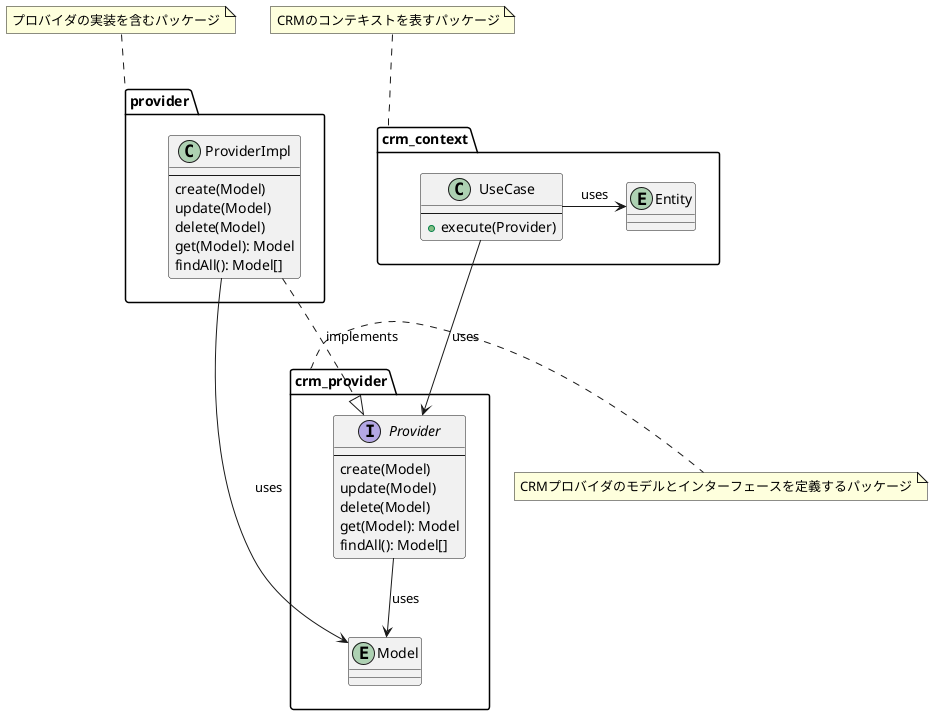
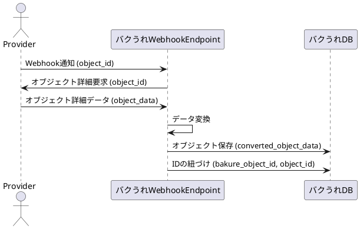
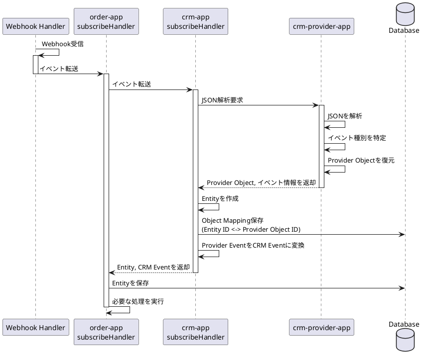
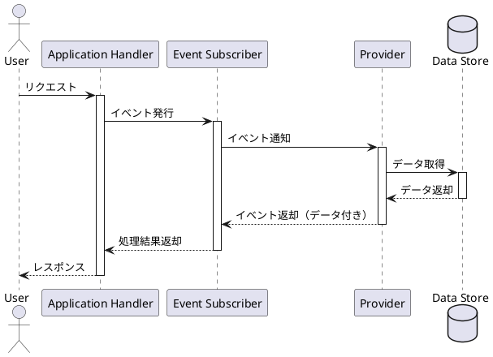
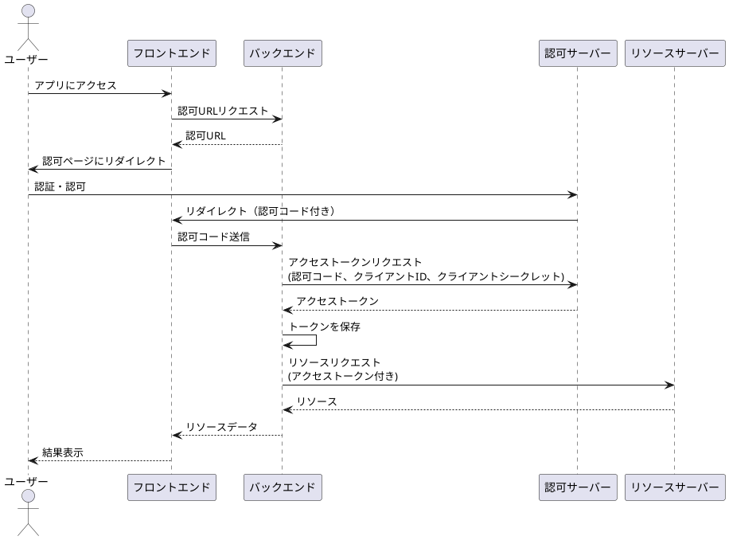

# Providers

## ドキュメント一覧
- [AnthropicストリーミングSSE仕様](./anthropic-streaming-sse.md)

## CRM Providers

### API



APIは、CRM Providerとのインターフェースを提供する。

inputはcrm_providerのモデルを受け取る。
outputはcrm_providerのモデルを返却する。



#### プロバイダとの同期


### Webhook

最終的にCRM ProviderのモデルもしくはCRM Contextの集約イベントとして

1. Providerから何かの通知を受け取る
2. 通知をイベントハンドリングして、関連の集約イベントを作成する
3. 集約イベントをCRM Contextに返却する

```plantuml
title architecture

package "CRM Provider" as crm_provider {
  enum Event {
    QuoteCreated
    QuoteUpdated
    ProductCreated
    ...
  }

  ' webhook受信しイベントを発行
  interface EventSubscriber {
    ---
    receive(json) -> Event
  }
  EventSubscriber --> Event: use

}

package "Provider" as provider {
  class EventSubscriberImpl {
    ---
    receive(json) -> Event
  }
}

EventSubscriberImpl --|> EventSubscriber: impl
EventSubscriberImpl --> Event: use
```

### Webhook受け取り後の処理フロー

#### CRM ProviderからObject作成通知を受け取る

CRM ProviderからObject作成通知を受け取った場合は、order-appでもエンティティを作成して、保存する。crm-appではIDのマッピングを保存する。



処理の流れのシーケンス図を書く



### レイヤー構造の最適化

現在の製品データモデルの変換フローは以下のようになっています：

```shell
catalog::Product → crm::Product → crm_provider::Product → provider(hubspot)::Product
```

この構造は冗長であり、以下のように最適化することが考えられます：

1. `crm::Product`と`crm_provider::Product`を統合する。
2. レイヤー間の変換を簡素化し、直接的なマッピングを行う。

最適化後の想定フロー：

```shell
catalog::Product → crm::Product → provider(hubspot)::Product
```

### 新しいパッケージ構造の提案

現在の`crm`と`crm_provider`の統合を考慮し、以下のような新しいパッケージ構造を提案します：

1. `crm_domain`: CRMのコアドメインロジックを含むパッケージ
   - エンティティ定義（例：Product, Customer, Deal）
   - ドメインサービス
   - リポジトリインターフェース

2. `crm_application`: アプリケーション固有のロジックを含むパッケージ
   - ユースケース
   - アプリケーションサービス

3. `crm_infrastructure`: 外部システムとの連携を担当するパッケージ
   - リポジトリの実装
   - 外部APIクライアント（Hubspot, Salesforce等）

この構造の利点：

- ドメインロジックが明確に分離され、ビジネスルールの把握が容易になる
- インフラストラクチャの詳細がドメインから分離され、テストが容易になる
- アプリケーション層で、ドメインロジックとインフラストラクチャを組み合わせやすくなる

実装例：

```rust
// crm_domain/src/product.rs
pub struct Product {
    // ドメイン固有の製品属性
}

// crm_application/src/use_cases/sync_product.rs
pub fn sync_product(product: catalog::Product, crm_repo: &dyn CRMRepository) {
    let crm_product = map_to_crm_product(product);
    crm_repo.save_product(crm_product);
}

// crm_infrastructure/src/repositories/hubspot_repository.rs
pub struct HubspotRepository {
    client: HubspotClient,
}

impl CRMRepository for HubspotRepository {
    fn save_product(&self, product: Product) {
        // Hubspot APIを使用して製品を保存
    }
}
```

この新しい構造により、`catalog::Product → crm_domain::Product → hubspot::Product`という
シンプルで明確なデータフローが実現できます。

### レイヤー構造の考察

- フレームワークやドライバー層はプラガブル（差し替え可能）な設計になっています。
- `llms_provider`はCRMのドメイン層の一部として考えられる可能性があります。
- 各レイヤーは別々のcrateとして実装されていますが、一部のレイヤーは統合することで、より簡潔な構造になる可能性があります。

これらの考察を踏まえ、アーキテクチャの見直しと最適化を検討することが推奨されます。具体的には：

1. ドメインモデルの統一
2. レイヤー間のマッピング簡素化
3. 不要な中間層の削除

これにより、コードの保守性が向上し、データフローがより明確になることが期待されます。

### Provider OAuth2



## マルチテナント

> 通知受け取り時にproviderやtenantを初期化する必要がある

webhookから受け取れるもの
portal_id: これはHubSpot側のマルチテナントID
app_id: バクうれ公開アプリのID
objectId: 変更があった通知対象のオブジェクトのID

objectIdから取引先IDを取得する必要あり

e.g.)
今回lineItemの変更からQuoteを復元し返却する。
QuoteにClientIdを紐づける必要があるため、lineItemもしくはQuoteに紐づくcompanyを取得する。
その後、Quoteを返却する。
そして、hs-companyは、clientとマッピングするため、clientから取引先IDを取得する。

### 取引先IDマッピング

先にhs-companyを同期しておきたい
または、変更通知を受け取り、clientを作成するようにしたい。
