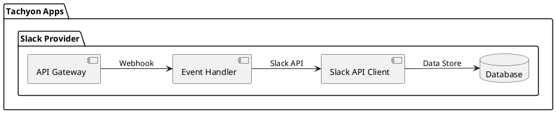

# Slack

## 実装タスク

### 認証関連
- ✅ Slack OAuth2認証フローの実装
- ✅ アクセストークンの保存と管理
- ✅ Workspaceの情報取得と保存

### イベント購読
- 🔄 Event Subscriptionsの設定
- 📝 Webhookエンドポイントの実装
- 📝 署名検証の実装
- 📝 イベントタイプごとのハンドラー実装
  - 📝 message.channels
  - 📝 message.groups
  - 📝 message.im
  - 📝 channel_created
  - 📝 channel_renamed
  - 📝 channel_archived
  - 📝 channel_unarchived

### メッセージ操作
- 📝 メッセージ送信機能
  - 📝 テキストメッセージ
  - 📝 リッチメッセージ（ブロックキット）
- 📝 メッセージ更新機能
- 📝 メッセージ削除機能
- 📝 スレッド返信機能

### チャンネル操作
- 📝 チャンネル一覧取得
- 📝 チャンネル作成
- 📝 チャンネル情報更新
- 📝 チャンネルアーカイブ/アンアーカイブ

### ユーザー操作
- 📝 ユーザー一覧取得
- 📝 ユーザー情報取得
- 📝 ボットユーザーのステータス更新

### エラーハンドリング
- 📝 レート制限への対応
- 📝 再試行メカニズムの実装
- 📝 エラーログの実装

### テスト
- 📝 単体テストの実装
- 📝 統合テストの実装
- 📝 モックサーバーの実装

## システム構成図

## 内部アーキテクチャ

### API Gateway
- SlackからのWebhookリクエストを受け付けるエンドポイント。
- リクエストの認証と検証を行う。
- イベントハンドラーにリクエストを転送する。

### Event Handler
- Slackからのイベントを処理する。
- イベントの種類に応じて適切なハンドラーを呼び出す。
- データベースへの保存やSlack APIの呼び出しを行う。

### Slack API Client
- Slack APIを呼び出すためのクライアント。
- メッセージの送信、チャンネル情報の取得などを行う。
- レート制限やエラーハンドリングを実装する。

### Database
- Slackのデータ（アクセストークン、Workspace情報、チャンネル情報など）を保存する。
- 必要に応じてキャッシュも利用する。
