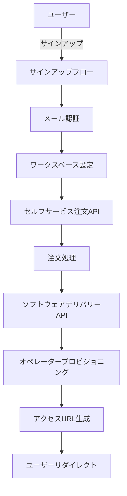

# Tachyon セルフサービスプロビジョニングシステム

## 概要

Tachyon セルフサービスプロビジョニングシステムは、プロダクト割り当てと即座のソフトウェアデリバリーを含む、自動化されたオペレーター（テナント）プロビジョニングを提供します。このシステムにより、新規ユーザーはサインアップし、ワークスペースを作成して、手動の介入なしにすぐにTachyonの使用を開始できます。

## アーキテクチャ

### システムコンポーネント



### 主要機能

1. **自動ユーザー登録**: Cognitoベースのユーザー作成とメール認証
2. **ワークスペース設定**: ユーザー定義のワークスペース設定（名前、URL、組織タイプ）
3. **プロダクト自動割り当て**: 固定のTachyon Operatorプロダクトを自動割り当て
4. **即座のプロビジョニング**: 即座のオペレーター作成とソフトウェアデリバリー
5. **シームレスリダイレクト**: プロビジョニング済みオペレーターURLへの自動遷移

## Implementation Details

### Configuration

#### Product IDs and Platform Settings

Located in `apps/tachyon/src/app/config/products.ts`:

```typescript
export const PLATFORM_OPERATOR_ID = process.env.NEXT_PUBLIC_PLATFORM_OPERATOR_ID || 'tn_01hjryxysgey07h5jz5wagqj0m'
export const TACHYON_OPERATOR_PRODUCT_ID = process.env.TACHYON_OPERATOR_PRODUCT_ID || 'pd_01jb0r4y4q9v8r2c7n6m5k3h1j'
```

### User Flow

#### 1. Account Creation
- User enters personal information (name, email, company)
- Password requirements: 8+ characters, uppercase, lowercase, number, special character
- Terms of service acceptance required

#### 2. Email Verification
- 6-digit verification code sent to user's email
- Code input required for account activation
- Automatic sign-in upon successful verification

#### 3. Workspace Setup
- **Workspace Name**: Display name for the organization
- **Workspace URL**: Unique URL identifier
- **Organization Type**: Business, Education, or Personal
- **Team Size**: Small (1-10), Medium (11-50), Large (51-200), Enterprise (200+)
- **Primary Use Case**: Project Management, Sales, Support, Development, etc.

#### 4. Provisioning Process
- Server Action `provisionOperatorWithProduct()` executes:
  1. Calls `selfServiceOrder` GraphQL mutation
  2. Processes order with `softwareDeliveryByOrder` mutation
  3. Returns provisioned operator access URL
- User automatically redirected to new operator URL

### Server Actions

Located in `apps/tachyon/src/app/signup/actions.ts`:

```typescript
export async function provisionOperatorWithProduct(
  workspaceData: WorkspaceFormData
): Promise<{ accessUrl?: string; error?: string }>
```

Key responsibilities:
- GraphQL client initialization with authentication
- Order placement with fixed product ID
- Software delivery execution
- Access URL extraction and return

### GraphQL Integration

#### Mutations Used

1. **selfServiceOrder**
   - Creates order for Tachyon Operator product
   - Links to platform operator
   - Returns order ID for processing

2. **softwareDeliveryByOrder**
   - Processes the created order
   - Provisions new operator
   - Returns access URL for the new tenant

### Database Schema

#### Seed Data Requirements

The following data must be present in the database (included in `scripts/n1-seed.sql`):

```sql
-- Platform Operator
INSERT INTO tenants (id, name, status) VALUES 
  ('tn_01hjryxysgey07h5jz5wagqj0m', 'QuantumBox Platform', 'active');

-- Tachyon Operator Product
INSERT INTO products (id, tenant_id, name, sku_code) VALUES
  ('pd_01jb0r4y4q9v8r2c7n6m5k3h1j', 'tn_01hjryxysgey07h5jz5wagqj0m', 'Tachyon Operator', 'tachyon-operator');
```

## Security Considerations

### Authentication
- JWT token used for API authentication
- Session-based user authentication after sign-up
- Secure password requirements enforced

### Data Validation
- Input sanitization for all user-provided data
- URL slug validation for workspace URLs
- Email address verification before provisioning

## Error Handling

### Common Error Scenarios

1. **Network Failures**
   - Retry mechanism for API calls
   - User-friendly error messages
   - Fallback to manual provisioning if needed

2. **Duplicate Workspace URLs**
   - Real-time availability checking
   - Alternative suggestions provided

3. **Provisioning Failures**
   - Detailed error logging
   - User notification with support contact
   - Manual intervention workflow

## Testing

### Local Development Setup

1. **Environment Variables**
   ```bash
   # Cognito Configuration
   COGNITO_REGION=us-east-1
   COGNITO_CLIENT_ID=your_client_id
   COGNITO_CLIENT_SECRET=your_client_secret
   COGNITO_ISSUER=https://cognito-idp.region.amazonaws.com/pool_id
   
   # Backend API
   NEXT_PUBLIC_BACKEND_API_URL=http://localhost:50054
   
   # Product Configuration (optional, defaults provided)
   NEXT_PUBLIC_PLATFORM_OPERATOR_ID=tn_01hjryxysgey07h5jz5wagqj0m
   TACHYON_OPERATOR_PRODUCT_ID=pd_01jb0r4y4q9v8r2c7n6m5k3h1j
   ```

2. **Backend Services**
   ```bash
   # Start database
   mise run up
   
   # Run backend API
   mise run dev-backend
   
   # Start frontend
   yarn dev --filter=tachyon
   ```

3. **Test Flow**
   - Navigate to `http://localhost:16000/signup`
   - Complete registration with test email
   - Verify email with 6-digit code
   - Create workspace
   - Verify redirect to provisioned URL

## Monitoring and Metrics

### Key Performance Indicators

- **Signup Conversion Rate**: Percentage of visitors completing signup
- **Provisioning Success Rate**: Successful provisions / total attempts
- **Time to Provision**: Average time from signup to access
- **Error Rate**: Failed provisions requiring manual intervention

### Logging

- All provisioning attempts logged with correlation IDs
- Error details captured for debugging
- User journey tracking for optimization

## Future Enhancements

1. **Multiple Product Selection**: Allow users to choose from product catalog
2. **Trial Period Management**: Automatic trial expiration and upgrade prompts
3. **Team Invitations**: Invite team members during workspace setup
4. **Custom Domain Support**: Use custom domains for workspace URLs
5. **SSO Integration**: Support enterprise SSO providers

## Related Documentation

- [Signup Flow Implementation](./signup-flow.md)
- [Cognito Integration](./cognito-integration.md)
- [GraphQL API Reference](../api/graphql-reference.md)
- [Multi-Tenancy Architecture](../authentication/multi-tenancy.md)