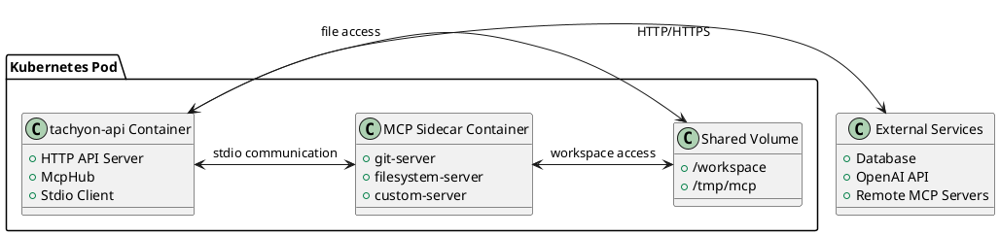

# MCP Stdio接続対応コンテナデプロイ環境の構築

## 概要

tachyon-apiでMCP Stdio接続を利用するために、Lambda実行環境からコンテナ実行環境（Cloud Run / ECS Fargate）への移行を実装します。Stdio接続には標準入出力による直接的なプロセス間通信が必要なため、コスト効率的なコンテナ環境でのデプロイメント戦略を確立し、MCPサーバーとの統合を可能にします。

## 背景・目的

### 解決したい課題
- **Lambda制約**: AWS Lambdaでは標準入出力による直接的なプロセス間通信ができない
- **MCPサーバー制限**: Stdio接続のMCPサーバー（git、filesystem等）が利用できない
- **スケーラビリティ**: Lambda実行時間制限（120秒）によるタイムアウト
- **永続接続**: MCPサーバーとの永続的な接続が維持できない

### 期待される効果
- Stdio接続MCPサーバーの完全サポート
- より柔軟な実行時間管理
- MCPサーバーとの効率的な通信
- ローカル開発環境との整合性向上
- **コスト最適化**: KubernetesよりもCloud Run/ECSの方が低コスト

## 詳細仕様

### プラットフォーム選択

#### Cloud Run vs ECS Fargate 比較

| 項目 | Cloud Run | ECS Fargate |
|------|-----------|-------------|
| **コスト** | リクエスト単位課金 | 実行時間課金（最小1分） |
| **最小リソース** | 128MB/0.08vCPU | 256MB/0.25vCPU |
| **最大実行時間** | 60分 | 無制限 |
| **Stdio対応** | ✅ 完全対応 | ✅ 完全対応 |
| **既存インフラ** | GCP中心 | AWS中心 |
| **設定複雑度** | 低（既存設定あり） | 中 |

**推奨: Cloud Run** 
- 既存のdeploy.value.run.yamlを活用可能
- リクエスト単位課金でコスト効率が良い
- GCPエコシステムとの親和性

### 機能要件

#### 1. コンテナ化されたtachyon-api
- **最適化されたDockerfile**
  - マルチステージビルドでサイズ最適化
  - Ubuntu 22.04ベースでMCPサーバー対応
  - Python/Node.jsランタイム統合
  - レイヤーキャッシュの最大活用
  - セキュリティ強化（非特権実行）

- **高速ビルド対応**
  - .dockerignoreによる不要ファイル除外
  - 依存関係の事前ビルド（cargo-chef）
  - GitHub Actions Cacheとの統合

- **MCP統合実行バイナリ**
  - 既存のHTTP APIサーバー機能維持
  - MCPハブ統合
  - Stdio接続対応

#### 2. MCPサーバー統合戦略
- **シングルコンテナ統合**
  - 同一コンテナ内でMCPサーバーをプロセス起動
  - localhost stdio通信
  - 軽量でコスト効率的

- **ワークスペース管理**
  - /tmp配下でのファイル操作
  - Git操作用の一時ディレクトリ
  - プロセス間でのファイル共有

#### 3. デプロイメント設定
- **Cloud Run設定**
  - CPU: 1 vCPU（リクエスト時のみ課金）
  - Memory: 1GB（MCPサーバー込み）
  - 同時実行数: 1000（自動スケール）

- **ECS Fargate設定（代替案）**
  - タスク定義とサービス設定
  - Application Load Balancer統合
  - CloudWatch監視

### 非機能要件
- **パフォーマンス**
  - 起動時間: 30秒以内（コールドスタート）
  - レスポンス時間: 500ms以内（通常時）
  - 同時接続: 100接続

- **ビルド効率**
  - Dockerビルド時間: 5分以内（キャッシュ利用時2分以内）
  - GitHub Actionsビルド: 10分以内
  - イメージサイズ: 1GB以下（最適化後）

- **可用性**
  - アップタイム: 99.9%
  - レプリケーション: 最低2インスタンス（本番環境）
  - グレースフルシャットダウン

- **セキュリティ**
  - 非特権コンテナ実行
  - シークレット管理（Secret Manager/Parameter Store）
  - 最小権限の原則

## 実装方針

### アーキテクチャ



### 技術選定
- **ベースイメージ**: Ubuntu 22.04 LTS（MCPサーバーサポート）
- **推奨プラットフォーム**: Google Cloud Run
- **代替プラットフォーム**: AWS ECS Fargate
- **ストレージ**: 一時ディスク（/tmp）
- **ネットワーク**: HTTP/HTTPS（パブリック）

### ディレクトリ構造

```
apps/tachyon-api/
├── Dockerfile.mcp                    # MCP対応Dockerfile
├── .dockerignore                     # ビルド高速化用
├── bin/
│   └── mcp-server.rs                # MCP統合サーバーバイナリ
├── deploy.value.run.mcp.yaml        # Cloud Run MCP設定
├── terraform/
│   └── ecs.tf                       # ECS Fargate設定（代替）
└── cloud-run/
    └── service.yaml                 # Cloud Run knativeサービス

cluster/developer-run-app/           # 既存Cloud Run Helmチャート拡張
├── templates/
│   └── knative.yaml                # MCPサポート追加
└── values.mcp.yaml                 # MCP用values

scripts/
├── deploy-mcp-cloud-run.sh         # Cloud Runデプロイ
└── deploy-mcp-ecs.sh               # ECS Fargateデプロイ

.github/workflows/
├── build-mcp-container.yml         # コンテナビルドワークフロー
└── deploy-mcp-container.yml        # デプロイワークフロー
```

## タスク分解

### フェーズ1: MCP対応Dockerfileの作成 📝 TODO
- [ ] ベースイメージの選定（Ubuntu 22.04）
- [ ] マルチステージビルドの設計
  - [ ] cargo-chefステージ（依存関係の事前ビルド）
  - [ ] Rustビルドステージ（最適化済み）
  - [ ] ランタイムステージ（最小構成）
- [ ] MCPサーバー実行環境の構築
  - [ ] Python/Node.js ランタイム
  - [ ] uvx, npx, pip インストール
  - [ ] Git, filesystem ツール
- [ ] Dockerビルド最適化
  - [ ] .dockerignoreの作成
  - [ ] レイヤーキャッシュの最適化
  - [ ] ビルドコンテキストの最小化
- [ ] セキュリティ強化
  - [ ] 非特権ユーザーでの実行
  - [ ] 不要なパッケージの削除
  - [ ] ベストプラクティスの適用

### フェーズ2: MCP統合サーバーバイナリの実装 📝 TODO
- [ ] 新しいバイナリエントリーポイント作成
  - [ ] `bin/mcp-server.rs`の実装
  - [ ] 既存のHTTP APIサーバー機能統合
  - [ ] MCPハブ初期化ロジック
- [ ] 設定管理
  - [ ] 環境変数ベースの設定
  - [ ] ConfigMapからのMCP設定読み込み
  - [ ] シークレット管理（APIキー等）

### フェーズ3: Cloud Run設定の作成 📝 TODO
- [ ] deploy.value.run.mcp.yamlの作成
  - [ ] 既存設定の拡張
  - [ ] MCPサーバー用リソース設定
  - [ ] 環境変数の追加
- [ ] Cloud Run knativeサービス定義
  - [ ] CPU/Memory制限
  - [ ] 同時実行数設定
  - [ ] ヘルスチェック設定
- [ ] MCP設定の外部化
  - [ ] Secret Manager統合
  - [ ] 環境別設定管理

### フェーズ4: ECS Fargate設定の作成（代替案） 📝 TODO
- [ ] Terraformタスク定義
  - [ ] コンテナ設定
  - [ ] リソース制限
  - [ ] ログ設定
- [ ] ECSサービス設定
  - [ ] Application Load Balancer
  - [ ] オートスケーリング
  - [ ] ヘルスチェック
- [ ] IAM・セキュリティ設定
  - [ ] タスクロール
  - [ ] 実行ロール
  - [ ] セキュリティグループ

### フェーズ5: デプロイスクリプトとCI/CD統合 📝 TODO
- [ ] Cloud Runデプロイスクリプトの作成
  - [ ] gcloudコマンド統合
  - [ ] 既存Helmチャートの拡張
  - [ ] イメージビルド&プッシュ
- [ ] ECS Fargateデプロイスクリプト（代替）
  - [ ] Terraformプラン&アプライ
  - [ ] ECRイメージプッシュ
  - [ ] サービス更新
- [ ] GitHub Actionsワークフローの作成
  - [ ] build-mcp-container.yml
    - [ ] Dockerキャッシュ設定（buildx）
    - [ ] マルチプラットフォームビルド（arm64/amd64）
    - [ ] レジストリプッシュ（GCR/ECR）
  - [ ] deploy-mcp-container.yml
    - [ ] 環境別デプロイ（staging/production）
    - [ ] 手動・自動トリガー設定
    - [ ] ロールバック機能
- [ ] Makefileの更新
  - [ ] 新しいターゲット追加
  - [ ] 環境別デプロイコマンド
  - [ ] ローカル開発用コマンド

### フェーズ6: 監視・ログ・トラブルシューティング 📝 TODO
- [ ] Cloud Run監視設定
  - [ ] Cloud Loggingへの統合
  - [ ] Cloud Monitoringメトリクス
  - [ ] アラート設定
- [ ] ECS監視設定（代替）
  - [ ] CloudWatch Logs統合
  - [ ] CloudWatch メトリクス
  - [ ] アラーム設定
- [ ] ヘルスチェック実装
  - [ ] HTTP health check
  - [ ] MCP接続状態確認

## 技術的詳細

### .dockerignore設計

```dockerfile
# .dockerignore - ビルド高速化のため不要ファイルを除外
target/
node_modules/
.git/
.github/
docs/
*.md
!README.md
.env*
.vscode/
.idea/
*.log
tmp/
coverage/
test-results/
playwright-report/
.DS_Store
Thumbs.db
```

### Dockerfile.mcp設計

```dockerfile
# Multi-stage build for MCP-enabled tachyon-api

# ============================================================================
# Chef stage - Pre-build dependencies for caching
# ============================================================================
FROM lukemathwalker/cargo-chef:latest-rust-1.76-slim AS chef
WORKDIR /app

FROM chef AS planner
COPY . .
RUN cargo chef prepare --recipe-path recipe.json

# ============================================================================
# Builder stage - Compile Rust application
# ============================================================================
FROM chef AS builder

# Install protobuf compiler
RUN apt-get update && apt-get install -y \
    protobuf-compiler \
    pkg-config \
    libssl-dev \
    && rm -rf /var/lib/apt/lists/*

# Build dependencies (cacheable layer)
COPY --from=planner /app/recipe.json recipe.json
RUN cargo chef cook --release --recipe-path recipe.json

# Build application
COPY . .
RUN cargo build --release --bin mcp-server

# ============================================================================
# Runtime base - MCP server environment
# ============================================================================
FROM ubuntu:22.04 as runtime-base

# Install MCP server dependencies in single layer
RUN apt-get update && apt-get install -y \
    python3 python3-pip python3-venv \
    nodejs npm \
    git curl ca-certificates \
    openssl \
    && pip3 install --no-cache-dir uvx \
    && npm install -g @modelcontextprotocol/server-filesystem @modelcontextprotocol/server-git \
    && rm -rf /var/lib/apt/lists/* \
    && apt-get clean

# Create non-privileged user
RUN useradd -m -u 1000 -s /bin/bash mcp

# ============================================================================
# Final runtime stage
# ============================================================================
FROM runtime-base AS runtime

# Copy application binary
COPY --from=builder /app/target/release/mcp-server /usr/local/bin/mcp-server

# Set permissions and ownership
RUN chmod +x /usr/local/bin/mcp-server \
    && chown mcp:mcp /usr/local/bin/mcp-server

# Create workspace directory
RUN mkdir -p /workspace /tmp/mcp \
    && chown -R mcp:mcp /workspace /tmp/mcp

USER mcp
WORKDIR /workspace

# Health check
HEALTHCHECK --interval=30s --timeout=10s --start-period=30s --retries=3 \
  CMD curl -f http://localhost:8080/health || exit 1

EXPOSE 8080
CMD ["mcp-server"]
```

### Cloud Run設定設計

```yaml
# deploy.value.run.mcp.yaml
image:
  repository: "asia-northeast1-docker.pkg.dev/tachyon-403814/tachyon-apps/tachyon-api"
  tag: "mcp-latest"

# Cloud Run 固有設定
cloudRun:
  cpu: "1"
  memory: "1Gi"
  maxInstances: 100
  minInstances: 0
  concurrency: 80

extraEnvs:
  - name: MCP_SERVERS_JSON
    value: |
      {
        "mcp_servers": {
          "git": {
            "command": "uvx",
            "args": ["mcp-server-git", "--repository", "/tmp/workspace"],
            "timeout": 45
          },
          "filesystem": {
            "command": "npx", 
            "args": ["@modelcontextprotocol/server-filesystem", "/tmp/workspace"],
            "timeout": 30
          }
        }
      }
  # 既存の環境変数...
```

### ECS Fargate設定設計 (代替案)

```hcl
# terraform/ecs.tf
resource "aws_ecs_task_definition" "tachyon_api_mcp" {
  family                   = "tachyon-api-mcp"
  requires_compatibilities = ["FARGATE"]
  network_mode            = "awsvpc"
  cpu                     = 1024
  memory                  = 2048

  container_definitions = jsonencode([
    {
      name  = "tachyon-api-mcp"
      image = "tachyon-api:mcp-latest"
      portMappings = [
        {
          containerPort = 8080
          protocol      = "tcp"
        }
      ]
      environment = [
        {
          name  = "MCP_SERVERS_JSON"
          value = jsonencode({
            mcp_servers = {
              git = {
                command = "uvx"
                args    = ["mcp-server-git", "--repository", "/tmp/workspace"]
                timeout = 45
              }
            }
          })
        }
      ]
      logConfiguration = {
        logDriver = "awslogs"
        options = {
          awslogs-group         = "/ecs/tachyon-api-mcp"
          awslogs-region        = "ap-northeast-1"
          awslogs-stream-prefix = "ecs"
        }
      }
    }
  ])
}
```

### GitHub Actions ワークフロー設計

#### build-mcp-container.yml
```yaml
name: Build MCP Container

on:
  push:
    branches: [main, develop]
    paths: 
      - 'apps/tachyon-api/**'
      - 'packages/llms/**'
      - '.github/workflows/build-mcp-container.yml'
  pull_request:
    paths:
      - 'apps/tachyon-api/**'
      - 'packages/llms/**'

env:
  REGISTRY: asia-northeast1-docker.pkg.dev
  PROJECT_ID: tachyon-403814
  REPOSITORY: tachyon-apps
  IMAGE_NAME: tachyon-api-mcp

jobs:
  build:
    runs-on: ubuntu-latest
    
    steps:
    - name: Checkout
      uses: actions/checkout@v4

    - name: Set up Docker Buildx
      uses: docker/setup-buildx-action@v3
      with:
        driver-opts: |
          image=moby/buildkit:v0.12.0

    - name: Log in to Google Cloud Registry
      uses: docker/login-action@v3
      with:
        registry: ${{ env.REGISTRY }}
        username: _json_key
        password: ${{ secrets.GCP_SA_KEY }}

    - name: Extract metadata
      id: meta
      uses: docker/metadata-action@v5
      with:
        images: ${{ env.REGISTRY }}/${{ env.PROJECT_ID }}/${{ env.REPOSITORY }}/${{ env.IMAGE_NAME }}
        tags: |
          type=ref,event=branch
          type=ref,event=pr
          type=sha,prefix={{branch}}-
          type=raw,value=latest,enable={{is_default_branch}}

    - name: Build and push
      uses: docker/build-push-action@v5
      with:
        context: .
        file: ./apps/tachyon-api/Dockerfile.mcp
        platforms: linux/amd64,linux/arm64
        push: true
        tags: ${{ steps.meta.outputs.tags }}
        labels: ${{ steps.meta.outputs.labels }}
        cache-from: type=gha
        cache-to: type=gha,mode=max
        build-args: |
          BUILDKIT_INLINE_CACHE=1
```

#### deploy-mcp-container.yml
```yaml
name: Deploy MCP Container

on:
  workflow_run:
    workflows: ["Build MCP Container"]
    types: [completed]
    branches: [main]
  workflow_dispatch:
    inputs:
      environment:
        description: 'Environment to deploy to'
        required: true
        default: 'staging'
        type: choice
        options:
        - staging
        - production
      image_tag:
        description: 'Image tag to deploy'
        required: true
        default: 'latest'

jobs:
  deploy-cloud-run:
    runs-on: ubuntu-latest
    if: ${{ github.event.workflow_run.conclusion == 'success' || github.event_name == 'workflow_dispatch' }}
    
    environment: ${{ github.event.inputs.environment || 'staging' }}
    
    steps:
    - name: Checkout
      uses: actions/checkout@v4

    - name: Authenticate to Google Cloud
      uses: google-github-actions/auth@v2
      with:
        credentials_json: ${{ secrets.GCP_SA_KEY }}

    - name: Set up Cloud SDK
      uses: google-github-actions/setup-gcloud@v2

    - name: Configure gcloud
      run: |
        gcloud config set project ${{ env.PROJECT_ID }}
        gcloud config set run/region asia-northeast1

    - name: Deploy to Cloud Run
      run: |
        IMAGE_TAG=${{ github.event.inputs.image_tag || 'latest' }}
        gcloud run deploy tachyon-api-mcp \
          --image="${{ env.REGISTRY }}/${{ env.PROJECT_ID }}/${{ env.REPOSITORY }}/${{ env.IMAGE_NAME }}:${IMAGE_TAG}" \
          --platform=managed \
          --region=asia-northeast1 \
          --allow-unauthenticated \
          --cpu=1 \
          --memory=1Gi \
          --concurrency=80 \
          --max-instances=100 \
          --min-instances=0 \
          --set-env-vars="MCP_SERVERS_JSON=${{ secrets.MCP_SERVERS_JSON }}" \
          --set-env-vars="ENVIRONMENT=${{ github.event.inputs.environment || 'staging' }}"

    - name: Update traffic (production only)
      if: ${{ github.event.inputs.environment == 'production' }}
      run: |
        gcloud run services update-traffic tachyon-api-mcp \
          --to-latest \
          --region=asia-northeast1
```

### MCP設定管理

環境変数での設定（Secret Manager連携）：
```json
{
  "mcp_servers": {
    "git": {
      "command": "uvx",
      "args": ["mcp-server-git", "--repository", "/tmp/workspace"],
      "timeout": 45,
      "disabled": false
    },
    "filesystem": {
      "command": "npx",
      "args": ["@modelcontextprotocol/server-filesystem", "/tmp/workspace"],
      "timeout": 30,
      "disabled": false
    }
  }
}
```

## テスト計画

### 単体テスト
- Dockerイメージビルドテスト
- MCP設定読み込みテスト
- ヘルスチェックエンドポイントテスト

### 統合テスト
- MCPサーバー起動・接続テスト
- Stdio通信テスト
- ファイルシステム操作テスト

### パフォーマンステスト
- **ビルド時間測定**
  - キャッシュなし: < 5分
  - キャッシュあり: < 2分
- **起動時間測定**: < 30秒
- **同時接続数テスト**: 100接続
- **メモリ使用量監視**: < 1GB

### E2Eテスト
- エージェント実行テスト
- Git操作の統合テスト
- 障害復旧テスト

### CI/CDテスト
- **GitHub Actions実行時間**
  - ビルド: < 10分
  - デプロイ: < 5分
- **マルチプラットフォームビルド**（amd64/arm64）
- **キャッシュ効率性**の検証

### UI/UX品質テスト
- **Storybook テスト**
  - `yarn test-storybook:ci`の実行と全テスト通過確認
  - 新規コンポーネントのStory作成チェック
  - インタラクションテストの動作確認
- **UI回帰テスト**
  - 既存コンポーネントへの影響確認
  - アクセシビリティ要件の維持確認

## リスクと対策

### 技術的リスク
- **コンテナサイズ増大**
  - 対策：マルチステージビルドによる最適化
  - モニタリング：イメージサイズの継続的な監視

- **起動時間の増加**
  - 対策：イメージレイヤーキャッシュの活用
  - 最適化：必要最小限のランタイム環境

### 運用リスク
- **Lambda→コンテナ移行の複雑さ**
  - 対策：段階的な移行戦略
  - 並行運用期間の設定

- **リソース使用量の増加**
  - 対策：適切なリソース制限設定
  - オートスケーリングの導入

## スケジュール

- **フェーズ1**: 2日間（Dockerfile/.dockerignore/バイナリ）
- **フェーズ2**: 1日間（バイナリ統合）
- **フェーズ3**: 1日間（Cloud Run設定）
- **フェーズ4**: 1日間（ECS Fargate設定・代替）
- **フェーズ5**: 2日間（GitHub Actions/デプロイスクリプト）
- **フェーズ6**: 1日間（監視・ログ）
- **テスト・検証**: 2日間

合計: 約10日間（Cloud Runメインなら8日間）

## 完了条件

- [ ] MCP対応Dockerイメージがビルドできる
- [ ] GitHub Actionsで高速ビルド&プッシュが動作する
- [ ] Cloud RunまたはECS Fargateにデプロイできる
- [ ] Stdio接続MCPサーバーが正常に動作する
- [ ] 既存のHTTP API機能が維持されている
- [ ] パフォーマンス要件を満たしている
  - [ ] 起動30秒以内、応答500ms以内
  - [ ] ビルド時間5分以内（キャッシュ利用時2分以内）
- [ ] コスト要件を満たしている（従量課金の活用）
- [ ] 監視・ログが適切に設定されている
- [ ] CI/CDパイプラインが完全に自動化されている
- [ ] **UI品質保証**
  - [ ] test-storybookが全て通ることを確認
  - [ ] 新規UIコンポーネントに対応するStoryが作成されている
  - [ ] インタラクティブテストが適切に実装されている
- [ ] ドキュメントが完備されている

## 運用手順

### デプロイコマンド

```bash
# MCP対応イメージのビルドとデプロイ
just build-mcp-api v1.0.0
just deploy-mcp-api v1.0.0

# 環境別デプロイ
just deploy-mcp-api-staging v1.0.0
just deploy-mcp-api-production v1.0.0
```

### 監視コマンド

```bash
# Pod状態確認
kubectl get pods -l app=tachyon-api-mcp

# ログ確認
kubectl logs -f deployment/tachyon-api-mcp

# リソース使用状況
kubectl top pods -l app=tachyon-api-mcp
```

### トラブルシューティング

```bash
# MCP設定確認
kubectl describe configmap mcp-config

# 詳細デバッグ
kubectl exec -it deployment/tachyon-api-mcp -- /bin/bash
```

## 参考資料

### 内部リソース
- `/docs/src/tachyon-apps/llms/mcp-api-specification.md`
- `/docs/src/tachyon-apps/llms/mcp-transport-support.md`
- `/apps/tachyon-api/Dockerfile`
- `/cluster/developer-app/`

### 外部リソース
- [Kubernetes Best Practices](https://kubernetes.io/docs/concepts/configuration/overview/)
- [Docker Multi-stage Builds](https://docs.docker.com/develop/dev-best-practices/dockerfile_best-practices/)
- [MCP Server Examples](https://github.com/modelcontextprotocol/servers)