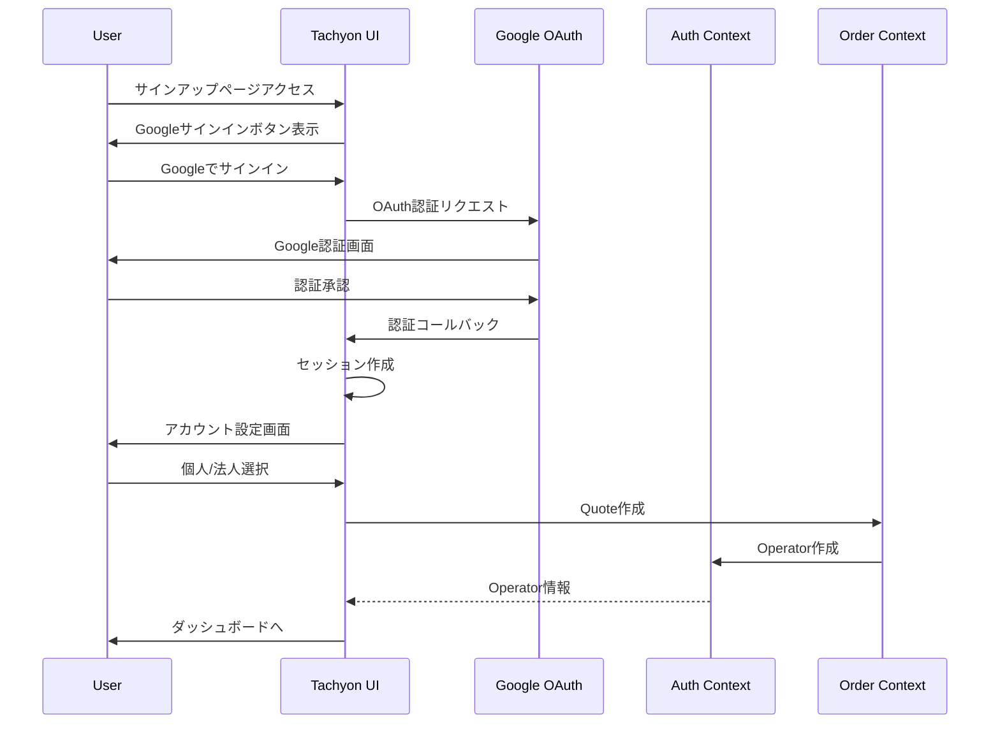
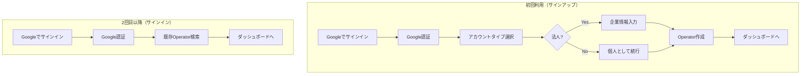

# Tachyon Google OAuth認証実装

## 概要

Tachyonのセルフサービス購入フローにGoogle OAuth認証を導入し、ユーザーがGoogleアカウントでワンクリックサインアップ/サインインできるようにする。

## 背景

現在の課題：
- メールアドレスとパスワードの入力が面倒
- パスワード管理の負担
- アカウント作成のハードルが高い

期待される効果：
- **ワンクリックサインアップ** - Googleアカウントで即座に開始
- **セキュリティ向上** - パスワード不要、Google側の2FA活用
- **コンバージョン改善** - サインアップのハードルを下げる
- **開発効率** - パスワードリセット機能などが不要

## 実装設計

### アーキテクチャ



### 認証フロー



## UI/UX設計

### サインアップページ

```
┌─────────────────────────────────────────────────┐
│           Tachyonを始める                        │
├─────────────────────────────────────────────────┤
│                                                 │
│     ╔═══════════════════════════════╗          │
│     ║  🔵 Googleでサインイン         ║          │
│     ╚═══════════════════════════════╝          │
│                                                 │
│     ─────────── または ───────────               │
│                                                 │
│     [メールアドレスで登録]                       │
│                                                 │
│                                                 │
│ サインインすることで、利用規約とプライバシー      │
│ ポリシーに同意したものとみなされます。           │
└─────────────────────────────────────────────────┘
```

### アカウント設定画面（初回のみ）

```
┌─────────────────────────────────────────────────┐
│ アカウント設定                                   │
├─────────────────────────────────────────────────┤
│                                                 │
│ ようこそ、[Google表示名]さん！                   │
│                                                 │
│ 利用形態を選択してください:                      │
│                                                 │
│ ┌─────────────┐  ┌─────────────┐             │
│ │   👤 個人    │  │   🏢 法人    │             │
│ │             │  │             │             │
│ │ 個人開発や   │  │ チームや    │             │
│ │ 趣味で利用   │  │ 企業で利用   │             │
│ └─────────────┘  └─────────────┘             │
│                                                 │
└─────────────────────────────────────────────────┘

↓ 法人選択時

┌─────────────────────────────────────────────────┐
│ 企業情報                                         │
├─────────────────────────────────────────────────┤
│                                                 │
│ 企業名*: [____________________]                 │
│                                                 │
│ 部署名（任意）: [____________________]          │
│                                                 │
│ Workspace URL:                                  │
│ tachyon.quantumbox.co.jp/v1beta/                │
│ [your-company-name]                             │
│                                                 │
│              [開始する →]                        │
│                                                 │
└─────────────────────────────────────────────────┘
```

## 技術実装

### 1. NextAuth.js設定

```typescript
// apps/tachyon/src/app/api/auth/[...nextauth]/route.ts
import NextAuth from 'next-auth'
import GoogleProvider from 'next-auth/providers/google'

export const authOptions = {
  providers: [
    GoogleProvider({
      clientId: process.env.GOOGLE_CLIENT_ID!,
      clientSecret: process.env.GOOGLE_CLIENT_SECRET!,
      authorization: {
        params: {
          prompt: "consent",
          access_type: "offline",
          response_type: "code"
        }
      }
    })
  ],
  callbacks: {
    async signIn({ user, account, profile }) {
      // 初回サインイン時の処理
      const existingOperator = await findOperatorByEmail(user.email);
      if (!existingOperator) {
        // 新規ユーザーはアカウント設定画面へ
        return '/signup/complete';
      }
      return true;
    },
    async session({ session, token }) {
      // Operator情報をセッションに含める
      if (session.user?.email) {
        const operator = await findOperatorByEmail(session.user.email);
        session.operator = operator;
      }
      return session;
    }
  }
}

const handler = NextAuth(authOptions);
export { handler as GET, handler as POST }
```

### 2. Auth Contextの拡張

```rust
// packages/auth/domain/src/user.rs
#[derive(Debug, Clone, Serialize, Deserialize)]
pub struct OAuthProvider {
    pub provider: String,  // "google", "github", etc.
    pub provider_id: String,
    pub email: String,
    pub name: Option<String>,
    pub picture: Option<String>,
}

// packages/auth/src/usecase/create_user_with_oauth.rs
pub struct CreateUserWithOAuth {
    user_repository: Arc<dyn UserRepository>,
    operator_repository: Arc<dyn OperatorRepository>,
}

impl CreateUserWithOAuth {
    pub async fn execute(&self, input: CreateUserWithOAuthInput) -> Result<User> {
        // 1. OAuth情報でユーザー作成
        let user = User::new_with_oauth(
            input.operator_id,
            input.oauth_provider,
            input.email,
            input.name,
        );
        
        // 2. 保存
        self.user_repository.save(&user).await?;
        
        Ok(user)
    }
}
```

### 3. データベーススキーマ

```sql
-- OAuth認証情報を保存
CREATE TABLE `user_oauth_providers` (
    `id` VARCHAR(32) NOT NULL,
    `user_id` VARCHAR(32) NOT NULL,
    `provider` ENUM('google', 'github', 'microsoft') NOT NULL,
    `provider_id` VARCHAR(255) NOT NULL,
    `email` VARCHAR(255) NOT NULL,
    `name` VARCHAR(255),
    `picture` VARCHAR(500),
    `created_at` TIMESTAMP NOT NULL DEFAULT CURRENT_TIMESTAMP,
    `updated_at` TIMESTAMP NOT NULL DEFAULT CURRENT_TIMESTAMP ON UPDATE CURRENT_TIMESTAMP,
    PRIMARY KEY (`id`),
    UNIQUE KEY `uk_provider_provider_id` (`provider`, `provider_id`),
    FOREIGN KEY (`user_id`) REFERENCES `users` (`id`)
) ENGINE=InnoDB DEFAULT CHARSET=utf8mb4;

-- Operatorテーブルにauth_type追加
ALTER TABLE `operators` 
ADD COLUMN `auth_type` ENUM('email', 'oauth') NOT NULL DEFAULT 'email',
ADD COLUMN `oauth_provider` VARCHAR(50);
```

## セキュリティ考慮事項

1. **OAuth設定**
   - Google Cloud ConsoleでOAuth 2.0クライアントID設定
   - 適切なリダイレクトURI設定
   - クライアントシークレットの安全な管理

2. **セッション管理**
   - JWT tokenの適切な有効期限設定
   - RefreshTokenの安全な保存
   - CSRF対策の実装

3. **権限管理**
   - OAuth scopeの最小権限原則
   - email, profile scopeのみ要求
   - 追加権限が必要な場合は明示的に要求

## 実装フェーズ

### Phase 1: 基本実装（1週間）
- [ ] NextAuth.js導入
- [ ] Google OAuth Provider設定
- [ ] サインイン/サインアップフロー実装
- [ ] セッション管理

### Phase 2: Auth Context統合（3日）
- [ ] OAuthProvider domain model追加
- [ ] CreateUserWithOAuth usecase実装
- [ ] データベースマイグレーション

### Phase 3: UI/UX改善（3日）
- [ ] サインインボタンデザイン
- [ ] アカウント設定画面
- [ ] エラーハンドリング
- [ ] ローディング状態

### Phase 4: テスト・デプロイ（2日）
- [ ] E2Eテスト
- [ ] セキュリティテスト
- [ ] 本番環境設定
- [ ] ドキュメント更新

## 成功指標

- サインアップ完了率: 70%以上（現在: 推定30%）
- サインアップ所要時間: 1分以内（現在: 3-5分）
- パスワードリセット依頼: 90%削減

## 今後の拡張

- GitHub OAuth追加
- Microsoft OAuth追加
- SAML/SSO対応（エンタープライズ向け）
- Magic Link認証

## 参考資料

- [NextAuth.js Documentation](https://next-auth.js.org/)
- [Google OAuth 2.0 Documentation](https://developers.google.com/identity/protocols/oauth2)
- [OAuth 2.0 Security Best Practices](https://datatracker.ietf.org/doc/html/draft-ietf-oauth-security-topics)