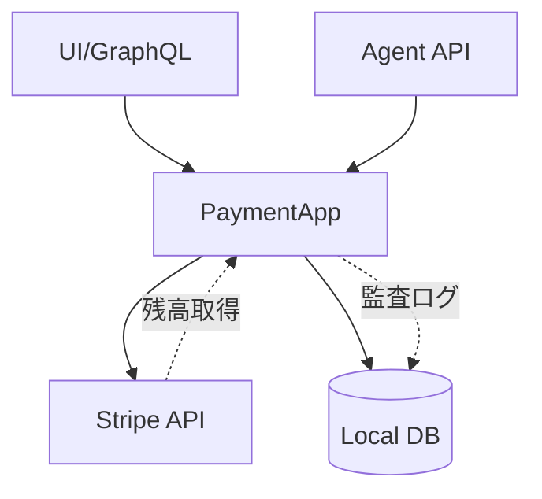

# Stripe APIとローカルDB同期の統一化

## 概要

現在、クレジット残高の取得がStripe APIとローカルDBで異なるソースを参照しているため、不整合が発生している。これを統一して、Stripe APIを単一の情報源（Single Source of Truth）として扱うように改善する。

## 背景・目的

### 現在の問題点

1. **データソースの不整合**
   - GraphQL API (`creditBalance`): Stripe APIから直接取得
   - Agent API (`check_billing`): ローカルDBから取得
   - 同じ残高でも異なる値を返す可能性がある

2. **複雑な同期ロジック**
   - Stripeカスタマーの有無で処理が分岐
   - ローカルDBとStripeの二重管理

3. **ユーザー体験の問題**
   - UIとAPIで異なる残高が表示される可能性
   - 課金チェックと残高表示で不整合

### 解決方針

Stripe APIを常に使用する方式に統一し、ローカルDBは監査ログとしてのみ使用する。

## 詳細仕様

### 機能要件

1. **残高取得の統一**
   - すべての残高取得をStripe API経由に統一
   - `check_billing`も`get_credit_balance`と同じロジックを使用

2. **ローカルDBの役割変更**
   - 残高の正確な情報源としては使用しない
   - トランザクション履歴の記録用として維持
   - 監査ログとして使用

3. **不要なテーブルの削除**
   - `credit_balances`テーブルの削除（Stripeが管理）
   - `credit_transactions`は監査用として維持

### 非機能要件

1. **パフォーマンス**
   - Stripe APIコールの最適化
   - 必要に応じてキャッシュ層の導入を検討

2. **エラーハンドリング**
   - Stripe API障害時の適切なエラー処理
   - リトライロジックの実装

3. **後方互換性**
   - 既存のAPIインターフェースは維持
   - 内部実装のみ変更

## 実装方針

### アーキテクチャ

### 主な変更点

1. **`CheckBillingUseCase`の修正**
   - ローカルDBではなく、Stripe APIから残高を取得
   - `GetBalanceUseCase`と同じロジックを共有

2. **リポジトリの整理**
   - `CreditRepository`の役割を監査ログに限定
   - 残高取得メソッドの削除または非推奨化

3. **マイグレーションの整理**
   - 未使用の`credit_balances`関連マイグレーションの削除

## タスク分解

### フェーズ1: 調査と設計 📝

- [ ] 現在のStripe API使用箇所の洗い出し
- [ ] ローカルDB依存箇所の特定
- [ ] パフォーマンス影響の評価

### フェーズ2: 実装 📝

- [ ] `CheckBillingUseCase`をStripe API使用に変更
- [ ] 共通の残高取得ロジックを抽出
- [ ] エラーハンドリングの実装
- [ ] 不要なマイグレーションファイルの削除

### フェーズ3: テストと検証 📝

- [ ] 単体テストの更新
- [ ] 統合テストの実施
- [ ] 残高不整合が解消されることを確認

### フェーズ4: クリーンアップ 📝

- [ ] 不要なコードの削除
- [ ] ドキュメントの更新
- [ ] パフォーマンス最適化

## テスト計画

### 単体テスト

1. `CheckBillingUseCase`のStripe API使用を確認
2. エラーケースのテスト
3. 残高0での動作確認

### 統合テスト

1. Agent API実行時の課金チェック
2. GraphQL APIとの整合性確認
3. Stripe API障害時の動作

## リスクと対策

### リスク

1. **Stripe API依存度の増加**
   - API制限への到達
   - ネットワーク遅延の影響

2. **既存データの扱い**
   - ローカルDBの既存データとの整合性

### 対策

1. **キャッシュ層の導入**
   - 短時間のキャッシュで API コール数を削減
   - Redis等の導入を検討

2. **段階的な移行**
   - フィーチャーフラグで制御
   - 一部のテナントから段階的に適用

## スケジュール

- 調査・設計: 1日
- 実装: 2日
- テスト: 1日
- リリース準備: 1日

## 完了条件

- [ ] すべての残高取得がStripe API経由になっている
- [ ] UIとAPIで同じ残高が表示される
- [ ] 不要なマイグレーションファイルが削除されている
- [ ] テストがすべてパスしている
- [ ] ドキュメントが更新されている

## 参考資料

- [Stripe Customer Balance API](https://stripe.com/docs/api/customer_balance_transactions)
- 現在の実装: `packages/payment/src/usecase/get_credit_balance.rs`
- 問題の箇所: `packages/payment/src/usecase/check_billing.rs`
