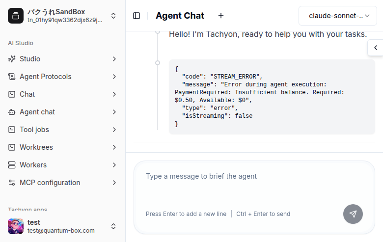
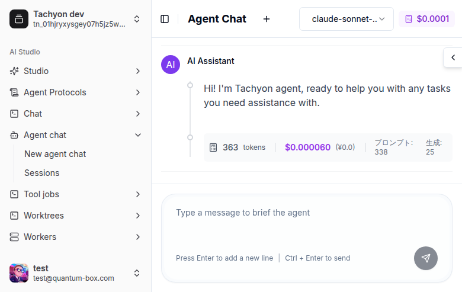

# Agent Chat メッセージ表示が消えるバグの修正

## 概要

Agent Chat でメッセージを送信すると、SSE ストリーミングでチャンクが正常に受信されているにもかかわらず、レスポンスが画面に表示されないバグを修正。

## 背景・目的

- 本番環境でAgent Chatを使用すると、メッセージ送信後にユーザーメッセージもアシスタントの応答も画面から消えてしまう
- ブラウザのコンソールログでは SSE チャンクが正常に受信・蓄積されていることが確認できた
- `AgentStream` コンポーネント自体のレンダリングロジックには問題がなかった

## 原因分析

### 根本原因

`useAgentStream.ts` の `startTask` 関数内 `finally` ブロックで、タスク完了後に `getAgentMessages()` API を呼び出して最新メッセージを再取得する処理がある。この処理が **無条件に** `setChunks(messages)` を実行していたため、以下の問題が発生：

1. 新規セッションでは、バックエンドがまだメッセージを DB に永続化していない場合がある
2. `getAgentMessages()` が空配列を返す
3. `setChunks([])` でSSEで受信済みのチャンクが上書きされ、画面が空になる

### 影響範囲

- Agent Chat の全ユーザー
- 特に新規セッション（チャットルーム作成直後）で確実に再現

## 修正内容

### `useAgentStream.ts` (メイン修正)

`finally` ブロックの `setChunks(messages)` を `messages.length > 0` で条件分岐するガードを追加：

```typescript
// Refetch messages to get proper database IDs for retry/delete.
// Only replace when the API returns messages – the backend may
// not have persisted them yet, and an empty response would wipe
// the SSE-delivered chunks the user just saw.
if (currentChatRoomId) {
    try {
        const messages = await getAgentMessages(
            currentChatRoomId,
            requestContext,
        )
        if (messages.length > 0) {
            setChunks(messages)
        }
    } catch (refetchError) {
        console.error(
            'Failed to refetch messages after task:',
            refetchError,
        )
    }
}
```

### `useToolJobChatStream.ts` (付随修正)

Biome lint エラー（`delete headers['Content-Type']`）を修正：

```typescript
// Before (lint error)
const headers = buildHeaders(accessToken, operatorId, userId)
delete headers['Content-Type']

// After
const { 'Content-Type': _, ...headers } = buildHeaders(accessToken, operatorId, userId)
```

## 動作確認

### 確認日: 2026-03-02

### 環境
- フロントエンド: Next.js dev server (localhost:16000, worktree4)
- バックエンド: Docker tachyon-api (localhost:50254, worktree2)
- Playwright MCP で自動操作

### 確認結果

#### SandBox テナント（残高なし）
1. ✅ サインインが正常に完了
2. ✅ Agent Chat ページへ遷移
3. ✅ メッセージ送信後、ユーザーメッセージが表示される
4. ✅ AI アシスタントの応答「Hello! I'm Tachyon, ready to help you with your tasks.」が表示される
5. ✅ `getAgentMessages` が 404 を返しても（新セッションのため）、SSE チャンクが維持される
6. ✅ 残高不足エラーも適切に表示される（STREAM_ERROR がスタイル付きアラートで表示）

#### Tachyon dev テナント（残高あり）
1. ✅ メッセージ送信後、AI レスポンス「Hi! I'm Tachyon agent, ready to help you with any tasks you need assistance with.」が正常表示
2. ✅ トークン使用量（363 tokens, $0.000060）が正常表示
3. ✅ STREAM_ERROR なし（残高が十分なため正常完了）
4. ✅ `getAgentMessages` が 404 を返しても SSE チャンクが維持される

### スクリーンショット




### `AgentStream.tsx` (エラー表示改善)

SSE の `type: "error"` チャンクが未知のチャンクタイプとして生の JSON で表示されていた問題を修正。スタイル付きアラートで表示するように変更：

```tsx
// Unknown chunk type fallback - handle error type with styled alert
{(chunk as unknown as { type: string }).type === 'error' ? (
    <div className='flex items-start gap-2 rounded-lg border border-red-200 bg-red-50 p-3 text-sm text-red-700 dark:border-red-800 dark:bg-red-950 dark:text-red-300'>
        <AlertCircle className='h-4 w-4 mt-0.5 shrink-0' />
        <span>
            {(chunk as unknown as { message?: string }).message ||
                'An error occurred'}
        </span>
    </div>
) : (
    <pre>...</pre>  // raw JSON fallback for truly unknown types
)}
```

## 品質チェック

- ✅ TypeScript 型チェック: `yarn ts --filter tachyon` pass
- ✅ Biome lint: `yarn lint --filter tachyon` pass

## 完了条件

- [x] 根本原因の特定
- [x] 修正の実装
- [x] TypeScript / lint チェック pass
- [x] Playwright MCP による動作確認
- [x] PR #1302 作成
