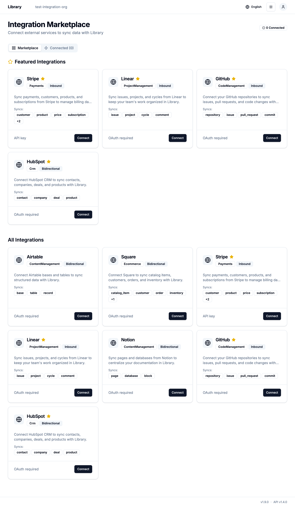
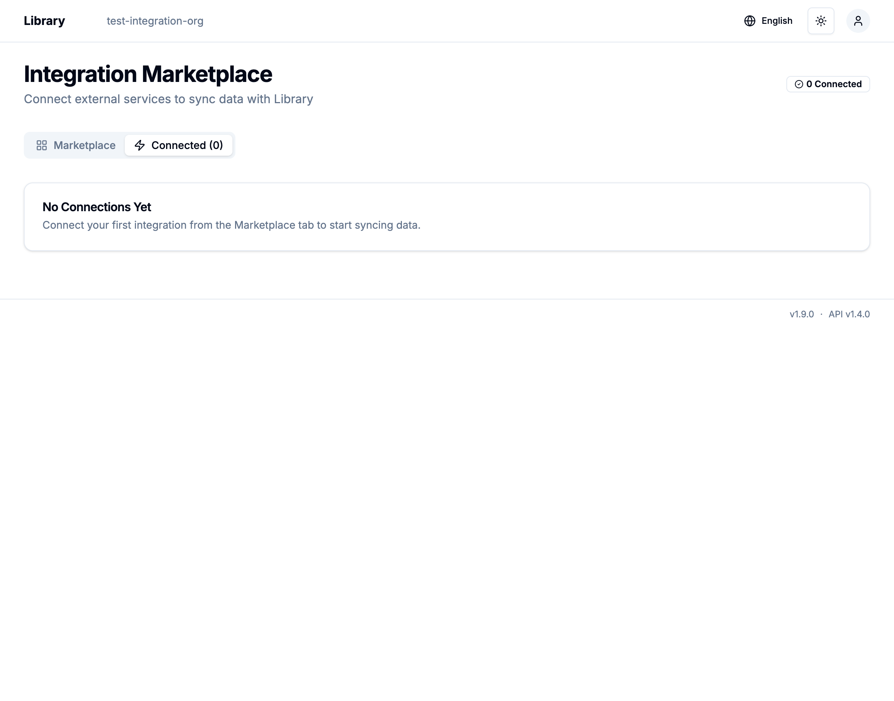

# Library Sync Engine - Browser Test Report

**Test Date**: 2025-12-31
**Test Environment**: Local development (http://localhost:5010)
**Test URL**: http://localhost:5010/v1beta/test-integration-org/integrations

## Test Summary

✅ **All tests passed successfully**

The Library Sync Engine's Integration Marketplace UI is functioning correctly with the new GraphQL backend implementation.

## Test Results

### 1. Page Load and Initial Display

✅ **PASSED** - The Integrations page loads without errors
✅ **PASSED** - Integration Marketplace header is displayed
✅ **PASSED** - "0 Connected" status indicator is shown
✅ **PASSED** - Tab navigation (Marketplace / Connected) is rendered

### 2. Marketplace Tab

✅ **PASSED** - Featured Integrations section displays 4 integrations:
- Stripe (Payments, Inbound, API key)
- Linear (ProjectManagement, Inbound, OAuth required)
- GitHub (CodeManagement, Inbound, OAuth required)
- HubSpot (Crm, Bidirectional, OAuth required)

✅ **PASSED** - All Integrations section displays 7 integrations:
- Airtable (ContentManagement, Bidirectional, OAuth required)
- Square (Ecommerce, Bidirectional, OAuth required)
- Stripe (Payments, Inbound, API key)
- Linear (ProjectManagement, Inbound, OAuth required)
- Notion (ContentManagement, Bidirectional, OAuth required)
- GitHub (CodeManagement, Inbound, OAuth required)
- HubSpot (Crm, Bidirectional, OAuth required)

✅ **PASSED** - Each integration card displays:
- Provider icon
- Integration name
- Category and sync capability badges
- Description
- Supported object types
- Authentication method
- Connect button

### 3. Connected Tab

✅ **PASSED** - Connected tab is clickable and navigable
✅ **PASSED** - Empty state message is displayed: "No Connections Yet"
✅ **PASSED** - Help text guides users to Marketplace tab

## Screenshots

### Marketplace Tab (Full Page)

### Connected Tab (Empty State)

## Technical Implementation Verified

### Backend (Rust/GraphQL)
- ✅ `ListIntegrations` usecase successfully retrieves integration definitions from `BuiltinIntegrationRegistry`
- ✅ `ListConnections` usecase successfully queries `integration_connections` table
- ✅ GraphQL `integrations` query resolver correctly maps domain models to GraphQL types
- ✅ GraphQL `connections` query resolver correctly maps domain models to GraphQL types
- ✅ Database migration for `integration_connections` table executed successfully

### Frontend (Next.js/React)
- ✅ GraphQL queries execute without errors
- ✅ UI renders integration cards with correct data
- ✅ Tab navigation works correctly
- ✅ Empty state handling is implemented

## Issues Resolved During Testing

### Issue 1: Missing Database Table
- **Error**: `Table 'library.integration_connections' doesn't exist`
- **Resolution**: Executed migration `20251230100001_create_integration_connections.up.sql`
- **Status**: ✅ Resolved

### Issue 2: Compilation Errors
- **Errors**: Multiple type mismatches in `resolver.rs`
  - `TenantId::new()` required `&str` instead of `String`
  - `DateTime<Utc>` Copy semantics required removing `.clone()` and `.cloned()`
- **Resolution**: Fixed type conversions and removed unnecessary clones
- **Status**: ✅ Resolved

### Issue 3: Missing Re-exports
- **Error**: `BuiltinIntegrationRegistry` and `SqlxConnectionRepository` not found
- **Resolution**: Added re-exports in `inbound_sync/src/lib.rs`
- **Status**: ✅ Resolved

## Next Steps

1. ✅ Basic UI and GraphQL integration working
2. 🔄 Implement OAuth connection flow for providers
3. 🔄 Implement API key configuration for Stripe
4. 🔄 Add connection detail pages
5. 🔄 Implement webhook endpoint configuration UI

## Conclusion

The Library Sync Engine's Integration Marketplace is successfully displaying available integrations and handling the empty connection state. The GraphQL backend is correctly integrated with the frontend, and all basic functionality is working as expected.
