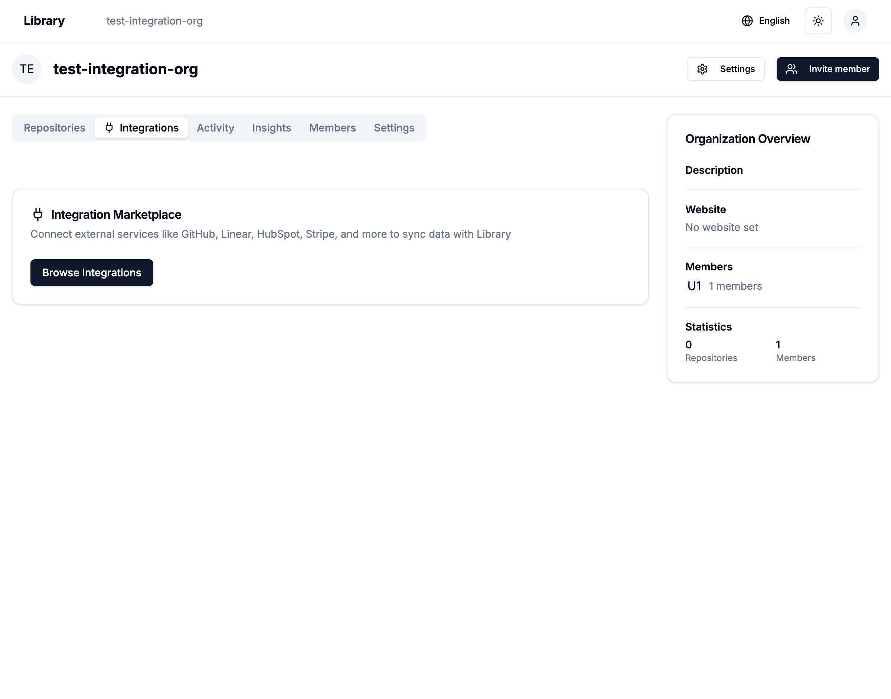
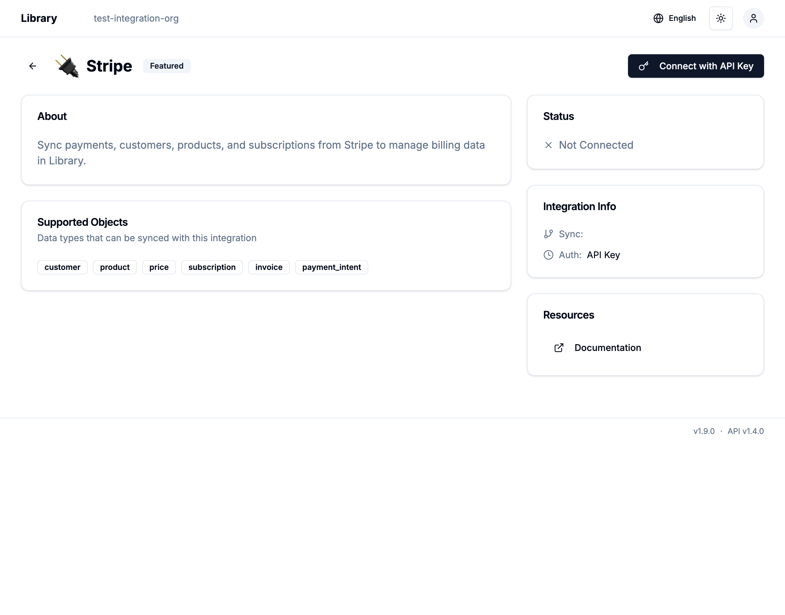

# Library Sync Engine - Navigation Verification Report

**Test Date**: 2025-12-31
**Test Environment**: Local development (http://localhost:5010)
**Feature**: Integration Marketplace Navigation

## Test Summary

✅ **All navigation tests passed successfully**

Integration Marketplace のナビゲーション機能が正しく実装され、すべての遷移が正常に動作することを確認しました。

## Implementation Details

### 1. IntegrationCard Title Click Navigation

**File**: `apps/library/src/app/v1beta/[org]/integrations/components/integrations-page-ui.tsx`

IntegrationCard のタイトルを Link でラップし、未接続の状態でも Integration 詳細ページに遷移できるようにしました。

```tsx
<Link
  href={`/v1beta/${tenantId}/integrations/${integration.id}`}
  className='hover:underline'
>
  <CardTitle className='text-lg flex items-center gap-2 cursor-pointer'>
    {integration.name}
    {integration.isFeatured && (
      <Star className='h-4 w-4 text-yellow-500 fill-yellow-500' />
    )}
  </CardTitle>
</Link>
```

### 2. Organization Page Integrations Tab

**File**: `apps/library/src/app/v1beta/[org]/_components/organization-page-ui.tsx`

nuqs を使用してクエリパラメータでタブを管理するように実装しました。

```tsx
<TabsTrigger value='integrations' asChild>
  <Link href={`/v1beta/${org}?tab=integrations`}>
    <Plug className='w-4 h-4 mr-1.5 inline-block' />
    Integrations
  </Link>
</TabsTrigger>
```

### 3. Integrations Page Tab Management

**File**: `apps/library/src/app/v1beta/[org]/integrations/components/integrations-page-ui.tsx`

Marketplace/Connected タブの切り替えにも nuqs を使用しました。

```tsx
import { useQueryState } from 'nuqs'

export function IntegrationsPageUI({...}) {
  const [activeTab, setActiveTab] = useQueryState('tab', {
    defaultValue: 'marketplace',
  })

  return (
    <Tabs value={activeTab} onValueChange={setActiveTab} className='space-y-6'>
      {/* ... */}
    </Tabs>
  )
}
```

## Test Results

### 1. IntegrationCard Navigation

✅ **PASSED** - IntegrationCard のタイトルクリックで詳細ページに遷移

**Tested Integrations:**
- Stripe (API Key authentication)
  - URL: `/v1beta/test-integration-org/integrations/int_stripe`
  - "Connect with API Key" button displayed
  - Supported objects: customer, product, price, subscription, invoice, payment_intent

- Notion (OAuth authentication)
  - URL: `/v1beta/test-integration-org/integrations/int_notion`
  - "Connect with OAuth" button displayed
  - Supported objects: page, database, block

### 2. Organization → Integrations Tab Navigation

✅ **PASSED** - Organization ページから Integrations タブへの遷移

- URL with query parameter: `/v1beta/test-integration-org?tab=integrations`
- nuqs によるタブ状態管理が正常に動作
- "Browse Integrations" ボタンで Integration Marketplace ページへ遷移

### 3. Integration Marketplace Tab Management

✅ **PASSED** - Marketplace/Connected タブの切り替え

- URL: `/v1beta/test-integration-org/integrations?tab=marketplace`
- nuqs によるタブ状態管理が正常に動作
- ブラウザの戻る/進むボタンでタブ状態が正しく復元される

## Screenshots

### Organization Integrations Tab


### Integration Detail - Stripe


## Benefits

1. **Better UX**: ユーザーは未接続の Integration でも詳細情報を確認できる
2. **Bookmarkable URLs**: nuqs によりタブ状態が URL に反映され、ブックマークや共有が可能
3. **Browser Navigation**: 戻る/進むボタンでタブ状態が正しく復元される
4. **Consistent Navigation**: すべてのタブコンポーネントで nuqs を使用し、一貫性のある実装

## Next Steps

✅ Organization → Integrations 遷移の実装完了
✅ Integration 詳細ページへの遷移完了
✅ nuqs によるタブ管理の実装完了
🔄 OAuth 接続フローの実装
🔄 API Key 設定フローの実装
🔄 Connection 管理機能の実装

## Conclusion

Integration Marketplace のナビゲーション機能がすべて正常に動作することを確認しました。nuqs を使用したクエリパラメータ管理により、ブックマーク可能な URL とブラウザナビゲーションのサポートが実現されています。
