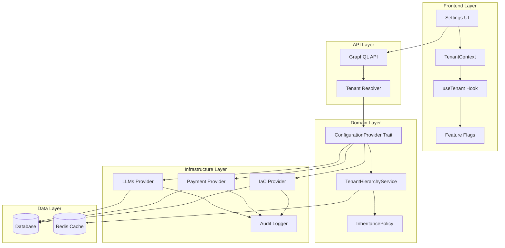
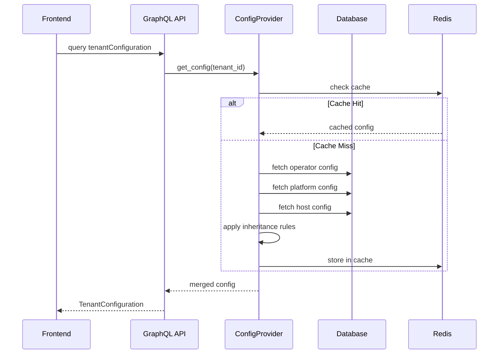
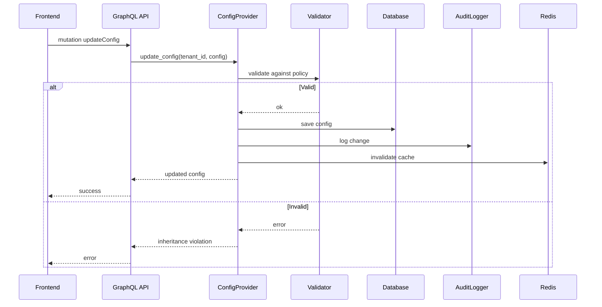

# マルチテナンシー設定管理アーキテクチャ

## 概要

本ドキュメントは、Tachyon Appsにおけるマルチテナンシー設定管理システムのアーキテクチャを説明します。

## アーキテクチャ全体図



## コンポーネント詳細

### 1. Frontend Layer

#### TenantContext
- **責務**: テナント情報の提供
- **実装**: React Context API
- **データ**:
  ```typescript
  interface TenantInfo {
    id: string
    name: string
    type: 'host' | 'platform' | 'operator'
    platformId?: string
    hostId?: string
  }
  ```

#### useTenant Hook
- **責務**: テナント情報と権限の取得
- **依存**: TenantContext, OpenFeature
- **機能**:
  - テナント情報の取得
  - 利用可能な設定の判定
  - Feature Flag評価

#### Settings UI
- **構成**:
  - `/settings` - 設定一覧
  - `/settings/operator` - Operator設定
  - `/settings/platform` - Platform設定
  - `/settings/host` - Host設定

### 2. API Layer

#### GraphQL Schema
```graphql
type Query {
  tenantConfiguration(tenantId: ID!): TenantConfiguration!
  providerConfigHierarchy(tenantId: ID!): ProviderConfigHierarchy!
  billingConfigHierarchy(tenantId: ID!): BillingConfigHierarchy!
  aiUsageConfigHierarchy(tenantId: ID!): AiUsageConfigHierarchy!
}

type Mutation {
  updateProviderConfig(tenantId: ID!, config: ProviderConfigurationInput!): ProviderConfiguration!
  updateBillingConfig(tenantId: ID!, config: BillingConfigurationInput!): BillingConfiguration!
  updateAiUsageConfig(tenantId: ID!, config: AiUsageConfigurationInput!): AiUsageConfiguration!
}
```

### 3. Domain Layer

#### ConfigurationProvider Trait
```rust
#[async_trait]
pub trait ConfigurationProvider: Send + Sync {
    type Config: Serialize + for<'de> Deserialize<'de> + Send + Sync;
    
    async fn get_config(&self, tenant_id: &TenantId) -> Result<Self::Config>;
    async fn get_inheritance_policy(&self) -> Result<InheritancePolicy>;
    async fn get_config_hierarchy(&self, tenant_id: &TenantId) -> Result<ConfigHierarchy<Self::Config>>;
    async fn update_config(&self, tenant_id: &TenantId, config: Self::Config) -> Result<()>;
}
```

#### 継承ルール
```rust
pub enum InheritanceType {
    Mandatory,      // 必須継承
    AllowOverride,  // 完全上書き可能
    AllowSubset,    // 親の範囲内で設定
    AllowExtend,    // 親に追加可能
}
```

### 4. Infrastructure Layer

各コンテキストの実装：

#### IaC Configuration Provider
- **管理対象**: 外部プロバイダー設定
- **継承ルール**:
  - Stripe設定: Mandatory
  - OpenAI設定: Mandatory
  - Keycloak設定: AllowSubset
  - カスタムプロバイダー: AllowOverride

#### Payment Configuration Provider
- **管理対象**: 課金設定
- **継承ルール**:
  - 通貨・税率: Mandatory
  - 月額上限: AllowSubset
  - 無料トライアル: AllowOverride

#### LLMs Configuration Provider
- **管理対象**: AI利用設定
- **継承ルール**:
  - トークン上限: AllowSubset
  - 利用可能モデル: AllowSubset
  - カスタムプロンプト: AllowOverride

## データフロー

### 設定取得フロー



### 設定更新フロー



## 継承メカニズム

### 設定マージアルゴリズム

```rust
fn merge_configs(operator, platform, host, policy) -> Result<Config> {
    let mut result = host; // ベースはHost設定
    
    // Platform設定をマージ
    if let Some(platform) = platform {
        for rule in policy.rules {
            match rule.inheritance_type {
                Mandatory => {
                    // Platform値で強制上書き
                    result[rule.field_path] = platform[rule.field_path];
                }
                AllowSubset => {
                    // Platform値を上限として設定
                    if let Some(op_value) = operator[rule.field_path] {
                        result[rule.field_path] = min(op_value, platform[rule.field_path]);
                    } else {
                        result[rule.field_path] = platform[rule.field_path];
                    }
                }
                _ => {} // その他は後続処理
            }
        }
    }
    
    // Operator設定をマージ
    if let Some(operator) = operator {
        for rule in policy.rules {
            match rule.inheritance_type {
                AllowOverride => {
                    // Operator値で上書き可能
                    result[rule.field_path] = operator[rule.field_path];
                }
                AllowExtend => {
                    // Operator値を追加
                    result[rule.field_path].extend(operator[rule.field_path]);
                }
                _ => {} // 既に処理済み
            }
        }
    }
    
    Ok(result)
}
```

## セキュリティ設計

### 権限モデル

```yaml
permissions:
  host:
    - settings:host:read
    - settings:host:write
    - settings:platform:*
    - settings:operator:*
    
  platform:
    - settings:platform:read
    - settings:platform:write  # 自Platform のみ
    - settings:operator:*      # 配下のOperatorのみ
    
  operator:
    - settings:operator:read
    - settings:operator:write  # 自Operatorのみ
```

### 監査ログ

```rust
pub struct ConfigChangeLog {
    pub id: String,
    pub user_id: String,
    pub tenant_id: String,
    pub category: ConfigCategory,
    pub before_value: Option<Value>,
    pub after_value: Value,
    pub timestamp: DateTime<Utc>,
    pub note: Option<String>,
}
```

## パフォーマンス最適化

### キャッシュ戦略

1. **Redis Cache**
   - TTL: 5分
   - Key: `config:{tenant_id}:{category}`
   - 更新時に関連キャッシュを無効化

2. **階層キャッシュ**
   ```
   Host Config   -> TTL: 1時間（変更頻度低）
   Platform Config -> TTL: 15分
   Operator Config -> TTL: 5分（変更頻度高）
   ```

3. **キャッシュ無効化**
   - 設定更新時に即座に無効化
   - 階層的な無効化（子の更新は親に影響しない）

### クエリ最適化

```sql
-- 効率的な階層取得
WITH RECURSIVE hierarchy AS (
    -- Operator
    SELECT tenant_id, tenant_type, parent_id, 0 as level
    FROM tenant_hierarchy
    WHERE tenant_id = ?
    
    UNION ALL
    
    -- Platform, Host
    SELECT h.tenant_id, h.tenant_type, h.parent_id, hierarchy.level + 1
    FROM tenant_hierarchy h
    INNER JOIN hierarchy ON h.tenant_id = hierarchy.parent_id
)
SELECT * FROM hierarchy ORDER BY level;
```

## 監視とアラート

### メトリクス

```yaml
metrics:
  - name: config_fetch_duration
    type: histogram
    labels: [tenant_type, category]
    
  - name: config_update_count
    type: counter
    labels: [tenant_type, category, status]
    
  - name: inheritance_violation_count
    type: counter
    labels: [field_path, rule_type]
    
  - name: cache_hit_rate
    type: gauge
    labels: [cache_type]
```

### アラート設定

```yaml
alerts:
  - name: high_config_update_rate
    condition: rate(config_update_count) > 100/min
    severity: warning
    
  - name: inheritance_violation_spike
    condition: rate(inheritance_violation_count) > 10/min
    severity: critical
    
  - name: low_cache_hit_rate
    condition: cache_hit_rate < 0.8
    severity: warning
```

## 将来の拡張性

### 検討中の機能

1. **設定テンプレート**
   - 業界別テンプレート
   - カスタムテンプレート作成

2. **設定履歴とロールバック**
   - 変更履歴の保持
   - 特定バージョンへのロールバック

3. **設定プレビュー**
   - 変更前の影響確認
   - ドライラン機能

4. **一括設定更新**
   - 複数Operatorへの一括適用
   - スケジュール実行

5. **設定エクスポート/インポート**
   - YAML/JSON形式でのエクスポート
   - 環境間の設定移行