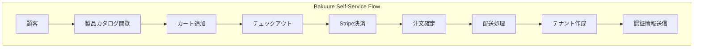
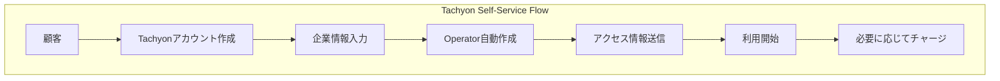
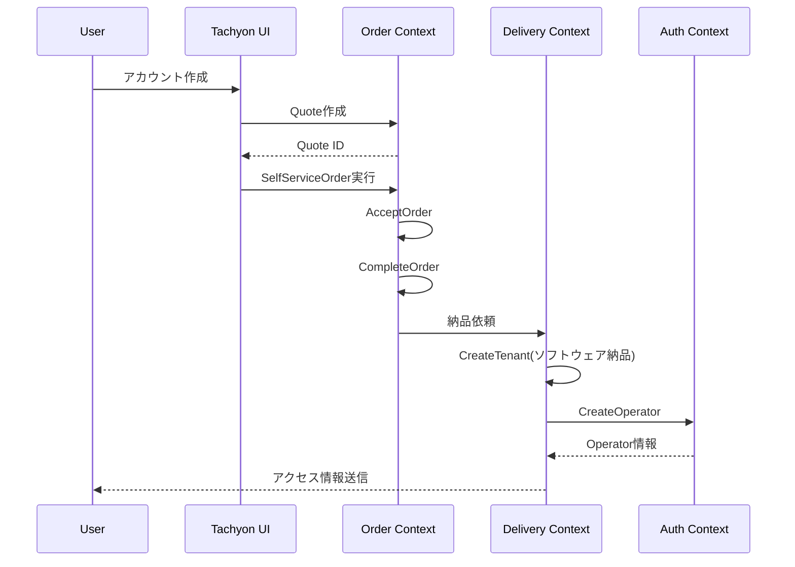
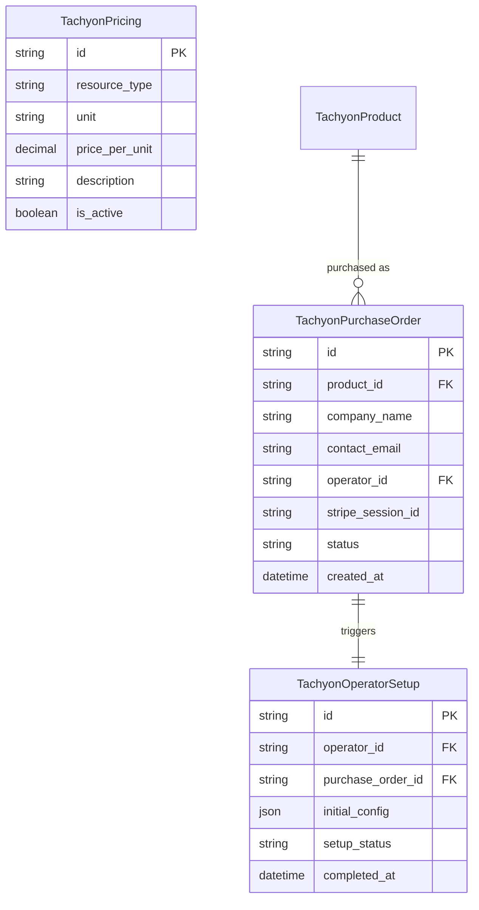
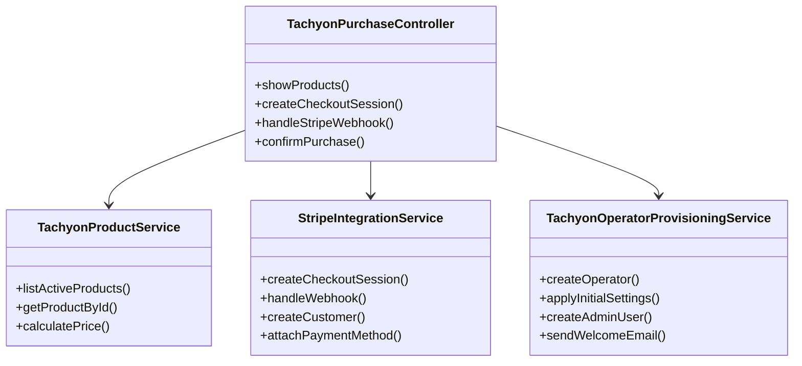
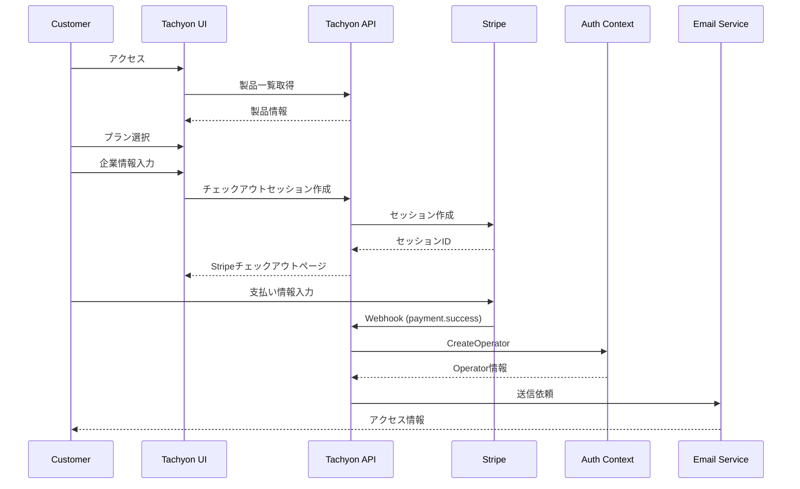

# Tachyonセルフサービス購入機能の実装

## 概要

Tachyonプラットフォーム上で、Tachyon自体のOperator（テナント）をセルフサービスで作成できる機能を実装する。個人開発者から企業まで、誰でも簡単にTachyonを使い始められる従量課金制のサービスとして提供する。

## 背景

現在の状況：
- Tachyon Operatorの作成は手動プロセスが必要
- 企業向けサービスとして展開されているが、個人開発者の需要も高い
- バクうれは既にTachyonプラットフォーム上でセルフサービス購入を実現している

期待される効果：
- 個人開発者も企業も24時間365日いつでもTachyonを開始可能
- サインアップから利用開始まで3分以内
- 初期費用なしで気軽に試せる
- 運用コストの大幅削減

## アーキテクチャ分析

### バクうれのセルフサービス購入フロー



### Tachyonに適用する購入フロー（チャージ式モデル）



## 要件定義

### 機能要件

1. **チャージ式課金モデル**
   - 初期費用なし、事前にクレジットをチャージして使用
   - 価格体系の明確な表示（API呼び出し、ストレージ、トークン使用量など）
   - リアルタイムの残高追跡とダッシュボード
   - クレジット残高が少なくなったら追加チャージ

2. **アカウント作成フロー**
   - アカウントタイプ選択（個人/法人）
   - 基本情報の入力（名前/企業名、メールアドレス）
   - 利用規約への同意

3. **Operator自動作成**
   - 購入完了と同時にOperatorを作成
   - URLフレンドリーなoperator名の自動生成
   - 適切なPlatform配下への配置

4. **初期設定**
   - 管理者ユーザーの作成
   - 基本的なセキュリティ設定
   - 残高アラートの設定（オプション）

5. **通知**
   - 購入確認メール
   - アクセス情報（URL、初期パスワード）
   - オンボーディングガイド

### 非機能要件

1. **パフォーマンス**
   - 購入完了からOperator利用可能まで5分以内
   - 同時購入処理100件/分に対応

2. **可用性**
   - 99.9%のアップタイム
   - 決済失敗時の適切なリトライ

3. **セキュリティ**
   - PCI DSS準拠
   - 初期パスワードの安全な生成と配布
   - 多要素認証の推奨

## 実装設計

### 既存Order Contextの活用

バクうれで既に実装されているOrder Contextを活用して、Tachyonのセルフサービス購入を実現する。



### Delivery Contextのソフトウェア納品対応

現在のDelivery Contextは物理配送に特化しているため、ソフトウェア納品（Operator作成）に対応できるよう拡張する。

```rust
// packages/delivery/domain/src/delivery_type.rs
#[derive(Debug, Clone, Serialize, Deserialize)]
pub enum DeliveryType {
    Physical {       // 物理配送
        address: ShippingAddress,
        tracking_number: Option<String>,
    },
    Software {       // ソフトウェア納品
        access_url: String,
        credentials: SoftwareCredentials,
    },
}

#[derive(Debug, Clone, Serialize, Deserialize)]
pub struct SoftwareCredentials {
    pub operator_id: String,
    pub initial_user_email: String,
    pub temporary_password: Option<String>,
    pub api_key: Option<String>,
}
```

### データモデル



### コンポーネント設計



### 購入フローシーケンス



## UI/UX設計

### 価格表示ページ

```
┌─────────────────────────────────────────────────┐
│                 Tachyon                         │
│    個人から企業まで - 使った分だけお支払い       │
└─────────────────────────────────────────────────┘

┌─────────────────────────────────────────────────┐
│              料金体系                            │
├─────────────────────────────────────────────────┤
│ ✨ 初期費用・月額固定費: ¥0                     │
│                                                 │
│ 📊 API使用料:                                   │
│   • Agent API: ¥0.1/リクエスト + AI料金         │
│   • Chat API: ¥0.05/リクエスト + AI料金         │
│                                                 │
│ 🤖 AI使用料（トークン単位）:                    │
│   • GPT-4: ¥0.003/1Kトークン（入力）            │
│   • GPT-4: ¥0.015/1Kトークン（出力）            │
│   • Claude: ¥0.003/1Kトークン（入力）           │
│   • Claude: ¥0.015/1Kトークン（出力）           │
│                                                 │
│ 💾 ストレージ: ¥10/GB/月                        │
│                                                 │
│         [今すぐ始める →]                         │
└─────────────────────────────────────────────────┘

┌─────────────────────────────────────────────────┐
│           利用例と想定料金                       │
├─────────────────────────────────────────────────┤
│ 👤 個人開発者（趣味プロジェクト）:              │
│    月1,000リクエスト程度 → 月額 ¥100〜500       │
│                                                 │
│ 🏢 スタートアップ（小規模利用）:                │
│    月10,000リクエスト程度 → 月額 ¥1,000〜5,000  │
│                                                 │
│ 🏭 企業（本格利用）:                            │
│    月100,000リクエスト程度 → 月額 ¥10,000〜     │
└─────────────────────────────────────────────────┘
```

### アカウント作成フォーム

```
┌─────────────────────────────────────────────────┐
│ アカウント作成                                   │
├─────────────────────────────────────────────────┤
│ アカウントタイプ:                                │
│ ○ 個人利用                                     │
│ ○ 法人利用                                     │
│                                                 │
│ お名前/企業名: [____________________]           │
│ メールアドレス: [____________________]          │
│ 電話番号（任意）: [____________________]        │
│                                                 │
│ Workspace名（URL）:                             │
│ https://tachyon.quantumbox.co.jp/v1beta/        │
│ [your-workspace-name]                           │
│                                                 │
│ □ 利用規約に同意する                            │
│ □ プライバシーポリシーに同意する                 │
│                                                 │
│              [無料で始める →]                    │
└─────────────────────────────────────────────────┘
```

## 実装詳細

### 1. 価格設定定義（Seed Data）

```sql
-- Tachyon価格マスタ（従量課金）
INSERT INTO pricing (id, resource_type, unit, price_nanodollars, description) VALUES
('pr_agent_api', 'agent_api', 'request', 100000000, 'Agent API実行'),
('pr_chat_api', 'chat_api', 'request', 50000000, 'Chat API実行'),
('pr_gpt4_input', 'token_gpt4', '1k_input_tokens', 3000000, 'GPT-4入力トークン'),
('pr_gpt4_output', 'token_gpt4', '1k_output_tokens', 15000000, 'GPT-4出力トークン'),
('pr_claude_input', 'token_claude', '1k_input_tokens', 3000000, 'Claude入力トークン'),
('pr_claude_output', 'token_claude', '1k_output_tokens', 15000000, 'Claude出力トークン'),
('pr_storage', 'storage', 'gb_month', 10000000000, 'ストレージ使用量');
```

### 2. アカウント作成ページ実装

```typescript
// apps/tachyon/src/app/signup/page.tsx
export default async function SignupPage() {
  const pricing = await getPricingInfo();
  
  return (
    <div className="container mx-auto py-8">
      <h1 className="text-3xl font-bold mb-8">
        Tachyonを始める - 個人でも企業でも
      </h1>
      
      <PricingTable pricing={pricing} />
      
      <SignupForm 
        onSubmit={async (data) => {
          // 1. Operator作成
          const operator = await createOperator({
            ...data,
            type: data.accountType, // 'personal' or 'business'
          });
          
          // 2. Stripe顧客作成（支払い方法は後で設定可）
          if (data.skipPayment !== true) {
            const stripeCustomer = await createStripeCustomer({
              operatorId: operator.id,
              email: data.email,
              type: data.accountType,
            });
          }
          
          // 3. ウェルカムメール送信
          await sendWelcomeEmail(data.email, operator, data.accountType);
        }}
      />
    </div>
  );
}
```

### 3. Tachyon用Product定義

```rust
// packages/catalog/src/seeds/tachyon_products.rs
pub fn seed_tachyon_products() -> Vec<Product> {
    vec![
        Product::new(
            ProductId::new("prod_tachyon_operator"),
            "Tachyon Operator",
            "TachyonプラットフォームのOperatorアカウント",
            ProductType::Software,
            PricingModel::PayAsYouGo,
        ),
    ]
}
```

### 4. Delivery Contextのソフトウェア納品実装

```rust
// packages/delivery/src/usecase/deliver_software.rs
pub struct DeliverSoftware {
    auth_app: Arc<dyn AuthApp>,
    tenant_repository: Arc<dyn TenantRepository>,
    email_sender: Arc<dyn EmailSender>,
}

impl DeliverSoftware {
    pub async fn execute(&self, order: &PurchaseOrder) -> Result<()> {
        // 1. ソフトウェア製品か確認
        let product = order.get_product()?;
        if !product.is_software() {
            return Err(anyhow!("Not a software product"));
        }
        
        // 2. Tachyon Operatorの場合
        if product.id() == "prod_tachyon_operator" {
            self.deliver_tachyon_operator(order).await?
        }
        
        Ok(())
    }
    
    async fn deliver_tachyon_operator(&self, order: &PurchaseOrder) -> Result<()> {
        // 1. Operator名の生成
        let operator_name = generate_operator_name(&order.company_name)?;
        
        // 2. Auth ContextでOperator作成
        let input = CreateOperatorInputData {
            executor: Executor::system(),
            multi_tenancy: MultiTenancy::platform_only(TACHYON_PLATFORM_ID),
            name: order.company_name.clone(),
            operator_name,
            platform_id: TACHYON_PLATFORM_ID,
        };
        
        let operator = self.auth_app
            .create_operator()
            .execute(&input)
            .await?;
        
        // 3. 納品情報を保存
        let delivery = SoftwareDelivery {
            order_id: order.id().clone(),
            delivery_type: DeliveryType::Software {
                access_url: format!("https://tachyon.quantumbox.co.jp/v1beta/{}", operator.id()),
                credentials: SoftwareCredentials {
                    operator_id: operator.id().to_string(),
                    initial_user_email: order.contact_email.clone(),
                    temporary_password: None, // OAuth認証を使用
                    api_key: None,
                },
            },
            delivered_at: Utc::now(),
        };
        
        self.tenant_repository.save_delivery(&delivery).await?;
        
        // 4. アクセス情報をメール送信
        self.send_access_info(&operator, &order.contact_email).await?;
        
        Ok(())
    }
}
```

### 4. Stripeインテグレーション（チャージ式）

```typescript
// apps/tachyon/src/app/api/payment-method/route.ts
export async function POST(request: Request) {
  const { operatorId, companyInfo } = await request.json();
  
  // 顧客作成
  const customer = await stripe.customers.create({
    email: companyInfo.contactEmail,
    name: companyInfo.companyName,
    metadata: {
      operatorId,
      operatorName: companyInfo.operatorName,
    },
  });
  
  // SetupIntentで支払い方法を登録（課金はまだ発生しない）
  const setupIntent = await stripe.setupIntents.create({
    customer: customer.id,
    payment_method_types: ['card'],
    usage: 'off_session', // 後で自動請求するため
  });
  
  return Response.json({ 
    customerId: customer.id,
    clientSecret: setupIntent.client_secret 
  });
}

// クレジットチャージ処理
export async function chargeCredits(operatorId: string, amountJpy: number) {
  const customer = await getStripeCustomer(operatorId);
  
  // チャージ用の支払いインテントを作成
  const paymentIntent = await stripe.paymentIntents.create({
    amount: amountJpy, // JPY単位
    currency: 'jpy',
    customer: customer.id,
    metadata: {
      operatorId,
      type: 'credit_charge',
    },
  });
  
  // 支払い成功後、クレジットを付与
  if (paymentIntent.status === 'succeeded') {
    await grantCredits(operatorId, amountJpy * 1000000000); // JPY→NanoDollar
  }
  
  return paymentIntent;
}
```

## 移行計画

### Phase 0: Delivery Contextソフトウェア納品対応（1週間）
- DeliveryType enumにソフトウェア納品を追加
- deliver_software usecaseの実装
- CreateTenant usecaseのリファクタリング
- ソフトウェア納品用のテーブル設計

### Phase 1: MVP実装（2週間）
- 個人/法人選択可能なアカウント作成フロー
- 支払い方法登録（チャージ時に必須）
- 簡易的な残高追跡
- クレジットチャージ機能

### Phase 2: チャージ機能完全実装（1ヶ月）
- リアルタイム残高追跡
- 複数のチャージ金額オプション
- 残高ダッシュボード
- 残高不足アラート機能

### Phase 3: 拡張機能（2ヶ月）
- 前払いクレジット購入
- 請求書払い対応
- 使用量予測とコスト最適化提案
- チーム別の使用量管理

## セキュリティ考慮事項

1. **決済セキュリティ**
   - Stripe Checkoutによる PCI DSS準拠
   - カード情報の非保持

2. **アクセス制御**
   - 初期パスワードの安全な生成（16文字以上）
   - 初回ログイン時のパスワード変更強制
   - 多要素認証の推奨

3. **データ保護**
   - 個人情報の暗号化
   - GDPRコンプライアンス

## 成功指標

1. **ビジネス指標**
   - セルフサービス購入率: 80%以上
   - 購入完了率: 70%以上
   - 平均購入時間: 10分以内

2. **技術指標**
   - Operator作成成功率: 99.9%
   - 平均プロビジョニング時間: 3分以内
   - システム可用性: 99.9%

## 参考実装

- **Order Context セルフサービス**: `packages/order/src/usecase/self_service_order.rs`
- **Delivery Context**: `packages/delivery/src/usecase/create_tenant.rs`
- **バクうれセルフサービスUI**: `apps/bakuure-ui/src/app/purchase/`
- **Auth Context Operator管理**: `packages/auth/src/usecase/create_operator.rs`

## 重要なポイント

1. **Order Contextの再利用**
   - 既存の`SelfServiceOrder` usecaseを活用
   - Quote作成 → AcceptOrder → CompleteOrderのフローを維持
   - Tachyon用のProductとLineItemRuleを定義

2. **Delivery Contextの拡張**
   - 現在は物理配送専用なので、ソフトウェア納品機能を追加
   - DeliveryTypeにSoftware variantを追加
   - Tachyon Operator作成をDeliveryコンテキスト内で実行

3. **チャージ式課金**
   - 初期クレジットなし
   - 使用量上限なし
   - 必要に応じてクレジットをチャージ

## 更新履歴

- 2025-01-29: 初版作成