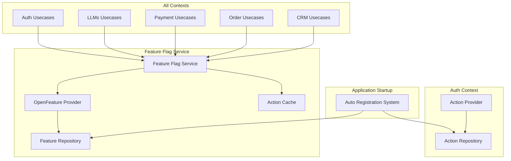

# Policy Action文字列を使用した全Usecaseの Feature Flag Service統合管理

## 概要

現在のPolicy管理システムで定義されているAction文字列（例: `auth:CreateUser`, `llms:ExecuteAgent`, `payment:CheckBilling`など）を活用し、すべてのUsecaseの機能有効/無効をFeature Flag Serviceで統合管理する仕組みを実装します。これにより、既存の107個のActionに対応するUsecaseを、Feature Flagを通じて動的に制御可能にします。

## 背景・目的

### 現状の課題
1. **機能制御の分散**: 各Usecaseの有効/無効制御が統一されていない
2. **動的な機能制御の不足**: デプロイなしでUsecaseの有効/無効を切り替えられない
3. **Action定義の未活用**: 107個のAction定義が権限チェック以外で活用されていない
4. **実験的機能の管理困難**: 新機能のロールアウトやA/Bテストが困難

### 解決したいこと
- すべてのUsecaseをFeature Flag Serviceで統合管理
- 既存のAction文字列を機能識別子として再利用
- 動的な機能の有効化/無効化（デプロイ不要）
- 段階的ロールアウトとA/Bテストの実現
- 緊急時の機能無効化（Kill Switch）

## 詳細仕様

### 機能要件

#### 1. Action文字列をFeature Flagキーとして使用
```rust
// 既存のAction文字列をそのままFeature Flagのキーとして使用
// 例: 107個の既存Action
"auth:CreateUser"           // ユーザー作成機能の有効/無効
"llms:ExecuteAgent"        // Agent API実行の有効/無効
"payment:CheckBilling"     // 課金チェック機能の有効/無効
"order:CreateOrder"        // 注文作成機能の有効/無効
"library:RegisterLibrary"  // ライブラリ登録機能の有効/無効
```

#### 2. Feature Flag Service の拡張
```rust
// Feature Flag Serviceに Action評価機能を追加
#[derive(Debug, Clone)]
pub struct FeatureFlagService {
    feature_repository: Arc<dyn FeatureV2Repository>,
    openfeature_provider: Arc<TachyonFeatureProvider>,
    action_cache: Arc<RwLock<HashMap<String, bool>>>, // Action評価結果キャッシュ
}

impl FeatureFlagService {
    /// Action文字列に基づいて機能の有効/無効を判定
    pub async fn is_action_enabled(
        &self,
        action: &str,
        context: &EvaluationContext,
    ) -> Result<bool> {
        // Action文字列をFeature Flagキーとして評価
        let flag_key = action; // 例: "auth:CreateUser"
        
        // OpenFeature Provider経由で評価
        let result = self.openfeature_provider
            .resolve_boolean_value(flag_key, false, context)
            .await?;
        
        Ok(result.value)
    }
    
    /// 複数Actionの一括評価（パフォーマンス最適化）
    pub async fn evaluate_actions(
        &self,
        actions: &[String],
        context: &EvaluationContext,
    ) -> Result<HashMap<String, bool>> {
        let mut results = HashMap::new();
        
        for action in actions {
            let enabled = self.is_action_enabled(action, context).await?;
            results.insert(action.clone(), enabled);
        }
        
        Ok(results)
    }
}
```

#### 3. 各Usecaseへの Feature Flag チェック組み込み
```rust
// 例: ExecuteAgent Usecase
pub struct ExecuteAgent {
    chat_stream_providers: Arc<ChatStreamProviders>,
    payment_app: Arc<dyn PaymentApp>,
    feature_flag_service: Arc<FeatureFlagService>, // 追加
}

impl ExecuteAgentInputPort for ExecuteAgent {
    async fn execute<'a>(
        &self,
        input: ExecuteAgentInputData<'a>,
    ) -> Result<ChatStreamResponse> {
        // Feature Flagチェック
        let action = "llms:ExecuteAgent";
        let context = EvaluationContext {
            executor: input.executor.clone(),
            multi_tenancy: input.multi_tenancy.clone(),
            tenant_id: input.multi_tenancy.tenant_id(),
            user_id: input.executor.user_id(),
        };
        
        if !self.feature_flag_service.is_action_enabled(action, &context).await? {
            return Err(errors::Error::FeatureDisabled(
                format!("Feature '{}' is currently disabled", action)
            ));
        }
        
        // 既存の処理継続...
    }
}
```

#### 4. Feature Flag 自動登録システム
```rust
/// 起動時にすべてのActionをFeature Flagとして自動登録
pub async fn auto_register_action_flags(
    action_repository: Arc<dyn ActionRepository>,
    feature_repository: Arc<dyn FeatureV2Repository>,
) -> Result<()> {
    let actions = action_repository.find_all().await?;
    
    for action in actions {
        let flag_key = format!("{}:{}", action.context(), action.name());
        
        // Feature Flagが存在しない場合のみ作成
        if feature_repository.find_by_key(&flag_key).await.is_err() {
            let feature = Feature {
                id: FeatureId::new(),
                key: flag_key.clone(),
                name: format!("{} Feature Flag", action.name()),
                description: Some(format!(
                    "Auto-generated feature flag for action: {}",
                    action.description().unwrap_or_default()
                )),
                enabled: true, // デフォルトは有効
                evaluation_strategy: EvaluationStrategy::Boolean,
                variants: vec![],
                target_users: vec![],
                created_at: Utc::now(),
                updated_at: Utc::now(),
            };
            
            feature_repository.save(feature).await?;
        }
    }
    
    Ok(())
}

```

### 非機能要件

1. **パフォーマンス**
   - Action評価結果のキャッシュ（TTL: 60秒）
   - Feature評価の遅延を最小限に抑える（< 5ms）
   - 起動時の自動登録は非同期で実行

2. **互換性**
   - 既存のUsecase実装への最小限の変更
   - Feature Flagチェックの追加は段階的に実施可能
   - チェックなしでも動作する後方互換性

3. **監査とモニタリング**
   - Feature Flag評価ログの記録
   - 無効化された機能の実行試行を記録
   - メトリクス収集（評価回数、有効/無効の比率）

4. **テスタビリティ**
   - MockFeatureFlagServiceの実装
   - Action有効/無効のテストモード
   - 統合テストでの Feature Flag 制御

## 実装方針

### アーキテクチャ



### 技術選定

1. **依存性注入**: `Arc<FeatureFlagService>` を各Usecaseに注入
2. **Action識別子**: 既存の `context:Name` 形式をそのまま使用
3. **キャッシュ戦略**: 
   - L1: メモリ内LRUキャッシュ（TTL: 60秒）
   - L2: Redis キャッシュ（TTL: 5分）
4. **エラーハンドリング**: `FeatureDisabled` エラータイプを追加

### データベース設計

#### Feature Flags テーブル（既存テーブルを活用）
```sql
-- Action文字列をkeyとして使用するため、既存テーブルをそのまま利用
-- feature_flags.key カラムに "auth:CreateUser" のような値を格納

-- 初期データ投入例
INSERT INTO `feature_flags` (`id`, `key`, `name`, `description`, `enabled`) VALUES
('fe_01HJRYXYSGEY07H5JZ5W00001', 'auth:CreateUser', 'Create User Feature', 'Controls user creation functionality', true),
('fe_01HJRYXYSGEY07H5JZ5W00002', 'llms:ExecuteAgent', 'Execute Agent Feature', 'Controls agent execution functionality', true),
('fe_01HJRYXYSGEY07H5JZ5W00003', 'payment:CheckBilling', 'Check Billing Feature', 'Controls billing check functionality', true);
```

### 依存関係の整理
```yaml
feature_flag:
  depends_on:
    - auth (Action Repository を参照)
    - errors (エラー型定義)
  
各Context (auth, llms, payment, etc.):
  depends_on:
    - feature_flag (FeatureFlagService を利用)
```

## タスク分解

### フェーズ1: Feature Flag Service 基盤整備 📝
- [ ] FeatureFlagService に `is_action_enabled` メソッド追加
- [ ] Action評価結果のキャッシュ機構実装（LRU + Redis）
- [ ] EvaluationContext の拡張（Executor/MultiTenancy対応）
- [ ] FeatureDisabled エラータイプの追加

### フェーズ2: Action自動登録システム 📝
- [ ] `auto_register_action_flags` 関数の実装
- [ ] 起動時の自動登録フック追加（main.rs）
- [ ] Action Repository から Feature Flag への同期
- [ ] 初期データ投入スクリプト作成（107個のAction）

### フェーズ3: 重要Usecaseへの統合（第1弾） 📝
- [ ] `llms:ExecuteAgent` - Agent API実行の Feature Flag 制御
- [ ] `payment:CheckBilling` - 課金チェックの Feature Flag 制御
- [ ] `auth:CreateUser` - ユーザー作成の Feature Flag 制御
- [ ] `order:CreateOrder` - 注文作成の Feature Flag 制御

### フェーズ4: 全Usecaseへの展開 📝
- [ ] Auth Context の全22個のUsecaseに統合
- [ ] LLMs Context の全25個のUsecaseに統合
- [ ] Payment Context の全5個のUsecaseに統合
- [ ] Order Context の全21個のUsecaseに統合
- [ ] その他Context（CRM、IAC、Library等）への統合

### フェーズ5: 管理UI実装 📝
- [ ] Action一覧画面（107個のActionをFeature Flagとして表示）
- [ ] Action単位での有効/無効トグル機能
- [ ] テナント別のオーバーライド設定
- [ ] 一括有効化/無効化機能（緊急Kill Switch）

### フェーズ6: モニタリングとテスト 📝
- [ ] Feature Flag評価メトリクスの実装
- [ ] 無効化された機能の実行試行ログ
- [ ] パフォーマンステスト（< 5ms基準）
- [ ] 統合テスト（各Contextのサンプルケース）
- [ ] ドキュメント作成

## テスト計画

### 単体テスト
- FeatureFlagService の `is_action_enabled` メソッドテスト
- キャッシュヒット/ミスのテスト
- Action自動登録のテスト

### 統合テスト
```rust
#[tokio::test]
async fn test_usecase_with_feature_flag() {
    // Setup
    let feature_flag_service = create_test_feature_flag_service().await;
    let llms_app = create_test_llms_app(feature_flag_service.clone()).await;
    
    // Feature Flagを無効化
    feature_flag_service.set_action_enabled("llms:ExecuteAgent", false).await;
    
    // ExecuteAgent実行 - FeatureDisabledエラーが返るはず
    let result = llms_app.execute_agent(/* ... */).await;
    assert!(matches!(result, Err(errors::Error::FeatureDisabled(_))));
    
    // Feature Flagを有効化
    feature_flag_service.set_action_enabled("llms:ExecuteAgent", true).await;
    
    // ExecuteAgent実行 - 正常に実行されるはず
    let result = llms_app.execute_agent(/* ... */).await;
    assert!(result.is_ok());
}

#[tokio::test]
async fn test_auto_registration() {
    // Action Repository に新しいActionを追加
    let action = Action::new("test", "TestAction", "Test description");
    action_repository.save(action).await.unwrap();
    
    // 自動登録実行
    auto_register_action_flags(action_repository, feature_repository).await.unwrap();
    
    // Feature Flagが作成されているか確認
    let feature = feature_repository.find_by_key("test:TestAction").await.unwrap();
    assert_eq!(feature.key(), "test:TestAction");
    assert!(feature.enabled());
}
```

### パフォーマンステスト
- 107個のAction評価時間測定（目標: < 5ms/評価）
- キャッシュ効果測定（キャッシュヒット率 > 95%）
- 並行アクセス時のレスポンス時間（1000 req/s）

## 進捗ログ

### 2025-09-23
- FeatureFlagAppに`ensure_enabled`を追加し、`FeatureFlagEvaluation`でExecutor/MultiTenancy情報とAction文字列を束ねて評価できるようにした（Noop実装も用意）。
- `feature_flag::App`でAction→flag keyの候補解決と評価ロジックを実装し、OpenFeature戦略／Variant設定を尊重したブール判定を返すようにした。
- Tachyon APIのDIレイヤーでFeatureFlagApp本体をそのまま注入し、`procurement:ListProcurementPrices`の評価も既存ユースケースのロジックを再利用する構成に整理した。
- 調達価格一覧ユースケースをAuth/FeatureFlag依存で再構成し、GraphQL層からExecutor/MultiTenancyを渡してポリシー検証＋Feature Flag判定を挟むフローへ更新した。
- `errors::Error`に`is_forbidden`/`is_not_found`/`is_bad_request`を追加し、既存テストをメソッドベースの検証へリライトして新しいハンドリングに追随させた。

### 2025-09-24
- `EnsureFeatureEnabled`ユースケースがAction／リソースパターン／コンテキスト単位の候補キーを順次評価し、非活性時は`permission_denied!`、未登録時は`not_found!`を返す実装で取り込まれていることを確認。
- 調達ドメインの`ListProcurementPrices`でポリシー判定後にFeature Flagチェックを必須にしており、ProcurementAppビルダー経由で`FeatureFlagApp`が依存注入されている。
- OpenFeatureプロバイダーはL1メモリキャッシュ（TTL 60秒）付きで稼働し、エグゼキューションメトリクスを`MetricsCollector`へ送出する構成になっている。
- A/Bテスト系やRedisキャッシュ層、Action自動登録フロー、主要ユースケース（LLMs/Payment/Authなど）への展開は未着手のまま。

### 2025-09-25
- GraphQL `featureFlagActionAccess` クエリを追加し、Executor/MultiTenancyのコンテキストでポリシー検証＆Feature Flag判定をバッチ実行できるようにした。戻り値にはフラグ有効／権限可否に加えてエラーメッセージを含む。App Schema・Codegen・TypeScriptクライアントを更新。
- Next.js 側でサイドメニュー定義を `sidebar-config.ts` に集約し、取得した `featureFlagActionAccess` 結果でグループ／アイテムをフィルタリングする実装に入れ替え。モジュール向けの Vitest (`sidebar-config.test.ts`) を追加し、個別に `corepack yarn --cwd apps/tachyon vitest run ...` で確認済み。
- `AuthApp::check_policy` の入力を `&str` 参照に拡張し、GraphQL層から動的なアクション文字列でも利用可能にした。既存の `check_actions` 補助は削除し、既存ユースケースはそのまま `check_policy` を呼ぶ構成を維持。
- Feature Flag SDK/GraphQL 層で `EnsureFeatureEnabled` ユースケースを組み込み、Feature Flag アプリ生成は `App::new` 直呼びに整理。関連するサンプル/ツールも `auth_app` 注入後に初期化するよう修正。
- EvaluateFeatureFlagActions ユースケースを追加し、GraphQL層ではメニュー用のアクション配列をユースケースへ委譲するだけに整理。ポリシー判定と Feature Flag 判定がユースケース内で一貫して行われ、エラーメッセージ/コンテキストもここで生成するよう統合した。

### 2025-09-26
- EvaluateFeatureFlagActions で `AuthApp::evaluate_policies_batch` を利用し、複数アクションの認可結果を一括取得するように改修。アダプタ層のバッチ評価が 1 回のポリシーRPCで完結するため、重複アクションの処理と通信コストを削減できるようになった。
- EvaluateFeatureFlagActions のユニットテストを追加し、ポリシー一括評価のパス・Feature Flag 停止時のエラーパス・空配列取り扱いを検証。

## 検証

### ✅ Playwright (2025-09-26)
- `scripts/seeds/n1-seed/009-feature-flags.yaml` に `context.auth` / `context.llms` / `context.order` / `context.payment` の Feature Flag を追加し、`cargo run -p yaml-seeder -- apply dev scripts/seeds/n1-seed`（本番は `apply prod`）で `tn_01hjjn348rn3t49zz6hvmfq67p` テナントへ投入。
- ブラウザで `http://localhost:16000/sign_in` にアクセスし、`test` / `hmw2atd@HCF3qwu*rcn` でサインイン。
- `http://localhost:16000/v1beta/tn_01hjjn348rn3t49zz6hvmfq67p` に遷移し、サイドバーに `AI Studio` / `IaC` / `Self Service` / `IAM` / `Feature Flags` / `Billing` / `Pricing` / `Procurement` / `Settings` が表示されることを確認。
- `Feature Flags` → `Flag Management` を開き、Feature Flag 一覧が正しく表示されることを確認。
- `scripts/seeds/n1-seed/008-auth-policies.yaml` に `feature_flag:CreateFeatureFlag` / `UpdateFeatureFlag` / `ToggleFeatureFlag` / `DeleteFeatureFlag` を追加し、`TenantAdminPolicy` / `AdminPolicy` で `allow` 設定。`cargo run -p yaml-seeder -- apply dev scripts/seeds/n1-seed`（本番は `apply prod`）で適用。
- Playwright MCP で Feature Flag 一覧を表示し、新規作成 → 編集 → トグル → 削除の操作がそれぞれ成功することを確認（`toast` の成功メッセージおよび一覧の反映を確認）。

## リスクと対策

### リスク1: パフォーマンス劣化
**対策**: 
- 多層キャッシュ（L1: メモリ、L2: Redis）
- Action評価の並列化
- デフォルト有効で、チェック失敗時のみ無効化

### リスク2: 既存システムへの影響
**対策**:
- Feature Flagチェックはオプトイン方式（段階的導入）
- チェックなしでも動作する後方互換性
- フェーズ別の段階的ロールアウト

### リスク3: 誤った無効化による障害
**対策**:
- 重要機能のProtection（無効化不可フラグ）
- 変更履歴と即座のロールバック機能
- Dry-runモードでの事前確認

### リスク4: 管理の複雑化
**対策**:
- Action単位の明確な管理UI
- カテゴリ別（Context別）の表示
- 一括操作とフィルタリング機能

## スケジュール

- **フェーズ1**: 2日間（Feature Flag Service基盤）
- **フェーズ2**: 1日間（Action自動登録）
- **フェーズ3**: 2日間（重要Usecase統合）
- **フェーズ4**: 5日間（全Usecase展開）
- **フェーズ5**: 3日間（管理UI）
- **フェーズ6**: 2日間（モニタリング・テスト）
- **バッファ**: 2日間

**合計見積もり**: 17日間

## 完了条件

1. ✅ 107個のActionがすべてFeature Flagとして登録されている
2. ✅ 重要Usecase（ExecuteAgent、CheckBilling等）でFeature Flag制御が動作
3. ✅ Action単位での有効/無効切り替えが可能
4. ✅ パフォーマンステストで基準値（< 5ms/評価）をクリア
5. ✅ キャッシュヒット率が95%以上
6. ✅ 管理UIから107個のActionの状態管理が可能
7. ✅ 統合テストがすべてパス
8. ✅ ドキュメントとマイグレーションガイドが完成

## 実装メモ

### 考慮事項
- **Action命名の一貫性**: 既存の `context:Name` 形式を厳守
- **デフォルト有効**: 新規Actionは基本的に有効状態で登録
- **緊急時対応**: Kill Switchとして全機能無効化も可能に
- **監査要件**: 誰がいつどのActionを有効/無効にしたかの記録

### 参考実装
- `packages/auth/domain/src/service/check_policy.rs` - Action定義の参照元
- `packages/feature_flag/src/openfeature/provider.rs` - OpenFeature統合
- `scripts/n1_seed_policy_data.sql` - 107個のAction定義リスト

### 具体的なAction例（107個から抜粋）
```yaml
Auth Context (22個):
  - auth:CreateUser
  - auth:InviteUser
  - auth:CreateOperator
  - auth:CreateServiceAccount
  
LLMs Context (25個):
  - llms:ExecuteAgent
  - llms:ResumeAgent
  - llms:CreateChatroom
  - llms:SendChatMessage
  
Payment Context (5個):
  - payment:CheckBilling
  - payment:CreateCheckoutSession
  - payment:CreatePaymentIntent
  
Order Context (21個):
  - order:CreateOrder
  - order:UpdateOrder
  - order:CancelOrder
  
Library Context (15個):
  - library:RegisterLibrary
  - library:SearchLibraries
  - library:UpdateLibrary
```

### 今後の拡張
- **段階的ロールアウト**: パーセンテージベースの有効化
- **A/Bテスト統合**: Feature Flagの変種機能との連携
- **自動化**: 負荷に応じた自動的な機能制限
- **分析**: Action使用頻度とパフォーマンスの相関分析
