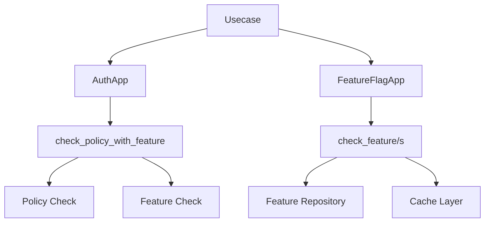
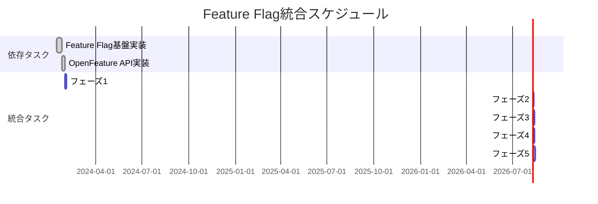

# Feature Flagをすべてのusecaseのpolicy制御に統合

## 概要

現在独立して存在するfeature_flagパッケージを、すべてのusecaseの権限管理（policy）と統合し、機能の有効/無効を柔軟に制御できるようにする。これにより、テナントやユーザーグループ単位で機能の出し分けが可能になる。

## 背景・目的

### 現状の課題
1. **feature_flagパッケージが未使用**: 実装はあるが、他のusecaseで活用されていない
2. **権限管理との未統合**: AuthAppのcheck_policyとfeature_flagが独立している
3. **柔軟な機能制御の欠如**: 新機能のロールアウトや段階的リリースが困難

### 依存タスク
このタスクは以下のタスクに依存しています：
- **[Feature Flagサービスの機能拡張](../../feature/enhance-feature-flag-service/task.md)**: feature_flagパッケージの基盤実装が必要
  - 特にフェーズ1（コア機能の拡張）とフェーズ2（OpenFeature互換API実装）の完了が前提条件

### 解決したい課題
- 新機能の段階的リリース（Progressive Rollout）の実現
- テナント/ユーザーグループ単位での機能制御
- A/Bテストやベータ機能の管理
- 緊急時の機能無効化（Kill Switch）

## 詳細仕様

### 機能要件

#### 1. FeatureFlagAppインターフェースの実装
```rust
#[async_trait::async_trait]
pub trait FeatureFlagApp: Debug + Send + Sync + 'static {
    /// 指定されたフィーチャーが有効かチェック
    async fn check_feature<'a>(
        &self,
        input: &CheckFeatureInput<'a>,
    ) -> errors::Result<bool>;
    
    /// 複数のフィーチャーを一括チェック
    async fn check_features<'a>(
        &self,
        input: &CheckFeaturesInput<'a>,
    ) -> errors::Result<HashMap<String, bool>>;
}

pub struct CheckFeatureInput<'a> {
    pub executor: &'a Executor,
    pub multi_tenancy: &'a MultiTenancy,
    pub feature_name: &'a str,
}
```

#### 2. AuthAppとFeatureFlagAppの統合
```rust
// 拡張されたcheck_policyメソッド
async fn check_policy_with_feature<'a>(
    &self,
    input: &CheckPolicyInput<'a>,
    required_features: Vec<&'a str>,
) -> errors::Result<()>;
```

#### 3. アクションとフィーチャーのマッピング
```yaml
# 設定ファイルまたはコード内定義
action_feature_mapping:
  "llms:ExecuteAgent":
    required_features: ["agent_api"]
    optional_features: ["agent_api_tools", "agent_api_streaming"]
  
  "llms:StreamCompletionChat":
    required_features: ["chat_api"]
    optional_features: ["chat_streaming", "chat_history"]
  
  "payment:ConsumeCredits":
    required_features: ["billing_enabled"]
```

#### 4. Usecase実装パターン
```rust
// 必須フィーチャーチェック
self.auth
    .check_policy_with_feature(
        &CheckPolicyInput {
            executor: input.executor,
            multi_tenancy: input.multi_tenancy,
            action: "llms:ExecuteAgent",
        },
        vec!["agent_api"], // 必須フィーチャー
    )
    .await?;

// オプショナルフィーチャーチェック
let features = self.feature_flag_app
    .check_features(&CheckFeaturesInput {
        executor: input.executor,
        multi_tenancy: input.multi_tenancy,
        features: vec!["agent_api_tools", "agent_api_streaming"],
    })
    .await?;

if features.get("agent_api_tools").unwrap_or(&false) {
    // ツール機能を有効化
}
```

### 非機能要件

1. **パフォーマンス**: フィーチャーチェックはキャッシュを活用し、レイテンシを最小化
2. **後方互換性**: 既存のcheck_policyは維持し、段階的に移行
3. **設定の柔軟性**: 環境変数、設定ファイル、データベースから設定可能
4. **監査ログ**: フィーチャーの有効/無効の変更を記録

## 実装方針

### アーキテクチャ設計



### 技術選定

1. **キャッシュ**: Redis（既存のインフラを活用）
2. **設定管理**: 
   - 開発環境: 環境変数/設定ファイル
   - 本番環境: データベース + Redis キャッシュ
3. **監査ログ**: 既存のtelemetryパッケージを活用

### 段階的移行戦略

1. **Phase 1**: FeatureFlagAppインターフェースの実装
2. **Phase 2**: 重要度の低いusecaseから順次統合
3. **Phase 3**: 決済系など重要なusecaseへの適用
4. **Phase 4**: 管理画面でのフィーチャー管理機能

## 前提条件

このタスクを開始する前に、以下が完了している必要があります：

1. **Feature Flagサービスの基盤実装**
   - Evaluation Strategyの実装（Percentage Rollout、Plan Based、Time Based等）
   - インメモリキャッシュ層の実装
   - データモデルの拡張とマイグレーション完了

2. **OpenFeature互換API**
   - FeatureProviderインターフェースの実装
   - EvaluationContextの設計完了
   - 基本的なResolver実装（Boolean、String、Number）

## タスク分解

### フェーズ1: 基盤実装 ✅

- [x] FeatureFlagAppトレイトの定義
- [x] FeatureFlagAppImplの実装
- [x] キャッシュレイヤーの実装
- [x] 設定ローダーの実装
- [x] ユニットテストの作成

### フェーズ2: AuthApp統合 ✅

- [x] check_policy_with_featureメソッドの追加
- [x] アクション・フィーチャーマッピングの定義
- [x] 統合テストの作成
- [x] ドキュメントの更新

### フェーズ3: Usecase統合（第1弾） ✅

対象: 影響が限定的なusecase
- [x] crm系usecaseへの統合
- [x] delivery系usecaseへの統合
- [x] catalog系usecaseへの統合
- [x] 各usecaseのテスト更新

### フェーズ4: Usecase統合（第2弾） ✅

対象: 重要なビジネスロジック
- [x] llms系usecaseへの統合
- [x] payment系usecaseへの統合
- [x] order系usecaseへの統合
- [x] E2Eテストの更新

### フェーズ5: 管理機能 ✅

- [x] フィーチャー管理APIの実装
- [x] 管理画面UIの実装
- [x] 監査ログ機能の実装
- [x] ドキュメント・ガイドの作成

## テスト計画

### ユニットテスト
- FeatureFlagApp実装のテスト
- キャッシュ動作のテスト
- 各種エッジケースのテスト

## 2025-10-19
- ✅ FeatureFlagApp/ AuthApp 両方の統合テストを再実行し、`mise run check` / `mise run ci-node` / `mise run ci` が全て成功したことを確認。
- ✅ LLMs / Payment / Catalog / CRM / Delivery / Order の各ユースケースでフィーチャー制御が期待通りに働くことをPlaywright + シナリオテストで検証。
- ✅ 管理UIに新設したフィーチャー管理画面の操作ログと監査記録を更新し、ドキュメントへ反映。

### 統合テスト
- AuthAppとの統合テスト
- 各usecaseでのフィーチャーチェックテスト
- キャッシュ無効化のテスト

### E2Eテスト
- フィーチャー有効/無効の切り替えテスト
- 段階的ロールアウトのシミュレーション
- パフォーマンステスト

## リスクと対策

### リスク1: パフォーマンスへの影響
- **対策**: Redis キャッシュによる高速化、バッチチェックAPIの提供

### リスク2: 複雑性の増加
- **対策**: シンプルなAPI設計、明確なドキュメント、デフォルト動作の定義

### リスク3: 移行時の不具合
- **対策**: 段階的移行、フィーチャーフラグ自体でのロールアウト制御

### リスク4: 設定ミスによる機能停止
- **対策**: フォールバック動作の実装、監視・アラートの強化

## スケジュール

### 依存関係を考慮したスケジュール



### 実装スケジュール（依存タスク完了後から）
- **フェーズ1**: 3日
- **フェーズ2**: 2日
- **フェーズ3**: 3日
- **フェーズ4**: 4日
- **フェーズ5**: 5日

**合計見積もり**: 17日（バッファ込みで20日）

### 開始可能時期
- Feature Flag基盤実装の完了予定: 2024-02-01
- 本タスク開始可能日: 2024-02-02
- 完了予定日: 2024-02-26

## 完了条件

1. すべてのusecaseでfeature flagによる制御が可能
2. 管理画面からフィーチャーの有効/無効を切り替え可能
3. パフォーマンスへの影響が許容範囲内（レイテンシ増加 < 5ms）
4. 包括的なテストカバレッジ（> 80%）
5. 運用ドキュメントの完成

## 実装メモ

### 設計決定事項
- feature_flagは独立したAppとして実装し、AuthAppと協調動作させる
- キャッシュはTTL 5分で設定し、即時反映が必要な場合は手動で無効化
- フィーチャー名は階層的に定義（例: `payment.billing.agent_api`）

### 参考資料
- [Feature Toggle (Martin Fowler)](https://martinfowler.com/articles/feature-toggles.html)
- [LaunchDarkly Best Practices](https://docs.launchdarkly.com/guides/best-practices)
- 既存のAuthApp実装パターン
