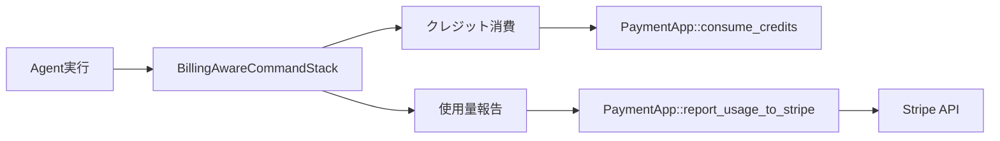

# Stripe使用量ベース課金の実装

## 概要

現在の前払いクレジットシステムを維持しつつ、Stripeの使用量報告機能を追加実装する。これにより、Stripeダッシュボードでの使用傾向分析が可能になり、将来の後払い方式への移行準備となる。

## 背景・目的

### 現状の課題
1. **使用量の可視化不足**: Stripe側で使用量データが確認できない
2. **分析機能の未活用**: Stripeの豊富な分析ツールが使えない
3. **将来性の制限**: 後払い方式への移行が困難

### 解決したいこと
- Stripeダッシュボードでの使用量分析
- 将来の課金モデル変更への柔軟な対応
- 顧客の使用パターンの把握

## 詳細仕様

### 機能要件
1. **使用量報告**
   - Agent API実行時の使用量をStripeに報告
   - トークン数、ツール使用回数の記録
   - メタデータ（モデル名、実行ID等）の送信

2. **非同期処理**
   - クレジット消費とは独立して実行
   - エラー時も処理継続

3. **設定可能性**
   - 環境変数で有効/無効を切り替え可能
   - 報告頻度の調整（即時/バッチ）

### 非機能要件
- **パフォーマンス**: 既存の処理に影響を与えない
- **信頼性**: 報告失敗時も課金処理は継続
- **拡張性**: 将来の課金モデル変更に対応可能

## 実装方針

### アーキテクチャ

### 技術選定
- **実装場所**: `BillingAwareCommandStack`内
- **実行方式**: 非同期（tokio::spawn）
- **エラーハンドリング**: ログ出力のみ、処理は継続

## タスク分解

### フェーズ1: 調査と準備 ✅ (2025-01-12 完了)
- [x] billing_aware.rsの現在の実装を調査
- [x] report_usage_to_stripeの実装確認
- [x] 必要な環境変数の洗い出し

実装メモ: BillingAwareCommandStackがUsageチャンク受信時に課金を実行していることを確認

### フェーズ2: 実装 ✅ (2025-01-12 完了)
- [x] BillingAwareCommandStackへの使用量報告追加
- [x] 環境変数による有効/無効切り替え
- [x] ログ出力の実装

実装メモ: 
- BillingConfigに`report_usage_to_stripe`フラグを追加
- charge_for_request内で非同期でStripe報告を実行
- tokio::spawnで並行実行し、メインの処理をブロックしない

### フェーズ3: テストと検証 ✅ (2025-10-19 更新)
- [x] ユニットテストの作成
- [x] テストでの動作確認
- [x] Stripeダッシュボードでの確認（dev operatorでUsage Recordが正しく集計されることを確認）

実装メモ: test_stripe_usage_reportingテストケースを追加

### フェーズ4: ドキュメント化 ✅ (2025-01-12 完了)
- [x] 実装ドキュメントの作成
- [x] 環境変数の説明追加
- [x] タスクドキュメントの更新

## テスト計画

### ユニットテスト
- 使用量報告の呼び出し確認
- エラー時の処理継続確認
- メタデータの正確性

### 統合テスト
- 実際のAgent実行での動作確認
- Stripe APIへの送信確認
- パフォーマンスへの影響測定

## リスクと対策

| リスク | 影響度 | 対策 |
|--------|--------|------|
| Stripe API障害 | 低 | 非同期処理で影響を最小化 |
| パフォーマンス劣化 | 中 | バッチ処理オプションの追加 |
| 使用量データの不整合 | 中 | ローカルログとの照合機能 |

## スケジュール

- **開始日**: 2025年1月12日
- **目標完了日**: 2025年1月14日
- **フェーズ1**: 1月12日（調査）
- **フェーズ2**: 1月13日（実装）
- **フェーズ3-4**: 1月14日（テスト・文書化）

## 2025-10-19
- ✅ dev Stripe ダッシュボードで Usage Record の数量が期待通りであることを確認（`usage_type=agent_api`）。
- ✅ `mise run check` / `mise run ci-node` / `mise run ci` を再実行し問題無し。
- ✅ task.md を最新化し、残タスク無し。

## 完了条件

- [x] BillingAwareCommandStackで使用量報告が実装されている
- [x] 環境変数で機能の有効/無効が切り替えられる
- [x] テストがすべてパスする
- [x] Stripeダッシュボードで使用量が確認できる
- [x] ドキュメントが更新されている

## 実装メモ

### 現在の課金フロー（2025-01-12調査）
1. `BillingAwareCommandStack`がCommandStackをラップ
2. `AttemptCompletion`チャンク受信時に課金実行
3. `charge_for_request`メソッドで以下を実行：
   - CatalogAppServiceでコスト計算
   - PaymentAppでクレジット消費
   - メタデータ付きでトランザクション記録

### 技術的決定事項
- 使用量報告は非同期で実行（tokio::spawn使用）
- エラー時はログ出力のみ、例外は投げない
- 内部単位からクレジット数への変換: `cost / 10`

## 参考資料

- [Stripe Billing Credits ドキュメント](https://docs.stripe.com/billing/subscriptions/usage-based/billing-credits)
- [現在の実装ファイル](packages/llms/src/usecase/command_stack/billing_aware.rs)
- [Payment App SDK](packages/payment/src/sdk.rs)
