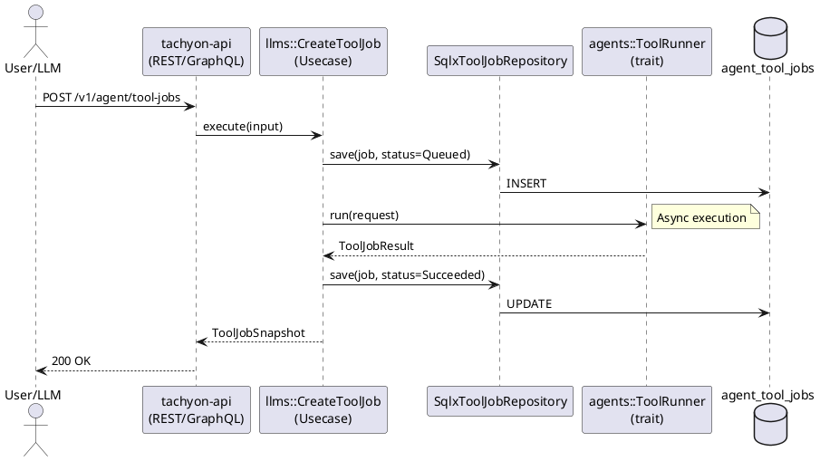

# agents crateのステートレス化リファクタリング

## 概要

`packages/agents` crateをステートレスな実行レイヤーに再設計し、Tool Jobの状態管理・永続化・オーケストレーション責務を`packages/llms` crateに移行する。これにより、agents crateを再利用可能なライブラリとして確立し、データソースの一元管理とアーキテクチャの明確化を実現する。

## 背景・目的

### 現在の問題点
1. **データソースの分散**
   - Agent API経由で作成されたTool JobはToolJobManagerのメモリ内HashMap
   - REST API経由で作成されたTool Jobはファイルシステム + DB（実装中）
   - UI（`/ai/tool-jobs`）ではREST API作成分のみ表示される

2. **責務の不明瞭さ**
   - `ToolJobManager`が状態管理（HashMap）、永続化（filesystem、DB）、実行（CLI起動）を全て担当
   - agents crateが特定のアプリケーション（tachyon-api）に密結合

3. **テスタビリティの低下**
   - ステートフルなManagerのテストが複雑
   - 依存関係が多く、モックが困難

### 期待される成果
1. **agents crateの再利用性向上**: 純粋なツール実行ライブラリとして他プロジェクトでも利用可能
2. **データの一元管理**: llms crateでAgent実行とTool Jobを統合管理
3. **アーキテクチャの明確化**: 実行（agents）vs 管理（llms）の責務分離
4. **テスタビリティ向上**: agents側は純粋関数的な実行ロジックのみ

## 詳細仕様

### 機能要件

#### agents crateの責務（ステートレス化後）
```yaml
responsibilities:
  - ToolRunner trait定義と実装
    - CodexRunner: CodeX CLI実行
    - ClaudeCodeRunner: Claude Code CLI実行
    - CursorAgentRunner: Cursor Agent CLI実行
  - CLI起動ロジック
  - JSON結果のパース・正規化
  - ドメインモデル定義
    - ToolJobCreateRequest
    - ToolJobResult
    - NormalizedOutput
    - ToolJobBilling

excluded_responsibilities:
  - 状態管理（ToolJobManager削除）
  - 永続化（repository、persistence削除）
  - REST APIエンドポイント（axumアダプター削除）
  - ステータス遷移管理
```

#### llms crateの責務（新規追加）
```yaml
new_responsibilities:
  - Tool Job状態管理
    - Queued → Running → Succeeded/Failed/Cancelled
    - ステートマシンの実装
  - Tool Job永続化
    - ToolJobRepository trait
    - SqlxToolJobRepository実装
    - agent_tool_jobsテーブル管理
  - Usecase層
    - CreateToolJob: Job作成とキュー投入
    - GetToolJob: Job情報取得
    - ListToolJobs: Job一覧取得
    - CancelToolJob: Job中止
    - HandleToolJobCallback: 完了コールバック処理
  - Agent実行との統合
    - AgentExecutionStateとの連携
    - AgentToolJobResultテーブル管理
    - Resume APIでのJob結果取り込み
```

### 非機能要件

1. **後方互換性**: 既存のAgent API、REST APIのインターフェースは維持
2. **パフォーマンス**: リファクタリング前後で性能劣化なし
3. **テスタビリティ**: 各層で独立したユニットテスト実行可能
4. **保守性**: 責務の明確化により、変更の影響範囲が限定的

### コンテキスト別の責務

```yaml
contexts:
  agents:
    description: "ステートレスなツール実行レイヤー"
    responsibilities:
      - ToolRunner trait定義
      - CLI実行と結果正規化
      - ドメインモデル（Request/Result）
    dependencies:
      - codex_provider
      - claude_code
      - value_object
      - errors

  llms:
    description: "Agent & Tool Job管理レイヤー"
    responsibilities:
      - Tool Job状態管理とステートマシン
      - Tool Job永続化（Repository）
      - Usecase層（Create/Get/List/Cancel）
      - Agent実行状態との統合
      - コールバック処理
    dependencies:
      - agents (ToolRunner使用)
      - auth (PolicyCheck)
      - payment (Billing)
      - persistence (Database)

  tachyon_api:
    description: "外部APIエントリーポイント"
    responsibilities:
      - REST/GraphQLエンドポイント提供
      - ヘッダー検証とDI
      - llms Usecaseへの委譲
    dependencies:
      - llms
      - agents (型定義のみ)
```

### データフロー（リファクタリング後）



## 実装方針

### TDD（テスト駆動開発）戦略

#### 既存動作の保証
- [ ] 現在のAgent API統合テストを維持（`agent_verification_loop_test.yaml`）
- [ ] Tool Job REST APIテストを維持（`tool_job_rest.yaml`）
- [ ] Idempotency-Keyテストを維持（`agent_idempotency_test.yaml`）
- [ ] 各テストがリファクタリング前後で同じ結果を返すことを確認

#### テストファーストアプローチ
- [ ] llms側のToolJobUsecaseテストを先に書く（Red → Green → Refactor）
- [ ] agents側のToolRunnerテストを独立して実行可能に
- [ ] Repository層のテストでDB永続化を検証

#### 継続的検証
- [ ] 各コミットで`mise run check`が成功
- [ ] シナリオテストが全て通過（`mise run docker-scenario-test`）
- [ ] カバレッジが低下しないことを確認

### アーキテクチャ設計

#### Phase 1: llms側のインフラ整備
```yaml
tasks:
  - ToolJobRepository trait定義（llms/domain/src/tool_job_repository.rs）
  - SqlxToolJobRepository実装（llms/src/interface_adapter/gateway/）
  - agent_tool_jobsテーブルマイグレーション（既存）の確認
  - ToolJobドメインモデルをllmsに追加（or agentsから参照）
```

#### Phase 2: Usecase層の実装
```yaml
tasks:
  - CreateToolJob Usecase
    - PolicyCheck（agents:CreateToolJob）
    - Billing見積もりと検証
    - ToolRunner実行（agents crateから使用）
    - Repository保存
  - GetToolJob Usecase
    - Repository取得
    - 権限検証
  - ListToolJobs Usecase
    - Operator/User単位のフィルタリング
  - CancelToolJob Usecase
    - 実行中Jobの中止
    - Status更新
  - HandleToolJobCallback Usecase（既存拡張）
    - Repository経由で状態更新
```

#### Phase 3: API層の切り替え
```yaml
tasks:
  - apps/tachyon-api/src/router.rsの修正
    - agents::axumからllms::usecaseへの切り替え
  - packages/llms/src/usecase/command_stack/tool_executor.rsの修正
    - ToolJobManagerからCreateToolJob Usecaseへの切り替え
  - DIレイヤーの整理
    - ToolJobRepositoryの注入
    - shared_tool_job_managerの削除
```

#### Phase 4: agents crateのクリーンアップ
```yaml
tasks:
  - ToolJobManagerの削除
  - storage.rsの削除（filesystem persistence）
  - repository.rsの削除
  - adapter/axum.rsの削除
  - lib.rsからの不要なexport削除
  - Cargo.tomlの依存整理（sqlx削除）
```

### 技術選定

- **既存技術の活用**: SQLx、async-graphql、axumなど既存スタックを継続使用
- **新規依存なし**: 新しいライブラリ導入は最小限
- **パターン**: Clean Architecture、DDD（既存パターンを踏襲）

## タスク分解

### Phase 1: llms側のインフラ整備 ✅
- [x] ToolJobRepository trait定義
- [x] SqlxToolJobRepository実装
- [x] マイグレーション確認と修正（`20251223180000_create_tool_jobs_table.up.sql`）
- [x] ToolJobドメインモデルのllmsへの追加/参照

### Phase 2: Usecase層の実装 ✅
- [x] CreateToolJob Usecase実装
- [x] GetToolJob Usecase実装
- [x] ListToolJobs Usecase実装
- [x] CancelToolJob Usecase実装
- [x] HandleToolJobCallback拡張

### Phase 3: API層の切り替え ✅
- [x] tachyon-api/router.rs修正
- [x] llms/command_stack/tool_executor.rs修正（tool_job_managerをOptional化）
- [x] DIレイヤー整理
- [x] REST APIハンドラー移行（llms/adapter/axum/tool_jobs/）
- [x] レスポンスラッパー型追加（ToolJobDetailResponse, ToolJobProvidersResponse）
- [x] list_providersエンドポイント追加

### Phase 4: agents crateのクリーンアップ ✅
- [x] ToolJobManager削除
- [x] 不要なモジュール削除（storage, repository, axum, usecase, manager）
- [x] Cargo.toml依存整理（sqlx, axum, utoipa-axum削除）
- [x] lib.rs整理（ToolRunner/job関連のexportのみに）

### Phase 5: テストと品質確認 ✅
- [x] シナリオテスト全件実行（`mise run docker-scenario-test`）- **25件全て成功** ✅
- [x] `mise run check`成功 ✅
- [x] `mise run ci-rust`成功 ✅ (236テスト中235成功、1つはignore)
- [ ] `mise run ci-node`失敗 - **library#ts neverthrow未インストール問題**（本リファクタリングとは無関係）
- [ ] パフォーマンス劣化なし確認

## スケジュール

AI Coding活用により、実装は1日以内に完了予定。

## リスクと対策

| リスク | 影響度 | 対策 |
|--------|--------|------|
| 既存テストの破損 | 高 | Phase 1完了時点で全テスト実行、破損検出 |
| データマイグレーション不要の確認 | 中 | 既存データはメモリ内のため、DB新規作成で問題なし |
| DIレイヤーの複雑化 | 中 | Repository注入を統一的に実装、テスト容易性確保 |
| agents crateの既存利用箇所 | 低 | ToolRunnerは維持されるため、外部への影響なし |

## 参考資料

- [tachyon-agent-autonomous-coding-loop task.md](../tachyon-agent-autonomous-coding-loop/task.md)
- [Clean Architecture](https://blog.cleancoder.com/uncle-bob/2012/08/13/the-clean-architecture.html)
- 既存実装:
  - `packages/agents/src/manager.rs`
  - `packages/llms/src/usecase/execute_agent.rs`
  - `packages/llms/src/usecase/command_stack/tool_executor.rs`

## 完了条件

- [x] agents crateがステートレス（ToolRunner traitのみ提供）
- [x] llms crateでTool Job管理完結（Repository、Usecase、ステートマシン）
- [x] 全シナリオテスト成功（`mise run docker-scenario-test`）- 25件通過
- [x] `mise run check`および`mise run ci-rust`成功 ✅ (ci-nodeはlibrary#ts neverthrow問題で失敗、本リファクタリングとは無関係)
- [x] 既存のAgent API、REST APIが同じ動作を維持
- [x] UI（`/ai/tool-jobs`）でAgent経由のTool Jobも表示可能
- [x] ドキュメント更新（本taskdoc更新済み）

### バージョン番号の決定基準

このタスクが完了した際のバージョン番号の上げ方：

**マイナーバージョン（x.X.x）を上げる:**
- [x] 内部アーキテクチャの大幅な変更
- [x] 既存機能の大幅な改善（データソース一元化）
- [x] 外部インターフェースは維持（後方互換性あり）

リファクタリングだが、アーキテクチャの大幅な変更のため**マイナーバージョン**を上げる。

## 備考

### 依存関係の方向性
```
agents (ステートレス実行)
  ↑ 使用
llms (管理・永続化)
  ↑ 呼び出し
tachyon-api (エントリーポイント)
```

### 移行後のディレクトリ構造
```
packages/
├── agents/
│   ├── src/
│   │   ├── lib.rs (ToolRunner exportのみ)
│   │   ├── runner.rs (trait定義)
│   │   ├── codex_runner.rs
│   │   ├── claude_runner.rs
│   │   ├── cursor_agent_runner.rs
│   │   └── job.rs (Request/Resultドメインモデル)
│   └── Cargo.toml (sqlx依存削除)
│
└── llms/
    ├── domain/src/
    │   └── tool_job_repository.rs (新規)
    ├── src/
    │   ├── usecase/
    │   │   ├── create_tool_job.rs (新規)
    │   │   ├── get_tool_job.rs (新規)
    │   │   ├── list_tool_jobs.rs (新規)
    │   │   └── cancel_tool_job.rs (新規)
    │   ├── interface_adapter/
    │   │   └── gateway/
    │   │       └── sqlx_tool_job_repository.rs (新規)
    │   └── adapter/
    │       └── axum/
    │           └── tool_job_handler.rs (新規: REST endpoint)
    └── Cargo.toml (agents依存追加)
```

### 既存コードの再利用
- `ToolJobManager::create_job`のロジック → `CreateToolJob::execute`に移植
- `JobState`の状態遷移 → llms側のステートマシンに統合
- `ToolJobSnapshot` → llms側のドメインモデルとして再定義または参照

## 実装メモ（2024-12-24）

### 主要な実装ファイル（新規/修正）

#### llms側（新規追加）
- `packages/llms/migrations/20251223180000_create_tool_jobs_table.up.sql` - DBマイグレーション
- `packages/llms/src/repository.rs` - ToolJobRepository trait定義
- `packages/llms/src/adapter/gateway/tool/sqlx_tool_job_repository.rs` - SQLx実装
- `packages/llms/src/usecase/create_tool_job.rs` - 作成ユースケース
- `packages/llms/src/usecase/get_tool_job.rs` - 取得ユースケース
- `packages/llms/src/usecase/list_tool_jobs.rs` - 一覧ユースケース
- `packages/llms/src/usecase/cancel_tool_job.rs` - キャンセルユースケース
- `packages/llms/src/adapter/axum/tool_jobs/` - REST APIハンドラー群
  - `mod.rs` - ルーター定義、OpenAPI統合
  - `create_tool_job_handler.rs`
  - `get_tool_job_handler.rs`
  - `list_tool_jobs_handler.rs`
  - `cancel_tool_job_handler.rs`
  - `list_providers_handler.rs`
  - `model.rs` - レスポンス型定義

#### agents側（削除済み）
- `packages/agents/src/manager.rs` - ToolJobManager（削除）
- `packages/agents/src/storage.rs` - ファイルシステム永続化（削除）
- `packages/agents/src/adapter/` - axumハンドラー群（削除）
- `packages/agents/src/usecase/` - ユースケース群（削除）

#### agents側（残存）
- `packages/agents/src/lib.rs` - ToolRunner、job関連の型のみexport
- `packages/agents/src/job.rs` - ToolJobCreateRequest、ToolJobSnapshot等のドメインモデル
- `packages/agents/src/runner.rs` - ToolRunner trait

### 実装上の気づき・変更点

1. **レスポンスラッパー追加**
   - シナリオテスト期待値に合わせて`ToolJobDetailResponse { job }` / `ToolJobProvidersResponse { providers }`を追加
   - `get_job`が直接`ToolJobResponse`を返していたのを修正

2. **list_providersエンドポイント**
   - agents crateから移行漏れしていたため新規追加
   - 静的なプロバイダーリスト（Codex, ClaudeCode, CursorAgent）を返す

3. **tool_job_managerのOptional化**
   - `llms::App`の`tool_job_manager`を`Option<Arc<ToolJobManager>>`に変更
   - `tool_executor.rs`でOptionalハンドリング追加
   - CLI向けなど、DB不要な環境でもAppを構築可能に

4. **モックメソッド追加（既存テスト修正）**
   - `catalog::RecordingAuthApp`に`add_user_to_tenant`メソッド追加
   - `auth::MockUserPolicyMappingRepositoryImpl`に`find_by_resource_scope`メソッド追加

### CI失敗の既知問題（本リファクタリングとは無関係）

**解決済み**: `library-api`のSQLxオフラインキャッシュ問題
- `sqlx::query!`マクロを`sqlx::query`に変更して解決

**未解決**: `library#ts` TypeScriptビルドエラー
- `neverthrow`モジュールが見つからないエラー
- 本リファクタリングとは無関係の既存問題

### テストコードの修正（SQLxオフラインキャッシュ問題対応）

テストコード内で`sqlx::query!`マクロをraw query（`sqlx::query`）に変更し、オフラインキャッシュ依存を解消:
- `library-api/organization_repository.rs` - DELETEクエリ
- `llms/adapter/gateway/` 配下の複数リポジトリテスト - INSERT/DELETEクエリ

## 今後の対応（Phase 6: アーキテクチャ改善）

### 背景
mainブランチとのコンフリクト解消時、mainのAgentProtocol対応（`agent_protocol_tool`フィールド追加）を優先した。
本ブランチで実装した`with_tool_job_usecases`によるDIパターンは一旦マージを見送り、以下の改善を後続タスクとして対応する。

### 提案: ToolAccessConfigへの統合

現状、ツール関連の設定が分散している：
- `tool_access: ToolAccessConfig` - filesystem/command/create_tool_job/agent_protocolの有効化フラグ
- `agent_protocol_tool: Option<AgentProtocolToolContext>` - AgentProtocolのツールコール用コンテキスト

**改善案**: 両方ともツール関連なので`ToolAccessConfig`に統合する

```rust
// 現状
pub struct ExecuteAgentInputData {
    pub tool_access: ToolAccessConfig,
    pub agent_protocol_tool: Option<AgentProtocolToolContext>,
}

// 改善後
pub struct ToolAccessConfig {
    pub filesystem: bool,
    pub command: bool,
    pub create_tool_job: bool,
    pub agent_protocol: bool,
    pub agent_protocol_context: Option<AgentProtocolToolContext>, // 追加
}
```

### 後続タスク
- [x] `ToolAccessConfig`への`agent_protocol_context`統合 ✅ (2024-12-24 完了)
- [x] `with_tool_job_usecases`パターンの再導入（ExecuteAgent/ResumeAgentへのDI改善）✅ (2024-12-24 完了)
- [x] テスタビリティ向上のためのモック容易化 ✅ (2024-12-24 完了)

### Phase 6 実装メモ (2024-12-24)

`agent_protocol_tool`を`ToolAccessConfig.agent_protocol_context`に統合:

**変更ファイル:**
- `packages/llms/src/usecase/command_stack/types.rs` - `AgentProtocolToolContext`を追加
- `packages/llms/src/usecase/command_stack/tool_access.rs` - `agent_protocol_context`フィールド追加
- `packages/llms/src/usecase/execute_agent.rs` - `agent_protocol_tool`フィールド削除
- `packages/llms/src/usecase/mod.rs` - re-export更新
- `packages/llms/src/adapter/axum/agent_handler.rs` - `tool_access_config.agent_protocol_context`に変更
- `apps/tachyon-code/src/agent_builtin.rs` - 不要なフィールド削除
- examples (`resume_agent.rs`, `agent_with_billing.rs`) - 不要なフィールド削除

### with_tool_job_usecases パターン再導入 (2024-12-24)

`ExecuteAgent`と`ResumeAgent`にToolJob Usecaseを注入するDIパターンを追加:

**変更ファイル:**
- `packages/llms/src/usecase/execute_agent.rs` - `create_tool_job`, `get_tool_job`, `cancel_tool_job`フィールドと`with_tool_job_usecases`メソッド追加
- `packages/llms/src/app.rs` - ToolJobRepository作成、CreateToolJob/GetToolJob/CancelToolJob Usecase作成、ExecuteAgent/ResumeAgentに注入

**実装詳細:**
```rust
// ExecuteAgent構造体にToolJob Usecaseフィールドを追加
pub struct ExecuteAgent {
    // 既存フィールド...
    create_tool_job: Option<Arc<crate::usecase::CreateToolJob>>,
    get_tool_job: Option<Arc<crate::usecase::GetToolJob>>,
    cancel_tool_job: Option<Arc<crate::usecase::CancelToolJob>>,
}

// Builderパターンで注入
impl ExecuteAgent {
    pub fn with_tool_job_usecases(
        mut self,
        create: Arc<CreateToolJob>,
        get: Arc<GetToolJob>,
        cancel: Arc<CancelToolJob>,
    ) -> Self { /* ... */ }
}
```

**テスタビリティ:**
- ToolJob UsecaseはOption型でデフォルトNone
- テスト時は`with_tool_job_usecases`を呼ばずにテスト可能
- モックを使わなくてもToolJob機能をスキップしてテストできる
