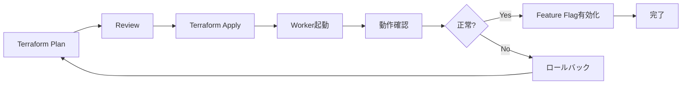

# Deploy Tool Job Worker on ECS Fargate Spot

## 概要

Tool Job Worker を ECS Fargate Spot にデプロイし、Upstash Redis と連携させて本番環境で Tool Job 機能を利用可能にする。コスト効率と可用性を両立したインフラ構成を Terraform で実装する。

## 背景・目的

### 現状
- Feature flag により本番環境で Tool Job 機能が無効化されている
- Redis と Worker プロセスが本番環境に未デプロイ
- 開発環境では Docker Compose で動作確認済み

### 目的
1. **本番対応**: Tool Job 機能を本番環境で利用可能にする
2. **コスト最適化**: Fargate Spot で 67% のコスト削減
3. **Infrastructure as Code**: Terraform で再現可能な構成を実現
4. **スケーラビリティ**: 需要に応じてスケール可能な設計

### 期待される成果
- 本番環境で Coding Agent 機能が利用可能
- 月額コスト: 約 $7/月（2台構成）
- インフラ構成の Git 管理

## 詳細仕様

### システム構成

```yaml
components:
  queue:
    # 開発環境: Redis (docker-compose)
    redis:
      provider: Local Redis
      url: "redis://localhost:6379"
      environment: development

    # 本番環境: AWS SQS (推奨)
    sqs:
      provider: AWS SQS
      queue_url: "https://sqs.ap-northeast-1.amazonaws.com/.../tool-job-queue"
      dlq_url: "https://sqs.ap-northeast-1.amazonaws.com/.../tool-job-dlq"
      environment: production
      features:
        - 完全マネージド
        - $0/月（無料枠内）
        - DLQでリトライ失敗管理
        - IAM認証

  worker:
    platform: ECS Fargate Spot
    container:
      image: tachyon-api
      command: "cargo run -p llms --bin tool_job_worker --features worker --release"
      cpu: 1024      # 1 vCPU
      memory: 2048   # 2 GB

    scaling:
      desired_count: 2
      min: 1
      max: 5

    environment:
      # キュー選択
      QUEUE_TYPE: "sqs"  # "redis" or "sqs"

      # Redis設定（開発環境）
      REDIS_URL: "redis://localhost:6379"

      # SQS設定（本番環境）
      AWS_SQS_QUEUE_URL: "https://sqs.ap-northeast-1.amazonaws.com/.../tool-job-queue"

      # 共通設定
      CALLBACK_URL: "https://api.tachyon.example.com"
      TOOL_JOB_OPERATOR_ID: "tn_01hjjn348rn3t49zz6hvmfq67p"
      MAX_CONCURRENT_JOBS: 3
      POLL_INTERVAL_MS: 2000

  api_server:
    changes:
      - REDIS_URL環境変数の追加
      - job_queueの初期化有効化

feature_flags:
  context.agents:
    host: enabled
    tachyon_platform: disabled  # 初期は無効、動作確認後に有効化
    tachyon_dev: enabled
```

### コスト試算

```yaml
monthly_costs:
  fargate_spot:
    cpu: "$0.00373/hour × 730h × 2台 = $5.45"
    memory: "$0.00082/hour × 730h × 2台 = $1.20"
    total: "$6.65/month"

  queue:
    # Redis（旧構成）
    upstash_redis:
      plan: "Pay as you go"
      estimated: "$0-5/month"

    # SQS（新構成・推奨）
    aws_sqs:
      free_tier: "最初の100万リクエスト/月無料"
      estimated: "$0/month"  # Tool Job規模なら無料枠内
      beyond_free: "$0.40/100万リクエスト"

  total_estimated:
    with_redis: "$7-12/month"
    with_sqs: "$6.65/month"  # SQS移行でさらに削減

  comparison:
    fargate_on_demand: "$19.88/month"
    fargate_spot_savings: "67% reduction"
    sqs_additional_savings: "$0-5/month"
```

### 非機能要件

#### 可用性
- **目標**: 99.5% uptime
- **対策**:
  - 2台の Worker で冗長化
  - Spot 中断時の自動再起動
  - Redis のリトライ機構

#### パフォーマンス
- **ジョブ処理時間**: 5-30分/ジョブ（CLI実行時間に依存）
- **同時実行数**: 3 jobs/worker × 2台 = 6 jobs
- **キュー待ち時間**: 平均 < 1分

#### セキュリティ
- **ネットワーク**: Private subnet 配置、NATゲートウェイ経由
- **認証情報**: AWS Secrets Manager で管理
- **通信**: TLS 必須（Redis、API Callback）

## 実装方針

### Terraform 構成

```
cluster/n1-aws/
├── modules/
│   └── tool-job-worker/
│       ├── main.tf           # Worker ECS Service定義
│       ├── variables.tf      # 変数定義
│       ├── outputs.tf        # Output値
│       └── iam.tf           # IAM Role/Policy
├── environments/
│   └── production/
│       ├── main.tf          # メインモジュール呼び出し
│       └── terraform.tfvars # 本番環境固有値
└── shared/
    └── secrets.tf           # Secrets Manager
```

### デプロイフロー



### Spot中断対策

```rust
// Worker側でSIGTERMハンドリング
async fn graceful_shutdown() {
    // 1. 新規ジョブ取得停止
    // 2. 実行中ジョブの完了待ち（最大2分）
    // 3. 未完了ジョブはRedisキューに戻る
    // 4. プロセス終了
}
```

## タスク分解

### Phase 1: SQS実装 🔄
- [x] Feature flag 実装（既存）
- [x] SQS移行方針決定
- [ ] packages/queue に SQS実装追加
  - [ ] `packages/queue/src/sqs/mod.rs` 作成
  - [ ] `SqsJobQueue` struct実装
  - [ ] `JobQueue` trait実装
  - [ ] Cargo.toml に `aws-sdk-sqs` 依存追加
- [ ] tool_job_worker.rs で QUEUE_TYPE による切り替え実装
  - [ ] `--queue-type` / `QUEUE_TYPE` 引数追加
  - [ ] Redis/SQS の条件分岐実装
- [ ] compose.yml に `QUEUE_TYPE=redis` 環境変数追加
- [ ] Terraform でSQSリソース作成
  - [ ] SQS Standard Queue
  - [ ] SQS DLQ (Dead Letter Queue)
  - [ ] IAM Role/Policy (ECS Task用)
  - [ ] ECS Task Definition
  - [ ] ECS Service (Fargate Spot)
  - [ ] Security Group
  - [ ] CloudWatch Logs
- [ ] 環境変数の設定
  - [ ] QUEUE_TYPE=sqs
  - [ ] AWS_SQS_QUEUE_URL
  - [ ] CALLBACK_URL
  - [ ] CLI認証情報

### Phase 2: デプロイと動作確認 📝
- [ ] Staging環境でテストデプロイ
- [ ] Worker起動確認
- [ ] Redis接続確認
- [ ] ジョブ実行テスト
  - [ ] Codex CLI実行
  - [ ] Claude Code CLI実行
  - [ ] Callback処理確認
- [ ] エラーハンドリング確認
- [ ] ログ出力確認

### Phase 3: 本番展開 📝
- [ ] 本番環境にデプロイ
- [ ] Feature flag 有効化（段階的）
- [ ] 監視設定
  - [ ] CloudWatch Alarms
  - [ ] ジョブ失敗率
  - [ ] Worker健全性
- [ ] ドキュメント更新

## リスクと対策

| リスク | 影響度 | 対策 |
|--------|--------|------|
| Spot 中断による処理中断 | 中 | SIGTERM ハンドリング、Redis リトライ |
| CLI認証情報の管理 | 高 | Secrets Manager、最小権限の原則 |
| 長時間ジョブのタイムアウト | 中 | タイムアウト設定の調整、分割処理 |
| コスト超過 | 低 | CloudWatch Alarms、Auto Scaling上限設定 |
| Redis接続失敗 | 高 | 接続リトライ、エラー監視 |

## 参考資料

### 既存実装
- `compose.yml` - 開発環境の Worker 設定
- `packages/llms/bin/tool_job_worker.rs` - Worker バイナリ
- `packages/queue/src/redis/` - Redis Queue 実装

### AWS ドキュメント
- [ECS Fargate Spot Best Practices](https://docs.aws.amazon.com/AmazonECS/latest/bestpracticesguide/fargate-security-considerations.html)
- [Spot Instance Interruption Notices](https://docs.aws.amazon.com/AWSEC2/latest/UserGuide/spot-interruptions.html)

### Upstash
- [Upstash Redis Documentation](https://docs.upstash.com/redis)

## 完了条件

- [x] Feature flag 実装済み
- [ ] Terraform コードが動作する
- [ ] Worker が正常に起動する
- [ ] Redis 接続が確立する
- [ ] ジョブが正常に処理される
- [ ] Callback が正常に動作する
- [ ] 監視・アラートが設定されている
- [ ] インフラ仕様ドキュメント作成
- [ ] 運用手順書の作成

### バージョン番号の決定基準

**パッチバージョン（x.x.X）を上げる場合:**
- [ ] 設定値の微調整
- [ ] ドキュメント更新

**マイナーバージョン（x.X.x）を上げる場合:**
- [x] 新しいインフラコンポーネントの追加（ECS Worker）
- [x] 新機能の本番対応（Tool Jobs）

**メジャーバージョン（X.x.x）を上げる場合:**
- [ ] インフラアーキテクチャの大幅変更

→ このタスク完了時は**マイナーバージョン**を上げる

## 実装メモ

### 2025-12-30
- Feature flag 実装完了
  - `context.agents` を seed に追加
  - 全 usecase に `ensure_enabled` チェック追加
  - UI (sidebar, agent chat) に条件付きレンダリング追加
- Upstash Redis URL 取得済み
- ECS Fargate Spot 採用決定（コスト効率）
- **SQS移行決定**: AWS環境ではSQSを使用する方針に変更
  - `QUEUE_TYPE` 環境変数でRedis/SQSを切り替え
  - 開発環境: Redis (docker-compose)
  - 本番環境: SQS (コスト削減 $0-5/月 → $0/月)
  - 既存の `JobQueue` traitを活用し、実装切り替えが容易
- **SQS実装完了**:
  - `packages/queue/src/sqs/mod.rs` を新規作成
  - `SqsJobQueue` が `JobQueue` traitを実装
  - `tool_job_worker.rs` で `QUEUE_TYPE` による動的切り替え実装
  - `compose.yml` に `QUEUE_TYPE=redis` 設定追加
  - Terraform に SQS リソース (`sqs.tf`) 追加
    - SQS Standard Queue + DLQ
    - CloudWatch Alarms（DLQ監視、キュー滞留監視）
    - IAM Policy（ECS Task Role用）
  - 開発環境はRedis、本番環境はSQSで運用可能な構成完成
