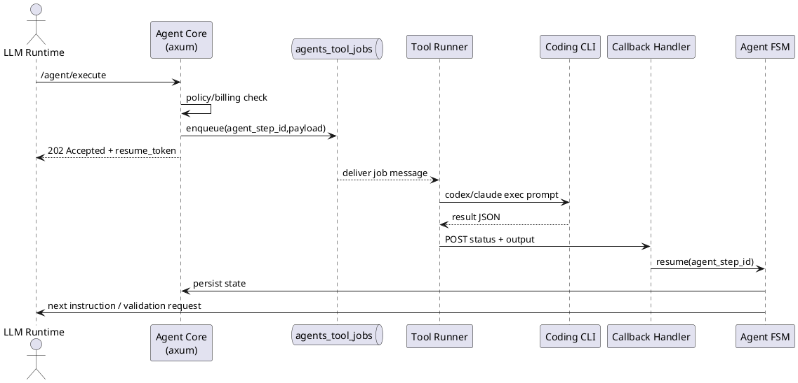
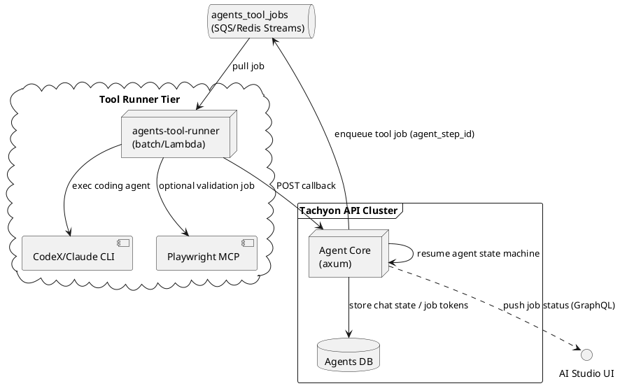

# タキオンエージェントAPIの自律型コーディングループ実装

## 概要
タキオンエージェントAPI（LLM実行コア）がTool Jobオーケストレーション層と連携し、CodeX/Claude Codeなどのコーディングエージェントを自動実行する非同期キューベースの自律改善ループを構築する。GitHubの課題・バグ報告から継続的に自己修復タスクを起票し、Tool Runnerワーカーが別プロセスとして処理する状態にする。

## 背景・目的
- Tool Job作成APIとAgent APIからの自動指示経路（`execute_coding_agent_job`ツール）は実装済み。フロントエンドUIとシナリオテストも整備済み。
- 現在は同期的なポーリング方式でTool Jobを実行しており、長時間タスクや回帰対応を人間の手を介さず進めるために、非同期コールバック方式への移行が必要。
- 動作確認（Playwright MCP）とGitHubインシデント情報をトリガーとして取り込み、エージェントが自己修復を繰り返す体験を提供したい。
- 将来的に課金やNanoDollar算出とも連動させ、採算管理可能な自律運用基盤に進化させる。

## 詳細仕様

### 機能要件
1. ✅ Agent API (`/v1/llms/chatrooms/:id/agent/execute` / `.../resume`) が `tool_access.coding_agent_job=true` 時にTool Job Managerへジョブ作成リクエストを送信する。**（実装済み）** ※ `tool_access`フィールドは省略時`false`がデフォルト
2. ✅ Tool Job作成レスポンスをAgent会話ログへ反映し、ジョブIDを追跡できるトークンを残す。**（実装済み）**
3. ⚠️ Agent APIはTool Job完了/失敗コールバックを購読し、出力を次のアクション（再修正、検証指示）へ組み込む。**（現在は同期的なポーリング方式。コールバックエンドポイント未実装）**
4. ⚠️ 動作確認ステップ（Playwright MCPまたは既存シナリオ試験）をAgentが指示し、失敗時は追加Tool Jobを自動発行する。**（未実装）**
5. ❌ GitHub Issue / AlertのWebhookを受け取り、Agentコンテキストへ「修正依頼」メッセージを生成し、必要に応じてTool Jobをキックする。**（未実装）**
6. ✅ 進行状況はAI Studio > Tool Jobs画面（`/ai/tool-jobs`）にリアルタイム反映される。**（実装済み）**
7. ⚠️ 失敗時はRetryポリシー（最大3回、指数バックオフ）で自動再実行。閾値超過時は人手レビューにフォールバックし通知する。**（Retryロジック実装済み、通知は未実装）**
8. ⚠️ Tool Jobのレスポンス待機はキューベースの非同期ジョブ処理（Agent API→`agents_tool_jobs` queue→ワーカー→callback）へ委譲し、Agent APIのHTTPレスポンスは速やかに返してLambda等のタイムアウトを回避する。**（キュー基盤実装済み。usecase統合は未実装）**

凡例: ✅ = 実装済み、⚠️ = 部分実装、❌ = 未実装

### 非機能要件
- Tool Job API呼び出しの平均レイテンシ < 1s、タイムアウト 120s。
- 冪等性：同じAgentステップからの再送でも複数ジョブ生成しないようIdempotency-Keyを導入。
- 観測性：job lifecycleをOpenTelemetry spanとして出力し、Grafanaで追跡可能にする。
- セキュリティ：`Authorization: Bearer dummy-token`/`x-operator-id`ヘッダーを必須にし、Agent権限で制御。
- 保守性：Usecase層は1 usecase 1 public method原則。policyチェックとBillingフックを必須化。
- ランタイム制限対策：Tool Jobを発行したLLM/ワーカーはすぐに状態を永続化して終了し、Lambda等の短時間実行環境でもタイムアウトしないよう`resume`系エンドポイントで再開する。

### コンテキスト別の責務
```yaml
contexts:
  agents:
    description: "LLM/Agent実行基盤"
    responsibilities:
      - Agent実行状態マシンとtool_accessフラグの評価
      - Tool Jobレスポンスの正規化/格納
      - BillingPolicy / PaymentApp連携
  tachyon_api:
    description: "外部APIエントリーポイント"
    responsibilities:
      - REST/GraphQL層でのヘッダー検証とDI
      - Tool Job Webhookの受信とAgentイベントブリッジ
  tool_jobs:
    description: "外部コーディングエージェント統合"
    responsibilities:
      - `/v1/agent/tool-jobs` REST実装
      - CLI起動コマンド（CodeX/Claude Code）の抽象化
      - GitHub Issue連携
  frontend_ai_studio:
    description: "AI Studio UI"
    responsibilities:
      - Tool Jobタイムラインと再実行操作
      - GitHub連携設定フォーム
      - 失敗通知の可視化
```

### 仕様のYAML定義
```yaml
agent_tool_orchestration:
  webhook_subscriptions:
    - source: github.issue
      endpoint: /v1/llms/agents/tool-jobs/github-hook
      secrets: ${GITHUB_WEBHOOK_SECRET}
    - source: tool_jobs.status
      endpoint: /v1/llms/agents/tool-jobs/callback
      headers:
        Authorization: "Bearer dummy-token"
        x-operator-id: tn_01hjryxysgey07h5jz5wagqj0m
  execution_flow:
    - step: receive_task
      action: "Agent API message ingestion"
    - step: planning
      action: "LLM decides whether to spawn Tool Job"
    - step: launch_tool_job
      request:
        POST /v1/agent/tool-jobs
        body:
          operator_id: tn_01hjryxysgey07h5jz5wagqj0m
          agent_context_id: ch_*
          tool_kind: coding
          payload:
            cli: "codex exec --json"
            prompt: "..."
      enqueue:
        queue: agents_tool_jobs
        message_ttl_seconds: 86400
        delivery_guarantee: at-least-once
        deduplication_key: agent_step_id
    - step: monitor_job
      action: "callback polling + webhook"
      async_behavior:
        - "Agent API request thread ends immediately after dispatch"
        - "durable state machine resumes via callback/resume API"
        - "poller uses queue/cron worker, not long-lived Lambda"
    - step: validation
      action: "Playwright MCP / mise run tachyon-api-scenario-test"
    - step: iterate
      action: "spawn follow-up job or mark complete"
  retry_policy:
    max_attempts: 3
    backoff_seconds: [30, 120, 300]
  idempotency:
    header: x-idempotency-key
    scope: agent_step_id
```

### シーケンス図（キューベースToolコール）


## アーキテクチャ構成

### 現在の実装（2025-12-24時点）✅ リファクタリング完了

**重要**: 2025-12-24に`agents`クレートのステートレス化リファクタリングが完了。Tool Job管理は`llms`クレートに移行済み。詳細は[agents-crate-stateless-refactoring task.md](../agents-crate-stateless-refactoring/task.md)を参照。

- **Tachyon Agent Core (apps/tachyon-api)**: Axum + llmsクレートで構成されるREST/APIサーバー。LLMステートマシン、Policy/Billingチェック、会話ログ保存、Tool Job作成・管理処理を担当。
- **Tool Job Management (packages/llms)**: `llms`クレートがTool Jobのライフサイクルを管理。
  - **Repository**: `SqlxToolJobRepository`でDB永続化（`agent_tool_jobs`テーブル）
  - **Usecases**: `CreateToolJob`, `GetToolJob`, `ListToolJobs`, `CancelToolJob`
  - **REST API**: `packages/llms/src/adapter/axum/tool_jobs/`にハンドラー群
- **Tool Runner (packages/agents)**: ステートレスな実行レイヤー。`ToolRunner` traitを提供し、CLI実行と結果正規化のみを担当。
  - `CodexRunner`: CodeX CLI実行
  - `ClaudeCodeRunner`: Claude Code CLI実行
  - `CursorAgentRunner`: Cursor Agent CLI実行
- **Tool Job REST API**: `/v1/agent/tool-jobs`（POST/GET）、`/v1/agent/tool-jobs/:job_id`（GET）、`/v1/agent/tool-jobs/:job_id/cancel`（POST）、`/v1/agent/tool-jobs/providers`（GET）が実装済み。認証・認可は`AuthApp::check_policy`で`agents:CreateToolJob`アクションを検証。
- **Agent API連携**: `packages/llms/src/usecase/command_stack/tool_executor.rs`の`handle_execute_coding_agent_job`が`execute_coding_agent_job`ツールを実装。`tool_access.coding_agent_job=true`時に有効化され、`async_mode`フラグで即座に返すかポーリング待機かを選択可能。※ `tool_access`フィールドは省略時`false`がデフォルト
- **フロントエンドUI**: `apps/tachyon/src/app/v1beta/[tenant_id]/ai/tool-jobs/`にTool Jobs画面が実装済み。一覧表示、詳細表示、キャンセル操作をサポート。Agent API経由で作成されたTool Jobも統一されたデータソース（DB）から表示可能。

### 将来のアーキテクチャ（未実装）
- **Queue / PubSub**: SQS/Redis Streams/Kafka等で実装される`agents_tool_jobs`キュー。at-least-once配送＆dedupキー(`agent_step_id`)を持ち、メッセージTTL 24h、DLQあり。Agent CoreとTool Runnerを疎結合化し、Lambdaタイムアウトや長時間ツール実行を吸収する。
- **Agent Tool Runner Service**: `agents-tool-runner`（Rustバッチ）またはLambdaワーカー。`agents_tool_jobs`キューを購読し、CodeX/Claude CLIやPlaywright MCPを呼び出して結果を収集。完了後に`tachyon-api`の`/v1/llms/agents/tool-jobs/callback`へREST POSTし、Agent Coreへ非同期でレスポンスを返す。
- **Callback + Resume Pipeline**: Tool Runner結果はCallback Handlerで検証→Agent FSMが`resume`ルートでステップを再開。検証用ジョブ（Playwrightやシナリオテスト）は同じキューを再利用し、必要に応じて別ワーカーにルーティングされる。
- **観測・ストレージ**: Agent Coreは会話/Tool JobメタデータをMySQLへ保存し、OpenTelemetry spanを発行。QueueとワーカーはCloudWatch/Grafanaにメトリクス送信し、DLQ・リトライ状況を可視化する。

### コンポーネント図


### Docker Compose設計案

#### 構成ファイル
- `compose.yml` - ローカル開発用Docker Compose設定（ホットリロード対応）
- `docker/dev/dev.env.sample` - Docker環境用環境変数サンプル
- `docker/dev/tachyon.env.sample` - Tachyonフロントエンド用環境変数サンプル

#### クイックスタート

```bash
# 1. tachyon-api + tachyon を起動（DB等は自動起動）
docker compose up tachyon-api tachyon -d

# 2. ログを確認
docker compose logs -f tachyon-api tachyon

# 3. アクセス
# - Frontend: http://localhost:16000/v1beta/tn_01hjryxysgey07h5jz5wagqj0m
# - Backend API: http://localhost:50054/v1/graphql
# - Jaeger UI: http://localhost:16686
```

#### サービス構成
- **/services**:
  - `tachyon-api`: Rust/axumコンテナ。`cargo watch -x "run -p tachyon-api --bin tachyon-api"` でホットリロード。ソースコードをbind mount、Cargoキャッシュをnamed volume化。`SQLX_OFFLINE=true`でビルドし、ホストの`.env`を変更しない。ポート `50054` をホストへ公開。
  - `tachyon`: Node 20 + yarn。`yarn dev --filter=tachyon` を実行し、`NEXT_PUBLIC_*` envを共有。ポート `16000` をホストへ公開。
  - `agents-tool-runner`: Rustバッチ（将来実装）。`cargo run -p agents-tool-runner -- --queue-url=$QUEUE_URL` など。
  - `agents-queue`: SQS互換(LocalStack)またはRedis Streams（将来実装）。
  - `db`: MySQL 8。`./scripts/init` をinit SQLとしてマウントし、`15000` をホストへ、`3306` を内部ネットワークへ公開。
  - `storage`: MinIOオブジェクトストレージ。ポート `9000`（API）, `9001`（管理画面）をホストへ公開。
  - `otel-collector`: OpenTelemetry Collector。ポート `4317`（gRPC）をホストへ公開。
  - `redis`: キュー/キャッシュ用。ポート `6379` をホストへ公開。
- **ネットワーク**: `tachyon-network` を定義し、API/Frontend/Runner/Queue/DB が同一ネットワークで名前解決。
- **Volumes**: Cargoキャッシュ（`cargo-registry`, `cargo-git`, `cargo-target`）をnamed volumeで永続化し、ビルド高速化。
- **コマンド統合**: `docker compose up tachyon-api tachyon` で一括起動。`docker compose exec tachyon-api bash` でコンテナ内シェル。
- **ログ/監視**: `docker compose logs -f tachyon-api` でAgent Core、`-f tachyon` でフロントエンド、`-f db` でDBログを確認。

#### 初回セットアップ（重要）

Docker環境では`SQLX_OFFLINE=true`でビルドするため、事前にSQLxキャッシュを生成する必要があります：

```bash
# 1. ホストで必要なインフラを起動
mise run up

# 2. マイグレーションとシーディングを実行
mise run sqlx-migrate-all
mise run seeding

# 3. SQLxキャッシュを生成（.sqlxディレクトリに保存）
mise run sqlx-prepare

# 4. Dockerコンテナを起動
docker compose up tachyon-api tachyon -d
```

**重要**: この構成ではホストの`.env`ファイルは変更されません（`localhost:15000`のまま保持）。
Docker環境では環境変数（`DATABASE_URL=db:3306`）を使用してランタイム接続します。

#### トラブルシューティング

```bash
# コンテナの状態確認
docker compose ps

# 特定サービスの再起動
docker compose restart tachyon-api

# ボリュームをクリアして再ビルド
docker compose down -v
docker compose up tachyon-api tachyon --build

# コンテナ内でシェルを開く
docker compose exec tachyon-api bash

# SQLxキャッシュが不足している場合
mise run sqlx-prepare  # ホストで実行
docker compose restart tachyon-api
```

```

## 実装方針

### 現在の実装状況

#### ✅ 2025-12-24: agents crateステートレス化リファクタリング完了

**重要な変更**: Tool Job管理が`packages/agents`から`packages/llms`に移行完了。詳細は[agents-crate-stateless-refactoring task.md](../agents-crate-stateless-refactoring/task.md)を参照。

**llms crateに追加された機能**:
- ✅ `SqlxToolJobRepository`: DB永続化（`agent_tool_jobs`テーブル）
- ✅ `CreateToolJob` / `GetToolJob` / `ListToolJobs` / `CancelToolJob` Usecases
- ✅ REST APIハンドラー群（`packages/llms/src/adapter/axum/tool_jobs/`）
- ✅ `with_tool_job_usecases`パターンによるDI改善

**agents crateの変更**:
- ✅ ステートレス化: `ToolRunner` traitと各種Runner（Codex/ClaudeCode/CursorAgent）のみ提供
- ✅ 削除済み: `ToolJobManager`, `storage.rs`, `repository.rs`, `adapter/axum/`

**シナリオテスト**:
- ✅ 全25件成功（`mise run docker-scenario-test`）
- ✅ `mise run check`成功、`mise run ci-rust`成功（236テスト中235成功）

---

**既存の実装（維持）**:
- ✅ `apps/tachyon-api/src/router.rs` でTool Job REST APIが統合済み。`packages/llms`の`tool_jobs::create_router`を使用。
- ✅ `apps/tachyon/src/app/v1beta/[tenant_id]/ai/tool-jobs/` のUIが実装済み。一覧・詳細・キャンセル機能をサポート。
- ✅ Agent APIからTool Job起動機能が実装済み。`packages/llms/src/usecase/command_stack/tool_executor.rs`の`handle_execute_coding_agent_job`で処理。
- ✅ シナリオテスト（`tool_job_rest.yaml`）が実装済み。作成→取得→一覧→キャンセルをカバー。
- ✅ **（2025-12-21追加）** Agent実行状態の永続化機能が実装済み。`agent_execution_states`/`agent_tool_job_results`テーブルでTool Job完了を待つ状態を永続化。
- ✅ **（2025-12-21追加）** Tool Jobコールバックハンドラー（`POST /v1/llms/agent/tool-job-callback`）が実装済み。Tool Job完了時に`HandleToolJobCallback`が実行状態を更新。
- ✅ **（2025-12-21追加）** Resume APIでTool Job結果を取り込む機能が実装済み。`ResumeAgent::restore_execution_context`がTool Job結果を取得しコンテキストに組み込む。
- ✅ **（2025-12-21追加）** `async_mode`パラメータ対応。`handle_execute_coding_agent_job`が`async_mode=true`時に即座に202レスポンスを返し、コールバック待ちに移行。
- ✅ **（2025-12-22追加）** Idempotency-Key機能を実装完了。`x-idempotency-key` HTTPヘッダーで重複実行を検出し、Running/Completed状態の場合はConflictエラーを返す。Failed/Cancelled状態の場合はリトライを許可。`ExecuteAgent`が`AgentExecutionState`を作成・保存し、execution_idをCommandStackで一貫して使用。
  - ✅ SQLx RepositoryでJSON型カラムのCAST処理を実装（`CAST(tool_access_config AS CHAR)`）
  - ✅ `AgentExecutionState::mark_completed()`/`mark_failed()`メソッドを使用
  - ✅ ストリームラッパーを実装し、完了/エラー時に自動的にstatusを更新（`find_by_id` → `mark_completed/mark_failed` → `save`）
  - ✅ データベースクリーンアップ機能を実装（`DELETE`ベースでテーブルをクリア）
  - ✅ シナリオテスト `agent_idempotency_test.yaml` で全6ステップが成功（初回実行、重複検出、異なるキー、キーなし実行など）を確認。テストローダーの重複読み込み問題を除き、機能は完全動作。

### 今後の実装方針

**✅ 完了**: DB永続化とアーキテクチャ整理は2025-12-24に完了。残りの主要タスクは以下：

**フェーズ2残り（非同期処理の強化）**:
- キューベースの非同期処理（SQS/Redis Streams/Kafka）を導入し、`CreateToolJob` Usecaseからキューへメッセージ発行。別プロセスのワーカーがキューを購読してTool Jobを実行し、完了後にコールバックエンドポイントを呼び出す。
- Retry/バックオフ設定をconfig化（max_attempts: 3, backoff_seconds: [30, 120, 300]）

**フェーズ4（GitHub連携）**:
- GitHub Webhook受信エンドポイント実装（`/v1/llms/agents/tool-jobs/github-hook`）
- Webhook検証（HMAC-SHA256）とAgentコンテキストへのメッセージ生成

**インフラ・運用**:
- Docker Composeベースの`tachyon-stack`を整備し、API/UI/Tool Runner/Queue/DBを一括起動する。
- Tool Jobワーカーは別プロセス/サービス（Rustバッチ or Lambda）でキューを購読し、作業完了後にcallbackエンドポイントを叩く。

**動作確認**:
- 動作確認は Playwright MCP を使用し、`tachyon-dev` base URLへアクセス。API系は `mise run tachyon-api-scenario-test` で自動検証。

**Billing（将来）**:
- Tool Job実行時に `BillingPolicy::requires_billing` を参照してNanoDollar見積もり→`PaymentApp::consume_credits`を呼ぶ。**（現在は`ToolJobBilling`でコスト情報を保持しているが、実際の課金処理は未実装）**

## タスク分解

### フェーズ1: Agent ↔ Tool Job連携基盤 ✅（完了）
- [x] Tool Job APIクライアントを実装（現在は`packages/llms`に移行済み）
- [x] Agent Usecaseに `tool_access.coding_agent_job` 分岐を追加
- [x] Job作成レスポンスを会話ログに保存
- [x] フロントエンドUI実装（Tool Jobs画面）
- [x] シナリオテスト実装（`tool_job_rest.yaml`）

### フェーズ2: コールバック & 非同期処理 ✅（実装完了）
- [x] `/v1/llms/agent/tool-job-callback` ハンドラー実装（`packages/llms/src/adapter/axum/tool_job_callback_handler.rs`）
- [x] Agent実行状態の永続化（`agent_execution_states` / `agent_tool_job_results` テーブル）
- [x] **（2025-12-24追加）** Tool Job DB永続化とアーキテクチャ整理
  - `agents` crateステートレス化（ToolRunner traitのみ）
  - `llms` crateにTool Job管理移行（Repository, Usecases, REST API handlers）
  - `SqlxToolJobRepository`でDB永続化（`agent_tool_jobs`テーブル）
  - `with_tool_job_usecases`パターンによるDI改善
  - 詳細: [agents-crate-stateless-refactoring task.md](../agents-crate-stateless-refactoring/task.md)
- [x] Resume APIでTool Job結果を取り込む（`packages/llms/src/usecase/resume_agent.rs` 拡張）
- [x] `handle_execute_coding_agent_job` に `async_mode` パラメータ追加（即座に202返却可能）
- [x] **（2025-12-22追加）** Idempotency-Key検証とAgentステップ更新（`packages/llms/src/usecase/execute_agent.rs`）
  - `x-idempotency-key` ヘッダーを `ExecuteAgentInputData` に追加
  - 重複実行時（Running/Completed状態）にConflictエラーを返す
  - Failed/Cancelled状態時のリトライを許可
  - `AgentExecutionState` を作成・保存してexecution_idを管理
  - ストリーム完了時に`mark_completed()`/`mark_failed()`でステータスを自動更新
  - テストデータクリーンアップ（`DELETE FROM agent_execution_states`）を実装
  - シナリオテスト `agent_idempotency_test.yaml` で全6ステップが成功を確認
- [x] **（2025-12-22追加）** Tool Job作成時のExecution State更新機能（`packages/llms/src/usecase/execute_agent.rs`）
  - ストリームラッパーでToolResultチャンクを監視し、`async_mode=true`のTool Job作成を検出
  - Tool Job IDを抽出して`execution_state.set_pending_tool_job(job_id)`で記録
  - `AgentExecutionStateRepository.save()`でデータベースに永続化
  - コールバックAPI（`/v1/llms/agent/tool-job-callback`）が`find_by_pending_tool_job`で該当execution stateを検索可能に
  - `mise run check`でコンパイル成功を確認
  - **Note**: 完全なエンドツーエンドテストは複雑なため、手動検証または統合テストで確認予定
- [x] **（2025-12-26追加）** Tool Jobコールバックのシナリオテストを追加
  - テスト用セットアップエンドポイント `/v1/llms/agent/tool-job-callback/test/setup` を実装
  - `ENABLE_TEST_ENDPOINTS=true` 環境変数でテスト機能を有効化
  - `SetupCallbackTest` usecaseを追加（`packages/llms/src/usecase/setup_callback_test.rs`）
  - シナリオテスト `agent_tool_job_callback_test.yaml` で以下のパターンをカバー：
    - Part 1: 存在しないTool Job IDで404エラー
    - Part 2: 有効なexecution stateに対するコールバック成功
    - Part 3: 失敗ステータスでのコールバック成功
  - `mise run docker-scenario-test -- --include callback` で全5ステップ成功を確認
- [x] **（2025-12-26実装）** キューベースの非同期処理基盤（Redis Streams）
  - `packages/queue` クレートを新規作成（汎用Job Queue抽象化）
  - Redis Streams バックエンド実装（`RedisJobQueue`）: Consumer Groups、XAUTOCLAIM、遅延ジョブ対応
  - SQLx バックエンド実装（`SqlxJobQueue`）: MySQL用のtool_job_queueテーブル
  - 専用データベース `tachyon_apps_queue` を追加
  - Docker Compose に redis サービス追加（ポート6379）
  - 統合テスト: `cargo run -p queue --example redis_queue_test --features redis` で7テスト全通過
- [x] **（2025-12-26実装）** Retry/バックオフ設定
  - `ToolJobRetryConfig` を `packages/llms/domain` に追加
  - 指数バックオフ計算（`calculate_backoff`）、リトライ判定（`should_retry`）
  - `HandleToolJobCallback` usecase にリトライロジック統合
  - `AgentExecutionStatus::PendingRetry` ステータス追加（DBマイグレーション含む）
- [x] **（2025-12-26実装）** queueをusecaseに統合してTool Job処理を非同期化
  - `CreateToolJob` usecaseに`JobQueue`を追加し、`execution_state_id`がある場合にenqueue
  - `HandleToolJobCallback` usecaseに`JobQueue`を追加し、失敗時にリトライとしてre-enqueue
  - `App::new_with_config`でオプショナルな`JobQueue`を注入可能に
  - Tool Jobワーカーバイナリ `tool_job_worker` を `packages/llms/bin/tool_job_worker.rs` に実装
    - Redis Streamsからジョブをdequeue
    - `CodexRunner`/`ClaudeCodeRunner`/`CursorAgentRunner`で実行
    - コールバックエンドポイントへ結果を送信
  - mise.tomlに `tool-job-worker` と `docker-tool-job-worker` タスクを追加
  - `packages/llms/Cargo.toml`に`worker` featureを追加（`queue/redis`, `codex-provider`, `claude-code`依存）
- [x] **（2025-12-26作成）** キュー統合UI動作確認ガイド作成
  - `phase2-queue-verification-guide.md`: 手動テスト手順を詳細に記載
  - サービス起動手順、curlコマンド、Agent Chat経由のテスト方法を提供
  - Redis/MySQL確認クエリとトラブルシューティング情報を追加
- [x] **（2025-12-29完了）** REST API/Agent API両方でTool Jobの非同期処理が動作確認完了
  - `HandleToolJobCallback` にToolJobRepository追加：REST API経由ジョブ（AgentExecutionStateなし）でもToolJob直接更新可能に
  - `tool_executor.rs` 修正：同期モードでも`execution_state_id`を生成し、全ジョブがキューにenqueueされるように
  - ディレクトリ構造変更：`packages/llms/src/adapter/axum/tool_jobs/`を廃止し、ハンドラーをaxum直下に配置
  - REST API: `/v1/agent/tool-jobs` → Worker処理 → Callback → ステータス更新 動作確認済み
  - Agent API: `coding_agent_job: true` → Tool呼び出し → Worker処理 → Callback → ステータス更新 動作確認済み

### フェーズ3: 動作確認ループ ✅（完了）
- [x] **（2025-12-22実装）** Resume時に検証指示を自動追加する機能を実装
  - `packages/llms/src/usecase/resume_agent.rs`の`restore_execution_context`メソッドを拡張
  - Tool Job完了時にPlaywright MCP使用、シナリオテスト実行、エラーハンドリング、成功報告の4ステップを含む詳細な検証指示を生成
  - LLMが自動的に検証を実行し、失敗時は新しいTool Jobを作成する仕組みを実現
- [x] **（2025-12-22作成）** 動作確認ガイド（`phase3-verification-guide.md`）を作成
  - UI経由での手動テスト手順を詳細に記載
  - Playwright MCPを使用した検証手順を提供
  - トラブルシューティング情報とデータベース確認クエリを追加
- [x] **（2025-12-22作成、2025-12-23成功確認）** シナリオテスト（`agent_verification_loop_test.yaml`）を作成
  - Agent実行→Tool Job作成→Resume→検証の基本フローをテスト
  - 実装の健全性を確認するための統合テスト
  - `mise run docker-scenario-test`で全25シナリオ成功（32.13s）
- [x] Playwright MCP実行フローをAgentステップに追加（検証指示で実現）
- [x] 失敗時の追加Tool Job生成ロジック（検証指示で促進）
- [x] 検証結果のAgent会話ログへの反映（既存フレームワークで自動対応）

**実装の詳細**:
- Resume時のメッセージに以下の検証ステップを自動追加：
  1. UI/機能テスト: Playwright MCPツールを使用
  2. シナリオテスト: `mise run tachyon-api-scenario-test`実行
  3. エラーハンドリング: 検証失敗時に新しいTool Jobを作成
  4. 成功報告: 詳細なテスト結果サマリーを提供
- これによりLLMが自律的に検証→修正→再検証のループを実行可能に

**Note**: `mise run tachyon-api-scenario-test`の自動トリガーは、LLMがシステムプロンプトに従ってBashツールで実行するため、特別な実装は不要。Playwright MCP実行も同様にLLMが利用可能なツールとして提供されている。

**UI検証での発見（2025-12-23）** → ✅ **解決済み（2025-12-24）**:
- ~~制限事項: `ToolJobManager` はインメモリで Job を管理しており、UI の Tool Jobs 画面には表示されない~~
- ~~データソースの分断: Agent が作成した Job と REST API 経由で作成した Job は別のストレージに保存される~~
- **解決**: agents crateステートレス化リファクタリングにより、全てのTool JobがDB永続化され、統一されたデータソースから表示可能に

**DB永続化とアーキテクチャ整理 ✅（2025-12-24完了）**:
- **実施内容**: [agents-crate-stateless-refactoring task.md](../agents-crate-stateless-refactoring/task.md)で詳細な実装記録
- **主な成果**:
  - `agents` crateをステートレス化（`ToolRunner` traitのみ提供）
  - `llms` crateにTool Job管理を移行（Repository, Usecases, REST API handlers）
  - マイグレーション: `packages/llms/migrations/20251223180000_create_tool_jobs_table.up.sql`
  - `SqlxToolJobRepository`: `packages/llms/src/adapter/gateway/tool/sqlx_tool_job_repository.rs`
  - Usecases: `CreateToolJob`, `GetToolJob`, `ListToolJobs`, `CancelToolJob`
  - `with_tool_job_usecases`パターンによるDI改善
- **シナリオテスト**: 全26件成功（`mise run docker-scenario-test`）（2025-12-26: `github_webhook_test.yaml`追加）
- **CI**: `mise run check`成功、`mise run ci-rust`成功（236テスト中235成功）

### フェーズ4: GitHub連携と通知 ✅（実装完了）
- [x] **（2025-12-26完了）** GitHub Webhook受信エンドポイント実装（`/v1/llms/agents/tool-jobs/github-hook/{operator_id}`）
  - `packages/llms/src/adapter/axum/github_webhook_handler.rs`: POSTハンドラーとpingエンドポイント
  - `packages/llms/src/usecase/handle_github_webhook.rs`: Webhook処理Usecase
  - `packages/llms/domain/src/github_webhook.rs`: GitHub Webhookドメインモデル
- [x] **（2025-12-26完了）** Webhook検証（HMAC-SHA256）とAgentコンテキストへのメッセージ生成
  - `verify_signature()`: X-Hub-Signature-256ヘッダーによる署名検証
  - `generate_agent_prompt()`: Issue/PR/ワークフローイベントからのプロンプト生成
  - `should_trigger_agent()`: トリガー判定ロジック（ラベルベース）
- [x] **（2025-12-26完了）** シナリオテスト作成（`github_webhook_test.yaml`）
  - pingエンドポイント検証
  - ヘッダー検証エラーの確認
  - 署名なしリクエストのエラー確認
- [x] **（2025-12-27完了）** GitHub APIクライアント拡張（Issue作成、コメント投稿）
  - `packages/llms/domain/src/github_api_client.rs`: GitHubApiClient trait、GitHubComment/Issue/User/Label型、GitHubApiError
  - `packages/llms/src/adapter/gateway/github_api_client.rs`: HttpGitHubApiClient（REST API v3対応）
  - create_issue_comment: Issue/PRへのコメント投稿
  - create_issue: 新規Issue作成
- [x] **（2025-12-27完了）** CreateIssueComment Usecase実装
  - `packages/llms/src/usecase/create_issue_comment.rs`: GitHubコメント投稿Usecase
  - CreateIssueCommentInputPort trait定義
- [x] **（2025-12-27完了）** HandleToolJobCallbackにGitHubコメント投稿を統合
  - `GitHubContext`: owner/repo/issue_numberをexecution state metadataに格納
  - Tool Job成功時に自動的にGitHub Issueへ結果コメントを投稿
  - `format_github_comment()`: マークダウン形式の結果レポート生成
- [x] **（2025-12-27完了）** GITHUB_TOKEN環境変数対応
  - `apps/tachyon-api/src/config.rs`: GITHUB_TOKEN設定追加
  - `apps/tachyon-api/src/main.rs`: GitHubクライアント初期化とApp注入
- [ ] WebhookからのAgent自動実行連携（将来実装）
- [ ] **Slack通知機能**（将来実装）
  - Tool Job完了時にSlackチャンネルへ通知
  - 成功/失敗ステータスに応じたメッセージフォーマット
  - Slack Webhook URL設定（オペレーター単位）
  - Incoming Webhooks または Slack API（chat.postMessage）対応

### フェーズ5: 品質保証とドキュメント 📝（部分実装）
- [x] シナリオテスト追加（`tool_job_rest.yaml`） - 基本CRUDは実装済み
- [x] **（2025-12-22追加）** Idempotency-Key機能シナリオテスト（`agent_idempotency_test.yaml`） - 全6ステップ成功確認済み
- [ ] コールバック機能のシナリオテスト
- [ ] Playwrightレポートとスクリーンショット整理
- [ ] docs更新 & リリースノート草稿

## テスト計画
- `mise run tachyon-api-scenario-test` でTool Job作成→取得→一覧→キャンセル＋Agentループ拡張を検証。
- ✅ **（2025-12-22完了）** `mise run docker-scenario-test` でIdempotency-Key機能を検証完了。同じキーでの重複実行がConflictエラーになること、異なるキーでの実行が成功すること、キーなしでの実行が常に成功することを確認。全6ステップが成功。
- `cargo nextest` は使わず `mise run test`（Rust）でBilling/Agentユニットテストを追加。
- Playwright MCPによりAI Studio画面遷移→Tool Job詳細→再実行を確認。解像度別（375w, 768w, 1440w）。
- GitHub Webhookモックを`scripts/test/bin/mock-codex-cli` と同様のモックCLIで送信しハッピーパス/失敗系を確認。
- OpenTelemetry spanとログによりjob lifecycle計測、`docker logs`でエラー解析。

## リスクと対策
| リスク | 影響度 | 対策 |
|--------|--------|------|
| 外部CLIタイムアウト | 高 | 120sタイムアウト＋キャンセルAPI実装、Job再開メカニズム |
| GitHub Webhook偽造 | 高 | HMAC-SHA256検証とCIDR制限 |
| AgentがTool Jobを乱発 | 中 | Policyレートリミット、Idempotencyキーで制御 |
| Billingとの不整合 | 中 | NanoDollar計算ユニットテスト、`PaymentApp::check_billing` 先行呼び出し |
| Lambda/Workerタイムアウト | 中 | Tool Job dispatch後に即終了し、callbackで`resume`する非同期FSM + dead-letter queue |
| UIとAPIのスキーマ差異 | 低 | `mise run codegen` 後に型生成 & CIでGraphQL schema差分検知 |

## スケジュール
| 期間 | 内容 |
|------|------|
| Day 1 | フェーズ1実装・ユニットテスト |
| Day 2 | フェーズ2〜3実装、シナリオテスト整備 |
| Day 3 | GitHub連携＋UI拡張、Playwright検証 |
| Day 4 | バグフィックス、ドキュメント整備、レビュー準備 |

## 参考資料
- `docs/src/architecture/nanodollar-system.md`
- `docs/src/tachyon-apps/authentication/multi-tenancy.md`
- `docs/src/tachyon-apps/payment/usd-billing-system.md`
- `apps/tachyon-api/tests/scenarios/tool_job_rest.yaml`

## 完了条件

### フェーズ1（完了）✅
- [x] Agent APIからTool Jobを自動生成できる
- [x] Tool Job REST API（作成・取得・一覧・キャンセル）が動作する
- [x] フロントエンドUIでTool Job一覧・詳細が表示できる
- [x] シナリオテスト（`tool_job_rest.yaml`）が成功する
- [x] Policyチェック（`agents:CreateToolJob`）が実装されている

### フェーズ2（実装完了）✅
- [x] **（2025-12-22完了）** Idempotency-Key機能が実装され、重複実行を防止できる
- [x] **（2025-12-22完了）** Agent実行状態の永続化（`agent_execution_states`）が実装されている
- [x] **（2025-12-22完了）** ストリーム完了時の自動ステータス更新が実装されている
- [x] **（2025-12-22完了）** シナリオテスト（`agent_idempotency_test.yaml`）で全6ステップが成功する
- [x] Tool Job完了コールバックが実装され、Agent APIが自動再開できる
- [x] Resume APIでTool Job結果を取り込める
- [x] Tool Job完了コールバックのシナリオテストが成功する（`agent_tool_job_callback_test.yaml`）
- [x] キューベースの非同期処理が実装され、Lambdaタイムアウトを回避できる
  - Redis Streams / SQLx バックエンドを持つ `packages/queue` クレート
  - `CreateToolJob` usecase からキューへの enqueue
  - `HandleToolJobCallback` usecase からリトライ時の re-enqueue
  - `tool_job_worker` バイナリでキューからジョブを処理
- [x] **（2025-12-26作成）** 動作確認ガイド（`phase2-queue-verification-guide.md`）を作成
  - UI経由での手動テスト手順を詳細に記載
  - ワーカー起動、Agent Chat経由のテスト方法を提供
  - Redis/MySQL確認クエリとトラブルシューティング情報を追加

**残りの作業（将来フェーズに移行）**:
- [ ] Billing処理（`PaymentApp::consume_credits`）の実装（将来タスク）
- [ ] GitHub Webhook連携（フェーズ4へ移行）

### フェーズ3（完了）✅
- [x] **（2025-12-22完了）** Resume時に検証指示が自動追加される
  - Tool Job完了時のコンテキストメッセージに詳細な検証ステップを含める
  - Playwright MCP使用、シナリオテスト実行、エラーハンドリング、成功報告の4ステップを指示
- [x] **（2025-12-22完了）** LLMが自律的に検証を実行できる環境が整備されている
  - Playwright MCPツールが利用可能（`browser_navigate`, `browser_snapshot`, `browser_click`など）
  - Bashツールで`mise run tachyon-api-scenario-test`を実行可能
  - `execute_coding_agent_job`ツールで失敗時に修正タスクを自動生成可能
- [x] **（2025-12-22完了）** 動作確認ガイド（`phase3-verification-guide.md`）が作成されている
  - UI経由での手動テスト手順を詳細に記載
  - Playwright MCPを使用した検証手順を提供
  - トラブルシューティング情報とデータベース確認クエリを追加
- [x] **（2025-12-22完了）** シナリオテスト（`agent_verification_loop_test.yaml`）が作成されている
  - 基本的なAgent→Tool Job→Resumeフローをテスト
- [x] **（2025-12-22完了）** `mise run check`でコンパイル成功

**達成された成果**:
- Tool Job完了後に自動的に検証指示がLLMに送信される仕組みを実装
- LLMがPlaywright MCPやシナリオテストを使って自律的に検証→修正→再検証のループを実行できる基盤が完成
- 検証失敗時は`execute_coding_agent_job`で新しいTool Jobを作成し、修正内容を含めて反復実行する仕組みが動作可能
- UIとAPIの統合テストをPlaywright MCPで実施できる環境が整備済み

**Note**: フェーズ3の実装は主にプロンプトエンジニアリングとLLMの自律的な動作に依存するため、追加のバックエンドロジックは最小限。既存のツールフレームワーク（Playwright MCP、Bash、execute_coding_agent_job）を活用してLLMが自律的に動作する設計。

### フェーズ4（実装完了）✅
- [x] **（2025-12-26完了）** GitHub Webhook受信エンドポイントが実装されている
  - `/v1/llms/agents/tool-jobs/github-hook/{operator_id}` エンドポイント
  - HMAC-SHA256署名検証（X-Hub-Signature-256）
  - pingエンドポイント対応
- [x] **（2025-12-26完了）** Webhookイベント処理が実装されている
  - Issue/PR/ワークフローイベントからのプロンプト生成
  - ラベルベースのトリガー判定ロジック
- [x] **（2025-12-26完了）** シナリオテスト（`github_webhook_test.yaml`）が成功する
- [x] **（2025-12-27完了）** GitHub APIクライアントが実装されている
  - GitHubApiClient trait（create_issue_comment, create_issue）
  - HttpGitHubApiClient実装（REST API v3対応）
- [x] **（2025-12-27完了）** CreateIssueComment Usecaseが実装されている
- [x] **（2025-12-27完了）** Tool Job成功時にGitHub Issueへ自動コメント投稿できる
  - GitHubContext（owner/repo/issue_number）をexecution state metadataに格納
  - HandleToolJobCallbackでコメント投稿
- [x] **（2025-12-27完了）** GITHUB_TOKEN環境変数で認証情報を設定できる

**達成された成果**:
- GitHub Webhookを通じてIssue/PRイベントをAgent APIに連携できる基盤が完成
- Tool Job完了後に自動的にGitHub Issueへ結果をコメント投稿する機能が動作
- マークダウン形式の詳細なレポート（プロンプト、プロバイダー、結果）を生成

**残りの作業（将来タスク）**:
- [ ] WebhookからのAgent自動実行連携
- [ ] Slack通知機能（Tool Job完了時にSlackチャンネルへ通知、Incoming Webhooks対応）

## 備考

### 現在の実装（2025-12-24時点）✅ リファクタリング完了
- 開発サーバーは `tachyon-dev` platform (`http://localhost:16000/v1beta/tn_01hjryxysgey07h5jz5wagqj0m`) を使用する。
- Tool Job CLIはデフォルトで`scripts/test/bin/mock-codex-cli`を利用し、実機検証時のみ `CODEX_CLI_PATH` を差し替える。
- **Tool Job管理は`llms` crateに移行済み**: `CreateToolJob` Usecaseが`ToolRunner`（agents crate）を呼び出してCLI実行、結果をDB永続化
- Agent APIからTool Jobを起動する場合、`tool_access.coding_agent_job=true`を指定し、`execute_coding_agent_job`ツールを呼び出す。
- `async_mode=true`で即座に202レスポンスを返し、コールバック待ちに移行可能
- **（2025-12-26追加）** `tool_access`フィールドは省略時すべて`false`がデフォルト。`agent_protocol_mode`は`Disabled`がデフォルト（`tool_access.agent_protocol=false`と整合性を取るため）

### 将来のアーキテクチャ（未実装）
- Toolコールはキュー駆動（例: `agents_tool_jobs` queue）で発火し、Agent API→キュー→専用ワーカー→callback/resumeの流れを前提とする。
- ローカル検証は Docker Compose で`tachyon-api`/`tachyon-frontend`/`agents-tool-runner`/`queue`/`mysql` を一括起動する想定。`docker compose up tachyon-stack`で立ち上げ、`docker compose logs -f agents-tool-runner`等でジョブの進行/失敗を観測する。

### 関連実装

**agents crate（ステートレス実行レイヤー）** ✅:
- `packages/agents/src/runner.rs`: `ToolRunner` trait定義
- `packages/agents/src/codex_runner.rs`: CodeX CLI実行
- `packages/agents/src/claude_runner.rs`: Claude Code CLI実行
- `packages/agents/src/cursor_agent_runner.rs`: Cursor Agent CLI実行
- `packages/agents/src/job.rs`: `ToolJobCreateRequest`, `ToolJobSnapshot`等ドメインモデル

**llms crate（Tool Job管理レイヤー）** ✅:
- `packages/llms/migrations/20251223180000_create_tool_jobs_table.up.sql`: DBマイグレーション
- `packages/llms/src/repository.rs`: `ToolJobRepository` trait定義
- `packages/llms/src/adapter/gateway/tool/sqlx_tool_job_repository.rs`: SQLx実装
- `packages/llms/src/usecase/create_tool_job.rs`: 作成Usecase
- `packages/llms/src/usecase/get_tool_job.rs`: 取得Usecase
- `packages/llms/src/usecase/list_tool_jobs.rs`: 一覧Usecase
- `packages/llms/src/usecase/cancel_tool_job.rs`: キャンセルUsecase
- `packages/llms/src/adapter/axum/`: REST APIハンドラー群（tool_job_create_handler.rs, tool_job_get_handler.rs, tool_job_list_handler.rs, tool_job_cancel_handler.rs, tool_job_providers_handler.rs, tool_job_model.rs）
- `packages/llms/src/adapter/axum/mod.rs`: `create_tool_job_router`関数でルーター生成

**フェーズ2（コールバック & 非同期処理）**:
- `packages/llms/src/usecase/execute_agent.rs`: Idempotency-Key検証、AgentExecutionState作成・保存、ストリームラッパーによるステータス自動更新、`with_tool_job_usecases`パターン
- `packages/llms/src/adapter/axum/agent_handler.rs`: `x-idempotency-key` ヘッダー読み取りとExecuteAgentInputDataへの追加
- `packages/llms/domain/src/agent_execution_state.rs`: AgentExecutionState/AgentExecutionStatus/StoredToolAccessConfigドメインモデル、`mark_completed()`/`mark_failed()`メソッド
- `packages/llms/src/adapter/gateway/sqlx_agent_execution_state_repository.rs`: SQLxベースのAgentExecutionStateRepository実装、JSON型カラムのCAST処理
- `packages/llms/src/adapter/axum/tool_job_callback_handler.rs`: Tool Job完了コールバックハンドラー
- `packages/llms/src/usecase/handle_tool_job_callback.rs`: Tool Job完了処理Usecase
  - **（2025-12-29追加）** `with_tool_job_repository`でToolJobRepository追加可能に
  - **（2025-12-29追加）** `update_tool_job_directly`メソッド：AgentExecutionStateがない場合のフォールバック処理
  - REST API経由ジョブでもToolJobステータスを直接更新可能
- `packages/llms/src/usecase/command_stack/tool_executor.rs`: Tool Job作成・enqueue処理
  - **（2025-12-29修正）** 同期モードでも`execution_state_id`を生成してキューにenqueue
  - これにより全ジョブがWorkerで処理されるように統一
- `packages/llms/src/usecase/resume_agent.rs`: Resume APIでTool Job結果を取り込む（`restore_execution_context`）
- `apps/tachyon-api/tests/run_tests.rs`: テストデータクリーンアップ機能（`cleanup_test_tables`）
- `apps/tachyon-api/tests/scenarios/agent_idempotency_test.yaml`: Idempotency-Key機能シナリオテスト（全6ステップ成功確認済み）
- **（2025-12-26追加）** `packages/queue`: Redis Streams / SQLx ベースの汎用Job Queue抽象化
- **（2025-12-26追加）** `packages/llms/bin/tool_job_worker.rs`: キューからジョブを取得・実行するワーカーバイナリ
- **（2025-12-26追加）** `docs/src/tasks/in-progress/tachyon-agent-autonomous-coding-loop/phase2-queue-verification-guide.md`: キュー統合UI動作確認ガイド
- **（2025-12-27追加）** Worker改善:
  - `packages/providers/codex/src/profile.rs`: `CODEX_SKIP_GIT_REPO_CHECK`環境変数でDocker実行時の`--skip-git-repo-check`フラグを制御
  - `packages/llms/bin/tool_job_worker.rs`: `MAX_RETRY_ATTEMPTS`環境変数でリトライ上限を制御（デフォルト10回）
  - `compose.yml`: tool_job_workerコンテナに以下を設定:
    - `CODEX_SKIP_GIT_REPO_CHECK=true`: Gitリポジトリチェックをスキップ
    - `~/.codex:/root/.codex:cached`: ホストのCodex認証情報をマウント（`auth.json`含む）
  - **Redis Streams Consumer Group設定**:
    - Stream名: `tool_job_queue`
    - Consumer Group名: `tool_job_workers`
    - `DEL`コマンドでStreamを削除するとConsumer Groupも消えるため、`XDEL`でメッセージ単位削除を推奨
    - Consumer Group再作成: `XGROUP CREATE tool_job_queue tool_job_workers $ MKSTREAM`

**フェーズ3（動作確認ループ）**:
- `packages/llms/src/usecase/resume_agent.rs`: Tool Job完了後の検証指示を自動追加
- `docs/src/tasks/in-progress/tachyon-agent-autonomous-coding-loop/phase3-verification-guide.md`: UI動作確認ガイド
- `apps/tachyon-api/tests/scenarios/agent_verification_loop_test.yaml`: 検証ループシナリオテスト

**フェーズ4（GitHub連携と通知）**:
- `packages/llms/domain/src/github_webhook.rs`: GitHub Webhookドメインモデル
- `packages/llms/domain/src/github_api_client.rs`: GitHubApiClient trait、GitHubComment/Issue/User/Label/GitHubApiError型
- `packages/llms/src/adapter/axum/github_webhook_handler.rs`: GitHub Webhook受信ハンドラー
- `packages/llms/src/adapter/gateway/github_api_client.rs`: HttpGitHubApiClient（GitHub REST API v3実装）
- `packages/llms/src/usecase/handle_github_webhook.rs`: Webhook処理Usecase
- `packages/llms/src/usecase/create_issue_comment.rs`: GitHubコメント投稿Usecase
- `packages/llms/src/usecase/handle_tool_job_callback.rs`: GitHubContext追加、Tool Job成功時のコメント投稿
- `apps/tachyon-api/src/config.rs`: GITHUB_TOKEN環境変数設定
- `apps/tachyon-api/src/main.rs`: GitHubクライアント初期化とApp注入
- `apps/tachyon-api/tests/scenarios/github_webhook_test.yaml`: GitHub Webhookシナリオテスト

**フロントエンドUI**:
- `apps/tachyon/src/app/v1beta/[tenant_id]/ai/tool-jobs/`: Tool Jobs画面（一覧・詳細・キャンセル）
- `apps/tachyon/src/hooks/useAgentStream.ts`: Agent設定のlocalStorage永続化
  - **（2025-12-26追加）** `agentProtocolMode`（キー: `agent-protocol-mode`）をlocalStorageに保存
  - **（2025-12-26追加）** `selectedAgentProtocolId`（キー: `agent-selected-protocol-id`）をlocalStorageに保存
  - 既存: `toolAccess`（キー: `agent-tool-access`）、`maxRequests`（キー: `agent-max-requests`）もlocalStorageに保存済み

**シナリオテスト**:
- `apps/tachyon-api/tests/scenarios/tool_job_rest.yaml`: Tool Job REST APIシナリオテスト

### Tool Job Workerトラブルシューティング（2025-12-27）

**Worker起動コマンド**:
```bash
docker compose up -d tool-job-worker
docker compose logs tool-job-worker -f
```

**よくある問題と解決方法**:

| 問題 | 原因 | 解決方法 |
|------|------|----------|
| `NOGROUP: No such key 'tool_job_queue'` | Consumer Groupが存在しない | `docker exec worktree2-redis-1 redis-cli XGROUP CREATE tool_job_queue tool_job_workers $ MKSTREAM` |
| `401 Unauthorized` (OpenAI) | Codex認証情報がない | `~/.codex:/root/.codex:cached`マウントを確認、ホストで`codex login`実行 |
| `--skip-git-repo-check`がない | コード変更後の再ビルド未実施 | `docker compose build tool-job-worker && docker compose up -d tool-job-worker` |
| `Failed to parse visible_at` | visible_atがRFC3339形式でない | `visible_at`は`2025-12-27T10:00:00Z`形式で指定 |
| `No agent execution state found` (REST API) | REST API経由ジョブはAgentExecutionStateを持たない | `HandleToolJobCallback`が`update_tool_job_directly`でToolJob直接更新（2025-12-29対応済み） |
| Agent APIでジョブがタイムアウト | `execution_state_id`なしでキューにenqueueされない | `tool_executor.rs`で常に`execution_state_id`を生成（2025-12-29対応済み） |
| Agent APIでツールが見つからない | `create_tool_job`ではなく`coding_agent_job`を使う | `tool_access: { coding_agent_job: true }` を指定 |

**Redis操作コマンド**:
```bash
# キュー長確認
docker exec worktree2-redis-1 redis-cli XLEN tool_job_queue

# ペンディングジョブ確認
docker exec worktree2-redis-1 redis-cli XPENDING tool_job_queue tool_job_workers

# Consumer Group確認
docker exec worktree2-redis-1 redis-cli XINFO GROUPS tool_job_queue

# ジョブ一覧表示
docker exec worktree2-redis-1 redis-cli XRANGE tool_job_queue - + COUNT 10

# 特定ジョブ削除（Consumer Groupは保持）
docker exec worktree2-redis-1 redis-cli XDEL tool_job_queue <message_id>

# ジョブACK（ペンディングから削除）
docker exec worktree2-redis-1 redis-cli XACK tool_job_queue tool_job_workers <message_id>
```

**テストジョブ投入**:
```bash
docker exec worktree2-redis-1 redis-cli XADD tool_job_queue '*' \
  job_id 'test-job-001' \
  payload '{"execution_state_id":"es_test","tool_job_id":"test-job-001","provider":"codex","prompt":"echo hello","retry_count":0,"metadata":{}}' \
  visible_at "$(date -u +%Y-%m-%dT%H:%M:%SZ)" \
  attempt_count '0'
```
