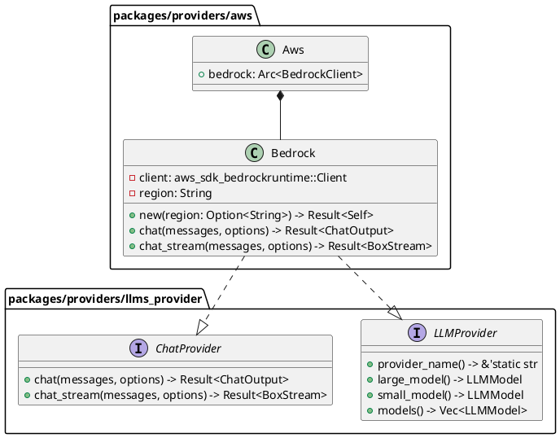

# AWS Bedrock Claude統合

## 概要

AWS Bedrock経由でClaudeモデルをLLMプロバイダーとして利用できるようにする機能を実装します。

## 目的

- AWS Bedrockを通じてClaudeモデルにアクセスできるようにする
- 既存のLLMプロバイダーアーキテクチャに統合する
- ストリーミングレスポンスをサポートする

## タスク一覧

- :white_check_mark: ドキュメント作成
- :white_check_mark: aws-sdk-bedrockruntime依存関係の追加
- :white_check_mark: bedrockモジュールの作成
- :white_check_mark: Bedrock構造体の実装
- :white_check_mark: ChatProviderトレイトの実装（chat）
- :white_check_mark: ChatProviderトレイトの実装（chat_stream）
- :white_check_mark: LLMProviderトレイトの実装
- :white_check_mark: model_provider_selectorへの追加
- :white_check_mark: LLMProvidersへの統合
- :white_check_mark: サンプルコードの作成
- :white_check_mark: コンパイル確認
- :white_check_mark: フォーマット・Lint確認
- :white_check_mark: Connectivity Test作成 (`packages/providers/aws/tests/connectivity.rs`)
- :white_check_mark: GitHub Actions Workflow更新 (`.github/workflows/llm-connectivity-test.yml`)
- :white_check_mark: Terraform Bedrock IAMポリシー・専用ロール追加 (`cluster/n1-aws/main.tf`)
- :white_check_mark: PR作成 (#943)
- :white_check_mark: Terraform apply (Bedrock権限反映)
- :white_check_mark: CI確認 (LLM Connectivity Test passed)

## 技術仕様

### アーキテクチャ



### 実装詳細

#### 1. 依存関係の追加

`packages/providers/aws/Cargo.toml`に以下を追加：

```toml
[features]
default = ["ses", "bedrock"]
bedrock = []

[dependencies]
aws-sdk-bedrockruntime = "1.0"
```

#### 2. Bedrockプロバイダーの実装

- プロバイダー名: `"bedrock"`
- サポートモデル:
  - Large: `anthropic.claude-3-opus-20240229-v1:0`
  - Small: `anthropic.claude-3-sonnet-20240229-v1:0`
  - Haiku: `anthropic.claude-3-haiku-20240307-v1:0`

#### 3. モデル指定形式

- `bedrock/claude-3-opus` → AWS Bedrock経由でClaude 3 Opus
- `bedrock/claude-3-sonnet` → AWS Bedrock経由でClaude 3 Sonnet
- `claude-3-opus` → 既存のAnthropicプロバイダー（変更なし）

### API仕様

#### リクエスト形式

AWS Bedrock Runtime APIの`InvokeModel`および`InvokeModelWithResponseStream`を使用：

```json
{
  "anthropic_version": "bedrock-2023-05-31",
  "max_tokens": 1000,
  "messages": [
    {
      "role": "user",
      "content": "Hello"
    }
  ]
}
```

#### レスポンス形式

```json
{
  "id": "msg_xxx",
  "type": "message",
  "role": "assistant",
  "content": [
    {
      "type": "text",
      "text": "Hello! How can I help you?"
    }
  ],
  "model": "claude-3-sonnet-20240229",
  "stop_reason": "end_turn",
  "usage": {
    "input_tokens": 10,
    "output_tokens": 20
  }
}
```

## 実装ファイル

### 新規作成

- `packages/providers/aws/src/bedrock/mod.rs` - モジュールエントリーポイント
- `packages/providers/aws/src/bedrock/client.rs` - Bedrockクライアント実装
- `packages/providers/aws/src/bedrock/models.rs` - モデル定義
- `packages/providers/aws/src/bedrock/chat.rs` - チャット機能実装
- `packages/providers/aws/examples/bedrock_chat.rs` - 使用例
- `packages/providers/aws/tests/connectivity.rs` - Connectivity Test

### 変更

- `packages/providers/aws/Cargo.toml` - 依存関係追加、dotenvy dev-dependency追加
- `packages/providers/aws/src/lib.rs` - bedrockモジュール追加
- `packages/llms/src/usecase/model_provider_selector.rs` - bedrock対応追加
- `packages/llms/src/app.rs` - Bedrockプロバイダー初期化
- `.github/workflows/llm-connectivity-test.yml` - Bedrock connectivity testジョブ追加（OIDC認証）
- `cluster/n1-aws/main.tf` - ConnectivityTestGithubActionsRole（Bedrock専用）追加

## テスト計画

### 単体テスト

- モデル名のパース
- プロバイダー選択ロジック
- メッセージ変換

### 統合テスト

- AWS Bedrock APIへの実際のリクエスト（dev環境）
- ストリーミングレスポンスの処理
- エラーハンドリング

## 環境変数

```bash
AWS_REGION=ap-northeast-1
AWS_ACCESS_KEY_ID=xxx
AWS_SECRET_ACCESS_KEY=xxx
```

## 参考資料

- [AWS Bedrock Runtime API](https://docs.aws.amazon.com/bedrock/latest/APIReference/API_runtime_InvokeModel.html)
- [Claude on Bedrock](https://docs.anthropic.com/claude/docs/claude-on-amazon-bedrock)
- [AWS SDK for Rust - Bedrock Runtime](https://docs.rs/aws-sdk-bedrockruntime/latest/aws_sdk_bedrockruntime/)

## 作成日

2025-10-29
