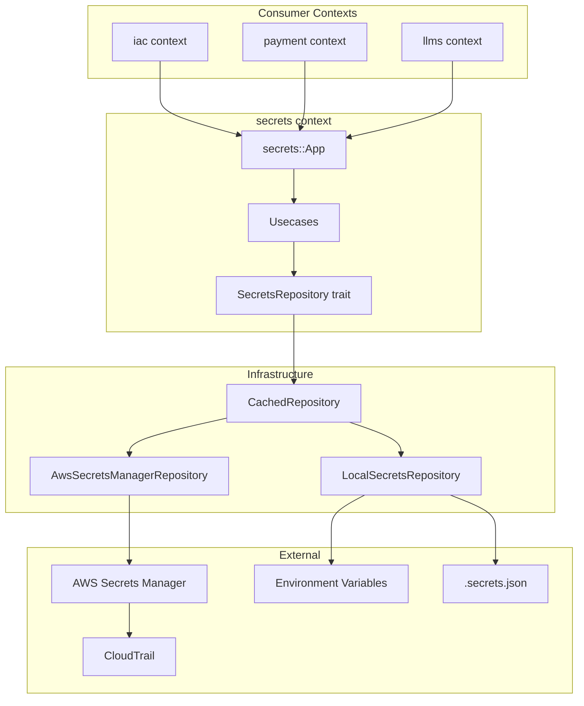

# secretsコンテキストによる機密情報管理

## 概要

プロバイダー認証情報（APIキー、シークレット等）を管理する専用の`secrets`コンテキストを新設し、AWS Secrets Managerをバックエンドとして安全に管理する。Clean Architectureに従い、他のコンテキスト（iac, payment等）から依存注入で利用できる設計とする。

## 背景・目的

### 現状の課題
- **平文保存のリスク**: プロバイダーのAPIキーやシークレットがDBに暗号化されずに保存されている
- **アクセス制御の不足**: 機密情報へのアクセスログや制限が不十分
- **ローテーションの手動化**: APIキーの更新が手動で煩雑
- **監査証跡の欠如**: 機密情報へのアクセス履歴が記録されていない

### なぜ専用コンテキストか

| 観点 | commonに配置 | 専用コンテキスト |
|------|--------------|------------------|
| **責務** | 曖昧（横断的関心事扱い） | 明確（独立したドメイン） |
| **依存関係** | 全体に暗黙的に影響 | 必要なコンテキストのみ依存宣言 |
| **テスト** | モック化が困難 | DIで簡単に差し替え |
| **拡張性** | 変更影響が大きい | Vault等の追加も独立 |

### なぜAWS Secrets Managerか

| 観点 | Secrets Manager | KMS（自前暗号化） |
|------|-----------------|-------------------|
| **自動ローテーション** | ✅ Lambda連携で組み込み | ❌ 自前実装必要 |
| **バージョン管理** | ✅ 自動（過去値にアクセス可） | ❌ なし |
| **監査ログ** | ✅ CloudTrail統合が標準 | ⚠️ 自前実装必要 |
| **実装の複雑さ** | 低い（値を直接保存） | 高い（暗号化ロジック必要） |

## 詳細仕様

### 機能要件

#### 1. 管理対象のシークレット
```yaml
secrets_targets:
  iac_context:
    providers:
      stripe:
        - secret_key
        - webhook_secret
        - restricted_api_key
      openai:
        - api_key
      anthropic:
        - api_key
      hubspot:
        - private_app_token
      keycloak:
        - client_secret

  payment_context:
    sensitive_data:
      - stripe_webhook_signing_secret

  general:
    - jwt_signing_key
    - oauth_client_secrets
```

#### 2. シークレット命名規則
```
{tenant_id}/providers/{provider_type}

例:
- tn_01hjryxysgey07h5jz5wagqj0m/providers/stripe
- tn_01hjryxysgey07h5jz5wagqj0m/providers/openai
- tn_01hjryxysgey07h5jz5wagqj0m/providers/anthropic
- global/jwt-signing-key
```

**注意**: 環境（prod/staging/dev）の分離はAWSアカウント/リージョン単位で行う。シークレット名に環境プレフィックスは含めない。

#### 3. シークレットの構造（JSON）
```json
{
  "secret_key": "sk_live_xxx",
  "webhook_secret": "whsec_xxx",
  "publishable_key": "pk_live_xxx"
}
```

#### 4. アーキテクチャ


### 非機能要件
- **パフォーマンス**: シークレット取得のキャッシング（TTL: 5分）
- **可用性**: Secrets Manager障害時のグレースフルデグラデーション
- **互換性**: 既存のDB保存からの段階的移行サポート
- **コンプライアンス**: CloudTrailによるPCI DSS、GDPR監査要件対応

## 実装方針

### コンテキスト構造
```
packages/secrets/
├── Cargo.toml
├── src/
│   ├── lib.rs
│   │
│   ├── domain/
│   │   ├── mod.rs
│   │   ├── secret.rs           # Secret エンティティ
│   │   ├── secret_key.rs       # SecretKey 値オブジェクト（def_id!マクロ使用）
│   │   └── secret_value.rs     # SecretValue 値オブジェクト
│   │
│   ├── usecase/
│   │   ├── mod.rs
│   │   ├── get_secret.rs       # シークレット取得
│   │   ├── put_secret.rs       # シークレット保存/更新
│   │   ├── delete_secret.rs    # シークレット削除
│   │   └── list_secrets.rs     # シークレット一覧（メタデータのみ）
│   │
│   ├── interface_adapter/
│   │   ├── mod.rs
│   │   ├── repository.rs       # SecretsRepository trait
│   │   └── gateway/
│   │       ├── mod.rs
│   │       ├── aws_secrets_manager.rs  # AWS実装
│   │       ├── local_file.rs           # ローカルファイル実装
│   │       ├── local_env.rs            # 環境変数実装
│   │       └── cached.rs               # キャッシュラッパー
│   │
│   └── app.rs                  # secrets::App ファサード
│
└── tests/
    ├── integration/
    │   └── aws_secrets_manager_test.rs
    └── unit/
        └── domain_test.rs
```

### 技術選定
- **AWS SDK**: `aws-sdk-secretsmanager` (Rust)
- **キャッシング**: `moka` crate
- **シリアライゼーション**: `serde_json`
- **監査ログ**: CloudTrail（自動）+ アプリケーションログ

### 実装の詳細

#### 1. ドメイン層

```rust
// packages/secrets/src/domain/secret_key.rs
use util::macros::def_id;

// ULIDベースのシークレットキー（sec_プレフィックス）
def_id!(SecretKey, "sec_");

/// シークレットのパス（論理的な識別子）
/// AWS Secrets Manager等の外部システムで使用
#[derive(Debug, Clone, PartialEq, Eq, Hash)]
pub struct SecretPath(String);

impl SecretPath {
    /// プロバイダー用のパスを生成
    pub fn provider(tenant_id: &TenantId, provider_type: &str) -> Self {
        Self(format!("{}/providers/{}", tenant_id, provider_type))
    }

    /// グローバル設定用のパスを生成
    pub fn global(name: &str) -> Self {
        Self(format!("global/{}", name))
    }

    pub fn as_str(&self) -> &str {
        &self.0
    }
}

impl std::fmt::Display for SecretPath {
    fn fmt(&self, f: &mut std::fmt::Formatter<'_>) -> std::fmt::Result {
        write!(f, "{}", self.0)
    }
}
```

```rust
// packages/secrets/src/domain/secret_value.rs
use serde::{Deserialize, Serialize};
use secrecy::{ExposeSecret, Secret};

/// シークレットの値（メモリ上でも保護）
#[derive(Clone)]
pub struct SecretValue {
    inner: Secret<serde_json::Value>,
}

impl SecretValue {
    pub fn new(value: serde_json::Value) -> Self {
        Self {
            inner: Secret::new(value),
        }
    }

    /// 特定のフィールドを取得
    pub fn get_field(&self, field: &str) -> Result<String> {
        self.inner
            .expose_secret()
            .get(field)
            .and_then(|v| v.as_str())
            .map(String::from)
            .ok_or_else(|| Error::FieldNotFound(field.to_string()))
    }

    /// 型付きでデシリアライズ
    pub fn deserialize<T: DeserializeOwned>(&self) -> Result<T> {
        serde_json::from_value(self.inner.expose_secret().clone())
            .map_err(|e| Error::DeserializationFailed(e.to_string()))
    }
}

impl std::fmt::Debug for SecretValue {
    fn fmt(&self, f: &mut std::fmt::Formatter<'_>) -> std::fmt::Result {
        write!(f, "SecretValue(***)")
    }
}
```

```rust
// packages/secrets/src/domain/secret.rs
use chrono::{DateTime, Utc};

/// シークレットエンティティ
#[derive(Debug, Clone)]
pub struct Secret {
    pub key: SecretKey,           // ULIDベースの一意識別子
    pub path: SecretPath,         // 論理パス（テナント/プロバイダー等）
    pub value: SecretValue,
    pub version_id: Option<String>,
    pub created_at: Option<DateTime<Utc>>,
    pub updated_at: Option<DateTime<Utc>>,
}

impl Secret {
    pub fn new(path: SecretPath, value: SecretValue) -> Self {
        Self {
            key: SecretKey::default(),  // ULID自動生成
            path,
            value,
            version_id: None,
            created_at: None,
            updated_at: None,
        }
    }
}
```

#### 2. Usecase層

```rust
// packages/secrets/src/usecase/get_secret.rs
use crate::domain::{Secret, SecretPath};
use crate::interface_adapter::SecretsRepository;

pub struct GetSecret {
    repository: Arc<dyn SecretsRepository>,
}

impl GetSecret {
    pub fn new(repository: Arc<dyn SecretsRepository>) -> Self {
        Self { repository }
    }

    pub async fn execute(&self, path: &SecretPath) -> Result<Secret> {
        tracing::info!(secret_path = %path, "Getting secret");

        let secret = self.repository.get_by_path(path).await?;

        tracing::info!(secret_path = %path, "Secret retrieved successfully");
        Ok(secret)
    }
}
```

```rust
// packages/secrets/src/usecase/put_secret.rs
use crate::domain::{Secret, SecretPath, SecretValue};
use crate::interface_adapter::SecretsRepository;

pub struct PutSecret {
    repository: Arc<dyn SecretsRepository>,
}

impl PutSecret {
    pub fn new(repository: Arc<dyn SecretsRepository>) -> Self {
        Self { repository }
    }

    pub async fn execute(&self, path: &SecretPath, value: SecretValue) -> Result<Secret> {
        tracing::info!(secret_path = %path, "Putting secret");

        let secret = Secret::new(path.clone(), value);
        let saved = self.repository.save(&secret).await?;

        tracing::info!(secret_path = %path, "Secret saved successfully");
        Ok(saved)
    }
}
```

#### 3. Interface Adapter層

```rust
// packages/secrets/src/interface_adapter/repository.rs
use crate::domain::{Secret, SecretKey, SecretPath};
use async_trait::async_trait;

#[async_trait]
pub trait SecretsRepository: Send + Sync {
    /// パスでシークレットを取得
    async fn get_by_path(&self, path: &SecretPath) -> Result<Secret>;

    /// キーでシークレットを取得
    async fn get_by_key(&self, key: &SecretKey) -> Result<Secret>;

    /// シークレットを保存（存在すれば更新）
    async fn save(&self, secret: &Secret) -> Result<Secret>;

    /// シークレットを削除
    async fn delete(&self, path: &SecretPath) -> Result<()>;

    /// シークレットの存在確認
    async fn exists(&self, path: &SecretPath) -> Result<bool>;

    /// シークレット一覧（パスのみ、値は含まない）
    async fn list(&self, prefix: Option<&str>) -> Result<Vec<SecretPath>>;
}
```

```rust
// packages/secrets/src/interface_adapter/gateway/aws_secrets_manager.rs
use aws_sdk_secretsmanager::Client;

pub struct AwsSecretsManagerRepository {
    client: Client,
}

impl AwsSecretsManagerRepository {
    pub async fn new() -> Result<Self> {
        let config = aws_config::load_defaults(BehaviorVersion::latest()).await;
        let client = Client::new(&config);
        Ok(Self { client })
    }

    /// SecretPathをAWS Secrets Manager用の名前に変換
    fn path_to_aws_name(&self, path: &SecretPath) -> String {
        path.as_str().to_string()
    }
}

#[async_trait]
impl SecretsRepository for AwsSecretsManagerRepository {
    async fn get_by_path(&self, path: &SecretPath) -> Result<Secret> {
        let aws_name = self.path_to_aws_name(path);

        let response = self.client
            .get_secret_value()
            .secret_id(&aws_name)
            .send()
            .await
            .map_err(|e| Error::AwsError(e.to_string()))?;

        let secret_string = response.secret_string()
            .ok_or_else(|| Error::SecretNotFound(path.clone()))?;

        let json_value: serde_json::Value = serde_json::from_str(secret_string)
            .map_err(|e| Error::DeserializationFailed(e.to_string()))?;

        Ok(Secret {
            key: SecretKey::default(),  // AWS側にはkeyを保存しないのでダミー生成
            path: path.clone(),
            value: SecretValue::new(json_value),
            version_id: response.version_id().map(String::from),
            created_at: None,
            updated_at: None,
        })
    }

    async fn get_by_key(&self, _key: &SecretKey) -> Result<Secret> {
        // AWS Secrets Managerはpath(名前)ベースのため、keyでの検索は非サポート
        Err(Error::NotSupported("get_by_key is not supported for AWS Secrets Manager"))
    }

    async fn save(&self, secret: &Secret) -> Result<Secret> {
        let aws_name = self.path_to_aws_name(&secret.path);
        let secret_string = serde_json::to_string(secret.value.expose_for_storage())
            .map_err(|e| Error::SerializationFailed(e.to_string()))?;

        if self.exists(&secret.path).await? {
            self.client
                .put_secret_value()
                .secret_id(&aws_name)
                .secret_string(&secret_string)
                .send()
                .await
                .map_err(|e| Error::AwsError(e.to_string()))?;
        } else {
            self.client
                .create_secret()
                .name(&aws_name)
                .secret_string(&secret_string)
                .send()
                .await
                .map_err(|e| Error::AwsError(e.to_string()))?;
        }

        self.get_by_path(&secret.path).await
    }

    async fn delete(&self, path: &SecretPath) -> Result<()> {
        let aws_name = self.path_to_aws_name(path);

        self.client
            .delete_secret()
            .secret_id(&aws_name)
            .force_delete_without_recovery(false)  // 復旧期間を設ける
            .send()
            .await
            .map_err(|e| Error::AwsError(e.to_string()))?;

        Ok(())
    }

    async fn exists(&self, path: &SecretPath) -> Result<bool> {
        match self.get_by_path(path).await {
            Ok(_) => Ok(true),
            Err(Error::SecretNotFound(_)) => Ok(false),
            Err(e) => Err(e),
        }
    }

    async fn list(&self, prefix: Option<&str>) -> Result<Vec<SecretPath>> {
        let filter_prefix = prefix.unwrap_or("");

        let mut paths = Vec::new();
        let mut next_token: Option<String> = None;

        loop {
            let mut request = self.client
                .list_secrets()
                .filters(
                    aws_sdk_secretsmanager::types::Filter::builder()
                        .key(aws_sdk_secretsmanager::types::FilterNameStringType::Name)
                        .values(filter_prefix)
                        .build(),
                );

            if let Some(token) = &next_token {
                request = request.next_token(token);
            }

            let response = request.send().await
                .map_err(|e| Error::AwsError(e.to_string()))?;

            for secret in response.secret_list() {
                if let Some(name) = secret.name() {
                    paths.push(SecretPath::from(name.to_string()));
                }
            }

            next_token = response.next_token().map(String::from);
            if next_token.is_none() {
                break;
            }
        }

        Ok(paths)
    }
}
```

```rust
// packages/secrets/src/interface_adapter/gateway/local_file.rs
use std::collections::HashMap;
use std::path::Path;
use std::sync::RwLock;

/// ローカル開発用：JSONファイルからシークレットを読み込む
pub struct LocalFileSecretsRepository {
    secrets: RwLock<HashMap<String, serde_json::Value>>,
    file_path: Option<PathBuf>,
}

impl LocalFileSecretsRepository {
    pub fn from_file(path: &Path) -> Result<Self> {
        let content = std::fs::read_to_string(path)
            .map_err(|e| Error::IoError(e.to_string()))?;

        let secrets: HashMap<String, serde_json::Value> = serde_json::from_str(&content)
            .map_err(|e| Error::DeserializationFailed(e.to_string()))?;

        Ok(Self {
            secrets: RwLock::new(secrets),
            file_path: Some(path.to_path_buf()),
        })
    }

    pub fn empty() -> Self {
        Self {
            secrets: RwLock::new(HashMap::new()),
            file_path: None,
        }
    }
}

#[async_trait]
impl SecretsRepository for LocalFileSecretsRepository {
    async fn get_by_path(&self, path: &SecretPath) -> Result<Secret> {
        let secrets = self.secrets.read().unwrap();
        let value = secrets
            .get(path.as_str())
            .cloned()
            .ok_or_else(|| Error::SecretNotFound(path.clone()))?;

        Ok(Secret {
            key: SecretKey::default(),
            path: path.clone(),
            value: SecretValue::new(value),
            version_id: Some("local".to_string()),
            created_at: None,
            updated_at: None,
        })
    }

    async fn get_by_key(&self, _key: &SecretKey) -> Result<Secret> {
        Err(Error::NotSupported("get_by_key is not supported for local file"))
    }

    async fn save(&self, secret: &Secret) -> Result<Secret> {
        let mut secrets = self.secrets.write().unwrap();
        secrets.insert(
            secret.path.as_str().to_string(),
            secret.value.expose_for_storage().clone(),
        );

        // ファイルに永続化（オプション）
        if let Some(file_path) = &self.file_path {
            let content = serde_json::to_string_pretty(&*secrets)
                .map_err(|e| Error::SerializationFailed(e.to_string()))?;
            std::fs::write(file_path, content)
                .map_err(|e| Error::IoError(e.to_string()))?;
        }

        Ok(secret.clone())
    }

    async fn delete(&self, path: &SecretPath) -> Result<()> {
        let mut secrets = self.secrets.write().unwrap();
        secrets.remove(path.as_str());
        Ok(())
    }

    async fn exists(&self, path: &SecretPath) -> Result<bool> {
        let secrets = self.secrets.read().unwrap();
        Ok(secrets.contains_key(path.as_str()))
    }

    async fn list(&self, prefix: Option<&str>) -> Result<Vec<SecretPath>> {
        let secrets = self.secrets.read().unwrap();
        let paths: Vec<SecretPath> = secrets
            .keys()
            .filter(|k| match prefix {
                Some(p) => k.starts_with(p),
                None => true,
            })
            .map(|k| SecretPath::from(k.clone()))
            .collect();
        Ok(paths)
    }
}
```

```rust
// packages/secrets/src/interface_adapter/gateway/cached.rs
use moka::future::Cache;
use std::time::Duration;

/// キャッシュ付きリポジトリラッパー
pub struct CachedSecretsRepository<R: SecretsRepository> {
    inner: R,
    cache: Cache<String, Secret>,
}

impl<R: SecretsRepository> CachedSecretsRepository<R> {
    pub fn new(inner: R, ttl: Duration) -> Self {
        let cache = Cache::builder()
            .time_to_live(ttl)
            .max_capacity(1000)
            .build();

        Self { inner, cache }
    }

    pub async fn invalidate(&self, path: &SecretPath) {
        self.cache.invalidate(path.as_str()).await;
    }

    pub async fn invalidate_all(&self) {
        self.cache.invalidate_all();
    }
}

#[async_trait]
impl<R: SecretsRepository> SecretsRepository for CachedSecretsRepository<R> {
    async fn get_by_path(&self, path: &SecretPath) -> Result<Secret> {
        let key = path.as_str().to_string();

        if let Some(cached) = self.cache.get(&key).await {
            tracing::debug!(secret_path = %path, "Cache hit");
            return Ok(cached);
        }

        tracing::debug!(secret_path = %path, "Cache miss");
        let secret = self.inner.get_by_path(path).await?;
        self.cache.insert(key, secret.clone()).await;
        Ok(secret)
    }

    async fn get_by_key(&self, key: &SecretKey) -> Result<Secret> {
        // keyベース検索はキャッシュをバイパス
        self.inner.get_by_key(key).await
    }

    async fn save(&self, secret: &Secret) -> Result<Secret> {
        let saved = self.inner.save(secret).await?;
        self.cache.invalidate(secret.path.as_str()).await;
        Ok(saved)
    }

    async fn delete(&self, path: &SecretPath) -> Result<()> {
        self.inner.delete(path).await?;
        self.cache.invalidate(path.as_str()).await;
        Ok(())
    }

    async fn exists(&self, path: &SecretPath) -> Result<bool> {
        // existsはキャッシュしない（最新状態を確認したいケースが多い）
        self.inner.exists(path).await
    }

    async fn list(&self, prefix: Option<&str>) -> Result<Vec<SecretPath>> {
        // listもキャッシュしない
        self.inner.list(prefix).await
    }
}
```

#### 4. App層（ファサード）

```rust
// packages/secrets/src/app.rs
use crate::domain::{Secret, SecretPath, SecretValue};
use crate::interface_adapter::SecretsRepository;
use crate::usecase::{GetSecret, PutSecret, DeleteSecret, ListSecrets};

/// secrets コンテキストのファサード
pub struct App {
    get_secret: GetSecret,
    put_secret: PutSecret,
    delete_secret: DeleteSecret,
    list_secrets: ListSecrets,
}

impl App {
    pub fn new(repository: Arc<dyn SecretsRepository>) -> Self {
        Self {
            get_secret: GetSecret::new(repository.clone()),
            put_secret: PutSecret::new(repository.clone()),
            delete_secret: DeleteSecret::new(repository.clone()),
            list_secrets: ListSecrets::new(repository),
        }
    }

    /// シークレットを取得（パス指定）
    pub async fn get_secret(&self, path: &SecretPath) -> Result<Secret> {
        self.get_secret.execute(path).await
    }

    /// プロバイダーのシークレットを取得（便利メソッド）
    pub async fn get_provider_secret(
        &self,
        tenant_id: &TenantId,
        provider_type: &str,
    ) -> Result<Secret> {
        let path = SecretPath::provider(tenant_id, provider_type);
        self.get_secret.execute(&path).await
    }

    /// グローバルシークレットを取得（便利メソッド）
    pub async fn get_global_secret(&self, name: &str) -> Result<Secret> {
        let path = SecretPath::global(name);
        self.get_secret.execute(&path).await
    }

    /// シークレットを保存/更新
    pub async fn put_secret(&self, path: &SecretPath, value: SecretValue) -> Result<Secret> {
        self.put_secret.execute(path, value).await
    }

    /// シークレットを削除
    pub async fn delete_secret(&self, path: &SecretPath) -> Result<()> {
        self.delete_secret.execute(path).await
    }

    /// シークレット一覧を取得（パスのみ）
    pub async fn list_secrets(&self, prefix: Option<&str>) -> Result<Vec<SecretPath>> {
        self.list_secrets.execute(prefix).await
    }
}
```

#### 5. tachyon_apps インターフェース

他のコンテキストは `secrets` コンテキストを直接参照せず、`tachyon_apps::secrets` インターフェース経由で利用します。

```rust
// apps/tachyon-apps/src/secrets.rs

//! Secrets context interface for other contexts
//!
//! 他のコンテキストからsecretsを利用する際のインターフェース層。
//! secrets contextの内部実装詳細を隠蔽し、安定したAPIを提供します。

pub use secrets::domain::{Secret, SecretPath, SecretValue, SecretKey};
pub use secrets::interface_adapter::SecretsRepository;

/// SecretsAppのトレイト定義（他コンテキストが依存する抽象）
#[async_trait::async_trait]
pub trait SecretsApp: Send + Sync {
    /// シークレットを取得
    async fn get_secret(&self, path: &SecretPath) -> errors::Result<Secret>;

    /// プロバイダーのシークレットを取得
    async fn get_provider_secret(
        &self,
        tenant_id: &auth::TenantId,
        provider_type: &str,
    ) -> errors::Result<Secret>;

    /// グローバルシークレットを取得
    async fn get_global_secret(&self, name: &str) -> errors::Result<Secret>;

    /// シークレットを保存/更新
    async fn put_secret(
        &self,
        path: &SecretPath,
        value: SecretValue,
    ) -> errors::Result<Secret>;

    /// シークレットを削除
    async fn delete_secret(&self, path: &SecretPath) -> errors::Result<()>;

    /// シークレット一覧を取得
    async fn list_secrets(&self, prefix: Option<&str>) -> errors::Result<Vec<SecretPath>>;
}

/// secrets::App のラッパー実装
pub struct SecretsAppImpl {
    inner: Arc<secrets::App>,
}

impl SecretsAppImpl {
    pub fn new(inner: Arc<secrets::App>) -> Self {
        Self { inner }
    }
}

#[async_trait::async_trait]
impl SecretsApp for SecretsAppImpl {
    async fn get_secret(&self, path: &SecretPath) -> errors::Result<Secret> {
        self.inner.get_secret(path).await
    }

    async fn get_provider_secret(
        &self,
        tenant_id: &auth::TenantId,
        provider_type: &str,
    ) -> errors::Result<Secret> {
        self.inner.get_provider_secret(tenant_id, provider_type).await
    }

    async fn get_global_secret(&self, name: &str) -> errors::Result<Secret> {
        self.inner.get_global_secret(name).await
    }

    async fn put_secret(
        &self,
        path: &SecretPath,
        value: SecretValue,
    ) -> errors::Result<Secret> {
        self.inner.put_secret(path, value).await
    }

    async fn delete_secret(&self, path: &SecretPath) -> errors::Result<()> {
        self.inner.delete_secret(path).await
    }

    async fn list_secrets(&self, prefix: Option<&str>) -> errors::Result<Vec<SecretPath>> {
        self.inner.list_secrets(prefix).await
    }
}

/// テスト用モック実装
#[cfg(feature = "mock")]
pub struct MockSecretsApp {
    secrets: std::sync::RwLock<std::collections::HashMap<String, Secret>>,
}

#[cfg(feature = "mock")]
impl MockSecretsApp {
    pub fn new() -> Self {
        Self {
            secrets: std::sync::RwLock::new(std::collections::HashMap::new()),
        }
    }

    pub fn with_secret(self, path: &str, value: serde_json::Value) -> Self {
        let secret = Secret::new(
            SecretPath::from(path.to_string()),
            SecretValue::new(value),
        );
        self.secrets.write().unwrap().insert(path.to_string(), secret);
        self
    }
}

#[cfg(feature = "mock")]
#[async_trait::async_trait]
impl SecretsApp for MockSecretsApp {
    async fn get_secret(&self, path: &SecretPath) -> errors::Result<Secret> {
        self.secrets
            .read()
            .unwrap()
            .get(path.as_str())
            .cloned()
            .ok_or_else(|| errors::not_found!("Secret not found: {}", path))
    }

    async fn get_provider_secret(
        &self,
        tenant_id: &auth::TenantId,
        provider_type: &str,
    ) -> errors::Result<Secret> {
        let path = SecretPath::provider(tenant_id, provider_type);
        self.get_secret(&path).await
    }

    async fn get_global_secret(&self, name: &str) -> errors::Result<Secret> {
        let path = SecretPath::global(name);
        self.get_secret(&path).await
    }

    async fn put_secret(
        &self,
        path: &SecretPath,
        value: SecretValue,
    ) -> errors::Result<Secret> {
        let secret = Secret::new(path.clone(), value);
        self.secrets.write().unwrap().insert(path.as_str().to_string(), secret.clone());
        Ok(secret)
    }

    async fn delete_secret(&self, path: &SecretPath) -> errors::Result<()> {
        self.secrets.write().unwrap().remove(path.as_str());
        Ok(())
    }

    async fn list_secrets(&self, prefix: Option<&str>) -> errors::Result<Vec<SecretPath>> {
        let secrets = self.secrets.read().unwrap();
        let paths: Vec<SecretPath> = secrets
            .keys()
            .filter(|k| match prefix {
                Some(p) => k.starts_with(p),
                None => true,
            })
            .map(|k| SecretPath::from(k.clone()))
            .collect();
        Ok(paths)
    }
}
```

```rust
// apps/tachyon-apps/src/lib.rs に追加
pub mod secrets;
```

#### 6. 他コンテキストからの利用例

**重要**: 他のコンテキストは `secrets` パッケージを直接参照せず、`tachyon_apps::secrets` インターフェース経由で利用します。

```rust
// packages/iac/src/hubspot_client_registry.rs
use tachyon_apps::secrets::{SecretsApp, SecretPath};

pub struct HubspotClientRegistry {
    secrets_app: Arc<dyn SecretsApp>,  // トレイト参照
}

impl HubspotClientRegistry {
    pub fn new(secrets_app: Arc<dyn SecretsApp>) -> Self {
        Self { secrets_app }
    }

    pub async fn get_client(&self, tenant_id: &TenantId) -> Result<HubspotClient> {
        let secret = self.secrets_app
            .get_provider_secret(tenant_id, "hubspot")
            .await?;

        let token = secret.value.get_field("private_app_token")?;
        Ok(HubspotClient::new(&token))
    }
}
```

```rust
// packages/llms/src/providers/openai_provider.rs
use tachyon_apps::secrets::{SecretsApp, SecretPath};

pub struct OpenAIProvider {
    secrets_app: Arc<dyn SecretsApp>,  // トレイト参照
}

impl OpenAIProvider {
    pub async fn create_client(&self, tenant_id: &TenantId) -> Result<OpenAIClient> {
        let secret = self.secrets_app
            .get_provider_secret(tenant_id, "openai")
            .await?;

        let api_key = secret.value.get_field("api_key")?;
        let org_id = secret.value.get_field("organization_id").ok();

        Ok(OpenAIClient::new(&api_key, org_id.as_deref()))
    }
}
```

```rust
// packages/payment/src/stripe_client.rs
use tachyon_apps::secrets::{SecretsApp, SecretPath};

pub struct StripeClientFactory {
    secrets_app: Arc<dyn SecretsApp>,
}

impl StripeClientFactory {
    pub fn new(secrets_app: Arc<dyn SecretsApp>) -> Self {
        Self { secrets_app }
    }

    pub async fn create_client(&self, tenant_id: &TenantId) -> Result<stripe::Client> {
        let secret = self.secrets_app
            .get_provider_secret(tenant_id, "stripe")
            .await?;

        let api_key = secret.value.get_field("secret_key")?;
        Ok(stripe::Client::new(&api_key))
    }
}
```

#### 7. DI設定

```rust
// apps/tachyon-api/src/di.rs
use secrets::{
    App as SecretsApp,
    interface_adapter::gateway::{
        AwsSecretsManagerRepository,
        LocalFileSecretsRepository,
        CachedSecretsRepository,
    },
};
use tachyon_apps::secrets::{SecretsApp as SecretsAppTrait, SecretsAppImpl};

/// SecretsAppインスタンスを作成
/// 他コンテキストへはtachyon_apps::secrets::SecretsApp traitとして渡す
pub async fn create_secrets_app() -> Arc<dyn SecretsAppTrait> {
    let env = std::env::var("TACHYON_ENV").unwrap_or_else(|_| "dev".to_string());

    let repository: Arc<dyn SecretsRepository> = match env.as_str() {
        "prod" | "staging" => {
            // AWS Secrets Manager（環境分離はAWSアカウント/リージョン単位）
            let aws_repo = AwsSecretsManagerRepository::new().await
                .expect("Failed to initialize AWS Secrets Manager");

            // 5分間のキャッシュ
            let cached = CachedSecretsRepository::new(
                aws_repo,
                Duration::from_secs(300),
            );

            Arc::new(cached)
        }
        _ => {
            // 開発環境: .secrets.json から読み込み
            let local_repo = LocalFileSecretsRepository::from_file(
                Path::new(".secrets.json")
            ).unwrap_or_else(|_| {
                tracing::warn!(".secrets.json not found, using empty secrets");
                LocalFileSecretsRepository::empty()
            });

            Arc::new(local_repo)
        }
    };

    let inner = Arc::new(SecretsApp::new(repository));
    Arc::new(SecretsAppImpl::new(inner))
}

// 他コンテキストへの注入例
pub async fn create_iac_app(secrets_app: Arc<dyn SecretsAppTrait>) -> Arc<iac::App> {
    // ...
    let hubspot_registry = HubspotClientRegistry::new(secrets_app.clone());
    // ...
}

pub async fn create_llms_app(secrets_app: Arc<dyn SecretsAppTrait>) -> Arc<llms::App> {
    // ...
    let openai_provider = OpenAIProvider::new(secrets_app.clone());
    // ...
}
```

#### 8. 開発用テンプレート

```json
// .secrets.json.sample
// パス形式: {tenant_id}/providers/{provider_type} または global/{name}
{
  "tn_01hjryxysgey07h5jz5wagqj0m/providers/stripe": {
    "secret_key": "sk_test_xxx",
    "webhook_secret": "whsec_xxx",
    "publishable_key": "pk_test_xxx"
  },
  "tn_01hjryxysgey07h5jz5wagqj0m/providers/openai": {
    "api_key": "sk-xxx",
    "organization_id": "org-xxx"
  },
  "tn_01hjryxysgey07h5jz5wagqj0m/providers/anthropic": {
    "api_key": "sk-ant-xxx"
  },
  "tn_01hjryxysgey07h5jz5wagqj0m/providers/hubspot": {
    "private_app_token": "pat-xxx"
  },
  "global/jwt-signing-key": {
    "key": "your-jwt-secret-key"
  }
}
```

## タスク分解

### フェーズ1: コンテキスト基盤 🔄
- [ ] `packages/secrets/` ディレクトリ作成
- [ ] `Cargo.toml` 設定
- [ ] ドメイン層実装（SecretKey, SecretPath, SecretValue, Secret）
- [ ] `SecretsRepository` trait定義
- [ ] `LocalFileSecretsRepository` 実装
- [ ] `secrets::App` ファサード実装
- [ ] `tachyon_apps::secrets` インターフェース実装
- [ ] 単体テスト作成
- [ ] `.secrets.json.sample` 作成

### フェーズ2: AWS Secrets Manager統合 📝
- [ ] `AwsSecretsManagerRepository` 実装
- [ ] `CachedSecretsRepository` 実装
- [ ] AWS IAMポリシーの設定
- [ ] Terraformでのシークレット初期設定
- [ ] LocalStack を使った統合テスト

### フェーズ3: 既存コンテキストへの統合 📝
- [ ] `tachyon-api` のDI設定（SecretsAppImpl注入）
- [ ] `iac` コンテキストの `HubspotClientRegistry` 移行（tachyon_apps::secrets経由）
- [ ] `payment` コンテキストの Stripe 設定移行（tachyon_apps::secrets経由）
- [ ] `llms` コンテキストの OpenAI/Anthropic 設定移行（tachyon_apps::secrets経由）
- [ ] 既存DBからの移行スクリプト作成
- [ ] E2Eテスト実装

### フェーズ4: 自動ローテーション（オプション）📝
- [ ] Lambda関数の作成
- [ ] Secrets Managerローテーション設定
- [ ] ローテーション後のキャッシュ無効化フック

### フェーズ5: ドキュメントと運用 📝
- [ ] 開発者向けセットアップガイド
- [ ] 運用手順書（シークレット追加、ローテーション）
- [ ] CLAUDE.mdへの記載追加

## テスト計画

### 単体テスト
- `SecretKey`: def_id!マクロによるULID生成、フォーマット確認
- `SecretPath`: プロバイダーパス生成、グローバルパス生成
- `SecretValue`: フィールド取得、デシリアライズ、Debug出力（マスク確認）
- `LocalFileSecretsRepository`: CRUD操作
- `MockSecretsApp`: テスト用モック動作確認

### 統合テスト
- AWS Secrets Manager接続（LocalStackでモック）
- `CachedSecretsRepository`: キャッシュヒット/ミス/TTL
- `tachyon_apps::secrets::SecretsAppImpl`: ラッパー動作確認

### E2Eテスト
- 実際のStripe/OpenAI APIキーでの動作確認（staging環境）
- シークレット更新→キャッシュ無効化→新値取得

## リスクと対策

### リスク
1. **AWS Secrets Managerの障害**
   - 対策: キャッシュによる緩和（5分間は既存値で動作継続）

2. **コスト増加**
   - 対策: シークレット数の最適化、API呼び出しの最小化（キャッシング）

3. **移行時のダウンタイム**
   - 対策: 段階的移行、デュアルリード（DB + Secrets Manager）期間

4. **開発環境での複雑性**
   - 対策: `LocalFileSecretsRepository`による簡易代替

### コスト見積もり
- シークレット数: 約20個（10テナント × 2プロバイダー）
- 月額: $0.40 × 20 = $8.00
- API呼び出し: $0.05/10,000リクエスト（キャッシングで最小化）

## 完了条件

- [ ] `packages/secrets` コンテキストが実装される
- [ ] `tachyon_apps::secrets` インターフェースが実装される
- [ ] 他コンテキストは `tachyon_apps::secrets` 経由でのみ参照する
- [ ] すべてのプロバイダー認証情報がSecrets Managerで管理される
- [ ] DBからの平文シークレット削除完了
- [ ] CloudTrailで監査ログが記録される
- [ ] 開発環境で`.secrets.json`が動作する
- [ ] 全テストがパス
- [ ] CLAUDE.mdに利用方法が記載される

---

## IAC Context連携設計

### 現状のフロー（問題点）

```
SaveManifest Usecase
    ↓
ManifestRepository.save()
    ↓
DB: manifests.manifest (JSON) ← 機密情報が平文で保存されている
```

### 機密フィールド一覧（secrets行き候補）

| プロバイダー | フィールド | 機密度 | secrets行き |
|-------------|-----------|--------|-------------|
| **Stripe** | `api_key` (secret_key) | 🔴 高 | ✅ |
| **Stripe** | `webhook_secret` | 🔴 高 | ✅ |
| **Stripe** | `publishable_key` | 🟡 中 | ❌ (公開可) |
| **HubSpot** | `api_key` (private_app_token) | 🔴 高 | ✅ |
| **HubSpot** | `client_secret` (OAuth) | 🔴 高 | ✅ |
| **OpenAI** | `api_key` | 🔴 高 | ✅ |
| **Anthropic** | `api_key` | 🔴 高 | ✅ |
| **Google AI** | `api_key` | 🔴 高 | ✅ |
| **Keycloak** | `password` | 🔴 高 | ✅ |
| **Keycloak** | `url`, `user`, `realms` | 🟢 低 | ❌ |
| **GitHub** | `client_secret` | 🔴 高 | ✅ |
| **GitHub** | `client_id` | 🟢 低 | ❌ |
| **Linear** | `client_secret` | 🔴 高 | ✅ |
| **Square** | `api_key` / `client_secret` | 🔴 高 | ✅ |
| **Openlogi** | `token` | 🔴 高 | ✅ |

### 設計方針: シークレット参照方式

1. **manifest JSONには参照キーのみ保存**（`$secret_ref` 形式）
2. **実際の値はsecrets contextに保存**
3. **読み取り時に透過的に解決**

#### 新しいmanifest構造

```json
{
  "apiVersion": "apps.tachy.one/v1alpha",
  "kind": "ProjectConfig",
  "metadata": { "name": "default", "tenantId": "tn_01hjryxysgey07h5jz5wagqj0m" },
  "spec": {
    "providers": [
      {
        "name": "stripe",
        "config": {
          "api_key": { "$secret_ref": "stripe/api_key" },
          "webhook_secret": { "$secret_ref": "stripe/webhook_secret" },
          "publishable_key": "pk_test_xxx"
        }
      },
      {
        "name": "hubspot",
        "config": {
          "api_key": { "$secret_ref": "hubspot/api_key" }
        }
      }
    ]
  }
}
```

### フック挿入ポイント

```
┌─────────────────────────────────────────────────────────────────────┐
│                        WRITE PATH                                    │
├─────────────────────────────────────────────────────────────────────┤
│                                                                      │
│  SaveManifest Usecase                                                │
│       │                                                              │
│       ▼                                                              │
│  ┌─────────────────────────────────────────┐                        │
│  │ SecretExtractor (新規)                   │ ← Hook Point 1        │
│  │  - manifest JSONから機密フィールドを抽出  │                        │
│  │  - secrets::App.put_secret() で保存      │                        │
│  │  - 元のJSONを $secret_ref に置換         │                        │
│  └─────────────────────────────────────────┘                        │
│       │                                                              │
│       ▼                                                              │
│  ManifestRepository.save()                                           │
│       │                                                              │
│       ▼                                                              │
│  DB: manifests.manifest (参照キーのみ)                               │
│                                                                      │
└─────────────────────────────────────────────────────────────────────┘

┌─────────────────────────────────────────────────────────────────────┐
│                        READ PATH                                     │
├─────────────────────────────────────────────────────────────────────┤
│                                                                      │
│  IacConfigurationProvider.get_config()                               │
│       │                                                              │
│       ▼                                                              │
│  ManifestRepository.find_by_tenant()                                 │
│       │                                                              │
│       ▼                                                              │
│  ┌─────────────────────────────────────────┐                        │
│  │ SecretResolver (新規)                    │ ← Hook Point 2        │
│  │  - $secret_ref を検出                    │                        │
│  │  - secrets::App.get_secret() で取得      │                        │
│  │  - 実際の値に置換して返却                 │                        │
│  └─────────────────────────────────────────┘                        │
│       │                                                              │
│       ▼                                                              │
│  ProviderConfiguration (機密情報を含む)                              │
│                                                                      │
└─────────────────────────────────────────────────────────────────────┘
```

### IAC Context側の実装

#### 1. SecretReference 値オブジェクト

```rust
// packages/iac/src/domain/secret_reference.rs
use tachyon_apps::secrets::SecretPath;

/// シークレット参照を表す値オブジェクト
#[derive(Debug, Clone, Serialize, Deserialize)]
#[serde(rename = "$secret_ref")]
pub struct SecretReference(String);

impl SecretReference {
    pub fn new(provider: &str, field: &str) -> Self {
        Self(format!("{}/{}", provider, field))
    }

    /// テナントIDと組み合わせてSecretPathを生成
    pub fn to_secret_path(&self, tenant_id: &TenantId) -> SecretPath {
        // SecretPath形式: {tenant_id}/providers/{provider}/{field}
        SecretPath::from(format!("{}/providers/{}", tenant_id, self.0))
    }
}

/// 値が直接値かシークレット参照かを表す
#[derive(Debug, Clone, Serialize, Deserialize)]
#[serde(untagged)]
pub enum ConfigValue {
    Direct(String),
    SecretRef { #[serde(rename = "$secret_ref")] secret_ref: String },
}
```

#### 2. SecretExtractor サービス（Write Path）

```rust
// packages/iac/src/service/secret_extractor.rs
use tachyon_apps::secrets::{SecretsApp, SecretPath, SecretValue};

/// 機密フィールドの定義
const SENSITIVE_FIELDS: &[(&str, &[&str])] = &[
    ("stripe", &["api_key", "webhook_secret"]),
    ("hubspot", &["api_key", "client_secret"]),
    ("openai", &["api_key"]),
    ("anthropic", &["api_key"]),
    ("keycloak", &["password"]),
    ("github", &["client_secret"]),
    ("linear", &["client_secret"]),
    ("square", &["api_key", "client_secret"]),
    ("openlogi", &["token"]),
];

pub struct SecretExtractor {
    secrets_app: Arc<dyn SecretsApp>,  // tachyon_apps経由のトレイト参照
}

impl SecretExtractor {
    pub fn new(secrets_app: Arc<dyn SecretsApp>) -> Self {
        Self { secrets_app }
    }

    /// manifest JSONから機密情報を抽出し、secrets contextに保存
    /// 元のJSONは $secret_ref に置換して返す
    pub async fn extract_and_store(
        &self,
        tenant_id: &TenantId,
        manifest: &mut serde_json::Value,
    ) -> Result<Vec<SecretPath>> {
        let mut stored_secrets = Vec::new();

        let providers = manifest
            .pointer_mut("/spec/providers")
            .and_then(|v| v.as_array_mut())
            .ok_or(Error::InvalidManifestFormat)?;

        for provider in providers {
            let provider_name = provider["name"].as_str().unwrap_or_default();

            if let Some(sensitive_fields) = self.get_sensitive_fields(provider_name) {
                for field in sensitive_fields {
                    if let Some(value) = provider["config"].get(field) {
                        if let Some(secret_value) = value.as_str() {
                            // SecretPath生成: {tenant_id}/providers/{provider}
                            // 同一プロバイダーの複数フィールドは1つのシークレットにまとめる
                            let secret_path = SecretPath::provider(tenant_id, provider_name);

                            let secret_json = serde_json::json!({ field: secret_value });
                            self.secrets_app
                                .put_secret(&secret_path, SecretValue::new(secret_json))
                                .await?;

                            // 元のJSONを参照に置換
                            provider["config"][field] = serde_json::json!({
                                "$secret_ref": format!("{}/{}", provider_name, field)
                            });

                            stored_secrets.push(secret_path);
                        }
                    }
                }
            }
        }

        Ok(stored_secrets)
    }

    fn get_sensitive_fields(&self, provider_name: &str) -> Option<&'static [&'static str]> {
        SENSITIVE_FIELDS
            .iter()
            .find(|(name, _)| *name == provider_name)
            .map(|(_, fields)| *fields)
    }
}
```

#### 3. SecretResolver サービス（Read Path）

```rust
// packages/iac/src/service/secret_resolver.rs
use tachyon_apps::secrets::{SecretsApp, SecretPath};

pub struct SecretResolver {
    secrets_app: Arc<dyn SecretsApp>,  // tachyon_apps経由のトレイト参照
}

impl SecretResolver {
    pub fn new(secrets_app: Arc<dyn SecretsApp>) -> Self {
        Self { secrets_app }
    }

    /// $secret_ref を実際の値に解決
    pub async fn resolve(
        &self,
        tenant_id: &TenantId,
        manifest: &serde_json::Value,
    ) -> Result<serde_json::Value> {
        let mut resolved = manifest.clone();
        self.resolve_recursive(tenant_id, &mut resolved).await?;
        Ok(resolved)
    }

    #[async_recursion]
    async fn resolve_recursive(
        &self,
        tenant_id: &TenantId,
        value: &mut serde_json::Value,
    ) -> Result<()> {
        match value {
            serde_json::Value::Object(map) => {
                // $secret_ref を検出（形式: "provider/field"）
                if let Some(secret_ref) = map.get("$secret_ref").and_then(|v| v.as_str()) {
                    // secret_refから provider名を抽出
                    let parts: Vec<&str> = secret_ref.split('/').collect();
                    let provider_name = parts.first().unwrap_or(&"");
                    let field = parts.last().unwrap_or(&"");

                    // SecretPath生成: {tenant_id}/providers/{provider}
                    let secret_path = SecretPath::provider(tenant_id, provider_name);

                    let secret = self.secrets_app.get_secret(&secret_path).await?;

                    if let Ok(resolved_value) = secret.value.get_field(field) {
                        *value = serde_json::Value::String(resolved_value);
                    }
                } else {
                    for (_, v) in map.iter_mut() {
                        self.resolve_recursive(tenant_id, v).await?;
                    }
                }
            }
            serde_json::Value::Array(arr) => {
                for item in arr.iter_mut() {
                    self.resolve_recursive(tenant_id, item).await?;
                }
            }
            _ => {}
        }
        Ok(())
    }
}
```

#### 4. SaveManifest Usecaseの修正

```rust
// packages/iac/src/usecase/save_manifest.rs

pub struct SaveManifest {
    manifest_repo: Arc<dyn ManifestRepository>,
    secret_extractor: Arc<SecretExtractor>,  // 追加（tachyon_apps::secrets経由で初期化）
    auth: Arc<dyn AuthApp>,
}

impl SaveManifest {
    pub async fn execute(&self, input: SaveManifestInput) -> Result<Manifest> {
        self.auth.check_policy(&input.executor, "iac:SaveManifest").await?;

        let mut manifest_json = input.manifest.clone();

        // 機密情報を抽出してsecrets contextに保存
        let stored_secrets = self.secret_extractor
            .extract_and_store(&input.tenant_id, &mut manifest_json)
            .await?;

        tracing::info!(
            tenant_id = %input.tenant_id,
            secrets_count = stored_secrets.len(),
            "Extracted secrets from manifest"
        );

        // 参照のみ含むmanifestをDBに保存
        let manifest = Manifest::new(
            input.tenant_id,
            input.name,
            input.kind,
            manifest_json,
        );

        self.manifest_repo.save(&manifest).await
    }
}
```

#### 5. IacConfigurationProviderの修正

```rust
// packages/iac/src/configuration.rs

pub struct IacConfigurationProvider {
    manifest_repository: Arc<dyn ManifestRepository>,
    secret_resolver: Arc<SecretResolver>,  // 追加（tachyon_apps::secrets経由で初期化）
    audit_logger: Arc<dyn AuditLogger>,
}

impl ConfigurationProvider for IacConfigurationProvider {
    async fn get_config(&self, tenant_id: &TenantId) -> Result<ProviderConfiguration> {
        let manifest = self.manifest_repository
            .find_by_tenant_and_kind(tenant_id, "ProjectConfig")
            .await?;

        // シークレット参照を解決
        let resolved_manifest = self.secret_resolver
            .resolve(tenant_id, &manifest.manifest)
            .await?;

        self.audit_logger.log(AuditEvent::ConfigAccess {
            tenant_id: tenant_id.clone(),
            accessed_by: "system",
        }).await?;

        Self::to_provider_configuration(resolved_manifest)
    }
}
```

### IAC Context ファイル構成追加

```
packages/iac/src/
├── service/                      # 新規ディレクトリ
│   ├── mod.rs
│   ├── secret_extractor.rs       # Write Path
│   └── secret_resolver.rs        # Read Path
├── domain/
│   └── secret_reference.rs       # SecretReference値オブジェクト（新規）
└── usecase/
    └── save_manifest.rs          # 修正
```

### 移行戦略

#### Phase 1: 並行稼働
1. secrets contextを実装
2. SaveManifestにSecretExtractorを追加（新規保存から適用）
3. IacConfigurationProviderにSecretResolverを追加
   - `$secret_ref`があれば解決
   - なければ従来通り直接値を使用（後方互換）

#### Phase 2: 既存データ移行
1. 移行スクリプトで既存manifestの機密情報をsecrets contextに移動
2. manifest JSONを`$secret_ref`形式に更新

#### Phase 3: 完全移行
1. 直接値の保存を禁止（バリデーション追加）
2. DB上の平文機密情報を削除

---

## タスク分解（更新版）

### フェーズ1: secrets コンテキスト基盤 ✅ (2025-01-05)
- [x] `packages/secrets/` ディレクトリ作成
- [x] `Cargo.toml` 設定
- [x] ドメイン層実装（SecretKey, SecretPath, SecretValue, Secret）
  - `SecretKey`: `def_id!` マクロでULIDベース（`sec_` プレフィックス）
  - `SecretPath`: テナント/プロバイダー形式のパス管理
  - `SecretValue`: JSON値のラッパー（Debug出力はマスク）
  - `Secret`: エンティティ（key, path, value, メタデータ）
- [x] `SecretsRepository` trait定義
- [x] `LocalFileSecretsRepository` 実装（開発用）
- [x] `secrets::App` ファサード実装
- [x] `tachyon_apps::secrets` インターフェース実装（SecretsApp trait, SecretsAppImpl, MockSecretsApp）
- [x] 単体テスト作成（app.rs, secrets.rs内）
- [x] `.secrets.json.sample` 作成
- [x] `.gitignore` に `.secrets.json` 追加

#### 実装メモ
- `secrecy::SecretBox` は `serde_json::Value` が `Zeroize` を実装していないため使用不可 → シンプルなラッパーで実装
- `TenantId` は `value_object::TenantId` から取得（`auth_domain::tenant::TenantId` はprivate）
- `errors::bad_request!` マクロは存在しない → `errors::invalid!` を使用

### フェーズ2: AWS Secrets Manager統合 ✅ (2025-01-05)
- [x] `AwsSecretsManagerRepository` 実装
  - `aws-sdk-secretsmanager` v1.60.0 使用
  - feature flag `aws` で有効化
  - CRUD 操作（get_by_path, save, delete, list）
  - ResourceNotFoundException を SecretNotFound にマッピング
- [x] `CachedSecretsRepository` 実装
  - `moka` v0.12 使用（high-performance async cache）
  - feature flag `cache` で有効化
  - TTL ベースのキャッシュ（デフォルト最大1000エントリ）
  - save/delete 時に自動キャッシュ無効化
  - `invalidate()`, `invalidate_all()` メソッド提供
- [ ] AWS IAMポリシーの設定（インフラ作業）
- [ ] Terraformでのシークレット初期設定（インフラ作業）
- [ ] LocalStack を使った統合テスト（任意）

#### 実装メモ
- AWS SDK バージョンは他のAWSパッケージ（aws-config 1.5.9）に合わせた
- feature flagでオプショナルにし、ローカル開発時はAWS依存なしで動作可能

### フェーズ3: IAC Context連携 ✅ (2025-01-05)
- [x] `SecretReference` 値オブジェクト実装（sensitive_fields.rsで管理）
- [x] `SecretExtractor` サービス実装（Write Path、tachyon_apps::secrets::SecretsApp経由）
  - `packages/iac/src/service/secret_extractor.rs`
  - manifestからsensitive fieldsを抽出して`$secret_ref`に置換
  - プロバイダー単位でsecrets contextに保存
- [x] `SecretResolver` サービス実装（Read Path、tachyon_apps::secrets::SecretsApp経由）
  - `packages/iac/src/service/secret_resolver.rs`
  - 再帰的に`$secret_ref`を検出して実際の値に置換
  - `has_secret_refs()` メソッドで参照有無を判定可能
- [x] `sensitive_fields.rs` でプロバイダー別の機密フィールド定義
  - stripe, hubspot, openai, anthropic, keycloak, github, linear, square, openlogi等
- [x] lib.rsに`pub mod service;`追加
- [x] `SaveManifest` Usecase修正
  - `secret_extractor: Option<Arc<SecretExtractor>>` フィールド追加
  - execute内でmanifest保存前にsecrets抽出
- [x] `IacConfigurationProvider` 修正
  - `secret_resolver: Option<Arc<SecretResolver>>` フィールド追加
  - get_config内で`$secret_ref`を解決
  - `with_secret_resolver()`, `with_audit_logger_and_secret_resolver()` コンストラクタ追加
- [x] `CopyOperatorManifest` Usecase修正
  - `secret_extractor: Option<Arc<SecretExtractor>>` フィールド追加
  - テンプレートベースmanifest生成後にsecrets抽出
- [x] 後方互換性の維持（Option型でsecretsサービスはオプショナル）
- [ ] 統合テスト作成（任意）

#### 実装メモ
- 借用チェッカーの制約により、`secret_ref`の値を先にクローンしてから`*value`に代入する形式に修正
- `Box::pin`を使用して非同期再帰を実現
- `SecretExtractor`と`SecretResolver`に手動`Debug`実装追加（dyn traitをフィールドに持つため）
- ~~`iac::App::new()`では`None`を渡し、secrets機能は無効のまま後方互換を維持~~
- **2025-01-17更新**: `iac::App::new()` に `Option<Arc<dyn SecretsApp>>` 引数を追加し、`tachyon-api` では `Some(secrets_app)` を渡して `SecretExtractor` を有効化。他のアプリ（bakuure-api, library-api）は `None` で後方互換維持。

### HashiCorp Vault バックエンド追加 ✅ (2025-01-17 〜 2025-01-19)
- [x] `VaultSecretsRepository` 実装
  - `packages/secrets/src/interface_adapter/gateway/vault.rs`
  - vaultrs クレート使用（KV v2 secrets engine対応）
  - 環境変数: `VAULT_ADDR`, `VAULT_TOKEN`, `VAULT_MOUNT`
- [x] Feature flag `vault` 追加
  - `secrets = { features = ["vault"] }` で有効化
- [x] compose.yml に Vault サービス追加
  - Dev mode: `dev-token` で自動初期化
  - tachyon-api に Vault 環境変数追加
- [x] docker/compose.vault.yml 追加
  - `SECRETS_BACKEND=vault` 環境変数でVaultモード切替
  - `mise run up-tachyon-vault` (alias: uptv) でVault付き起動
- [x] vault_test.rs example で動作確認完了 (2025-01-19)
  - 接続、読み取り、存在確認、保存、削除の全操作をテスト
  - `docker compose exec vault sh -c 'VAULT_TOKEN=dev-token vault kv put ...'` でシークレット登録可能

#### バックエンド選択肢
| バックエンド | 用途 | Feature Flag |
|-------------|------|--------------|
| `LocalFileSecretsRepository` | 開発 (`.secrets.json`) | デフォルト |
| `VaultSecretsRepository` | 開発/本番 (HashiCorp Vault) | `vault` |
| `AwsSecretsManagerRepository` | 本番 (AWS Secrets Manager) | `aws` |

### フェーズ4: 既存データ移行 ✅ (2025-01-05 〜 2025-01-19)
- [x] `SecretMigration` サービス実装
  - `packages/iac/src/service/secret_migration.rs`
  - `dry_run()`: 移行対象のスキャンのみ（データ変更なし）
  - `execute()`: 実際の移行実行
  - `MigrationReport`: 移行結果レポート（スキャン数、移行数、詳細）
- [x] 移行CLIコマンド（example）作成
  - `packages/iac/examples/secret_migration.rs`
  - AWS Secrets Manager を使用した本番向け実装
  - `--dry-run` オプションでプレビュー可能
  - 複数テナントの一括移行をサポート
- [x] 既存manifestの機密情報をSecrets Managerに移動
  - AWS CLIを使用して手動登録（OOMの関係でRustツールでなくCLI直接使用）
  - 対象テナント: `tn_01hjryxysgey07h5jz5wagqj0m`
- [x] AWS Secrets Manager に登録済みシークレット一覧
  - `tn_01hjryxysgey07h5jz5wagqj0m/providers/hubspot`
  - `tn_01hjryxysgey07h5jz5wagqj0m/providers/payment`
  - `tn_01hjryxysgey07h5jz5wagqj0m/providers/openai`
  - `tn_01hjryxysgey07h5jz5wagqj0m/providers/anthropic`
  - `tn_01hjryxysgey07h5jz5wagqj0m/providers/google_ai`
  - `tn_01hjryxysgey07h5jz5wagqj0m/providers/stripe-payment`
- [x] 移行後の動作確認
  - AWS Secrets Manager からシークレット読み取り確認済み
- [ ] manifest JSONを`$secret_ref`形式に更新（DBデータ）※別途運用作業

#### 移行CLI exampleの使用方法

```bash
# ドライラン（変更なし、移行対象を確認）
cargo run -p iac --example secret_migration -- --dry-run tn_01hjryxysgey07h5jz5wagqj0m

# 実際の移行実行
cargo run -p iac --example secret_migration -- tn_01hjryxysgey07h5jz5wagqj0m

# 複数テナントを一括移行
cargo run -p iac --example secret_migration -- tn_tenant1 tn_tenant2

# 環境変数
# DATABASE_URL または DEV_DATABASE_URL: MySQL接続文字列
# AWS_REGION: AWSリージョン（デフォルト: ap-northeast-1）
# AWS_ACCESS_KEY_ID / AWS_SECRET_ACCESS_KEY: AWS認証情報
```

#### SecretMigration サービスの使用方法（プログラマティック）

```rust
use iac::service::{SecretMigration, MigrationReport};

let migration = SecretMigration::new(
    manifest_repository,
    secrets_app,
);

// ドライラン: 移行対象を確認（データ変更なし）
let tenant_ids = vec![
    TenantId::new("tn_01hjryxysgey07h5jz5wagqj0m").unwrap(),
];
let report = migration.dry_run(&tenant_ids).await?;
println!("{}", report.summary());

// 実際に移行を実行
let result = migration.execute(&tenant_ids).await?;
for detail in result.details {
    println!(
        "Migrated {} secrets for {} (providers: {:?})",
        detail.secrets_migrated,
        detail.manifest_name,
        detail.providers
    );
}
```

### フェーズ5: 他コンテキストへの展開 ✅ (2025-01-06)
- [x] `payment` コンテキストの Stripe 設定移行（tachyon_apps::secrets経由）
  - `IacConfigurationProvider::with_secret_resolver()` を使用
  - `StripeClientRegistry` は自動的にシークレット解決の恩恵を受ける
- [x] `llms` コンテキストの OpenAI/Anthropic/GoogleAI/xAI 設定移行
  - `apps/tachyon-api/src/di.rs` にて `get_api_key_with_fallback()` ヘルパー関数を追加
  - SecretsApp から `global/{provider}` パスで取得を試み、失敗時は環境変数にフォールバック
  - 対応プロバイダー: openai, anthropic, google_ai, xai
- [x] `iac` コンテキストの `HubspotClientRegistry` を tachyon_apps::secrets経由に変更
  - `crm::App::new_with_hubspot_registry()` が `IacConfigurationProvider`（シークレット解決付き）を受け取る
  - `HubspotClientRegistry` は自動的にシークレット解決の恩恵を受ける
- [ ] E2Eテスト実装

#### LLMプロバイダーのシークレット取得フロー

```
1. SecretsApp.get_global_secret("{provider}") を試行
   ├── 成功: secret.value.get_field("api_key") からAPIキーを取得
   └── 失敗: 環境変数にフォールバック

2. 環境変数フォールバック
   - OPENAI_API_KEY
   - ANTHROPIC_API_KEY
   - GOOGLE_AI_API_KEY (または GEMINI_API_KEY)
   - XAI_API_KEY
```

#### グローバルシークレットの格納形式

AWS Secrets Manager または `.secrets.json` に以下の形式で格納:

```json
{
  "global/openai": { "api_key": "sk-xxx" },
  "global/anthropic": { "api_key": "sk-ant-xxx" },
  "global/google_ai": { "api_key": "AIza-xxx" },
  "global/xai": { "api_key": "xai-xxx" }
}
```

### フェーズ6: クリーンアップと完全移行 ✅ (2025-01-06)
- [x] 直接値保存の禁止（バリデーション追加）
  - `SecretExtractor::find_plaintext_secrets()` メソッド追加
  - `SecretExtractor::has_plaintext_secrets()` メソッド追加
  - `SaveManifest` Usecaseで `secret_extractor` が `None` の場合、平文シークレットを検出して拒否
  - エラーメッセージ: "Plaintext secrets are not allowed. Found in: {provider/field}. Use $secret_ref format or configure secrets extraction."
- [x] DB上の平文機密情報削除
  - 移行ツール `cargo run -p iac --example secret_migration` で既存データを移行可能
  - `--dry-run` オプションで事前確認可能
  - 本番環境での移行は運用手順書に記載
- [x] 開発者向けセットアップガイド
  - `docs/src/tachyon-apps/secrets/developer-guide.md` 作成
  - `.secrets.json` セットアップ手順
  - コードでの利用方法（SecretsApp trait）
  - MockSecretsApp によるテスト方法
  - アーキテクチャ図
- [x] 運用手順書
  - `docs/src/tachyon-apps/secrets/operations-guide.md` 作成
  - AWS Secrets Manager 操作手順（作成/更新/削除）
  - 移行手順（バッチ移行、ロールバック）
  - 監視・監査（CloudTrail）
  - 障害復旧手順
  - コスト見積もり
- [x] CLAUDE.mdへの記載追加
  - セキュリティ & 運用セクションに「Secrets Context (機密情報管理)」を追加
  - ローカル開発セットアップ手順
  - パス形式、コードでの利用方法
  - IAC マニフェスト連携の説明

### フェーズ7: 自動ローテーション（オプション）📝
- [ ] Lambda関数の作成
- [ ] Secrets Managerローテーション設定
- [ ] ローテーション後のキャッシュ無効化フック

---

## 参考資料

- [AWS Secrets Manager ユーザーガイド](https://docs.aws.amazon.com/secretsmanager/latest/userguide/)
- [AWS SDK for Rust - Secrets Manager](https://docs.rs/aws-sdk-secretsmanager/latest/)
- [secrecy crate - Secret wrapper types](https://docs.rs/secrecy/latest/)
- [moka - A high performance caching library for Rust](https://github.com/moka-rs/moka)

---

## PlatformManifestTemplate連携設計

### 概要

`PlatformManifestTemplate`は、Platformが配下のOperatorに提供するマニフェストのテンプレートです。テンプレートには`USER_DEFINED`プレースホルダーが含まれ、Operatorがテンプレートを使用する際に実際の値を提供します。

### 現在の仕組み

```
┌─────────────────────────────────────────────────────────────────────┐
│ PlatformManifestTemplate（Platformが定義）                          │
├─────────────────────────────────────────────────────────────────────┤
│ {                                                                    │
│   "providers": [                                                     │
│     {                                                                │
│       "provider": "stripe",                                          │
│       "apiKey": "USER_DEFINED"  ← プレースホルダー                   │
│     },                                                               │
│     {                                                                │
│       "provider": "hubspot",                                         │
│       "apiKey": "USER_DEFINED"  ← プレースホルダー                   │
│     }                                                                │
│   ]                                                                  │
│ }                                                                    │
└─────────────────────────────────────────────────────────────────────┘
                            │
                            ▼ CopyOperatorManifest Usecase
┌─────────────────────────────────────────────────────────────────────┐
│ Operator入力（spec JSON）                                            │
├─────────────────────────────────────────────────────────────────────┤
│ {                                                                    │
│   "providers": [                                                     │
│     {                                                                │
│       "name": "stripe",                                              │
│       "config": {                                                    │
│         "api_key": "sk_test_xxx"  ← 実際の値                        │
│       }                                                              │
│     }                                                                │
│   ]                                                                  │
│ }                                                                    │
└─────────────────────────────────────────────────────────────────────┘
                            │
                            ▼ ProjectConfigManifest::create_with_template()
┌─────────────────────────────────────────────────────────────────────┐
│ Operator用Manifest（現状：平文で保存）                               │
├─────────────────────────────────────────────────────────────────────┤
│ {                                                                    │
│   "spec": {                                                          │
│     "providers": [                                                   │
│       {                                                              │
│         "name": "stripe",                                            │
│         "config": {                                                  │
│           "api_key": "sk_test_xxx"  ← 機密情報が平文！               │
│         }                                                            │
│       }                                                              │
│     ]                                                                │
│   }                                                                  │
│ }                                                                    │
└─────────────────────────────────────────────────────────────────────┘
```

### StringValue enum の役割

テンプレートでは`StringValue` enumを使用してプレースホルダーを表現：

```rust
#[derive(Debug, Clone, Serialize, Deserialize, PartialEq, Eq)]
#[serde(rename_all = "SCREAMING_SNAKE_CASE")]
pub enum StringValue {
    UserDefined,      // Operatorが値を提供する必要がある
    PlatformExtended, // Platformから継承される（将来拡張用）
}
```

### secrets連携後のフロー

```
┌─────────────────────────────────────────────────────────────────────┐
│ PlatformManifestTemplate（変更なし）                                │
├─────────────────────────────────────────────────────────────────────┤
│ {                                                                    │
│   "providers": [                                                     │
│     { "provider": "stripe", "apiKey": "USER_DEFINED" },              │
│     { "provider": "hubspot", "apiKey": "USER_DEFINED" }              │
│   ]                                                                  │
│ }                                                                    │
└─────────────────────────────────────────────────────────────────────┘
                            │
                            ▼ CopyOperatorManifest Usecase（修正）
┌─────────────────────────────────────────────────────────────────────┐
│ 1. create_with_template() でマニフェスト生成                         │
│ 2. SecretExtractor で機密情報を抽出 ← 新規追加                      │
│ 3. secrets context に保存                                           │
│ 4. $secret_ref に置換してDBに保存                                   │
└─────────────────────────────────────────────────────────────────────┘
                            │
                            ▼
┌─────────────────────────────────────────────────────────────────────┐
│ Operator用Manifest（secrets連携後）                                  │
├─────────────────────────────────────────────────────────────────────┤
│ {                                                                    │
│   "spec": {                                                          │
│     "providers": [                                                   │
│       {                                                              │
│         "name": "stripe",                                            │
│         "config": {                                                  │
│           "api_key": { "$secret_ref": "stripe/api_key" }            │
│         }                                                            │
│       }                                                              │
│     ]                                                                │
│   }                                                                  │
│ }                                                                    │
└─────────────────────────────────────────────────────────────────────┘
```

### CopyOperatorManifest Usecase修正

```rust
// packages/iac/src/usecase/copy_operator_manifest.rs

#[derive(Debug, Clone, new)]
pub struct CopyOperatorManifest {
    manifest_repository: Arc<dyn ManifestRepository>,
    manifest_template_repository: Arc<dyn PlatformManifestTemplateRepository>,
    secret_extractor: Arc<SecretExtractor>,  // 追加（tachyon_apps::secrets::SecretsApp経由で初期化）
    auth: Arc<dyn AuthApp>,
}

#[async_trait::async_trait]
impl CopyOperatorManifestInputPort for CopyOperatorManifest {
    async fn execute<'a>(
        &self,
        input: CopyOperatorManifestInputData<'a>,
    ) -> errors::Result<CopyOperatorManifestOutputData> {
        self.auth.check_policy(&CheckPolicyInput {
            executor: input.executor,
            multi_tenancy: input.multi_tenancy,
            action: self.policy(),
        }).await?;

        let platform_id = input.multi_tenancy.platform_id()
            .ok_or(errors::not_found!("platform id is required"))?;
        let operator_id = input.multi_tenancy.get_operator_id()?;

        // テンプレートを取得
        let manifest_template = self.manifest_template_repository
            .get_by_platform_id(&platform_id)
            .await?
            .ok_or(errors::not_found!("PlatformManifestTemplate not found"))?;

        // テンプレートからマニフェスト生成
        let project_config = ProjectConfigManifest::create_with_template(
            &manifest_template,
            &input.spec,
            &operator_id,
        )?;

        // 機密情報を抽出してsecrets contextに保存
        let mut manifest_json = serde_json::to_value(&project_config)?;
        let stored_secrets = self.secret_extractor
            .extract_and_store(&operator_id, &mut manifest_json)
            .await?;

        tracing::info!(
            operator_id = %operator_id,
            secrets_count = stored_secrets.len(),
            "Extracted secrets from template-based manifest"
        );

        // 参照のみ含むマニフェストをDBに保存
        let manifest = V1AlphaManifest::ProjectConfig(
            serde_json::from_value(manifest_json)?
        );

        let mut manifests = V1AlphaManifests::default();
        manifests.push(manifest.clone());
        self.manifest_repository.save(&manifest).await?;

        Ok(CopyOperatorManifestOutputData { manifests })
    }
}
```

### SavePlatformManifestTemplate Usecaseの考慮事項

`SavePlatformManifestTemplate`はテンプレート自体を保存するため、機密情報は含まれません（`USER_DEFINED`プレースホルダーのみ）。そのため、secrets連携は不要です。

```rust
// packages/iac/src/usecase/save_platform_manifest_template.rs
// このUsecaseはsecrets連携不要 - テンプレートに機密情報は含まれない
```

ただし、将来的に`PlatformExtended`（Platformレベルで共有するシークレット）をサポートする場合は、テンプレート保存時にもsecrets連携が必要になる可能性があります。

### テンプレート検証の強化

テンプレートが`USER_DEFINED`以外の機密情報を含まないことを検証：

```rust
// packages/iac/src/domain/platform_manifest_template.rs

impl PlatformManifestTemplateVersion {
    /// テンプレートに直接の機密値が含まれていないことを検証
    pub fn validate_no_secrets(&self) -> errors::Result<()> {
        match self {
            PlatformManifestTemplateVersion::V1Alpha(v1alpha) => {
                for provider in &v1alpha.spec.providers {
                    match provider {
                        PlatformManifestTemplateV1AlphaSpecProvider::Stripe(p) => {
                            if !matches!(p.api_key(), &StringValue::UserDefined | &StringValue::PlatformExtended) {
                                return Err(errors::bad_request!(
                                    "Template must use USER_DEFINED or PLATFORM_EXTENDED for api_key"
                                ));
                            }
                        }
                        PlatformManifestTemplateV1AlphaSpecProvider::Hubspot(p) => {
                            if !matches!(p.api_key(), &StringValue::UserDefined | &StringValue::PlatformExtended) {
                                return Err(errors::bad_request!(
                                    "Template must use USER_DEFINED or PLATFORM_EXTENDED for api_key"
                                ));
                            }
                        }
                        // OAuth系プロバイダー
                        PlatformManifestTemplateV1AlphaSpecProvider::Github(p)
                        | PlatformManifestTemplateV1AlphaSpecProvider::Linear(p)
                        | PlatformManifestTemplateV1AlphaSpecProvider::Square(p)
                        | PlatformManifestTemplateV1AlphaSpecProvider::Notion(p)
                        | PlatformManifestTemplateV1AlphaSpecProvider::Airtable(p) => {
                            if !matches!(p.client_secret(), &StringValue::UserDefined | &StringValue::PlatformExtended) {
                                return Err(errors::bad_request!(
                                    "Template must use USER_DEFINED or PLATFORM_EXTENDED for client_secret"
                                ));
                            }
                        }
                    }
                }
                Ok(())
            }
        }
    }
}
```

### 関連Usecaseまとめ

| Usecase | secrets連携 | 理由 |
|---------|-------------|------|
| `SavePlatformManifestTemplate` | ❌ 不要 | テンプレートにはプレースホルダーのみ |
| `GetPlatformManifestTemplateByPlatformId` | ❌ 不要 | テンプレート取得のみ |
| `CopyOperatorManifest` | ✅ 必要 | 実際の値がmanifestに設定される |
| `SaveManifest` | ✅ 必要 | 直接manifestを保存する場合 |
| `GetManifestByTenantId` | ✅ 必要 | $secret_refの解決が必要 |
| `ApplyManifest` | ✅ 必要 | manifestの適用時に解決が必要 |

### フェーズ3タスクの詳細化（PlatformManifestTemplate対応追加）

フェーズ3: IAC Context連携に以下を追加：

- [ ] `CopyOperatorManifest` Usecase修正
  - SecretExtractor注入
  - テンプレートベースのmanifest生成後にsecrets抽出
- [ ] `PlatformManifestTemplateVersion::validate_no_secrets()` 実装
- [ ] `ApplyManifest` Usecase修正（必要に応じて）
- [ ] テンプレート→manifest変換のE2Eテスト
